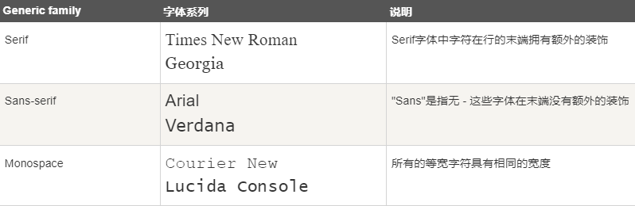
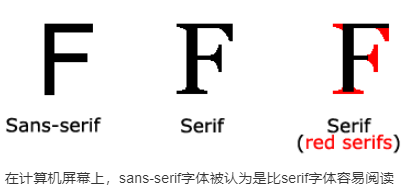
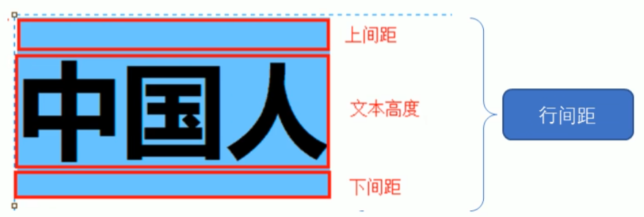

#  CSS

---

# 简介

**CSS** (Cascading Style Sheets，层叠样式表/CSS样式表/级联样式表），是一种用来为结构化文档（如 HTML 文档或 XML 应用）添加样式（字体、间距和颜色等）的标记语言，**CSS** 文件扩展名为 **.css**。

CSS 主要用于设置HTML 页面中的文本内容(字体、大小、对齐方式等)、图片的外形(宽高、边框样式、边距等)以及版面的布局和外观显示样式。

- 样式定义**如何显示** HTML 元素
- 样式通常存储在**样式表**中
- 把样式添加到 HTML 4.0 中，是为了**解决内容与表现分离的问题**
- **外部样式表**可以极大提高工作效率
- 外部样式表通常存储在 **CSS 文件**中
- 多个样式定义可**层叠**为一个

**CSS3** 现在已被大部分现代浏览器支持，而下一版的 **CSS4** 仍在开发中。


# 多重样式优先级

样式表允许以多种方式规定样式信息。样式可以规定在单个的 HTML 元素中，在 HTML 页的头元素中，或在一个外部的 CSS 文件中。甚至可以在同一个 HTML 文档内部引用多个外部样式表。

一般情况下，优先级如下：

**（内联样式）Inline style > （内部样式）Internal style sheet >（外部样式）External style sheet > 浏览器默认样式**

> 如果外部样式放在内部样式的后面，则外部样式将覆盖内部样式

下列是一份优先级逐级增加的选择器列表：

- 通用选择器（*）
- 元素(类型)选择器
- 类选择器
- 属性选择器
- 伪类
- ID 选择器
- 内联样式

>  !important 规则例外
>
> 当 !important 规则被应用在一个样式声明中时,该样式声明会覆盖CSS中任何其他的声明, 无论它处在声明列表中的哪里. 尽管如此, !important规则还是与优先级毫无关系.使用 !important 不是一个好习惯，因为它改变了你样式表本来的级联规则，从而使其难以调试。
>
> 一些经验法则：
>
> - **Always** 要优化考虑使用样式规则的优先级来解决问题而不是 `!important`
> - **Only** 只在需要覆盖全站或外部 css（例如引用的 ExtJs 或者 YUI ）的特定页面中使用 `!important`
> - **Never** 永远不要在全站范围的 css 上使用` !important`
> - **Never** 永远不要在你的插件中使用 `!important`

CSS 优先级法则：

-  A 选择器都有一个权值，权值越大越优先；
-  B 当权值相等时，后出现的样式表设置要优于先出现的样式表设置；
-  C 创作者的规则高于浏览者：即网页编写者设置的CSS 样式的优先权高于浏览器所设置的样式；
-  D 继承的CSS 样式不如后来指定的CSS 样式；
-  E 在同一组属性设置中标有“!important”规则的优先级最大

# 基本语法

```css
selector{
    property:style attribute;
}
```

CSS 规则由两个主要的部分构成：选择器，以及一条或多条声明

选择器通常是您需要改变样式的 HTML 元素。

每条声明都是一个键值对，即由一个属性和一个值组成。

属性（property）是准备设置的样式属性（style attribute）。每个属性有一个值。属性和值被冒号分开。

CSS声明总是以分号 **;** 结束，声明总以大括号 **{}** 括起来。

CSS注释以 **/\*** 开始, 以 ***/** 结束。


# 代码风格

1. 样式格式书写

   1. 紧凑格式

      ```css
      h3 {color: deeppink; font-size: 20px}
      ```

   2. 展开格式

      ```css
      h3 {
          color: pink;
          font-size: 20px;
      }
      ```

      建议使用展开格式

2. 样式大小写

   建议样式选择器、属性名、属性值关键字全部使用小写字母，特殊情况除外

3. 空格规范

   1. 属性值前面、冒号后面，保留一个空格
   2. 选择器(标签)和大括号中间保留空格

 

# 基础选择器

选择器(选择符)就是根据不同需求把不同的标签选出来。

基础选择器是由单个选择器组成的，包括标签选择器、类选择器、id选择器、通配符选择器


## 标签(元素)选择器

标签选择器(元素选择器)是指用 HTML标签名称作为选择器，按标签名称分类，为页面中某一类标签指统一的CSS样式。

标签选择器可以把某一类标签全部选择出来，比如所有的`<div>` 标签和所有的`<span>`标签

```css
labelname {
    property:style attribute;
}
```


## 类选择器

class 选择器用于描述一组元素的样式

class 选择器在 HTML 中以 class 属性表示, 在 CSS 中，类选择器以一个点 **.** 号显示

不能使用标签名作为类名

```css
.classname {
    property: style attribute;
}
```

多类名：可以给一个标签指定多个类名，从而达到更多的选择目的；在标签中写多个类名，多个类名中间用空格分开即可；可以把一些标签元素相同的样式(共同的部分)放到同一个类里面从而进行同时调整


## id选择器

id 选择器可以为标有特定 id 的 HTML 元素指定特定的样式。

HTML元素以id属性来设置id选择器,CSS 中 id 选择器以 "#" 来定义。

 ID属性不要以数字开头，数字开头的ID在 Mozilla/Firefox 浏览器中不起作用。

ID属性只能在每个HTML文档中出现一次。

```css
#id {
    property: style attribute;
}
```


## 通配符选择器

在CSS中，通配符选择器使用`*`定义，它表示选取页面中所有元素(标签)

```css
* {
    property: style attribute;
}
```


# 属性

## 字体属性

1. 字型

   - **通用字体系列** - 拥有相似外观的字体系统组合（如 "Serif" 或 "Monospace"）
   - **特定字体系列** - 一个特定的字体系列（如 "Times" 或 "Courier"）

   

   

2. 字体系列

   ```css
   font-family:"Times New Roman", Times, serif;
   ```

   font-family 属性设置文本的字体系列。

   font-family 属性应该设置几个字体名称作为一种"后备"机制，如果浏览器不支持第一种字体，他将尝试下一种字体。

   如果字体系列的名称超过一个字，它必须用引号，如Font Family："宋体"。

   多个字体系列是用一个逗号分隔指明。

3. 字体样式

   - 正常 - 正常显示文本
   - 斜体 - 以斜体字显示的文字
   - 倾斜的文字 - 文字向一边倾斜（和斜体非常类似，但不太支持）

   ```css
   font-style:normal;
   font-style:italic;
   font-style:oblique 5deg;
   ```

   > italic 和 oblique 都是向右倾斜的文字, 但区别在于 italic 是指斜体字，而 oblique 是倾斜的文字，对于没有斜体的字体应该使用 oblique 属性值来实现倾斜的文字效果。

4. 字体大小

   绝对大小：

   - 设置一个指定大小的文本
   - 不允许用户在所有浏览器中改变文本大小
   - 确定了输出的物理尺寸时绝对大小很有用

   相对大小：

   - 相对于周围的元素来设置大小
   - 允许用户在浏览器中改变文字大小

   字体的默认大小和普通文本段落一样，是16像素（16px=1em）。

   不能通过调整字体大小使段落看上去像标题，或者使标题看上去像段落，务必使用正确的HTML标签，如`<h1> - <h6>`表示标题和`<p>`表示段落。

   ```css
   font-size:40px;
   font-size:2.5em;
   body {font-size:100%;}
   ```

   > 为了避免Internet Explorer 中无法调整文本的问题，许多开发者使用 em 单位代替像素。
   >
   > em的尺寸单位由W3C建议。
   >
   > 1em和当前字体大小相等。在浏览器中默认的文字大小是16px。
   >
   > 因此，1em的默认大小是16px。可以通过下面这个公式将像素转换为em：**px/16=em**
   >
   > 
   >
   > 在所有浏览器的解决方案中，设置 `<body>`元素的默认字体大小的是百分比

5. 字体粗细

   ```css
   font-weight:normal;
   font-weight:bold;
   font-weight:900;
   ```

   | 值      | 描述                                                        |
   | :------ | :---------------------------------------------------------- |
   | normal  | 默认值。定义标准的字符。                                    |
   | bold    | 定义粗体字符。                                              |
   | bolder  | 定义更粗的字符。                                            |
   | lighter | 定义更细的字符。                                            |
   | number  | 定义由细到粗的字符。400 等同于 normal，而 700 等同于 bold。 |
   | inherit | 规定应该从父元素继承字体的粗细。                            |

6. 以小型大写字体或者正常字体显示文本

   ```css
   font-variant:small-caps;
   ```

   font-variant 属性设置小型大写字母的字体显示文本，这意味着所有的小写字母均会被转换为大写，但是所有使用小型大写字体的字母与其余文本相比，其字体尺寸更小

   | 值         | 描述                                         |
   | :--------- | :------------------------------------------- |
   | normal     | 默认值。浏览器会显示一个标准的字体。         |
   | small-caps | 浏览器会显示小型大写字母的字体。             |
   | inherit    | 规定应该从父元素继承 font-variant 属性的值。 |

7. 复合属性

   font 简写属性在一个声明中设置所有字体属性。

   可设置的属性是（按顺序）： "font-style font-variant font-weight font-size/line-height font-family"

   使用 font 属性时，必须按上面语法格式中的顺序书写，不能更换顺序，并且各个属性间以空格隔开

   font-size和font-family的值是必需的。如果缺少了其他值，默认值将被插入，如果有默认值的话。

   ```css
   font:font-style font-variant font-weight font-size/line-height font-family;
   ```

   | 值                      | 描述                                               |
   | :---------------------- | :------------------------------------------------- |
   | *font-style*            | 规定字体样式。                                     |
   | *font-variant*          | 规定字体异体。                                     |
   | *font-weight*           | 规定字体粗细。                                     |
   | *font-size/line-height* | 规定字体尺寸和行高。                               |
   | *font-family*           | 规定字体系列。                                     |
   | caption                 | 定义被标题控件（比如按钮、下拉列表等）使用的字体。 |
   | icon                    | 定义被图标标记使用的字体。                         |
   | menu                    | 定义被下拉列表使用的字体。                         |
   | message-box             | 定义被对话框使用的字体。                           |
   | small-caption           | caption 字体的小型版本。                           |
   | status-bar              | 定义被窗口状态栏使用的字体。                       |


## 文本属性

1. 文本颜色

   ```css
   color:red;
   color:#00ff00;
   color:rgb(255,0,0);
   ```

   颜色属性被用来设置文字的颜色。

   颜色是通过CSS最经常的指定：

   - 十六进制值 - 如: **＃FF0000**
   - 一个RGB值 - 如: **RGB(255,0,0)**
   - 颜色的名称 - 如: **red**

   > CSS的颜色可以通过以下方法指定：
   >
   > - 十六进制颜色
   >
   >    所有主要浏览器都支持十六进制颜色值。指定一个十六进制的颜色其组成部分是：＃RRGGBB，其中RR（红色），GG（绿色）和BB（蓝色）。所有值必须介于0和FF之间。
   >
   > - RGB颜色
   >
   >    RGB颜色值在所有主要浏览器都支持。RGB颜色值指定：RGB（红，绿，蓝）。每个参数（红色，绿色和蓝色）定义颜色的亮度，可在0和255之间，或一个百分比值（从0％到100％）之间的整数。
   >
   > - RGBA颜色
   >
   >    RGBA颜色值被IE9, Firefox3+, Chrome, Safari,和Opera10+支持。RGBA颜色值是RGB颜色值alpha通道的延伸 - 指定对象的透明度。RGBA颜色值指定：RGBA（红，绿，蓝，alpha）。 Alpha参数是一个介于0.0（完全透明）和1.0（完全不透明）之间的参数。
   >
   > - HSL色彩
   >
   >    IE9, Firefox, Chrome, Safari,和Opera 10+.支持HSL颜色值。HSL代表色相，饱和度和亮度 - 使用色彩圆柱坐标表示。HSL颜色值指定：HSL（色调，饱和度，明度）。色相是在色轮上的程度（从0到360）-0（或360）是红色的，120是绿色的，240是蓝色的。饱和度是一个百分比值;0％意味着灰色和100％的阴影，是全彩。亮度也是一个百分点;0％是黑色的，100％是白色的。
   >
   > - HSLA颜色
   >
   >    HSLA颜色值被IE9, Firefox3+, Chrome, Safari,和Opera10+.支持.HSLA的颜色值是一个带有alpha通道的HSL颜色值的延伸 - 指定对象的透明度。指定HSLA颜色值：HSLA（色调，饱和度，亮度，α），α是Alpha参数定义的不透明度。 Alpha参数是一个介于0.0（完全透明）和1.0（完全不透明）之间的参数。
   >
   > - 预定义/跨浏览器的颜色名称

2. 文本修饰

   ```css
   text-decoration:none;
   text-decoration:overline;
   text-decoration:line-through;
   text-decoration:underline;
   ```

   text-decoration 属性用来设置或删除文本的装饰。

   从设计的角度看 text-decoration属性主要是用来删除链接的下划线

   | 值           | 描述                                            |
   | :----------- | :---------------------------------------------- |
   | none         | 默认。定义标准的文本。                          |
   | underline    | 定义文本下的一条线。                            |
   | overline     | 定义文本上的一条线。                            |
   | line-through | 定义穿过文本下的一条线。                        |
   | blink        | 定义闪烁的文本。                                |
   | inherit      | 规定应该从父元素继承 text-decoration 属性的值。 |

3. 文本转换

   ```css
   text-transform:uppercase;
   text-transform:lowercase;
   text-transform:capitalize;
   ```

   文本转换属性是用来指定在一个文本中的大写和小写字母。

   可用于所有字句变成大写或小写字母，或每个单词的首字母大写。

   | 值         | 描述                                           |
   | :--------- | :--------------------------------------------- |
   | none       | 默认。定义带有小写字母和大写字母的标准的文本。 |
   | capitalize | 文本中的每个单词以大写字母开头。               |
   | uppercase  | 定义仅有大写字母。                             |
   | lowercase  | 定义无大写字母，仅有小写字母。                 |
   | inherit    | 规定应该从父元素继承 text-transform 属性的值。 |

4. 文本缩进

   ```css
   text-indent:50px;
   ```

   文本缩进属性是用来指定文本的第一行的缩进。

   | 值       | 描述                                        |
   | :------- | :------------------------------------------ |
   | *length* | 定义固定的缩进。默认值：0。                 |
   | *%*      | 定义基于父元素宽度的百分比的缩进。          |
   | inherit  | 规定应该从父元素继承 text-indent 属性的值。 |

5. 文本方向

   ```css
   direction:rtl;
   ```

   direction属性指定文本方向/书写方向。

   | 值      | 描述                                      |
   | :------ | :---------------------------------------- |
   | ltr     | 默认。文本方向从左到右。                  |
   | rtl     | 文本方向从右到左。                        |
   | inherit | 规定应该从父元素继承 direction 属性的值。 |

6. 字符间距

   ```css
   letter-spacing:2px
   letter-spacing:-3px
   ```

   letter-spacing 属性增加或减少字符间的空白（字符间距）

   | 值       | 描述                                           |
   | :------- | :--------------------------------------------- |
   | normal   | 默认。规定字符间没有额外的空间。               |
   | *length* | 定义字符间的固定空间（允许使用负值）。         |
   | inherit  | 规定应该从父元素继承 letter-spacing 属性的值。 |

7. 行高(行间距)

   ```css
   line-height:90%
   ```

   设置以百分比计的行高

   负值是不允许的

   | 值       | 描述                                                 |
   | :------- | :--------------------------------------------------- |
   | normal   | 默认。设置合理的行间距。                             |
   | *number* | 设置数字，此数字会与当前的字体尺寸相乘来设置行间距。 |
   | *length* | 设置固定的行间距。                                   |
   | *%*      | 基于当前字体尺寸的百分比行间距。                     |
   | inherit  | 规定应该从父元素继承 line-height 属性的值。          |

   

8. 对齐元素中的文本

   ```css
   text-align:center
   ```

   text-align属性指定元素文本的水平对齐方式。

   | 值      | 描述                                       |
   | :------ | :----------------------------------------- |
   | left    | 把文本排列到左边。默认值：由浏览器决定。   |
   | right   | 把文本排列到右边。                         |
   | center  | 把文本排列到中间。                         |
   | justify | 实现两端对齐文本效果。                     |
   | inherit | 规定应该从父元素继承 text-align 属性的值。 |

9. 文本阴影

   ```css
   text-shadow: h-shadow v-shadow blur color;
   text-shadow: 2px 2px #ff0000;
   ```

   text-shadow 属性应用于阴影文本。

   | 值         | 描述                             |
   | :--------- | :------------------------------- |
   | *h-shadow* | 必需。水平阴影的位置。允许负值。 |
   | *v-shadow* | 必需。垂直阴影的位置。允许负值。 |
   | *blur*     | 可选。模糊的距离。               |
   | *color*    | 可选。阴影的颜色。               |

10. 设置或返回文本是否被重写

    ```css
    unicode-bidi: normal|embed|bidi-override|initial|inherit;
    ```

    unicode-bidi 属性与 direction 属性一起使用，来设置或返回文本是否被重写，以便在同一文档中支持多种语言。

    `unicode-bidi`与`direction`属性一同决定如何对文档中的双向文本进行处理。例如，如果内容块同时包含从左到右和从右到左的文本，则用户代理使用复杂的Unicode算法来决定如何显示文本。该`unicode-bidi`属性重写此算法，并允许开发人员控制文本嵌入。

    `unicode-bidi`和`direction`属性是两个不会受简写属性`all`影响的属性。

    | 值            | 描述                                                    |
    | :------------ | :------------------------------------------------------ |
    | normal        | 默认。不使用附加的嵌入层面。                            |
    | embed         | 创建一个附加的嵌入层面。                                |
    | bidi-override | 创建一个附加的嵌入层面。重新排序取决于 direction 属性。 |
    | initial       | 设置该属性为它的默认值。                                |
    | inherit       | 从父元素继承该属性。                                    |

11. 元素的垂直对齐

    ```css
    vertical-align:text-top;
    ```

    vertical-align 属性设置一个元素的垂直对齐方式。

    该属性定义行内元素的基线相对于该元素所在行的基线的垂直对齐。允许指定负长度值和百分比值。这会使元素降低而不是升高。在表单元格中，这个属性会设置单元格框中的单元格内容的对齐方式。

    | 值          | 描述                                                         |
    | :---------- | :----------------------------------------------------------- |
    | baseline    | 默认。元素放置在父元素的基线上。                             |
    | sub         | 垂直对齐文本的下标。                                         |
    | super       | 垂直对齐文本的上标                                           |
    | top         | 把元素的顶端与行中最高元素的顶端对齐                         |
    | text-top    | 把元素的顶端与父元素字体的顶端对齐                           |
    | middle      | 把此元素放置在父元素的中部。                                 |
    | bottom      | 使元素及其后代元素的底部与整行的底部对齐。                   |
    | text-bottom | 把元素的底端与父元素字体的底端对齐。                         |
    | length      | 将元素升高或降低指定的高度，可以是负数。                     |
    | %           | 使用 "line-height" 属性的百分比值来排列此元素。允许使用负值。 |
    | inherit     | 规定应该从父元素继承 vertical-align 属性的值。               |

12. 元素中空白的处理方式

    ```css
    /* 值 */
    white-space: normal;
    white-space: nowrap;
    white-space: pre;
    white-space: pre-wrap;
    white-space: pre-line;
    white-space: break-spaces;
    
    /* 全局值 */
    white-space: inherit;
    white-space: initial;
    white-space: revert;
    white-space: revert-layer;
    white-space: unset;
    ```

    white-space属性指定元素内的空白怎样处理。

    | 值       | 描述                                                         |
    | :------- | :----------------------------------------------------------- |
    | normal   | 默认。空白会被浏览器忽略。                                   |
    | pre      | 空白会被浏览器保留。其行为方式类似 HTML 中的 <pre> 标签。    |
    | nowrap   | 文本不会换行，文本会在在同一行上继续，直到遇到 <br> 标签为止。 |
    | pre-wrap | 保留空白符序列，但是正常地进行换行。                         |
    | pre-line | 合并空白符序列，但是保留换行符。                             |
    | inherit  | 规定应该从父元素继承 white-space 属性的值。                  |

    |                | 换行符 | 空格和制表符 | 文字换行 | 行尾空格 |
    | :------------- | :----- | :----------- | :------- | -------- |
    | `normal`       | 合并   | 合并         | 换行     | 删除     |
    | `nowrap`       | 合并   | 合并         | 不换行   | 删除     |
    | `pre`          | 保留   | 保留         | 不换行   | 保留     |
    | `pre-wrap`     | 保留   | 保留         | 换行     | 挂起     |
    | `pre-line`     | 保留   | 合并         | 换行     | 删除     |
    | `break-spaces` | 保留   | 保留         | 换行     | 换行     |

13. 字间距

    ```css
    word-spacing:30px;
    ```

    word-spacing属性增加或减少字与字之间的空白。

    负值是允许的。

    | 值       | 描述                                         |
    | :------- | :------------------------------------------- |
    | normal   | 默认。定义单词间的标准空间。                 |
    | *length* | 定义单词间的固定空间。                       |
    | inherit  | 规定应该从父元素继承 word-spacing 属性的值。 |
