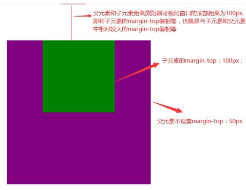

#  CSS

---

# 简介

---

**CSS** (Cascading Style Sheets，层叠样式表/CSS样式表/级联样式表），是一种用来为结构化文档（如 HTML 文档或 XML 应用）添加样式（字体、间距和颜色等）的标记语言，**CSS** 文件扩展名为 **.css**。

CSS 主要用于设置HTML 页面中的文本内容(字体、大小、对齐方式等)、图片的外形(宽高、边框样式、边距等)以及版面的布局和外观显示样式。

- 样式定义**如何显示** HTML 元素
- 样式通常存储在**样式表**中
- 把样式添加到 HTML 4.0 中，是为了**解决内容与表现分离的问题**
- **外部样式表**可以极大提高工作效率
- 外部样式表通常存储在 **CSS 文件**中
- 多个样式定义可**层叠**为一个

**CSS3** 现在已被大部分现代浏览器支持，而下一版的 **CSS4** 仍在开发中。


# 特性

---

- 层叠性
   - 遵循**就近原则**，离结构越近优先级越高
   - 样式不冲突就不会层叠
- 继承性
   - 子标签会继承父标签的某些样式，如text- font- line- color 行高等样式
   - 恰当地使用继承可以简化代码，降低CSS样式的复杂性
   - 设置行高时不带单位代表font-size的倍数
- 优先级
   - 选择器相同则执行层叠性
   - 选择器不同则根据选择器权重执行

# 多重样式优先级

---

样式表允许以多种方式规定样式信息。样式可以规定在单个的 HTML 元素中，在 HTML 页的头元素中，或在一个外部的 CSS 文件中。甚至可以在同一个 HTML 文档内部引用多个外部样式表。

一般情况下，优先级如下：

**（内联样式）Inline style > （内部样式）Internal style sheet >（外部样式）External style sheet > 浏览器默认样式**

> 如果外部样式放在内部样式的后面，则外部样式将覆盖内部样式

下列是一份优先级逐级增加的选择器列表：

- 继承/通用选择器（*）
- 元素(类型)选择器
- 类选择器
- 属性选择器
- 伪类
- ID 选择器
- 内联样式


>  !important 规则例外
>
> 当 !important 规则被应用在一个样式声明中时,该样式声明会覆盖CSS中任何其他的声明, 无论它处在声明列表中的哪里. 尽管如此, !important规则还是与优先级毫无关系.使用 !important 不是一个好习惯，因为它改变了你样式表本来的级联规则，从而使其难以调试。
>
> 一些经验法则：
>
> - **Always** 要优化考虑使用样式规则的优先级来解决问题而不是 `!important`
> - **Only** 只在需要覆盖全站或外部 css（例如引用的 ExtJs 或者 YUI ）的特定页面中使用 `!important`
> - **Never** 永远不要在全站范围的 css 上使用` !important`
> - **Never** 永远不要在你的插件中使用 `!important`

CSS 优先级法则：

-  选择器都有一个权值，权值越大越优先；
-  当权值相等时，后出现的样式表设置要优于先出现的样式表设置；
-  创作者的规则高于浏览者：即网页编写者设置的CSS 样式的优先权高于浏览器所设置的样式；
-  继承的CSS 样式权重是0，不如后来指定的CSS 样式；
-  在同一组属性设置中标有“!important”规则的优先级最大
-  权重叠加：**复合选择器**的权重需要将选择器的所有权重相加，且结果不会产生进位


# 书写顺序

---

1. 布局定位属性: display/position/ float/clear/visibility/overflow	(建议 display第一个写，毕竟关系到模式)
2. 自身属性: width/height/margin/ padding /border/ background
3. 文本属性: color/font / text-decoration/text-align/vertical-align/white- space / break-word
4. 其他属性 ( CSS3 ) : content/cursor / border-radius / box-shadow / text-shadow/ background:linear-gradient...

# Emmet语法

---

Emmet语法的前身是Zen coding,它使用缩写,来提高HTML/CSS的编写速度,VScode内部已经集成该语法.

1. 快速生成HTML结构语法

   ​	 ①生成标签 直接输入标签名 按tab键即可 比如 div 然后tab键,就可以生成<div></div>
   ​     ②如果想要生成多个相同标签 加上 * 就可以 比如 div*3 就可以快速生成3个div
   ​     ③如果有父子级关系,可以用> 比如 ul>li就可以
   ​     ④如果有兄弟关系的标签,用+ 就可以 比如 div+p
   ​     ⑤如果生成带有类名或者id名字的,直接写 .demo 或者 #two tab 键就可以了
   ​     ⑥如果生成的div类名是由顺序的,可以用自增符号$
   ​     ⑦如果想要在生成的标签内部写内容可以用{}表示

2. 快速生成CSS样式语法

   CSS基本采取简写形式即可

   ​     ①比如w200 按tab 可以生成 width:200px;
   ​     ②比如lh26 按tab 可以生成 line-height:26px; 


# 初始化(CSS reset)

---

1. 不同浏览器对有些标签的默认值是不同的，为了消除不同浏览器对HTML文本呈现的差异，照顾浏览器的兼容，我们需要对CSS初始化

2. 每个网页都必须首先进行CSS初始化

3. ```css
   *{
       margin: 0;
       padding: 0;
       outline: 0;
       resize: none;
   }
   em,
   i{
       font-style: normal;
   }
   li{
       list-style: none;
   }
   img{
       border: 0;
       vertical-align: middle;
   }
   button{
       cursor: pointer;
   }
   a{
       text-decoration:none;
   }
   .clearfix:after {
   	content:"";
       display: block;
       height: 0;
       clear: both;
       visibility: hidden;
   }
   .clearfix{ 
       /* IE6、7 专有 */
   	*zoom: 1;
   }
   ```

# 基本语法

---

```css
selector{
    property:style attribute;
}
```

CSS 规则由两个主要的部分构成：选择器，以及一条或多条声明

选择器通常是您需要改变样式的 HTML 元素。

每条声明都是一个键值对，即由一个属性和一个值组成。

属性（property）是准备设置的样式属性（style attribute）。每个属性有一个值。属性和值被冒号分开。

CSS声明总是以分号 **;** 结束，声明总以大括号 **{}** 括起来。

CSS注释以 **/\*** 开始, 以 ***/** 结束。


# 代码风格

---

1. 样式格式书写

   1. 紧凑格式

      ```css
      h3 {color: deeppink; font-size: 20px}
      ```

   2. 展开格式

      ```css
      h3 {
          color: pink;
          font-size: 20px;
      }
      ```

      建议使用展开格式

2. 样式大小写

   建议样式选择器、属性名、属性值关键字全部使用小写字母，特殊情况除外

3. 空格规范

   1. 属性值前面、冒号后面，保留一个空格
   2. 选择器(标签)和大括号中间保留空格

 

# 基础选择器

---

选择器(选择符)就是根据不同需求把不同的标签选出来。

基础选择器是由单个选择器组成的，包括标签选择器、类选择器、id选择器、通配符选择器


## 标签(元素)选择器

标签选择器(元素选择器)是指用 HTML标签名称作为选择器，按标签名称分类，为页面中某一类标签指统一的CSS样式。

标签选择器可以把某一类标签全部选择出来，比如所有的`<div>` 标签和所有的`<span>`标签

```css
labelname {
    property:style attribute;
}
```


## 类选择器

class 选择器用于描述一组元素的样式

class 选择器在 HTML 中以 class 属性表示, 在 CSS 中，类选择器以一个点 **.** 号显示

不能使用标签名作为类名

```css
.classname {
    property: style attribute;
}
/*选择标签中所有类名为class的元素*/
lable.class{
    property: style attribute;
}
```

多类名：可以给一个标签指定多个类名，从而达到更多的选择目的；在标签中写多个类名，多个类名中间用空格分开即可；可以把一些标签元素相同的样式(共同的部分)放到同一个类里面从而进行同时调整


## id选择器

id 选择器可以为标有特定 id 的 HTML 元素指定特定的样式。

HTML元素以id属性来设置id选择器,CSS 中 id 选择器以 "#" 来定义。

 ID属性不要以数字开头，数字开头的ID在 Mozilla/Firefox 浏览器中不起作用。

ID属性只能在每个HTML文档中出现一次。

```css
#id {
    property: style attribute;
}
```


## 通配符选择器

在CSS中，通配符选择器使用`*`定义，它表示选取页面中所有元素(标签)

```css
* {
    property: style attribute;
}
```


##  属性选择器

通过元素的属性选择 HTML 元素。属性选择器可以根据属性名和属性值进行选择。

```css
lable[attribute]
lable[attribute=value]
/*属性包含value*/
[attribute~=value]
/*匹配具有 att 属性且值以 val 开头的 E 元素*/
lable[att^="val"]
/*匹配具有 att 属性且值以 val 结尾的 E 素*/
lable[att$="val"]
/*匹配具有 att 属性且值中含有 val 的 E 元素*/
lable[att*="val"]
```


# 复合选择器

---

在CSS中，可以根据选择器的类型把选择器分为基础选择器和复合选择器，复合选择器是建立在基础选择器之上，对基本选择器进行组合形成的

 复合选择器由两个或多个基础选择器通过不同方式组合而成，复合选择器可以更准确、高效地选择目标元素(标签)。


## 后代选择器

```css
父元素 子元素 {
    样式声明
}
```

后代选择器又称为包含选择器，可以选择父元素里面子元素(所有后代)。其写法就是把外层标签写在前面，内层标签写在后面，中间用空格分隔。当标签发生嵌套时，内层标签就成为外层标签的后代。


## 子选择器

```css
父元素>子元素 {
    样式声明
}
/*紧跟在前一个元素后的第一个元素*/
element+element{
}
```

子元素选择器(子选择器 )只能选择父元素的**最近一级子元素**


## 并集选择器

```css
元素1,
元素2,
...
元素n {
    样式声明
}
```

并集选择器可以选择多组标签, 同时为他们定义相同的样式。通常用于集体声明.
并集选择器是各选择器通过英文逗号(,)连接而成，任何形式的选择器都可以作为并集选择器的一部分。


## 伪类选择器

```css
元素:伪类 {
    样式声明
}
```

伪类是一种不存在的类，伪类用来表示**元素的一种状态**。

伪类选择器用于向某些选择器添加特殊的效果，比如给链接添加特殊效果，或选择第1个，第n个元素.

伪类选择器书写最大的特点是用冒号(:)表示，比如:hover 、 :first-child。

注意事项：

- 为了确保生效，请按照**LVHA**的顺序声明:link - :visited - :hover - :active
- 因为a链接在浏览器中具有默认样式，所以我们实际工作中都需要给链接单独指定样式


| 选择器               | 例子                  | 例子描述                                                     |
| -------------------- | --------------------- | ------------------------------------------------------------ |
| **:active**          | a:active              | 匹配被点击的链接                                             |
| :checked             | input:checked         | 匹配处于选中状态的 <input> 元素                              |
| :disabled            | input:disabled        | 匹配每个被禁用的 <input> 元素                                |
| :empty               | p:empty               | 匹配任何没有子元素的 <p> 元素                                |
| :enabled             | input:enabled         | 匹配每个已启用的 <input> 元素                                |
| :first-child         | p:first-child         | 匹配父元素中的第一个子元素 <p>，<p> 必须是父元素中的第一个子元素 |
| :first-of-type       | p:first-of-type       | 匹配父元素中的第一个 <p> 元素                                |
| **:focus**           | input:focus           | 匹配获得焦点的 <input> 元素                                  |
| **:hover**           | a:hover               | 匹配鼠标悬停其上的元素                                       |
| :in-range            | input:in-range        | 匹配具有指定取值范围的 <input> 元素                          |
| :invalid             | input:invalid         | 匹配所有具有无效值的 <input> 元素                            |
| :lang(language)      | p:lang(it)            | 匹配每个 lang 属性值以 "it" 开头的 <p> 元素                  |
| :last-child          | p:last-child          | 匹配父元素中的最后一个子元素 <p>， <p> 必须是父元素中的最后一个子元素 |
| :last-of-type        | p:last-of-type        | 匹配父元素中的最后一个 <p> 元素                              |
| **:link**            | a:link                | 匹配所有未被访问的链接                                       |
| :not(selector)       | :not(p)               | 匹配每个非 <p> 元素的元素                                    |
| :nth-child(n)        | p:nth-child(2)        | 匹配父元素中的第二个子元素 <p>                               |
| :nth-last-child(n)   | p:nth-last-child(2)   | 匹配父元素的倒数第二个子元素 <p>                             |
| :nth-last-of-type(n) | p:nth-last-of-type(2) | 匹配父元素的倒数第二个子元素 <p>                             |
| :nth-of-type(n)      | p:nth-of-type(2)      | 匹配父元素的第二个子元素 <p>                                 |
| :only-of-type        | p:only-of-type        | 匹配父元素中唯一的 <p> 元素                                  |
| :only-child          | p:only-child          | 匹配父元素中唯一的子元素 <p>                                 |
| :optional            | input:optional        | 匹配不带 "required" 属性的 <input> 元素                      |
| :out-of-range        | input:out-of-range    | 匹配值在指定范围之外的 <input> 元素                          |
| :read-only           | input:read-only       | 匹配指定了 "readonly" 属性的 <input> 元素                    |
| :read-write          | input:read-write      | 匹配不带 "readonly" 属性的 <input> 元素                      |
| :required            | input:required        | 匹配指定了 "required" 属性的 <input> 元素                    |
| :root                | root                  | 匹配元素的根元素，在 HTML 中，根元素永远是 HTML              |
| :target              | #news:target          | 匹配当前活动的 #news 元素（单击包含该锚名称的 URL）          |
| :valid               | input:valid           | 匹配所有具有有效值的 <input> 元素                            |
| **:visited**         | a:visited             | 匹配所有已经访问过的链接                                     |


## 结构伪类选择器

1. :first-child{},用来选择父元素下的第一个子元素。

   注意：:first-child{}是根据父元素下所有子元素进行排序。

2. :last-child{},用来选择父元素下的最后一个子元素。

   注意：:last-child{}是根据父元素下所有子元素进行排序

3. :nth-child(n){}，选中父元素第n个子元素，n为一个具体数字。

   :nth-child(n){}，选中父元素下所有子元素，n为字母。

   :nth-child(2n){}，选中父元素下偶数行的子元素。

   :nth-child(even){}，选中父元素下偶数行的子元素。

   :nth-child(2n+1){}，选中父元素下奇数行的子元素。

   :nth-child(odd){}，选中父元素下奇数行的子元素。

   注意：:nth-child(){}是根据父元素下所有子元素进行排序

4. :first-of-type{},用来选择父元素下的第一个子元素。

   注意：:first-of-type{}是根据父元素下所有同类型的子元素进行排序。

5. :last-of-type{},用来选择父元素下的最后一个子元素。

   注意：:last-of-type{}是根据父元素下所有同类型的子元素进行排序。

6. :nth-of-type(n){}，选中父元素第n个子元素，n为一个具体数字。

   :nth-of-type(n){}，选中父元素下所有子元素，n为字母。

   :nth-of-type(2n){}，选中父元素下偶数行的子元素。

   :nth-of-type(even){}，选中父元素下偶数行的子元素。

   :nth-of-type(2n+1){}，选中父元素下奇数行的子元素。

   :nth-of-type(odd){}，选中父元素下奇数行的子元素。

   注意：:nth-of-stype(n){}是根据父元素下同类型的子元素进行排序

7. :not(n){}否定类，将复合的元素去除，n为指定数值。

> - nth-child 对父元素里面所有孩子排序选择(序号是固定的) 先找到第n个孩子，然后看看是否和E匹配
>    nth-of-type 对父元素里面指定子元素进行排序选择。先去匹配E，然后再根据E 找第n个孩子
> - n 可以是数字，关键字和公式
>    - n 如果是数字，就是选择第n 个子元素，里面数字从1开始...
>    - n可以是关键字：even 偶数，odd 奇数
>    - n 可以是公式:常见的公式如下(如果n是公式，则从0开始计算，但是第0个元素或者超出了元素的个数会被忽略)
>
> 


## 伪元素选择器

1. 伪元素选择器可以帮助我们利用CSS创建新标签元素，而不需要HTML标签，从而简化HTML结构
2. `::before`在元素内部的**前面**插入内容，成为该元素的子元素
3. `::after`在元素内部的**后面**插入内容，成为该元素的子元素
4. before 和 after 创建一个元素，但是属于行内元素，新创建的这个元素在文档树中是找不到的，所以我们称为伪元素
5. before 和 after 必须有 content 属性
6. 伪元素选择器和标签选择器一样，权重为1

# 属性

---

## 字体属性

1. 字型

   - **通用字体系列** - 拥有相似外观的字体系统组合（如 "Serif" 或 "Monospace"）
   - **特定字体系列** - 一个特定的字体系列（如 "Times" 或 "Courier"）

   

   

2. 字体系列

   ```css
   font-family:"Times New Roman", Times, serif;
   ```

   font-family 属性设置文本的字体系列。

   font-family 属性应该设置几个字体名称作为一种"后备"机制，如果浏览器不支持第一种字体，他将尝试下一种字体。

   如果字体系列的名称超过一个字，它必须用引号，如Font Family："宋体"。

   多个字体系列是用一个逗号分隔指明。

3. 字体样式

   - 正常 - 正常显示文本
   - 斜体 - 以斜体字显示的文字
   - 倾斜的文字 - 文字向一边倾斜（和斜体非常类似，但不太支持）

   ```css
   font-style:normal;
   font-style:italic;
   font-style:oblique 5deg;
   ```

   > italic 和 oblique 都是向右倾斜的文字, 但区别在于 italic 是指斜体字，而 oblique 是倾斜的文字，对于没有斜体的字体应该使用 oblique 属性值来实现倾斜的文字效果。

4. 字体大小

   绝对大小：

   - 设置一个指定大小的文本
   - 不允许用户在所有浏览器中改变文本大小
   - 确定了输出的物理尺寸时绝对大小很有用

   相对大小：

   - 相对于周围的元素来设置大小
   - 允许用户在浏览器中改变文字大小

   字体的默认大小和普通文本段落一样，是16像素（16px=1em）。

   不能通过调整字体大小使段落看上去像标题，或者使标题看上去像段落，务必使用正确的HTML标签，如`<h1> - <h6>`表示标题和`<p>`表示段落。

   ```css
   font-size:40px;
   font-size:2.5em;
   body {font-size:100%;}
   ```

   > 为了避免Internet Explorer 中无法调整文本的问题，许多开发者使用 em 单位代替像素。
   >
   > em的尺寸单位由W3C建议。
   >
   > 1em和当前字体大小相等。在浏览器中默认的文字大小是16px。
   >
   > 因此，1em的默认大小是16px。可以通过下面这个公式将像素转换为em：**px/16=em**
   >
   > 
   >
   > 在所有浏览器的解决方案中，设置 `<body>`元素的默认字体大小的是百分比

5. 字体粗细

   ```css
   font-weight:normal;
   font-weight:bold;
   font-weight:900;
   ```

   | 值      | 描述                                                        |
   | :------ | :---------------------------------------------------------- |
   | normal  | 默认值。定义标准的字符。                                    |
   | bold    | 定义粗体字符。                                              |
   | bolder  | 定义更粗的字符。                                            |
   | lighter | 定义更细的字符。                                            |
   | number  | 定义由细到粗的字符。400 等同于 normal，而 700 等同于 bold。 |
   | inherit | 规定应该从父元素继承字体的粗细。                            |

6. 以小型大写字体或者正常字体显示文本

   ```css
   font-variant:small-caps;
   ```

   font-variant 属性设置小型大写字母的字体显示文本，这意味着所有的小写字母均会被转换为大写，但是所有使用小型大写字体的字母与其余文本相比，其字体尺寸更小

   | 值         | 描述                                         |
   | :--------- | :------------------------------------------- |
   | normal     | 默认值。浏览器会显示一个标准的字体。         |
   | small-caps | 浏览器会显示小型大写字母的字体。             |
   | inherit    | 规定应该从父元素继承 font-variant 属性的值。 |

7. 复合属性

   font 简写属性在一个声明中设置所有字体属性。

   可设置的属性是（按顺序）： "font-style font-variant font-weight font-size/line-height font-family"

   使用 font 属性时，必须按上面语法格式中的顺序书写，不能更换顺序，并且各个属性间以空格隔开

   font-size和font-family的值是必需的。如果缺少了其他值，默认值将被插入，如果有默认值的话。

   ```css
   font:font-style font-variant font-weight font-size/line-height font-family;
   ```

   | 值                      | 描述                                               |
   | :---------------------- | :------------------------------------------------- |
   | *font-style*            | 规定字体样式。                                     |
   | *font-variant*          | 规定字体异体。                                     |
   | *font-weight*           | 规定字体粗细。                                     |
   | *font-size/line-height* | 规定字体尺寸和行高。                               |
   | *font-family*           | 规定字体系列。                                     |
   | caption                 | 定义被标题控件（比如按钮、下拉列表等）使用的字体。 |
   | icon                    | 定义被图标标记使用的字体。                         |
   | menu                    | 定义被下拉列表使用的字体。                         |
   | message-box             | 定义被对话框使用的字体。                           |
   | small-caption           | caption 字体的小型版本。                           |
   | status-bar              | 定义被窗口状态栏使用的字体。                       |


## 文本属性

1. 文本颜色

   ```css
   color:red;
   color:#00ff00;
   color:rgb(255,0,0);
   ```

   颜色属性被用来设置文字的颜色。

   颜色是通过CSS最经常的指定：

   - 十六进制值 - 如: **＃FF0000**
   - 一个RGB值 - 如: **RGB(255,0,0)**
   - 颜色的名称 - 如: **red**

   > CSS的颜色可以通过以下方法指定：
   >
   > - 十六进制颜色
   >
   >    所有主要浏览器都支持十六进制颜色值。指定一个十六进制的颜色其组成部分是：＃RRGGBB，其中RR（红色），GG（绿色）和BB（蓝色）。所有值必须介于0和FF之间。
   >
   > - RGB颜色
   >
   >    RGB颜色值在所有主要浏览器都支持。RGB颜色值指定：RGB（红，绿，蓝）。每个参数（红色，绿色和蓝色）定义颜色的亮度，可在0和255之间，或一个百分比值（从0％到100％）之间的整数。
   >
   > - RGBA颜色
   >
   >    RGBA颜色值被IE9, Firefox3+, Chrome, Safari,和Opera10+支持。RGBA颜色值是RGB颜色值alpha通道的延伸 - 指定对象的透明度。RGBA颜色值指定：RGBA（红，绿，蓝，alpha）。 Alpha参数是一个介于0.0（完全透明）和1.0（完全不透明）之间的参数。
   >
   > - HSL色彩
   >
   >    IE9, Firefox, Chrome, Safari,和Opera 10+.支持HSL颜色值。HSL代表色相，饱和度和亮度 - 使用色彩圆柱坐标表示。HSL颜色值指定：HSL（色调，饱和度，明度）。色相是在色轮上的程度（从0到360）-0（或360）是红色的，120是绿色的，240是蓝色的。饱和度是一个百分比值;0％意味着灰色和100％的阴影，是全彩。亮度也是一个百分点;0％是黑色的，100％是白色的。
   >
   > - HSLA颜色
   >
   >    HSLA颜色值被IE9, Firefox3+, Chrome, Safari,和Opera10+.支持.HSLA的颜色值是一个带有alpha通道的HSL颜色值的延伸 - 指定对象的透明度。指定HSLA颜色值：HSLA（色调，饱和度，亮度，α），α是Alpha参数定义的不透明度。 Alpha参数是一个介于0.0（完全透明）和1.0（完全不透明）之间的参数。
   >
   > - 预定义/跨浏览器的颜色名称

2. 文本修饰

   ```css
   text-decoration:none;
   text-decoration:overline;
   text-decoration:line-through;
   text-decoration:underline;
   ```

   text-decoration 属性用来设置或删除文本的装饰。

   从设计的角度看 text-decoration属性主要是用来删除链接的下划线

   | 值           | 描述                                            |
   | :----------- | :---------------------------------------------- |
   | none         | 默认。定义标准的文本。                          |
   | underline    | 定义文本下的一条线。                            |
   | overline     | 定义文本上的一条线。                            |
   | line-through | 定义穿过文本下的一条线。                        |
   | blink        | 定义闪烁的文本。                                |
   | inherit      | 规定应该从父元素继承 text-decoration 属性的值。 |

3. 文本转换

   ```css
   text-transform:uppercase;
   text-transform:lowercase;
   text-transform:capitalize;
   ```

   文本转换属性是用来指定在一个文本中的大写和小写字母。

   可用于所有字句变成大写或小写字母，或每个单词的首字母大写。

   | 值         | 描述                                           |
   | :--------- | :--------------------------------------------- |
   | none       | 默认。定义带有小写字母和大写字母的标准的文本。 |
   | capitalize | 文本中的每个单词以大写字母开头。               |
   | uppercase  | 定义仅有大写字母。                             |
   | lowercase  | 定义无大写字母，仅有小写字母。                 |
   | inherit    | 规定应该从父元素继承 text-transform 属性的值。 |

4. 文本缩进

   ```css
   text-indent:50px;
   ```

   文本缩进属性是用来指定文本的第一行的缩进。

   | 值       | 描述                                        |
   | :------- | :------------------------------------------ |
   | *length* | 定义固定的缩进。默认值：0。                 |
   | *%*      | 定义基于父元素宽度的百分比的缩进。          |
   | inherit  | 规定应该从父元素继承 text-indent 属性的值。 |

5. 文本方向

   ```css
   direction:rtl;
   ```

   direction属性指定文本方向/书写方向。

   | 值      | 描述                                      |
   | :------ | :---------------------------------------- |
   | ltr     | 默认。文本方向从左到右。                  |
   | rtl     | 文本方向从右到左。                        |
   | inherit | 规定应该从父元素继承 direction 属性的值。 |

6. 字符间距

   ```css
   letter-spacing:2px
   letter-spacing:-3px
   ```

   letter-spacing 属性增加或减少字符间的空白（字符间距）

   | 值       | 描述                                           |
   | :------- | :--------------------------------------------- |
   | normal   | 默认。规定字符间没有额外的空间。               |
   | *length* | 定义字符间的固定空间（允许使用负值）。         |
   | inherit  | 规定应该从父元素继承 letter-spacing 属性的值。 |

7. 行高(行间距)

   ```css
   line-height:90%
   ```

   设置以百分比计的行高

   负值是不允许的

   | 值       | 描述                                                 |
   | :------- | :--------------------------------------------------- |
   | normal   | 默认。设置合理的行间距。                             |
   | *number* | 设置数字，此数字会与当前的字体尺寸相乘来设置行间距。 |
   | *length* | 设置固定的行间距。                                   |
   | *%*      | 基于当前字体尺寸的百分比行间距。                     |
   | inherit  | 规定应该从父元素继承 line-height 属性的值。          |

   

8. 对齐元素中的文本

   ```css
   text-align:center
   ```

   text-align属性指定元素文本的水平对齐方式。

   | 值      | 描述                                       |
   | :------ | :----------------------------------------- |
   | left    | 把文本排列到左边。默认值：由浏览器决定。   |
   | right   | 把文本排列到右边。                         |
   | center  | 把文本排列到中间。                         |
   | justify | 实现两端对齐文本效果。                     |
   | inherit | 规定应该从父元素继承 text-align 属性的值。 |

9. 文本阴影

   ```css
   text-shadow: h-shadow v-shadow blur color;
   text-shadow: 2px 2px #ff0000;
   ```

   text-shadow 属性应用于阴影文本。

   | 值         | 描述                             |
   | :--------- | :------------------------------- |
   | *h-shadow* | 必需。水平阴影的位置。允许负值。 |
   | *v-shadow* | 必需。垂直阴影的位置。允许负值。 |
   | *blur*     | 可选。模糊的距离。               |
   | *color*    | 可选。阴影的颜色。               |

10. 设置或返回文本是否被重写

    ```css
    unicode-bidi: normal|embed|bidi-override|initial|inherit;
    ```

    unicode-bidi 属性与 direction 属性一起使用，来设置或返回文本是否被重写，以便在同一文档中支持多种语言。

    `unicode-bidi`与`direction`属性一同决定如何对文档中的双向文本进行处理。例如，如果内容块同时包含从左到右和从右到左的文本，则用户代理使用复杂的Unicode算法来决定如何显示文本。该`unicode-bidi`属性重写此算法，并允许开发人员控制文本嵌入。

    `unicode-bidi`和`direction`属性是两个不会受简写属性`all`影响的属性。

    | 值            | 描述                                                    |
    | :------------ | :------------------------------------------------------ |
    | normal        | 默认。不使用附加的嵌入层面。                            |
    | embed         | 创建一个附加的嵌入层面。                                |
    | bidi-override | 创建一个附加的嵌入层面。重新排序取决于 direction 属性。 |
    | initial       | 设置该属性为它的默认值。                                |
    | inherit       | 从父元素继承该属性。                                    |

11. 元素的垂直对齐

    ```css
    vertical-align:text-top;
    ```

    vertical-align 属性设置一个元素的垂直对齐方式。

    该属性定义行内元素的基线相对于该元素所在行的基线的垂直对齐。允许指定负长度值和百分比值。这会使元素降低而不是升高。在表单元格中，这个属性会设置单元格框中的单元格内容的对齐方式。

    | 值          | 描述                                                         |
    | :---------- | :----------------------------------------------------------- |
    | baseline    | 默认。元素放置在父元素的基线上。                             |
    | sub         | 垂直对齐文本的下标。                                         |
    | super       | 垂直对齐文本的上标                                           |
    | top         | 把元素的顶端与行中最高元素的顶端对齐                         |
    | text-top    | 把元素的顶端与父元素字体的顶端对齐                           |
    | middle      | 把此元素放置在父元素的中部。                                 |
    | bottom      | 使元素及其后代元素的底部与整行的底部对齐。                   |
    | text-bottom | 把元素的底端与父元素字体的底端对齐。                         |
    | length      | 将元素升高或降低指定的高度，可以是负数。                     |
    | %           | 使用 "line-height" 属性的百分比值来排列此元素。允许使用负值。 |
    | inherit     | 规定应该从父元素继承 vertical-align 属性的值。               |

12. 元素中空白的处理方式

    ```css
    /* 值 */
    white-space: normal;
    white-space: nowrap;
    white-space: pre;
    white-space: pre-wrap;
    white-space: pre-line;
    white-space: break-spaces;
    
    /* 全局值 */
    white-space: inherit;
    white-space: initial;
    white-space: revert;
    white-space: revert-layer;
    white-space: unset;
    ```

    white-space属性指定元素内的空白怎样处理。

    | 值       | 描述                                                         |
    | :------- | :----------------------------------------------------------- |
    | normal   | 默认。空白会被浏览器忽略。                                   |
    | pre      | 空白会被浏览器保留。其行为方式类似 HTML 中的 <pre> 标签。    |
    | nowrap   | 文本不会换行，文本会在在同一行上继续，直到遇到 <br> 标签为止。 |
    | pre-wrap | 保留空白符序列，但是正常地进行换行。                         |
    | pre-line | 合并空白符序列，但是保留换行符。                             |
    | inherit  | 规定应该从父元素继承 white-space 属性的值。                  |

    |                | 换行符 | 空格和制表符 | 文字换行 | 行尾空格 |
    | :------------- | :----- | :----------- | :------- | -------- |
    | `normal`       | 合并   | 合并         | 换行     | 删除     |
    | `nowrap`       | 合并   | 合并         | 不换行   | 删除     |
    | `pre`          | 保留   | 保留         | 不换行   | 保留     |
    | `pre-wrap`     | 保留   | 保留         | 换行     | 挂起     |
    | `pre-line`     | 保留   | 合并         | 换行     | 删除     |
    | `break-spaces` | 保留   | 保留         | 换行     | 换行     |

13. 字间距

    ```css
    word-spacing:30px;
    ```

    word-spacing属性增加或减少字与字之间的空白。

    负值是允许的。

    | 值       | 描述                                         |
    | :------- | :------------------------------------------- |
    | normal   | 默认。定义单词间的标准空间。                 |
    | *length* | 定义单词间的固定空间。                       |
    | inherit  | 规定应该从父元素继承 word-spacing 属性的值。 |


## 背景属性

1. 背景颜色
   - `background-color:value;`
   - 一般情况下元素背景颜色默认值是 transparent(透明)，我们也可以手动指定背景颜色为透明色
2. 背景图片
   -  `background-image:url(link) | none;`
   - background-image属性描述了元素的背景图像。实际开发常见于logo 或者一些装饰性的小图片或者是超大的背景图片,优点是非常便于控制位置(精灵图也是一种运用场景)
3. 背景平铺
   - `background-repaeat: repeat | no-repeat | repeat-x | repeat-y`
4. 背景图片位置
   - `background-position: x y;`
   - 参数值：
      - 精确单位length：百分数、由浮点数字和单位标识符组成的长度值，若未指定具体值则默认居中
      - 方向名词position：top、center、bottom、left、center、right，这类参数值的前后顺序可调换，若省略某个值则默认该值为居中对齐
      - 混合单位，第一个值为x坐标，第二个值为y坐标
5. 背景附着
   - `background-attachment: scroll | fixed`
6. 背景半透明
   - `background: rgba(0,0,0,value);`
   - 取值范围[0,1]
   - 只影响背景颜色，对其他无影响
7. 复合写法
   - `background:背景颜色 背景图片地址 背景平铺 背景图像滚动 背景图片位置`


## 显示与隐藏属性

1. display属性

   - `display: none | block`
   - none：隐藏元素且不占有原来位置
   - block：除了转换为块级元素之外，同时还有显示元素的意思

2. visibility属性

   - `visibility: inherit | visible | hidden | collapse`
   - inherit：继承上一个父对象的可见性
   - visible：对象可视
   - hidden：对象隐藏且继续占有原来位置
   - collapse：主要用来隐藏表格的行或列

3. overflow属性

   - `overflow: visible | hidden | auto | scroll | overlay`

   - visible：不剪切内容也不添加滚动条，是默认值

   - hidden：不显示超过对象尺寸的内容

   - auto：在需要时剪切内容并添加滚动条，此为body和textarea的默认值

   - scroll：总是显示滚动条

   - *overlay*：行为与auto相同，但滚动条绘制在内容之上而不是占用空间。仅在基于WebKit（例如，Safari）和基于Blink的（例如，Chrome或Opera）浏览器中受支持。

   - 注意：

      一般情况下，我们都不想让溢出的内容显示出来，因为溢出的部分会影响布局。
      但是如果有定位的盒子，请慎用overflow:hidden 因为它会隐藏多余的部分


## 垂直对齐属性

1. 用于设置一个元素的垂直对齐方式，但是它只针对于**行内元素或者行内块元素**有效
2. `vertical-align`
   - 相对父元素
      - `baseline`使元素的基线与父元素的基线对齐。HTML规范没有详细说明部分可替换元素的基线，如`<textarea>`，这意味着这些元素使用此值的表现因浏览器而异。
      - `sub`使元素的基线与父元素的下标基线对齐。
      - `super`使元素的基线与父元素的上标基线对齐。
      - `text-top`使元素的顶部与父元素的字体顶部对齐。
      - `text-bottom`使元素的底部与父元素的字体底部对齐。
      - `middle`使元素的中部与父元素的基线加上父元素x-height（译注：x高度）的一半对齐。
      - `<length>`使元素的基线对齐到父元素的基线之上的给定长度。可以是负数。
      - `<percentage>`使元素的基线对齐到父元素的基线之上的给定百分比，该百分比是`line-height`属性的百分比。可以是负数。
   - 相对行
      - `top`使元素及其后代元素的顶部与整行的顶部对齐。
      - `bottom`使元素及其后代元素的底部与整行的底部对齐。
3. 可用于使图片底侧的空白缝隙消除


# 元素显示模式

---

- 作用:网页的标签非常多，在不同地方会用到不同类型的标签，了解他们的特点可以更好的布局我们的网页

- 元素显示模式就是元素(标签)以什么方式进行显示，比如<div>自己占一行，比如一行可以放多个<span>

- HTML元素一般分为块元素和行内元素两种类型

- 模式转换：

   - 

      ```css
      /*含内元素<a>转换为块级元素*/
      display:block;
      ```

   - ```css
      /*块级元素转换为行内元素*/
      display:inline;
      ```

   - ```css
      /*行内元素转换为行内块元素*/
      display:inline-block;
      ```


# 传统网页布局

---

## 标准流(普通流/文档流)

CSS中的标准流是指HTML元素默认的布局方式。在标准流中，HTML元素会按照它们在HTML代码中出现的顺序依次排列，并且它们会给定一个默认的宽度。

- 块级元素会独占一行，从上向下顺序排列。常用元素 : div、hr、p、h1~h6、ul、ol、dl、form、table
- 行内元素会按照顺序，从左到右顺序排列，碰到父元素边缘则自动换行。常用元素:span、a、i、em等


## 浮动

float 属性用于创建浮动框，将其移动到一边，直到左边缘或右边缘触及包含块或另一个浮动框的边缘

- `float: none | left | right`

- 特性：

   - 浮动元素会脱离标准流(脱标)，浮动的盒子**不再保留原先的位置**
   - 浮动元素会在一行内显示，并沿着元素的**顶部**对齐
   - 浮动元素会具有行内块元素的特性。
   - 浮动的元素是互相贴靠在一起的(不会有缝缝隙)，如果父级宽度装不下这些浮动的盒子，多出的盒子
      会另起一行对齐。
   - 浮动的元素**不占据高度**
   - 只会压住它下面标准流的盒子，但是不会压住下面标准流盒子里面的文字(图片)

- 浮动元素经常和标准流父级搭配使用,先用标准流的父元素排列上下位置,之后内部子元素采取浮动排列左右位置

- 清除浮动

   - 由于浮动元素不再占用原文档流的位置，所以它会对后面的元素排版产生影响，即父级没有高度且子盒子浮动导致布局被影响

   - `selector{clear: left | right | both}`

   - 本质：清除浮动元素造成的影响

   - 策略：闭合浮动

   - 清除浮动之后，父级就会根据浮动的子盒子自动检测高度

   - 清除浮动方法

      1. 额外标签法(隔墙法)，是W3C推荐的做法

         - 额外标签法会在浮动元素未尾添加一个空的块级标签

         - 将这个空块级标签清除浮动

         - 优点:通俗易懂，书写方便
            缺点:添加许多无意义的标签，结构化较差

      2. 父级添加overflow

         - 给父级添加overflow 属性，将其属性值设置为 hidden、 auto 或 scroll
         - 优点:代码简洁
            缺点:无法显示溢出的部分

      3. :after伪元素

         - 给父元素添加:after 方式是额外标签法的升级版

         - ```css
            .clearfix:after {
            	content:"";
                display: block;
                height: 0;
                clear: both;
                visibility: hidden;
            }
            .clearfix{ 
                /* IE6、7 专有 */
            	*zoom: 1;
            }
            ```

         - 优点:没有增加标签，结构更简单
            缺点:照顾低版本浏览器

      4. 给父元素添加双伪元素

         - ```css
            .clearfix:before,.clearfix:after {
                content:"";
            	display:table;
            }
            .clearfix:after {
                clear:both;
            }
            .clearfix {
            	*zoom:1;
            }
            ```

         - 优点:代码更简洁
            缺点:照顾低版本浏览器


## 定位

1. 定位可以让盒子自由的在某个盒子内移动位置或者固定屏幕中某个位置，并且可以压住其他盒子

2. 定位=定位模式+边偏移

3. 定位模式
   - 定位模式决定元素的定位方式，它通过CSS的position 属性来设置
   
   - `position: static | relative | absolute | fixed | sticky` 
      - static：静态定位(无定位)
         - 默认定位方式
         - 静态定位按照标准流特性摆放位置，它没有边偏移
         - 静态定位在布局时很少用到
         
      - relative：相对定位
         - 元素在移动位置的时候**相对于它原来的位置**来移动
         - 原来在标准流的位置继续占有，后面的盒子仍然以标准流的方式对待它，即相对定位**不脱标**
         
      - absolute：绝对定位
         - 盒子可以在浏览器中以坐标进行位置精准描述，拥有自己的绝对位置
         - 元素脱离标准文档流(**脱标**)，释放自己的位置，对其他元素不会产生任何干扰而是对他们进行压盖
         - 如果没有祖先元素或者祖先元素没有定位，则以浏览器为准定位( Document文档)
         -  绝对定位的盒子会以自己祖先元素中，**离自己最近的拥有定位属性的盒子当做基准点**，这个盒子通常是相对定位的，所以这个性质也叫做子绝父相
         
      - fixed：固定定位
      
         - 元素固定于浏览器可视区的位置
      
         - **以浏览器的可视窗口为参照点**移动元素，跟父元素没有任何关关系，不随滚动条滚动
      
         - 固定定位也是**脱标**的，固定定位也可以看做是一种特殊的绝对定位
      
         - 以版心为基准的算法：
      
            ```css
            {
                position: fixed;
                left: 50%;
                margin-left: width/2;
            }
            ```
      
      - sticky：粘性定位
         - 这是 css3 新增的属性值
         - 最初会被当作是relative，相对于原来的位置进行偏移； 一旦超过一定阈值之后，会被当成 fixed定位，相对于视口进行定位
         - 以浏览器的可视窗口为参照点移动元素(固定定位特点)
            粘性定位占有原先的位置(相对定位特点)
         - 必须添加一个边偏移，即阈值
   
4. 边偏移
   - 边偏移就是定位的盒子移动到最终位置
   - `top | bottom | left | right : value`
   
5. 堆叠顺序
   - `z-index: value`
   - 决定盒子的层级顺序(z轴)，值为数字，没有单位，数值大的将覆盖数字小的部分
   - 数值可以是正整数、负整数或0,默认是auto
   - 如果属性值相同，则按照书写顺序，后来居上
   - 只有定位的盒子才有该属性
   
6. 特性

   - 行内元素添加绝对或者固定定位，可以直接设置高度和宽度
   - 块级元素添加绝对或者固定定位，如果不给宽度或者高度，默认大小是内容的大小
   - 绝对定位(固定定位)会压住下面标准流所有的内容


# BFC(块级格式化上下文)

---

> BFC（Block Formatting Context，块格式化上下文） 是Web页面的可视化CSS渲染的一部分，是页面中的一块渲染区域，有自己的渲染规则，它决定了其子元素将如何定位，以及和其他元素的关系和相互作用。BFC可以看成是元素的一种属性， 当元素拥有了BFC属性后，这个元素就可以看做成隔离了的独立容器，容器内的元素不会影响容器外的元素。

特点：

- 独立且隔离的一个区域
- 里面的盒子垂直排列
- 属于同一个BFC相邻的俩个盒子（父子关系 相邻的兄弟关系）会有内边距重叠
- BFC的区域不会与float重叠
- 计算BFC的高度时，浮动元素也参与计算


实现BFC属性的方法：

1. 浮动元素，float 除 none 以外的值
2. 定位元素，position的值不是static或者relative。
3. display 为 inline-block 、table-cell、table-caption、table、table-row、table-row-group、table-header-group、table-footer-group、inline-table、flow-root、flex或 inline-flex、grid或 inline-grid
4. overflow 除了 visible 以外的值（hidden，auto，scroll）
5. 根元素`<html>` 就是一个 BFC


作用：

1. 避免外边距重叠（防止margin塌陷）
2. 清除浮动
3. 阻止元素被浮动元素覆盖

# 盒子模型(Box Model)

---

- CSS 盒子模型本质上是一个盒子，封装周围的HTML元素，它包括:边框、外边距、内边距、和实际内容


1. border(边框)

   - `border-width: value`
   - ` border-style: value`
      - 语法
         - 如果提供全部四个参数值，将按上、右、下、左的顺序作用于四边。
         - 如果只提供一个，将用于全部的四边。
         - 如果提供两个，第一个用于上、下，第二个用于左、右。
         - 如果提供三个，第一个用于上，第二个用于左、右，第三个用于下。
         - 如果`border-width`等于0，本属性将失去作用。
      - 取值
         - *none*：和关键字 hidden 类似，不显示边框。在这种情况下，如果没有设定背景图片，`border-width`计算后的值将是 0，即使先前已经指定过它的值。在单元格边框重叠情况下，none 值优先级最低，意味着如果存在其他的重叠边框，则会显示为那个边框。
         - *hidden*：和关键字 none 类似，不显示边框。在这种情况下，如果没有设定背景图片，`border-width`计算后的值将是 0，即使先前已经指定过它的值。在单元格边框重叠情况下，hidden 值优先级最高，意味着如果存在其他的重叠边框，边框不会显示。
         - *dotted*：显示为一系列圆点。标准中没有定义两点之间的间隔大小，视不同实现而定。圆点半径是`border-width`计算值的一半。
         - *dashed*：显示为一系列短的方形虚线。标准中没有定义线段的长度和大小，视不同实现而定。
         - *solid*：显示为一条实线。
         - *double*：显示为一条双实线，宽度是`border-width`。
         - *groove*：显示为有雕刻效果的边框，样式与 ridge 相反。
         - *ridge*：显示为有浮雕效果的边框，样式与 groove 相反。
         - *inset*：显示为有陷入效果的边框，样式与 outset 相反。当它指定到`border-collapse`为 collapsed 的单元格时，会显示为 groove 的样式。
         - *outset*：显示为有突出效果的边框，样式与 inset 相反。当它指定到`border-collapse`为 collapsed 的单元格时，会显示为 ridge 的样式。
   - `border-color: value`
   - `border-collapse: collapse`合并相邻边框
   - 边框简写对于顺序没有要求  

2. content(内容)

3. padding(内边距)

   - 复合写法
      - 如果提供全部四个参数值，将按上、右、下、左的顺序作用于四边。
      - 如果只提供一个，将用于全部的四边。
      - 如果提供两个，第一个用于上、下，第二个用于左、右。
      - 如果提供三个，第一个用于上，第二个用于左、右，第三个用于下。

4. margin(外边距)

   - 复合写法

      - 如果提供全部四个参数值，将按上、右、下、左的顺序作用于四边。

      - 如果只提供一个，将用于全部的四边。

      - 如果提供两个，第一个用于上、下，第二个用于左、右。

      - 如果提供三个，第一个用于上，第二个用于左、右，第三个用于下。

   - 外边距可以让**块级**盒子**水平居中**，但是必须满足两个条件：

      - 盒子必须指定了宽度( width )
      - 盒子左右的外边距都设置为auto

   - 外边距塌陷

      - 对于两个嵌套关系(父子关系)的块元素，父元素有上外边距同时子元素也有上外边距，此时父元素会塌陷较大的外边距值，即两个上外边距会合成一个上外边距，以值相对较大的上外边距值为准。
      - 解决方法
         - 给父元素设置外边框（border）或者内边距（padding）(不建议)
         - 触发BFC
            - 浮动元素：子元素或者父元素的**float**不为**none**
            - 绝对定位元素：子元素或者父元素的**position**不为**relative**或**static**
            - 父元素的**overflow**为**auto**或**scroll**或**hidden**
            - 父元素的**display**的值为**table-cell**或**inline-block**或**flex**或 **inline-flex**
      - 

   - 外边距合并

      - 给一个元素设置下外边距（margin-bottom），并同时给一个元素设置上外边距（margin-top）。两个元素之间的距离不等于这两个外边距之和，而是等于其中最大的一个外边距。
      - 解决方法：
         - 只设置其中一个元素的margin值即可（推荐）
         - 给每一个元素添加父元素，然后触发BFC规则（不推荐）
      - 

5. 圆角边框

   - `border-radius: length;`
   - (椭)圆与边框的交集形成圆角效果
   - 该属性是一个简写属性，可以跟四个值，分别代表左上角、右上角、右下角、左下角
   - 如果是正方形，想要设置为一个圆，把数值修改为高度或者宽度的一半即可，或者直接写为 50%
   - 如果是个矩形,设置为高度的一半就可以做圆角矩形
   - 

6. 盒子阴影

   - `box-shadow:[inset]<offset-x><offset-y><blur-radius><spread-radius>[<color>]`

   - ```
      inset：可选参数。把其投影设置为内阴影。阴影落在盒子内部，这样看起来就像是内容被压低了。此时阴影会在边框之内(即使是透明边框）、背景之上、内容之下。若不设置，即为默认投影方式是外阴影。默认阴影在边框外，即阴影向外扩散。
      <offset-x>：设置水平偏移量，正值阴影则位于元素右边，负值阴影则位于元素左边。
      <offset-y>：设置垂直偏移量，正值阴影则位于元素下方，负值阴影则位于元素上方。
      <blur-radius>：可选参数。设置阴影模糊值。值越大，模糊面积越大，阴影就越大越淡。不能为负值。默认为0，此时阴影边缘锐利。对于长而直的阴影边缘，它会创建一个过渡颜色用于模糊以阴影边缘为中心、模糊半径为半径的局域，过渡颜色的范围在完整的阴影颜色到它最外面的终点的透明之间。
      <spread-radius>：可选参数。设置阴影外延值。取正值时，阴影扩大；取负值时，阴影收缩。默认为0，此时阴影与元素同样大。需要考虑inset。
      <color>：可选参数。设置阴影的颜色。如果没有指定，则由浏览器决定——通常是<color>的值，不过目前Safari取透明。
      ```

   - 默认的是外阴影(outset),但是不可以写这个单词,否则导致阴影无效

   - 盒子阴影不占用空间，不会影响其他盒子排列


# 高级技巧

---


## 精灵技术(CSS Sprites)

1. 一种网页图片应用处理方式，有效地减少服务器接收和发送请求的次数，提高页面的加载速度，它允许你将一个页面涉及到的所有零星图片都包含到一张大图中去，这样一来，当访问该页面时，载入的图片就不会像以前那样一幅一幅地慢慢显示出来了

2. 精灵技术主要针对于背景图片使用，就是把多个小背景图片整合到一张大图片中，这个大图片也称为sprites 精灵图或者雪碧图

3. 移动背景图片位置，此时可以使用 background-position。移动的距离就是这个目标图片的x和y坐标。注意网页中的坐标有所不同因为一般情况下都是往上往左移动，所以数值是负值。使用精灵图的时候需要精确测量，每个小背景图片的大小和位置

4. 缺点：

   图片文件还是比较大的
   图片本身放大和缩小会失真
   一旦图片制作完毕想要更换非常复杂


## 字体图标(iconfont)

1. 字体图标可以为前端工程师提供一种方便高效的图标使用方式，字体图标呈现为图标，本质为字体

2. 优点：

   轻量级:一个图标字体要比一系列的图像要小。一旦字体加载了，图标就会马上渲染出来，减少了服务器请求

   灵活性:本质其实是文字，可以很意的改变颜色、产生阴影、透明效果、旋转等

   兼容性:几乎支持所有的浏览器，请放心使用

3. 字体图标不能替代精灵技术，只是对工作中图标部分技术的提升和优化

4. 下载网站：

   ```
   icomoon字库 http://icomoon.io/
   阿里iconfont字库 http://www.iconfont.cn/
   ```

5. 引入：

   ```css
   /*字体声明*/
   @font-face{
       copy
   } 
   ```

6. 使用：

   ```css
   element{
       font-family:	;
   }
   ```

7. 追加：重新上传selection.json，然后选中自己想要新的图标，再重新下载iconfont，并替换原来的文件即可


## 三角

```css
box{
    width: 0;
    height: 0;
    line-height: 0;
    font-size: 0;
    border: px solid transparent;
    border-xx-color: value;
}
```


## 用户界面样式

1. 鼠标样式
   - `cursor: default | pointer | move | text | not-allowed`
   - default：默认指针，通常是箭头
   - pointer：悬浮于连接上时，通常为手
   - move：被悬浮的物体可被移动
   - text：指示文字可被选中
   - not-allowed：不能执行
2. 取消轮廓线`outline: 0 | none`
3. 防止拖拽文本域`resize: none`


## 将溢出文字用省略号表示

1. 单行文本

   ```css
   {
       /*1.先强制一行内显示文本，默认normal即自动换行*/
   	white-space: nowrap;
       /*2.超出的部分隐藏*/
   	overflow: hidden;
   	/*3.文字用省略号替代超出的部分*/
       text-overflow: ellipsis;
   }
   ```

2. 多行文本

   ```css
   {
       overflow: hidden;
       text-overflow: ellipsis;
       /*弹性伸缩盒子模型显示 */
       display: -webkit-box;
       /* 限制在一个块元素显示的文本的行数 */
       -webkit-line-clamp: 2;
       /*设置或检索伸缩盒对象的子元素的排列方式*/
       -webkit-box-orient: vertical;
   }
   ```

   多行文本溢出显示省略号有较大兼容性问题，适合于webKit浏览器或移动端(移动端大部分是webkit内核)


# CSS3新特性

---
