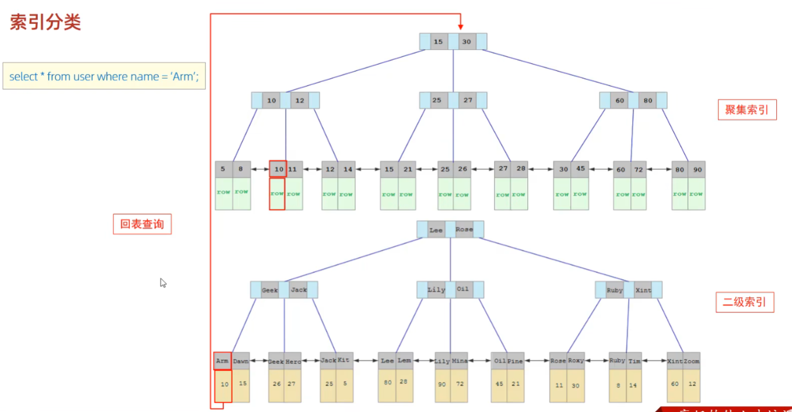
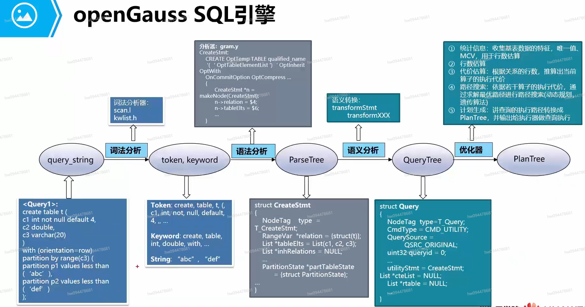

#   DataBase

---

# 主流关系型数据库

---

1. MySQL
2. PostgreSQL
3. Oracle
4. Microsoft SQL Server
5. SQLite
6. Microsoft Access
7. Microsoft Azure SQL Database

# SQL

---

> 1. SQL语句可以单行或多行书写，以分号结尾
> 2. SQL语句可以使用空格/缩进来增强语句的可读性。
> 3. MySQL数据库的SQL语句不区分大小写，关键字建议使用大写。
> 4. 注释:
>    单行注释:`-- 注释内容`或`# 注释内容(MySQL特有)`
>    多行注释: `/*注释内容*/`

## SQL分类

SQL 语句主要可以划分为以下 3 个类别  

- **DDL（Data Definition Languages）语句：**数据定义语言，这些语句定义了不同的数据段、数据库、表、列、索引等数据库对象的定义。常用的语句关键字主要包括 create、drop、alter等。
- **DML（Data Manipulation Language）语句：**数据操纵语句，用于添加、删除、更新和查询数据库记录，并检查数据完整性，常用的语句关键字主要包括 insert、delete、udpate 和select 等。(增删改）
- **DCL（Data Control Language）语句：**数据控制语句，用于控制不同数据段直接的许可和访问级别的语句。这些语句定义了数据库、表、字段、用户的访问权限和安全级别。主要的语句关键字包括 grant、revoke 等。
- **DQL（Data Query Language）语句：**数据查询语言，用来查询数据库中表的记录


## 数据类型

1. 数值类型

   | 类型         | 大小                                     | 范围（有符号 SIGNED）                                        | 范围（无符号 UNSIGNED）                                      | 用途            |
   | :----------- | :--------------------------------------- | :----------------------------------------------------------- | :----------------------------------------------------------- | :-------------- |
   | TINYINT      | 1 Bytes                                  | (-128，127)                                                  | (0，255)                                                     | 小整数值        |
   | SMALLINT     | 2 Bytes                                  | (-32 768，32 767)                                            | (0，65 535)                                                  | 大整数值        |
   | MEDIUMINT    | 3 Bytes                                  | (-8 388 608，8 388 607)                                      | (0，16 777 215)                                              | 大整数值        |
   | INT或INTEGER | 4 Bytes                                  | (-2 147 483 648，2 147 483 647)                              | (0，4 294 967 295)                                           | 大整数值        |
   | BIGINT       | 8 Bytes                                  | (-9,223,372,036,854,775,808，9 223 372 036 854 775 807)      | (0，18 446 744 073 709 551 615)                              | 极大整数值      |
   | FLOAT        | 4 Bytes                                  | (-3.402 823 466 E+38，-1.175 494 351 E-38)，0，(1.175 494 351 E-38，3.402 823 466 351 E+38) | 0，(1.175 494 351 E-38，3.402 823 466 E+38)                  | 单精度 浮点数值 |
   | DOUBLE       | 8 Bytes                                  | (-1.797 693 134 862 315 7 E+308，-2.225 073 858 507 201 4 E-308)，0，(2.225 073 858 507 201 4 E-308，1.797 693 134 862 315 7 E+308) | 0，(2.225 073 858 507 201 4 E-308，1.797 693 134 862 315 7 E+308) | 双精度 浮点数值 |
   | DECIMAL      | 对DECIMAL(M,D) ，如果M>D，为M+2否则为D+2 | 依赖于M(精度)和D(标度)的值                                   | 依赖于M和D的值                                               | 小数值          |

   > 这些类型包括严格数值数据类型(INTEGER、SMALLINT、DECIMAL 和 NUMERIC)，以及近似数值数据类型(FLOAT、REAL 和 DOUBLE PRECISION)。
   >
   > DOUBLE(x,y)表示x位有效数字，小数点后y位
   >
   > 关键字INT是INTEGER的同义词，关键字DEC是DECIMAL的同义词。
   >
   > BIT数据类型保存位字段值，并且支持 MyISAM、MEMORY、InnoDB 和 BDB表。
   >
   > 作为 SQL 标准的扩展，MySQL 也支持整数类型 TINYINT、MEDIUMINT 和 BIGINT。

2. 日期和时间类型

   | 类型      | 大小 ( bytes) | 格式                | 范围                                                         | 用途                     |
   | :-------- | :------------ | :------------------ | :----------------------------------------------------------- | :----------------------- |
   | DATE      | 3             | YYYY-MM-DD          | 1000-01-01/9999-12-31                                        | 日期值                   |
   | TIME      | 3             | HH:MM:SS            | '-838:59:59'/'838:59:59'                                     | 时间值或持续时间         |
   | YEAR      | 1             | YYYY                | 1901/2155                                                    | 年份值                   |
   | DATETIME  | 8             | YYYY-MM-DD hh:mm:ss | '1000-01-01 00:00:00' 到 '9999-12-31 23:59:59'               | 混合日期和时间值         |
   | TIMESTAMP | 4             | YYYY-MM-DD hh:mm:ss | '1970-01-01 00:00:01' UTC 到 '2038-01-19 03:14:07' UTC结束时间是第 **2147483647** 秒，北京时间 **2038-1-19 11:14:07**，格林尼治时间 2038年1月19日 凌晨 03:14:07 | 混合日期和时间值，时间戳 |

   > 每个时间类型有一个有效值范围和一个"零"值，当指定不合法的MySQL不能表示的值时使用"零"值
   >
   > TIMESTAMP类型有专有的自动更新特性
   >
   > **MySQL** 使用下列数据类型在数据库中存储日期或日期/时间值：
   >
   > - DATE - 格式：YYYY-MM-DD
   > - DATETIME - 格式：YYYY-MM-DD HH:MM:SS
   > - TIMESTAMP - 格式：YYYY-MM-DD HH:MM:SS
   > - YEAR - 格式：YYYY 或 YY
   >
   > **SQL Server** 使用下列数据类型在数据库中存储日期或日期/时间值：
   >
   > - DATE - 格式：YYYY-MM-DD
   > - DATETIME - 格式：YYYY-MM-DD HH:MM:SS
   > - SMALLDATETIME - 格式：YYYY-MM-DD HH:MM:SS
   > - TIMESTAMP - 格式：唯一的数字

3. 字符串类型

   | 类型       | 大小                  | 用途                            |
   | :--------- | :-------------------- | :------------------------------ |
   | CHAR       | 0-255 bytes           | 定长字符串                      |
   | VARCHAR    | 0-65535 bytes         | 变长字符串                      |
   | TINYBLOB   | 0-255 bytes           | 不超过 255 个字符的二进制字符串 |
   | TINYTEXT   | 0-255 bytes           | 短文本字符串                    |
   | BLOB       | 0-65 535 bytes        | 二进制形式的长文本数据          |
   | TEXT       | 0-65 535 bytes        | 长文本数据                      |
   | MEDIUMBLOB | 0-16 777 215 bytes    | 二进制形式的中等长度文本数据    |
   | MEDIUMTEXT | 0-16 777 215 bytes    | 中等长度文本数据                |
   | LONGBLOB   | 0-4 294 967 295 bytes | 二进制形式的极大文本数据        |
   | LONGTEXT   | 0-4 294 967 295 bytes | 极大文本数据                    |

   > char(n) 和 varchar(n) 中括号中 n 代表字符的个数，并不代表字节个数
   >
   > BINARY 和 VARBINARY 类似于 CHAR 和 VARCHAR，不同的是它们包含二进制字符串而不要非二进制字符串。也就是说，它们包含字节字符串而不是字符字符串。这说明它们没有字符集，并且排序和比较基于列值字节的数值值。
   >
   > BLOB 是一个二进制大对象，可以容纳可变数量的数据。有 4 种 BLOB 类型：TINYBLOB、BLOB、MEDIUMBLOB 和 LONGBLOB。它们区别在于可容纳存储范围不同。


## 数据库相关

### 进入数据库控制台

#### MySQL

```mysql
mysql -u <user_name> [-p] [-h host] [-P port]	# 进入MySQL
```

#### OpenGauss

```mysql
gsql [-U user_name][-W password][-p port][-d dbname][-f filename][-h host][-r][-C]
```

> gsql是openGauss提供的在命令行下运行的数据库连接工具。此工具除了具备操作数据库的基本功能，还提供了若干高级特性，便于用户使用。
>
> 禁止使用omm用户进行远程连接数据库。
>
> - **dbname**
>
>    指定想要连接的数据库名称。
>
> - **port**
>
>    指定数据库服务器的端口号。
>
> - **-f filename**
>
>    使用文件作为命令源而不是交互式输入。该参数指定读取文本文件的路径以及名称。
>
> - **-C**
>
>    表示密态数据库开启，可以创建密钥和加密表。


### 查看数据库配置

```mysql
SHOW VARIABLES LIKE 'slow_query_log'; # 查看慢查询日志是否开启
SELECT @@local_infile; # 查看local_infile是否开启
SHOW VARIABLES LIKE 'sort_buffer_size'; # 查看file sort缓冲区大小
```


### 创建数据库

```mysql
-- MySQL
CREATE DATABASE [IF NOT EXISTS] database_name [DEFAULT CHARSET 字符集] [COLLATE 排序规则];

-- OpenGauss
CREATE DATABASE database_name;
```

> 字符集：
>
> - utf8
> - utf8mb4

### 查看数据库

```mysql
-- MySQL
SHOW DATABASES; # 查询所有数据库
SELECT DATABASE();	# 查询当前数据库

-- OpenGauss
SELECT datname FROM pg_database; # 查看所有数据库,使用'\l'亦可
\c dbname;	# OpenGauss 连接数据库
```


### 删除数据库

```mysql
-- MySQL/OpenGauss
DROP DATABASE [IF EXISTS] database_name;
```


### 进入数据库

```mysql
-- MySQL
USE database_name;
-- OpenGauss
\c dbname;
```


## 模式相关

### 创建模式

```mysql
-- OpenGauss
CREATE SCHEMA schema_name 
    [ AUTHORIZATION user_name ] ;
```

> 模式名不能和当前数据库里其他的模式重名。 模式的名称不可以“pg_”开头。
>
> 当不指定schema_name时，把user_name当作模式名，此时user_name只能是角色名。


### 修改模式

```mysql
-- OpenGauss
# 重命名
ALTER SCHEMA schema_name 
    RENAME TO new_name;
# 修改所有者
ALTER SCHEMA schema_name 
    OWNER TO new_owner;
```


### 查看模式

```mysql
# OpenGauss
set search_path to schema_name;	# 指定模式位置，默认的模式为public
show search_path; # 查看当前模式位置
\dn # 查看所有模式
\dt # 查看模式内对象
```


### 删除模式

```mysql
DROP SCHEMA schema_name [CASCADE|RESTRICT];
```

> 不要随意删除pg_temp或pg_toast_temp开头的模式，这些模式是系统内部使用的，如果删除，可能导致无法预知的结果。


## 表相关

### 创建表

```mysql
create table TableName
(
	ColName1 type [NOT NULL] [UNIQUE] [PRIMARY KEY] [COMMENT 字段注释],
    [FOREIGN KEY () REFERENCES TableName(ColName)]
)[COMMENT 表注释];

-- OpenGauss
CREATE TABLE table_name 
    (column_name data_type [, ... ]);
```


### 查询表

```mysql
SHOW TABLES;	# 查询当前数据库所有表
DESC table_name;	# 查询表结构
SHOW CREATE TABLE table_name;	# 查询指定表的建表语句
```


### 删除表

```mysql
DROP TABLE [IF EXISTS] 表名;	# 删除指定表
TRUNCATE TABLE 表名;	# 删除指定表并重新创建该表
```


## 约束相关

### 约束类型

1. 主键约束（primary key constraint）

   要求主键列数据唯一，且不能为空

2. 唯一约束（unique constraint）

   要求该列唯一，可以为空，但不能出现一个空值

   > 主键和唯一的区别：
   >
   >  
   >
   > 　　a.主键不能为NULL，唯一可以为NULL
   >
   >  
   >
   > 　　b.主键可以是复合主键，也可以是单值主键
   >
   >  
   >
   > 　　c.一张表中只能设置一次主键（复合主键），但唯一键可以设置多次

3. 外键约束（foreign key constraint）

   用于两表间建立连接，需要指定引用主表的哪一列

   > OpenGauss的FOREIGN Key在MySQL兼容性下，外键可以关联非唯一性索引。即一个表中的FOREIGN Key指向另一个表中的 Non-unique KEY（非唯一约束的键）。 
   >
   > 如果在MySQL兼容性下，定义外键指定ON UPDATE | DELETE CASCADE时，在非唯一性索引中，非唯一索引字段存在多个元组时，只要dml其中一行数据，则会触发外键表里关联的字段全部修改。但如果字段为NULL时，则不触发外键关联的字段做对应的修改，MySQL兼容性需要安装dolphin插件才可生效。

4. 检查约束（check constraint）

   某列取值范围限制，格式限制等，如有关年龄的约束

5. 非空约束（not null constraint）

   用于确保列不能为NULL，如果在列上定义了非空约束，那么当插入数据时，必须为该列提供数据，当更新列数据时，不能将其值设置为NULL

6. 默认约束（default constraint）

   用于为数据表中的字段指定默认值，即当在表中插入一条新纪录时，如果没有给这个字段赋值，那么数据库系统会自动为这个字段插入默认值


### 表级约束

与列定义相互独立，不包含在列定义中;通常用于对多个列一起进行约束，与定义用","分隔;必须指出要约束的列的名称

> 某些特殊情况只能使用表级约束，列级约束无法完成创建，例如：
>
> - 创建复合索引就必须使用表级索引，才能创建成功

- 主键
- 外键
- 唯一
- 检查

```mysql
[Constraint <约束名>] Primary Key( <列名> [{<列名>}])
[Constraint <约束名>] Foreign key (列名)  References <外表名>(<列名> [{<列名>}])
[Constraint <约束名>] Unique  ( <列名> [{<列名>}])
[Constraint <约束名>] Check (<条件>)

e.g.:
　　create table student2(
　　stuno number(3) ,
　　stuname varchar2(10) ,
　　stuaddress varchar2(20) ,
　　stubid number(3),
　　constraint PK_sno primary key(stuno) ,
　　constraint UQ_sname_subid unique(stuname,stubid),
　　constraint CK_saddress check( length(stuAddress)>2)
　　);
```


### 列级约束

包含在列定义中;直接跟在该列的其他定义之后，用空格分隔;不必指定列名

> 某些特殊情况只能使用列级约束，表级约束无法完成创建，例如：
>
> - 创建非空约束，必须在列级进行定义，不能在表级创建

- 主键
- 外键
- 唯一
- 检查
- 默认
- 非空

```mysql
[Constraint <约束名>] Primary Key
[Constraint <约束名>] Foreign key (列名)  References <外表名>(列名)
[Constraint <约束名>] Unique
[Constraint <约束名>] Check (<条件>)
[Constraint <约束名>] Default  约束条件
[Constraint <约束名>] Null | Not Null

e.g.:
　　create table student (
　　stuno number(3) constraint PK_stuno primary key,　
　　stuname varchar2(10) constaint UQ_stuname unique constraint NN_stuname not null,　
　　stuaddress varchar2(20) default '广东省广州市'  constraint CK_stuaddress check(length(stuaddress)>2)　
　　);
```


### 约束命名

规范：constraint 约束类型_字段名

1、主键约束：PK_字段名

2、检查约束：CK_字段名

3、唯一约束：UQ_字段名

4、非空约束：NN_字段名

5、外键约束：FK_子表_父表

6、默认约束：一般不需要命名


### 外键删除/更新行为

```mysql
... on delete|update actions;
```

| 行为        | 说明                                                         |
| ----------- | ------------------------------------------------------------ |
| NO ACTION   | 当在父表中删除/更新对应记录时，首先检查该记录是否有对应外键，如果有则不允许删除/更新。(与 RESTRICT一致) |
| RESTRICT    | 当在父表中删除/更新对应记录时，首先检查该记录是否有对应外键，如果有则不允许删除/更新。(与 NO ACTION一致) |
| CASCADE     | 当在父表中删除/更新对应记录时，首先检查该记录是否有对应外键，如果有，则也删除/更新外键在子表中的记录 |
| SET NULL    | 当在父表中删除对应记录时，首先检查该记录是否有对应外键，如果有则设置子表中该外键值为null(这就要求该外键允许取null) |
| SET DEFAULT | 父表有变更时，子表将外键列设置成一个默认的值(Innodb不支持)   |


## ALTER

---


```mysql
ALTER TABLE 表名 DROP COLUMN 列名	# 删除列
ALTER TABLE 表名 ADD [COLUMN] 列名 属性 [COMMENT 注释] [约束]	#	增加列
ALTER TABLE 表名 CHANGE COLUMN 列名 新列名	#修改列的类型信息
ALTER TABLE 表名字 CHANGE COLUMN 列名 新列名 属性	# 重命名列
ALTER TABLE 表名 RENAME TO 表新名	# 重命名表
Alter TABLE 表名 DROP CONSTRAINT 约束名	# 删除表中约束
ALTER TABLE 表名 ADD CONSTRAINT 约束名 约束	# 添加约束
ALTER TABLE 表名 ADD index 索引名 (列名)	# 添加索引
ALTER TABLE 表名 MODIFY COLUMN 要修改属性的列名 新属性	# 修改列的属性

-- MySQL
ALTER TABLE 表名 ADD 列名 类型(长度) [COMMENT 注释] [约束]	#	增加列
ALTER TABLE 表名 CHANGE 列名 新列名 类型(长度) [COMMENT 注释] [约束]	#	修改列的列名和数据类型
ALTER TABLE 表名 MODIFY 列名 新数据类型(长度) # 修改数据类型
ALTER TABLE 表名 DROP 列名	# 删除列
ALTER TABLE 表名 RENAME TO 表新名	# 重命名表
# 添加外键
ALTER TABLE 表名 ADD CONSTRAINT 外键名 FOREIGN KEY (外键字段名) REFERENCES 主表(主表列名)
ALTER TABLE 表名 DROP FOREIGN KEY 外键名	# 删除外键
# 设置外键删除/更新行为
ALTER TABLE 表名 ADD CONSTRAINT 外键名 FOREIGN KEY (外键字段名) REFERENCES 主表(主表列名) ON 权限1 行为1 [ON 权限2 行为2];

-- OpenGauss
ALTER DATABASE database_name RENAME TO new_name;	# 重命名数据库
ALTER TABLE  table_name ADD column_name data_type;	# 在一张已经存在的表上添加列
ALTER TABLE table_name DROP COLUMN column_name;	# 在一张已经存在的表上删除列
ALTER TABLE  table_name MODIFY column_name data_type;	# 修改表的字段类型
ALTER TABLE table_name RENAME  column_name TO new_column_name;	# 重命名表中指定的列
```


## DML

1. 添加数据

   ```mysql
   INSERT INTO table_name[(字段名1，字段名2)] VALUES(val1,val2,...)[,(val1,val2,...)]; 
   
   -- OpenGauss
   INSERT INTO table_name [ ( column_name [, ...] ) ]
       { DEFAULT VALUES
       | VALUES {( { expression | DEFAULT } [, ...] ) }[, ...] };
   ```

   > - 插入数据时，指定的字段顺序需要与值的顺序是一一对应的
   > - 字符串和日期型数据应该包含在引号中
   > - 插入的数据大小，应该在字段的规定范围内

2. 修改数据

   ```mysql
   UPDATE table_name SET 字段名1 = 值1,字段名2 = 值2,...[ WHERE 条件];
   ```

3. 删除数据

   ```mysql
   DELETE FROM 表名 [WHERE 条件]
   ```

   > DELETE 语句不能删除某一个字段的值(可以使用UPDATE)


## DQL

```mysql
# 基本框架
SELECT	字段列表
FROM	表名列表
WHERE	条件列表
GROUP BY	分组字段列表
HAVING	分组后条件列表
ORDER BY	排序字段列表
LIMIT	分页参数
```

> 执行顺序
>
> 1. FROM
> 2. WHERE
> 3. GROUP BY
> 4. HAVING
> 5. SELECT
> 6. ORDER BY
> 7. LIMIT

1. 基础查询

   ```mysql
   SELECT [DISTINCT] 字段1[[AS] 别名1],字段2[[AS] 别名2], ... 
   FROM 表名[[AS] 别名];
   
   SELECT [DISTINCT] *
   FROM 表名;
   ```

2. 条件查询

   ```mysql
   SELECT 字段列表 
   FROM 表名 
   WHERE 条件列表;
   ```

   > 
   >
   > 

3. 分组查询

   ```mysql
   SELECT 字段列表 
   FROM 表名 
   [WHERE 条件] 
   GROUP BY 分组字段名
   [HAVING 分组后过滤条件];
   ```

   > 使用分组查询后字段列表只能为分组字段名或聚合函数
   >
   > where与having区别
   >
   > - 执行时机不同:where是分组之前进行过滤，不满足where条件，不参与分组，而having是分组之后对结果进行过滤
   > - 判断条件不同: where不能对聚合函数进行判断，而having可以。

4. 排序查询

   ```mysql
   SELECT 字段列表 
   FROM 表名 
   ORDER BY 字段1 排序方式1,字段2 排序方式2;
   ```

   > 排序方式
   >
   > - ASC:升序(默认值)
   > - DESC:降序
   >
   > 如果是多字段排序，当第一个字段值相同时，才会根据第二个字段进行排序

5. 分页查询

   ```mysql
   SELECT 字段列表 
   FROM 表名 
   LIMIT 起始索引,查询记录数;
   ```

   > 起始索引从0开始，起始索引= (查询页码 - 1)*每页显示记录数
   >
   > 分页查询是数据库的方言，不同的数据库有不同的实现，MySQL中是LIMIT。
   >
   > 如果查询的是第一页数据，起始索引可以省略，直接简写为 limit 10。

6. 多表查询

   - 交叉连接：笛卡儿乘积，指两个关系中所有元组的任意组合

      ```mysql
      SELECT FROM 表1 CROSS JOIN 表2;	# OpenGauss交叉连接
      
   - 内连接：查询两张表的交集部分数据

      ```mysql
      SELECT 字段列表 FROM 表1，表2 WHERE 条件...; # 隐式内连接
      SELECT 字段列表 FROM 表1 INNER JOIN 表2 ON 连接条件; # 显式内连接
      ```
   
   - 外连接：保留表中的悬浮元组，将悬浮元组的其他属性设置为NULL

      ```mysql
      SELECT 字段列表 FROM 表1 LEFT OUTER JOIN 表2 ON 条件 ...; # 左外连接
      SELECT 字段列表 FROM 表1 RIGHT OUTER JOIN 表2 ON 条件 ...; # 右外连接
      SELECT 字段列表 FROM 表1 FULL OUTER JOIN 表2 ON 条件 ...; # OpenGauss全外连接
      ```

   - 自连接：当前表与自身的连接查询，自连接必须使用表别名

      ```mysql
      SELECT 字段列表 FROM 表A 别名A JOIN 表A 别名B ON 条件...;
      ```
   
   - [联合查询](#set)
   
   - 子查询
   
      - 根据子查询结果不同，分为:
         - 标量子查询(子查询结果为单个值)
         - 列子查询(子查询结果为一列)
         - 行子查询(子查询结果为一行)
         - 表子查询(子查询结果为多行多列)
      - 根据子查询位置，分为:
         - WHERE之后
         - FROM之后
         - SELECT之后


## DCL

1. 用户管理

   ```mysql
   -- MySQL
   # 查询用户
   USE mysql;	# 进入mysql模式
   SELECT * FROM user;	# 查询user表
   
   # 创建用户
   CREATE USER '用户名'@'主机名' IDENTIFIED BY '密码';
   
   # 修改用户密码
   ALTER USER '用户名'@'主机名' IDENTIFIED WITH mysql_native_password BY '新密码';
   
   # 删除用户
   DROP USER '用户名'@'主机名';
   
   -- OpenGauss
   # 创建用户
   CREATE USER user_name [ [ WITH ] option [ ... ] ] [ ENCRYPTED | UNENCRYPTED ] { PASSWORD | IDENTIFIED BY } { 'password' [EXPIRED] | DISABLE };
   # 修改密码
    ALTER ROLE user_name IDENTIFIED BY '$$$$$$$$' REPLACE 'XXXXXXXX';
   ```

   > 若主机号为'%'则表示任意主机

2. 权限控制

   > MySQL权限级别分为了五个层级，并且每个级别的权限都对应着不同的表，这些表都存在于mysql库下，在MySQL官方文档中有详细介绍权限的概念
   >
   > 1. 全局级
   >
   >    全局权限适用于一个给定服务器中的所有数据库。这些权限存储在mysql.user表中。`GRANT ALL ON *.*`和`REVOKE ALL ON *.*`用于授予和撤销全局权限。
   >
   > 2. 数据库层级
   >
   >    数据库权限适用于一个给定数据库中的所有目标。这些权限存储在mysql.db和mysql.host表中。`GRANT ALL ON db_name.*`和`REVOKE ALL ON db_name.*`用于授予和撤销数据库权限。
   >
   > 3. 表层级
   >
   >    表权限适用于一个给定表中的所有列。这些权限存储在mysql.talbes_priv表中。`GRANT ALL ON
   >    db_name.tbl_name`和`REVOKE ALL ON db_name.tbl_name`只授予和撤销表权限
   >
   > 4. 列层级
   >
   >    列权限适用于一个给定表中的单一列。这些权限存储在mysql.columns_priv表中。当使用REVOKE时，您必须指定与被授权列相同的列。
   >
   > 5. 子程序层级
   >
   >    `REATE ROUTINE`, `ALTER ROUTINE`,`EXECUTE`和`GRANT`权限适用于已存储的子程序。这些权限可以被授予为全局层级和数据库层级。而且，除了`CREATE ROUTINE`外，这些权限可以被授予为子程序层级，并存储在mysql.procs_priv表中。

   ```mysql
   SHOW GRANTS FOR '用户名'@'主机名';	# 查询权限
   GRANT 权限列表 ON 数据库名.表名 TO '用户名'@'主机名';	# 授予权限
   REVOKE 权限列表 ON 数据库名.表名 FROM '用户名'@'主机名';	# 撤销权限
   ```

   > ALL/ALL PRIVILEGES表示所有权限


## <a id="set">集合操作</a>

1. 并集

   ```mysql
      SELECT column_name(s) FROM table1
      UNION [ALL]
      SELECT column_name(s) FROM table2;
   ```

   这个查询会返回来自`table1`和`table2`的所有唯一记录。如果需要包含重复记录，只需更改上述查询，将`UNION`替换为`UNION ALL`即可

2. 交集

   ```mysql
      SELECT column_name(s) FROM table1
      INTERSECT
      SELECT column_name(s) FROM table2;
   ```

3. 差集

   ```mysql
      SELECT column_name(s) FROM table1
      EXCEPT
      SELECT column_name(s) FROM table2;
   ```

> 上述集合操作（并集UNION，交集INTERSECT和差集EXCEPT）在多种数据库系统中都被广泛支持，包括但不限于以下数据库：
>
> 1. MySQL: MySQL支持并集(UNION)操作，但不直接支持交集(INTERSECT)和差集(EXCEPT)。然而，你可以通过其他方法实现类似的功能，例如使用INNER JOIN（等同于交集），或者使用LEFT JOIN和WHERE（等同于差集）
> 2. PostgreSQL: PostgreSQL全面支持并集(UNION)，交集(INTERSECT)，以及差集(EXCEPT)的操作 
> 3. SQLite: SQLite也全面支持并集(UNION)，交集(INTERSECT)，以及差集(EXCEPT)的操作 
> 4. SQL Server: SQL Server也全面支持并集(UNION)，交集(INTERSECT)，以及差集(EXCEPT)的操作 
> 5. Oracle: Oracle也全面支持并集(UNION)，交集(INTERSECT)，以及差集(MINUS，Oracle中的差集关键词是MINUS而不是EXCEPT)的操作
>
> 需要注意的是，虽然这些集合操作在SQL标准中有定义，但是不同的数据库系统可能会有不同的实现方式和细微的语法差异。在使用时，建议查阅具体的数据库文档或者使用数据库相关的查询工具来确保正确的使用。


## 事务

> 事务是一组操作的集合，它是一个不可分割的工作单位，事务会把所有的操作作为一个整体一起向系统提交或撤销操作请求，即这些操作要么同时成功，要么同时失败。
>
> **四大特性ACID**
>
> - 原子性 (Atomicity): 事务是不可分割的最小操作单元，要么全部成功，要么全部失败
> - 一致性(Consistency):事务完成时，必须使所有的数据都保持一致状态
> - 隔离性(lsolation):数据库系统提供的隔离机制，保证事务在不受外部并发操作影响的独立环境下运行
> - 持久性 (Durability): 事务一旦提交或回滚，它对数据库中的数据的改变就是永久的
>
> **并发事务问题**
>
> - 脏读：一个事务读到另外一个事务还没有提交的数据
> - 不可重复读：一个事务先后读取同一条记录，但两次读取的数据不同，称之为不可重复读
> - 幻读：一个事务按照条件查询数据时没有对应的数据行，但是在插入数据时又发现这行数据已经存在
>
> **事务隔离级别**
>
> - MySQL
>
>    
>    
> - openGauss
>
>    - **READ COMMITTED**：读已提交隔离级别，事务只能读到已提交的数据而不会读到未提交的数据，这是缺省值。
>
>       实际上，SELECT查询会查看到在查询开始运行的瞬间该数据库的一个快照。不过，SELECT能查看到其自身所在事务中先前更新的执行结果。即使先前更新尚未提交。请注意，在同一个事务里两个相邻的SELECT命令可能会查看到不同的快照，因为其它事务会在第一个SELECT执行期间提交。
>
>       因为在读已提交模式里，每个新的命令都是从一个新的快照开始的，而这个快照包含所有到该时刻为止已提交的事务，因此同一事务中后面的命令将看到任何已提交的其它事务的效果。这里关心的问题是在单个命令里是否看到数据库里绝对一致的视图。
>
>       读已提交模式提供的部分事务隔离对于许多应用而言是足够的，并且这个模式速度快，使用简单。不过，对于做复杂查询和更新的应用，可能需要保证数据库有比读已提交模式更加严格的一致性视图。
>
>    - **REPEATABLE READ**：事务可重复读隔离级别，事务只能读到事务开始之前已提交的数据，不能读到未提交的数据以及事务执行期间其它并发事务提交的修改（但是，查询能查看到自身所在事务中先前更新的执行结果，即使先前更新尚未提交）。这个级别和读已提交是不一样的，因为可重复读事务中的查询看到的是事务开始时的快照，不是该事务内部当前查询开始时的快照，就是说，单个事务内部的select命令总是查看到同样的数据，查看不到自身事务开始之后其他并发事务修改后提交的数据。使用该级别的应用必须准备好重试事务，因为可能会发生串行化失败。

```mysql
-- MySQL
# 查看/设置事务提交方式
SELECT @@autocommit;
SET @@autocommit = 0|1;

COMMIT; # 提交事务
ROLLBACK; # 回滚事务

# 开启事务
START TRANSACTION;
BEGIN;

SELECT @@TRANSACTION_ISOLATION; # 查看事务隔离级别
SET [SESSION|GLOBAL] TRANSACTION ISOLATION LEVEL {READ UNCOMMITTED|READ COMMITTED|REPEATABLE READ|SERIALIZABLE}; # 设置事务隔离级别

-- OpenGauss
# 启动事务
BEGIN [ WORK | TRANSACTION ]
  [ 
    { 
       ISOLATION LEVEL { READ COMMITTED | SERIALIZABLE | REPEATABLE READ }
       | { READ WRITE | READ ONLY }
      } [, ...] 
  ];
START TRANSACTION
  [ 
    { 
       ISOLATION LEVEL { READ COMMITTED | SERIALIZABLE | REPEATABLE READ }
       | { READ WRITE | READ ONLY }
     } [, ...] 
  ];
# 设置事务特性
{ SET [ LOCAL ] TRANSACTION|SET SESSION CHARACTERISTICS AS TRANSACTION }
  { ISOLATION LEVEL { READ COMMITTED | SERIALIZABLE | REPEATABLE READ }
  | { READ WRITE | READ ONLY } } [, ...];
# 提交事务
{ COMMIT | END } [ WORK | TRANSACTION ] ;
# 回滚事务
ROLLBACK [ WORK | TRANSACTION ]; 
```

> 
>
> **OpenGauss**
>
> - **WORK | TRANSACTION**
>
>    BEGIN格式中的可选关键字，没有实际作用。
>
> - **ISOLATION LEVEL**
>
>    指定事务隔离级别，它决定当一个事务中存在其他并发运行事务时它能够看到什么数据。
>
>    > **说明：** 在事务中第一个数据修改语句（SELECT, INSERT，DELETE，UPDATE，FETCH，COPY)执行之后，事务隔离级别就不能再次设置。
>
>    取值范围：
>
>    - READ COMMITTED：读已提交隔离级别，只能读到已经提交的数据，而不会读到未提交的数据。这是缺省值。
>    - REPEATABLE READ： 可重复读隔离级别，仅仅看到事务开始之前提交的数据，它不能看到未提交的数据，以及在事务执行期间由其它并发事务提交的修改。
>    - SERIALIZABLE：目前功能上不支持此隔离级别，等价于REPEATABLE READ。
>
> - **READ WRITE | READ ONLY**
>
>    指定事务访问模式（读/写或者只读）。
>
> - **LOCAL**
>
>    声明该命令只在当前事务中有效。
>
> - **SESSION**
>
>    声明这个命令只对当前会话起作用。
>
>    取值范围：字符串，要符合标识符的命名规范。
>
> - **COMMIT | END**
>
>    提交当前事务，让所有当前事务的更改为其他事务可见。


## 索引相关

> 索引(index)是帮助DBMS高效获取数据的数据结构(有序)。在数据之外，数据库系统还维护着满足特定查找算法的数据结构，这些数据结构以某种方式引用(指向)数据， 这样就可以在这些数据结构上实现高级查找算法，这种数据结构就是索引
>
> ### 索引的特点
>
> 优点：
>
> - 通过创建唯一索引，可以保证数据库表中每一行数据的唯一性。
> - 可以大大加快数据的查询速度。
> - 加速表和表之间的连接。
> - 在使用分组和排序子句进行数据查询时，可以有效减少分组和排序的时间。
>
> 缺点：
>
> - 创建索引和维护索引要耗费时间。且随着数据量的增加而增加。
> - 索引需要占用磁盘空间。
> - 当表中的数据进行增加、删除或修改时，所以也要动态维护，降低了数据的维护速度。
>
> ### **索引的结构**
>
> 
>
> 
>
> ### 索引的种类
>
> > 聚簇索引、非聚簇索引
> >
> > - ​	**聚簇索引**：物理排序，在索引上按顺序，数据存放也按顺序排
> > - ​	**非聚簇索引**：逻辑排序，仅索引排序，数据无序存放
> >
> > 唯一值索引、非唯一值索引：索引键值是否允许重复
> >
> > 单列索引与复合索引(联合索引/组合索引)：单列与多列
> >
> > 反键索引、函数索引、倒排索引....
>
> 
>
> 
>
> 
>
> 
>
> > 聚集索引选取规则:
> > 如果存在主键，主键索引就是聚集索引
> > 如果不存在主键，将使用第一个唯一(UNIQUE)索引作为聚集索引
> > 如果表没有主键，或没有合适的唯一索引，则innoDB会自动生成一个rowid作为隐藏的聚集索引
>
> 

### 基本语法

```mysql
CREATE [UNIQUE|FULLTEXT|SPATIAL]INDEX index_name
ON table_name (col_name[(length)][ASC | DESC],...)

-- MySQL
# 创建索引
CREATE [UNIQUE|FULLTEXT]INDEX index_name
ON table_name (col_name[length][ASC | DESC],...);

SHOW INDEX FROM table_name[\G];	# 查看索引
DROP INDEX index_name ON table_name;	# 删除索引

-- OpenGauss
# 创建索引
CREATE [UNIQUE] INDEX index_name ON table_name (col_name,...);
# 局部索引
CREATE INDEX [ [schema_name.]index_name ] ON table_name  (expression);
# 部分索引
CREATE INDEX [ [schema_name.]index_name ] ON table_name  (column_name) 
   [ WHERE predicate ]；
# 聚簇索引
CREATE INDEX index_name ON table_name(col_name);
CLUSTER table_name USING index_name;
# 删除索引
DROP INDEX index_name;
```

> - `UNIQUE`：创建的索引应该包含唯一的值。如果表中有重复的值，那么这个索引将会失败。
>
> - `FULLTEXT`：创建的索引应该用于全文搜索。这个选项只在某些数据库系统中可用，例如 MySQL。
>
> - `SPATIAL`：创建的索引应该用于空间查询。这个选项只在某些数据库系统中可用，例如 MySQL。
>
> - `ASC` 和 `DESC`：这些选项用于设置索引的排序方式。默认是 `ASC`，即升序。如果你设置为 `DESC`，那么索引将按照降序排列。
>
> 
>
> 我们需要注意的是，在新插入数据时，PostgreSQL 并不会维护索引的正确性（即后续插入的数据并不是按照聚簇索引的顺序在物理上排序），我们需要再次使用 `CLUSTER` 命令来维护聚簇索引的正确性。

### 使用规则

1. 最左前缀法则

   如果索引了多列(联合索引)，要遵守最左前缀法则。

   最左前缀法则指的是查询从索引的最左列开始，并且不跳过索引中的列。

   如果跳跃某一列，索引将部分失效(后面的字段索引失效)。
   
   查询时索引顺序对结果不影响，存在即可
   
2. 范围查询

   联合索引中，出现范围查询(">"或"<")，范围查询右侧的列索引失效

3. 索引列运算

   在索引列上进行运算操作则索引失效

4. 字符串类型字段使用时不加引号，索引将失效

5. 模糊查询

   如果仅使用尾部模糊匹配，索引不会失效；如果使用头部模糊匹配，索引会失效

6. or连接的条件

   用or分割开的条件，如果or前的条件中的列有索引，而后面的列中没有索引，那么涉及的索引都不会被用到

7. 数据分布影响

   如果DBMS评估使用索引比全表查询更慢则不会使用索引

8. 覆盖索引

   尽量使用覆盖索引(查询使用了索引，并且需要返回的列在该索引中已经全部能够找到)，减少`select *`

   > using index condition : 查找使用了索引，但是需要回表查询数据
   > using where; using index : 查找使用了索引，但是需要的数据都在索引列中能找到，所以不需要回表查询数据

9. 前缀索引

   当字段类型为字符串(varchar，text等),时，有时候需要索引很长的字符串，这会让索引变得很大，查询时，浪费大量的磁盘IO，影响查询效率。此时可以只将字符串的一部分前缀，建立索引，这样可以大大节约索引空间，从而提高索引效率。

   可以根据索引的选择性来决定，而选择性是指不重复的索引值(基数和数据表的记录总数的比值，索引选择性越高则查询效率越高，唯一索引的选择性是1，这是最好的索引选择性，性能也是最好的。

   ```mysql
   # 计算选择性
   select count(distinct col_name)/count(*) from table_name;
   select count(distinct substring(col_name,1,length))/count(*) from table_name;
   ```

   

## 视图

> 视图(View)是一种虚拟存在的表。视图中的数据并不在数据库中实际存在，行和列数据来自定义视图的查询中使用的表，并且是在使用视图时动态生成的。
> 通俗的讲，视图只保存了查询的SOL逻辑，不保存查询结果。所以我们在创建视图的时候，主要的工作就落在创建这条SOL查询语句上.

```mysql
-- MySQL
# 创建视图
CREATE [OR REPLACE] VIEW 视图名称[(列名列表)] AS SELECT语句 [WITH [CASCADED|LOCAL] CHECK OPTION];
SHOW CREATE VIEW 视图名称;	# 查看创建视图语句
SELECT * FROM 视图名称;	# 查看视图数据
# 修改视图
CREATE [OR REPLACE] VIEW 视图名称[(列名列表)] AS SELECT语句 [WITH [CASCADED|LOCAL] CHECK OPTION];
ALTER VIEW VIEW 视图名称[(列名列表)] AS SELECT语句 [WITH [CASCADED|LOCAL] CHECK OPTION];
DROP VIEW [IF EXISTS] 视图名称;	# 删除视图

-- OpenGauss
CREATE [ TEMP | TEMPORARY ] VIEW view_name [ ( column_name [, ...] ) ]
     AS query;
```

> 当使用`WITH CHECK OPTION`子句创建视图时，MySQL会通过视图检查在更改的每个行，例如 插入，更新，删除，以使其符合视图的定义。MySQL允许基于另一个视图创建视图，它还会检查依赖视图中的规则以保持一致性。为了确定检查的范围，MySQL提供了两个选项：`CASCADED `和`LOCAL` ，默认值为 `CASCADED`。
>
> 如果不使用`WITH CHECK OPTION`子句，则可以通过该视图往表中插入不符合视图查询条件的元组，但是通过该视图查询时不会显示该非法元组。
>
> 要使视图可更新，视图中的行与基础表中的行之间必须存在一对一的关系。如果视图包含以下任何一项，则该视图不可更新:
>
> 1. 聚合函数或窗口函数(SUM()、 MIN()、 MAX()、 COUNT()等)
> 2. DISTINCT
> 3. GROUP BY
> 4. HAVING
> 5. UNION 或者 UNION ALL


## 基础函数

> 函数是指一段可以直接被另一段程序调用的程序或代码

1. 聚合函数

   > 将一列数据作为一个整体进行纵向计算

   1. SQL Aggregate 函数
      - AVG() - 返回平均值
      
      - COUNT() - 返回行数
      
         
      
      - FIRST() - 返回第一个记录的值
      
      - LAST() - 返回最后一个记录的值
      
      - MAX() - 返回最大值
      
      - MIN() - 返回最小值
      
      - SUM() - 返回总和
      
   2. SQL Scalar 函数
      - UCASE() - 将某个字段转换为大写
      - LCASE() - 将某个字段转换为小写
      - MID() - 从某个文本字段提取字符，MySql 中使用
      - SubString(字段，1，end) - 从某个文本字段提取字符
      - LEN() - 返回某个文本字段的长度
      - ROUND() - 对某个数值字段进行指定小数位数的四舍五入
      - NOW() - 返回当前的系统日期和时间
      - FORMAT() - 格式化某个字段的显示方式

2. 字符串函数

   - concat：将两个或多个字符串组合成一个字符串

   - length和char_length函数：以字节和字符获取字符串的长度

   - left(str,length)：返回具有指定长度的字符串的左边部分

   - right(str,length)：回具有指定长度的字符串的右边部分

   - replace(str,old,new)：搜索并替换字符串中的子字符串

   - ```mysql
      SUBSTRING(string,position);
      SUBSTRING(string FROM position);
      
      SUBSTRING(string,position,length);
      SUBSTRING(string FROM position FOR length);
      ```

      从具有特定长度的位置开始提取一个子字符串

   - trim([{BOTH|LEADING|TRAILING} [removed_str] FROM] str)：从字符串中删除不需要的字符

   - find_in_set(needle,haystack):在逗号分隔的字符串列表中找到一个字符串

      - 第一个参数`needle`是要查找的字符串。
      - 第二个参数`haystack`是要搜索的逗号分隔的字符串列表。

   - format(N,D,locale):格式化具有特定区域设置的数字，舍入到小数位数

      - `N`是要格式化的数字。
      - `D`是要四舍五入的小数位数。
      - `locale`是一个可选参数，用于确定千个分隔符和分隔符之间的分组。如果省略`locale`操作符，MySQL将默认使用`en_US`

   - lower:将字符串str全部转为小写

   - upper:将字符串str全部转为大写

   - lpad(str,n,pad):左填充，用字符串pad对str的左边进行填充，达到n个字符串长度

   - rpad(str,n,pad):右填充，用字符串pad对str的右边进行填充，达到n个字符串长度

3. 数值函数

   

4. 日期函数

   | 函数                              | 描述                                |
   | :-------------------------------- | :---------------------------------- |
   | NOW()                             | 返回当前的日期和时间                |
   | CURDATE()                         | 返回当前的日期                      |
   | CURTIME()                         | 返回当前的时间                      |
   | DATE()                            | 提取日期或日期/时间表达式的日期部分 |
   | EXTRACT()                         | 返回日期/时间的单独部分             |
   | DATE_ADD(date,INTERVAL expr type) | 向日期添加指定的时间间隔            |
   | DATE_SUB()                        | 从日期减去指定的时间间隔            |
   | DATEDIFF(date1,date2)             | 返回两个日期之间的天数              |
   | DATE_FORMAT()                     | 用不同的格式显示日期/时间           |
   | YEAR(date)                        | 获取指定date的年份                  |
   | MONTH(date)                       | 获取指定date的月份                  |
   | DAY(date)                         | 获取指定date的日期                  |

   > date 参数是合法的日期表达式
   >
   > expr 参数是您希望添加的时间间隔
   >
   > type 参数可以是下列值：
   >
   > | Type 值            |
   > | :----------------- |
   > | MICROSECOND        |
   > | SECOND             |
   > | MINUTE             |
   > | HOUR               |
   > | DAY                |
   > | WEEK               |
   > | MONTH              |
   > | QUARTER            |
   > | YEAR               |
   > | SECOND_MICROSECOND |
   > | MINUTE_MICROSECOND |
   > | MINUTE_SECOND      |
   > | HOUR_MICROSECOND   |
   > | HOUR_SECOND        |
   > | HOUR_MINUTE        |
   > | DAY_MICROSECOND    |
   > | DAY_SECOND         |
   > | DAY_MINUTE         |
   > | DAY_HOUR           |
   > | YEAR_MONTH         |

5. 流程函数

   | **函数**                                                 | **功能**                                                |
   | -------------------------------------------------------- | ------------------------------------------------------- |
   | if(value, t, f)                                          | 如果value为true，则返回t，否则返回f                     |
   | ifnull(value1, value2)                                   | 如果value1不为null，返回value1，否则返回value2          |
   | case when [val1] then [res1] … else [default] end        | 如果val1为true，则返回res1，否则返回default默认值       |
   | case [expr] when [val1] then [res1] … else [default] end | 如果expr的值等于val1，则返回res1，否则返回default默认值 |

   


## 自定义函数

1. 标量型函数（Scalar functions）：返回一个标量值

   ```mysql
   CREATE FUNCTION function_name([paraments]) RETURNS type
   BEGIN
   	block
   END
   ```

2. 表值函数

   1. 内联表值型函数（Inline table-valued functions）

      > 内联表值型函数以表的形式返回一个返回值，即它返回的是一个表。内联表值型函数没有由BEGIN-END 语句括起来的函数体。其返回的表由一个位于RETURN 子句中的SELECT 命令段从数据库中筛选出来。内联表值型函数功能相当于一个参数化的视图。

      ```mysql
      CREATE FUNCTION function_name([paraments]) RETURNS table
      RETURN(SQL_expression)
      ```

   2. 多声明表值型函数（Multi-statement table-valued functions）

      > 多声明表值型函数可以看作标量型和内联表值型函数的结合体。它的返回值是一个表，但它和标量型函数一样有一个用BEGIN-END 语句括起来的函数体，返回值的表中的数据是由函数体中的语句插入的。由此可见，它可以进行多次查询，对数据进行多次筛选与合并，弥补了内联表值型函数的不足。

      ```mysql
      CREATE FUNCTION function_name([paraments]) RETURNS table_name(column_name)
      BEGIN
      	block
      END
      ```


### MySQL

#### **函数定义**

> 存储函数是有返回值的存储过程，存储函数的参数只能是IN类型的。

```mysql
    CREATE  
        [DEFINER = { user | CURRENT_USER }]
        FUNCTION functionName ( varName varType [, ... ] )
        RETURNS returnVarType
        [characteristic ...] 
        routine_body;
```

> - functionName：函数名，同MySQL内置函数一样，大小写不敏感
> - varName: 形参名
> - varType: 形参类型，其与varName配对使用。形参数量不限( $\geq 0$)
> - returnVarType: 返回值类型。函数**必须有且只能有一个**返回值
> - characteristic：函数特性
> - routine_body：函数体。函数体中必须含有 **return** 语句，当函数体为复合结构时，需要使用begin ... end 语句
>
> | characteristic值                                             | 说明                                                         |
> | ------------------------------------------------------------ | ------------------------------------------------------------ |
> | `language sql `                                              | 指明函数体的语言类型, 目前仅支持sql                          |
> | `[not] deterministic `                                       | **deterministic** 指明函数的结果是确定的，即相同的输入会得到相同的输出；**not deterministic**意为结果不确定。默认为 **not deterministic** |
> | `{ contains sql |no sql |reads sql data |modifies sql data }` | 指明函数体使用sql语句的限制。**contains sql**意为函数体包含sql语句，但不包含读写数据的sql语句；**no sql**意为函数体不包含sql语句；**reads sql data**意为函数体包含读数据sql语句；**modifies sql data**意为函数体包含写数据的sql语句。默认为**contains sql** |
> | `sql security { definer |invoker } `                         | 指明谁有权限执行该函数。**definer**意为只有定义者才能执行；**invoker**意为拥有权限的调用者可以执行。默认为**definer** |
> | `comment 'message' `                                         | 函数的注释信息，指明函数的功能                               |

#### <a id='gramma'>语法</a>

1. 系统变量

   系统变量是MySQL服务器提供，属于服务器层面。分为全局变量(GLOBAL)、会话变量(SESSION)

   ```mysql
   # 查看系统变量
   SHOW [SESSION|GLOBAL] VARIABLES;	# 查看所有系统变量
   SHOW [SESSION|GLOBAL] VARIABLES LIKE '...'; # 可以通过LIKE模糊匹配方式查找变量
   SELECT @@[SESSION|GLOBAL] 系统变量名; # 查看指定变量的值
   
   # 设置系统变量
   SET [SESSION|GLOBAL] 系统变量名=值;
   SET @@[SESSION|GLOBAL] 系统变量名=值;
   ```
   
   如果没有指定SESSION/GLOBAL，默认是SESSION会话变量。
   mysql服务重新启动之后，所设置的全局参数会失效，长期性修改可以在 /etc/my.cnf 中配置
   
1. 局部变量

   > 局部变量是定义在sql语句块中的变量，常见于存储过程和函数的 begin ... end 中，语句块执行完后局部变量则结束生命周期，作用域为begin ... end 中

   1. 声明` DECLARE localVar dataType [DEFAULT ...];`

   > - `localVar`是变量名
   > - `dataType`是变量的数据类型
   >
   > declare声明定义语句，必须放在begin...end函数体中最前面的位置

   2. 赋值

   ```mysql
   set var = expression [, var = expression, ...];
   set var := expression [, var = expression, ...];
   select 字段名 into var1 [, ...] from table_Name where conditon
   ```

   >  sql下的 **=** 操作符是比较(判定是否相等)操作符，只有在**set**语句中可作为赋值操作符使用。故在其他语句中，赋值操作应该使用 **:=** 操作符
   >
   > 通过select语句将所查询出的字段数据依次赋值到 **into** 后的变量中。值得一提的是，当select查询结果为空时(即，无记录)，则不对变量进行赋值操作；当select查询的结果不止一条时，MySQL将报错，函数执行失败

3. 用户变量

   > 定义在当前客户端的连接下的变量，其作用域在当前客户端连接下均有效，当当前客户端断开连接后则该变量结束生命周期。其对其他客户端连接不可见

   1. 声明

      用户变量**无需先行声明或初始化**，直接赋值使用即可。赋值时，当前客户端下若无该用户变量，则会自动创建并完成赋值；查看一个不存在的用户变量时(e.g., select @foo)返回null。需要注意的是，用户变量的变量名必须以 **@** 开头，其作用域为当前连接

   2. 赋值

      ```mysql
      # 对名为 @varName 用户变量赋值
      set @varName = val; 
      set @varName := val;
      select @varName:=select 字段名 [as 别名] [, ...] from table_Name where condition;
      select @varName:=Val;
      select 字段名 into @var1 [, ...] from table_Name where conditon
      ```
      
      > 通过select语句将所查询出的字段数据赋值到变量中，只能使用 **:=** 操作符赋值

4. 参数

   | 类型  | 含义                                                       |
   | ----- | ---------------------------------------------------------- |
   | IN    | 该类参数作为输入，也就是需要调用时传入值，是参数的默认类型 |
   | OUT   | 该类参数作为输出，也就是该参数可以作为返回值               |
   | INOUT | 既可以作为输入参数，也可以作为输出参数                     |

   ```mysql
   ([ IN|OUT|INOUT 参数名 参数类型])
   ```

5. 判断语句

   ```mysql
   # if语句
   	if condition then
           statements
       [ elseif condition then
           statements ]
       [ else
           statements ]
       end if;
       
   # case语句
   CASE case_value
   WHEN when_value1 THEN statement_list1
   [ WHEN when_value2 THEN statement_list2]
   [ ELSE statement_list ]
   END CASE;
   
   CASE
   WHEN search_condition1 THEN statement_list1
   [WHEN search_condition2 THEN statement_list2] 
   ...
   [ELSE statement_list]
   END CASE;
   ```

6. 循环语句

   ```mysql
   # while语句
   	[label:] while condition do
           statements
       end while [label]
   
   # repeat语句(do-while)
   REPEAT
   	statements;
   	UNTIL conditon;
   END REPEAT;
   
   # loop语句
   [begin_label] LOOP
   	statements;
   END LOOP [end_label];
   ```

   > LOOP实现简单的循环，如果不在SQL逻辑中增加退出循环的条件可以用其来实现简单的死循环。LOOP可以配合以下两个语句使用:
   >
   > ```mysql
   >  leave label;    # 跳出label所标注的循环结构
   >  iterate label;  # 跳过循环体的剩余部分，直接开始label所标注的下一次循环
   > ```

7. 游标

   > 游标(CURSOR)是用来存储查询结果集的数据类型，在存储过程和函数中可以使用游标对结果集进行循环的处理。游标的使用包括游标的声明、OPEN、FETCH 和 CLOSE。
   >
   > 直接通过select语句返回的结果集是一个临时表，临时表无法循环遍历所有元组，此时可以使用游标暂存数据再使用循环语句对其遍历操作。

   ```mysql
   DECLARE cursor_name CURSOR FOR 查询语句;	# 声明游标
   OPEN cursor_name;	# 打开游标
   FETCH cursor_name INTO var_list;	# 获取游标记录
   CLOSE cursor_name;	# 关闭游标
   ```

   > 游标的声明必须在局部变量之后

8. 条件处理程序

   > 条件处理程序(Handler)可以用来定义在流程控制结构执行过程中遇到问题时相应的处理步骤

   ```mysql
   DECLARE handler_action HANDLER FOR condition_value [, condition_value] statement ;
   
   -- 参数
   # handler_action
   CONTINUE # 继续执行当前程序
   EXIT # 终止执行当前程序
   
   # condition_value
   SQLSTATE 'sqlstate_value' # 状态码，如02000
   SQLWARNING	# 所有以01开头的SQLSTATE代码的简写
   NOT FOUND # 所有以02开头的SQLSTATE代码的简写
   SQLEXCEPTION	# 所有没有被 SQLWARNING 或 NOT FOUND捕的SQLSTATE代码的简写

5. 其他操作

   ```mysql
   show function status [like functionName];	# 查看函数状态
   show create function functionName;	# 查看函数定义
   alter function functionName [characteristic ...];	# 修改函数特性
   drop function [if exists] functionName;	# 删除函数
   ```

   > - 通过show status 命令查看函数的相关信息。可以在其后面使用 like 语句进行函数名匹配，其中functionName同样支持 **%** 进行模糊匹配
   > - 通过alter function实现对函数特性characteristic的修改，注意，不是对函数定义内容的修改
   > - 通过drop function 删除函数。当指定函数不存在时，会报错，可以添加 **if exists** 避免出现报错

6. <a id='end'>修改结束符</a>

   > 在命令行中其默认将 **;** 符号作为结束符来执行语句。所以如果我们在命令行中创建函数，需要使用 delimiter 命令重定义结束符。先通过 **delimiter $$** 将结束符更改为 **$$** (可随意更改，一般常用\$\$)再创建函数。函数创建完毕后，通过我们重定义后的结束符结束(即 **$$** )。最后不要忘记，通过 **delimiter ;** 将结束符重新修改为 **;**


### OpenGauss

#### 函数定义

```mysql
CREATE [OR REPLACE] FUNCTION name ([[argmode] [argname] argtype [{DEFAULT|=}default_expr] [,...]]) 
[RETURNS retype | RETURNS TABLE (column_name column_type [,...]) |RETURNS TRIGGER]
AS $$
DECLARE
--声明段
BEGIN
--过程化语句
END;
$$ LANGUAGE lang_name;
```

> - argmode：`IN | OUT | INOUT`
> - lang_name：`PLPGSQL`


#### 语法

1. 变量

   1. 变量必须在declare部分声明，即必须建立BEGIN-END块。块结构也强制变量必须先声明后使用，即变量在过程内有不同作用域、不同的生存期。
   2. 同一变量可以在不同的作用域内定义多次，内层的定义会覆盖外层的定义。
   3. 在外部块定义的变量，可以在嵌套块中使用。但外部块不能访问嵌套块中的变量。
   
2. 游标

   > 为了处理SQL语句，存储过程进程分配一段内存区域来保存上下文联系。游标是指向上下文区域的句柄或指针。借助游标，存储过程可以控制上下文区域的变化。

   ```mysql
   # 定义游标
   CURSOR cursor_name
       [ BINARY ]  [ NO SCROLL ]  [ { WITH | WITHOUT } HOLD ]
       FOR query ;
   # 通过已经创建的游标检索数据
   FETCH [ direction { FROM | IN } ] cursor_name;
   # 在不检索数据的情况下重新定位一个游标
   MOVE [ direction [ FROM | IN ] ] cursor_name;
   # 关闭游标，释放和一个游标关联的所有资源
   CLOSE { cursor_name | ALL } ;
   ```

   > - **cursor_name**
   >
   >    将要创建、关闭的游标名。
   >
   > - **BINARY**
   >
   >    指明游标以二进制而不是文本格式返回数据。
   >
   > - **NO SCROLL**
   >
   >    声明游标检索数据行的方式。
   >
   >    - NO SCROLL：声明该游标不能用于以倒序的方式检索数据行。
   >    - 未声明：根据执行计划的不同，自动判断该游标是否可以用于以倒序的方式检索数据行。
   >
   > - **WITH HOLD | WITHOUT HOLD**
   >
   >    声明当创建游标的事务结束后，游标是否能继续使用。
   >
   >    - WITH HOLD：声明该游标在创建它的事务结束后仍可继续使用。
   >    - WITHOUT HOLD：声明该游标在创建它的事务之外不能再继续使用，此游标将在事务结束时被自动关闭。
   >    - 如果不指定WITH HOLD或WITHOUT HOLD，默认行为是WITHOUT HOLD。
   >    - 跨节点事务不支持WITH HOLD（例如在多DBnode部署openGauss中所创建的含有DDL的事务属于跨节点事务）。
   >
   > - **query**
   >
   >    使用SELECT或VALUES子句指定游标返回的行。
   >
   >    取值范围：SELECT或VALUES子句。
   >
   > - **direction_clause**
   >
   >    定义抓取数据的方向。
   >
   >    取值范围：
   >
   >    - NEXT（缺省值）
   >
   >       从当前关联位置开始，抓取下一行。
   >
   >    - PRIOR
   >
   >       从当前关联位置开始，抓取上一行。
   >
   >    - FIRST
   >
   >       抓取查询的第一行（和ABSOLUTE 1相同）。
   >
   >    - LAST
   >
   >       抓取查询的最后一行（和ABSOLUTE -1相同）。
   >
   >    - ABSOLUTE count
   >
   >       抓取查询中第count行。
   >
   >       ABSOLUTE抓取不会比用相对位移移动到需要的数据行更快，因为下层的实现必须遍历所有中间的行。
   >
   >       count取值范围：有符号的整数
   >
   >       - count为正数，就从查询结果的第一行开始，抓取第count行。
   >       - count为负数，就从查询结果末尾抓取第abs(*count*)行。
   >       - count为0时，定位在第一行之前。
   >
   >    - RELATIVE count
   >
   >       从当前关联位置开始，抓取随后或前面的第count行。
   >
   >       取值范围：有符号的整数
   >
   >       - count为正数就抓取当前关联位置之后的第count行。
   >       - count为负数就抓取当前关联位置之前的第abs(count)行。
   >       - 如果当前行没有数据的话，RELATIVE 0返回空。
   >
   >    - count
   >
   >       抓取随后的count行（和FORWARD count一样）。
   >
   >    - ALL
   >
   >       从当前关联位置开始，抓取所有剩余的行（和FORWARD ALL一样）。
   >
   >    - FORWARD
   >
   >       抓取下一行（和NEXT一样）。
   >
   >    - FORWARD count
   >
   >       从当前关联位置开始，抓取随后或前面的count行。
   >
   >    - FORWARD ALL
   >
   >       从当前关联位置开始，抓取所有剩余行。
   >
   >    - BACKWARD
   >
   >       从当前关联位置开始，抓取前面一行(和PRIOR一样) 。
   >
   >    - BACKWARD count
   >
   >       从当前关联位置开始，抓取前面的count行（向后扫描）。
   >
   >       取值范围：有符号的整数
   >
   >       - count为正数就抓取当前关联位置之前的count行。
   >       - count为负数就抓取当前关联位置之后的abs（count）行。
   >       - 如果有数据的话，BACKWARD 0重新抓取当前行。
   >
   >    - BACKWARD ALL
   >
   >       从当前关联位置开始，抓取所有前面的行（向后扫描） 。
   >
   > - **{ FROM | IN } cursor_name**
   >
   >    使用关键字FROM或IN指定游标名称。
   >
   >    取值范围：已创建的游标的名称。
   >
   > - **ALL**
   >
   >    关闭所有已打开的游标。

3. 返回语句

   1. `RETURN X;`

   2. > 当需要函数返回一个集合时，使用RETURN NEXT或者RETURN QUERY向结果集追加结果，然后继续执行函数的下一条语句。随着后续的RETURN NEXT或RETURN QUERY命令的执行，结果集中会有多个结果。函数执行完成后会一起返回所有结果。

      RETURN NEXT可用于标量和复合数据类型。

      RETURN QUERY有一种变体RETURN QUERY EXECUTE，后面还可以增加动态查询，通过USING向查询插入参数。

4. 条件语句

   ```mysql
   IF condition THEN
       statement;
   [{ELSIF|ELSEIF} condition THEN 
       statement;]
   [ELSE
       statement;]
   END IF;
   ```

   > ELSEIF是ELSIF的别名。

5. 循环语句

   1. ```mysql
      # 简单LOOP语句
      LOOP
      	statement;
      	EXIT;
      END LOOP
      ```

      > 必须要结合EXIT使用，否则将陷入死循环

   2. ```mysql
      # WHILE_LOOP语句
      WHILE condition LOOP
      	statement;
      END LOOP;
      ```

   3. ```mysql
      # FOR_LOOP（integer变量）语句
      FOR name IN [REVERSE] lower_bound...upper_bound [BY step] LOOP
      	statement;
      END LOOP;
      ```

      > - 变量name会自动定义为integer类型并且只在此循环里存在。变量name介于lower_bound和upper_bound之间。
      > - 当使用REVERSE关键字时，lower_bound必须大于等于upper_bound，否则循环体不会被执行。

   4. ```mysql
      # FOR_LOOP查询语句
      FOR target IN query LOOP
      	statement;
      END LOOP;
      ```

      > 变量target会自动定义，类型和query的查询结果的类型一致，并且只在此循环中有效。target的取值就是query的查询结果。

   5. ```mysql
      # FORALL批量查询语句
      FORALL index IN lower_bound...upper_bound [SAVE EXCEPTIONS]
      	DML;
      ```

      > - 变量index会自动定义为integer类型并且只在此循环里存在。index的取值介于low_bound和upper_bound之间。
      > - 如果声明了SAVE EXCEPTIONS，则会将循环体DML执行过程中每次遇到的异常保存在SQL&BULK_EXCEPTIONS中，并在执行结束后统一抛出一个异常，循环过程中没有异常的执行的结果在当前子事务内不会回滚。

   6. ```mysql
      # LABEL_LOOP语句
      [label_begin:] LOOP
          statements
      END LOOP [label_end]
      ```

      > 在简单loop语句的基础上增加了label标签的用法，标签规则如下：
      >
      > - label_begin可以单独出现（不加label_end)，但是使用label_end，就必须有与之相同的label_begin。
      > - 标签可以被continue或exit语句引用，特别的是，在数据库模式为'B'时，也可用iterate或leave语句。
      >
      > 该循环只在数据库兼容模式为'B'时使用，其他模式下报错。必须要结合EXIT使用（’B‘模式下可使用’LEAVE‘,与EXIT效果相同；’B‘模式下可使用'ITERATE',与CONTINUE效果相同)，否则将陷入死循环。

   7. ```mysql
      # WHILE_DO语句
      [label_begin:] WHILE condition DO
      statements
      END WHILE [label_end]
      ```

      > 只要条件表达式为真，WHILE语句就会不停的在一系列语句上进行循环，在每次进入循环体的时候进行条件判断。
      >
      > 标签规则如下：
      >
      > - label_begin可以单独出现（不加label_end)，但是使用label_end，就必须有与之相同的label_begin。
      > - 标签可以被continue或exit语句引用，特别的是，在数据库模式为'B'时，也可用iterate或leave语句。
      >
      > 该循环只在数据库兼容模式为'B'时使用，其他模式下报错。

   8. ```mysql
      # REPEAT语句
      [label_begin:] REPEAT
      statements
      UNTIL condition
      END REPEAT [label_end]
      ```

      > 只要条件表达式为真，WHILE语句就会停止在一系列语句上进行循环，在每次进入循环体的时候进行条件判断。
      >
      > 标签规则如下：
      >
      > - label_begin可以单独出现（不加label_end)，但是使用label_end，就必须有与之相同的label_begin。
      > - 标签可以被continue或exit语句引用，特别的是，在数据库模式为'B'时，也可用iterate或leave语句。
      >
      >  该循环只在数据库兼容模式为'B'时使用，其他模式下报错。

6. 分支语句

   ```mysql
   # case_when
   CASE case_expression
   WHEN when_expression THEN
   	statement;
   [ELSE 
   	statement;]
   END CASE;
   ```

7. 在PL/SQL程序中，可以用NULL语句来说明“不用做任何事情”，相当于一个占位符，可以使某些语句变得有意义，提高程序的可读性。

8. 调试

   ```mysql
   # format
   raise level 'format' [using option=expression];
   # conditon
   raise level conditon_name [using option=expression];
   # sqlstate
   raise level sqlstate 'sqlstate' [using option=expression];
   # option
   raise [level] using option=expression;
   # 不接任何参数，仅用于一个BEGIN块中的EXCEPTION语句，它使得错误重新被处理。
   raise;
   ```

   > - level选项用于指定错误级别，有DEBUG，LOG，INFO，NOTICE，WARNING以及EXCEPTION（默认值）。EXCEPTION抛出一个正常终止当前事务的异常，其他的仅产生不同异常级别的信息。特殊级别的错误信息是否报告到客户端、写到服务器日志由[log_min_messages](https://docs.opengauss.org/zh/docs/5.0.0-lite/docs/DatabaseReference/记录日志的时间.html#zh-cn_topic_0283137528_zh-cn_topic_0237124722_zh-cn_topic_0059778452_sc6c47ec8cc1b47e28be98dbb24b1b39a)和[client_min_messages](https://docs.opengauss.org/zh/docs/5.0.0-lite/docs/DatabaseReference/记录日志的时间.html#zh-cn_topic_0283137528_zh-cn_topic_0237124722_zh-cn_topic_0059778452_s2955da1f1cb24b0aa68ddc77700233e0)这两个配置参数控制。
   >
   > - format：格式字符串，指定要报告的错误消息文本。格式字符串后可跟表达式，用于向消息文本中插入。在格式字符串中，%由format后面跟着的参数的值替换，%%用于打印出%。例如：
   >
   >    ```lua
   >    --v_job_id 将替换字符串中的 %：
   >    RAISE NOTICE 'Calling cs_create_job(%)',v_job_id;
   >    ```
   >
   > - option = expression：向错误报告中添加另外的信息。关键字option可以是MESSAGE、DETAIL、HINT以及ERRCODE，并且每一个expression可以是任意的字符串。
   >
   >    - MESSAGE，指定错误消息文本，这个选项不能用于在USING前包含一个格式字符串的RAISE语句中。
   >    - DETAIL，说明错误的详细信息。
   >    - HINT，用于打印出提示信息。
   >    - ERRCODE，向报告中指定错误码（SQLSTATE）。可以使用条件名称或者直接用五位字符的SQLSTATE错误码。
   >
   > - condition_name：错误码对应的条件名。
   >
   > - sqlstate：错误码。
   >
   >    如果在RAISE EXCEPTION命令中既没有指定条件名也没有指定SQLSTATE，默认用RAISE EXCEPTION (P0001)。如果没有指定消息文本，默认用条件名或者SQLSTATE作为消息文本。
   >
   >    当由SQLSTATE指定了错误码，则不局限于已定义的错误码，可以选择任意包含五个数字或者大写的ASCII字母的错误码，而不是00000。建议避免使用以三个0结尾的错误码，因为这种错误码是类别码，会被整个种类捕获。
   >
   >    兼容O模式下，SQLCODE等于SQLSTATE。


## 触发器

> 触发器是与表有关的数据库对象，指在 insert/update/delete 之前或之后，触发并执行触发器中定义的SQL语句集合。触发器的这种特性可以协助应用在数据库端确保数据的完整性，日志记录，数据校验等操作。
>
> 系统为每一个触发器建立临时变量NEW和OLD
>
> - New.column_name：update或insert事件对应“新”元组，column_name对应新元组上的对应的列值
> - OLD.column_name：update或insert事件对应“老”元组，column_name对应老元组上的对应的列值

### **openGauss**

1. 创建触发器

   ```mysql
   CREATE TRIGGER trigger_name { BEFORE | AFTER | INSTEAD OF } { event [ OR ... ] }
       ON table_name
       [ FOR [ EACH ] { ROW | STATEMENT } ]
       [ WHEN ( condition ) ]
       EXECUTE PROCEDURE function_name ( arguments );
   ```

   > - **trigger_name**
   >
   >    触发器名称。
   >
   > - **BEFORE**
   >
   >    触发器函数是在触发事件发生前执行。
   >
   > - **AFTER**
   >
   >    触发器函数是在触发事件发生后执行。
   >
   > - **INSTEAD OF**
   >
   >    触发器函数直接替代触发事件。
   >
   > - **event**
   >
   >    启动触发器的事件，取值范围包括：INSERT、UPDATE、DELETE或TRUNCATE，也可以通过OR同时指定多个触发事件。
   >
   > - **table_name**
   >
   >    触发器对应的表名称。
   >
   > - **FOR EACH ROW | FOR EACH STATEMENT**
   >
   >    触发器的触发频率。
   >
   >    - FOR EACH ROW是指该触发器是受触发事件影响的每一行触发一次。
   >    - FOR EACH STATEMENT是指该触发器是每个SQL语句只触发一次。
   >
   >    未指定时默认值为FOR EACH STATEMENT。约束触发器只能指定为FOR EACH ROW。
   >
   > - **function_name**
   >
   >    用户定义的函数，必须声明为不带参数并返回类型为触发器，在触发器触发时执行。
   >
   > - **arguments**
   >
   >    执行触发器时要提供给函数的可选的以逗号分隔的参数列表。

2. 修改触发器

   ```mysql
   ALTER TRIGGER trigger_name ON table_name RENAME TO new_trigger_name;
   ```

   > - **new_trigger_name**
   >
   >    修改后的新触发器名称。

3. 删除触发器

   ```mysql
   DROP TRIGGER trigger_name ON table_name [ CASCADE | RESTRICT ];
   ```

4. 创建触发器函数

   ```mysql
   CREATE OR REPLACE FUNCTION function_name() RETURNS TRIGGER AS
   	$$
   	DECLARE
   	BEGIN
   		function_block;
   		RETURN [NEW|OLD|N];
   	END
   	$$ LANGUAGE PLPGSQL;
   ```
   
   > OpenGuass在创建触发器之前，需要先创建一个函数，如果返回值是Trigger，那么该函数就是触发器函数，否则是普通函数。同一个触发器可以指定多个触发事件，每个事件发生时都能激活触发器来执行触发器的动作。
   >
   > `RETURN`语句的作用是触发器函数执行完成后返回`OLD`或`NEW`元组或NULL(异常)，`RETURN`语句只在`BEFORE`定义的触发器中有效，对于`AFTER`定义的触发器其返回值会被忽略；在 `DELETE` 触发器中，`NEW` 是空的，因此返回 `NEW` 通常没有意义，在 `DELETE` 触发器中，通常会返回 `OLD`，即被删除的行；对于 `AFTER INSERT` 和 `AFTER UPDATE` 触发器，它们的返回值会被忽略，因为在这些触发器执行完毕后，新行已经被插入或更新到数据库中了；返回`NULL`异常时，`INSERT`、`UPDATE` 和 `DELETE` 操作会被取消；使用raise可以抛出异常。

**示例**

```mysql
# 创建源表及触发表
	CREATE TABLE test_trigger_src_tbl(id1 INT, id2 INT, id3 INT);
	CREATE TABLE test_trigger_des_tbl(id1 INT, id2 INT, id3 INT);

# 创建触发器函数
	CREATE OR REPLACE FUNCTION tri_insert_func() RETURNS TRIGGER AS
           $$
           DECLARE
           BEGIN
                   INSERT INTO test_trigger_des_tbl VALUES(NEW.id1, NEW.id2, NEW.id3);
                   RETURN NEW;
           END
           $$ LANGUAGE PLPGSQL;

	CREATE OR REPLACE FUNCTION tri_update_func() RETURNS TRIGGER AS
           $$
           DECLARE
           BEGIN
                   UPDATE test_trigger_des_tbl SET id3 = NEW.id3 WHERE id1=OLD.id1;
                   RETURN OLD;
           END
           $$ LANGUAGE PLPGSQL;

	CREATE OR REPLACE FUNCTION TRI_DELETE_FUNC() RETURNS TRIGGER AS
           $$
           DECLARE
           BEGIN
                   DELETE FROM test_trigger_des_tbl WHERE id1=OLD.id1;
                   RETURN OLD;
           END
           $$ LANGUAGE PLPGSQL;

# 创建INSERT触发器
	CREATE TRIGGER insert_trigger
           BEFORE INSERT ON test_trigger_src_tbl
           FOR EACH ROW
           EXECUTE PROCEDURE tri_insert_func();

# 创建UPDATE触发器
	CREATE TRIGGER update_trigger
           AFTER UPDATE ON test_trigger_src_tbl  
           FOR EACH ROW
           EXECUTE PROCEDURE tri_update_func();

# 创建DELETE触发器
	CREATE TRIGGER delete_trigger
           BEFORE DELETE ON test_trigger_src_tbl
           FOR EACH ROW
           EXECUTE PROCEDURE tri_delete_func();

# 执行INSERT触发事件并检查触发结果
	INSERT INTO test_trigger_src_tbl VALUES(100,200,300);
	SELECT * FROM test_trigger_src_tbl;
	SELECT * FROM test_trigger_des_tbl;

# 执行UPDATE触发事件并检查触发结果
	UPDATE test_trigger_src_tbl SET id3=400 WHERE id1=100;
	SELECT * FROM test_trigger_src_tbl;
	SELECT * FROM test_trigger_des_tbl;

# 执行DELETE触发事件并检查触发结果
	DELETE FROM test_trigger_src_tbl WHERE id1=100;
	SELECT * FROM test_trigger_src_tbl;
	SELECT * FROM test_trigger_des_tbl;

# 修改触发器
	ALTER TRIGGER delete_trigger ON test_trigger_src_tbl RENAME TO delete_trigger_renamed;

# 删除触发器
	DROP TRIGGER insert_trigger ON test_trigger_src_tbl;
	DROP TRIGGER update_trigger ON test_trigger_src_tbl;
	DROP TRIGGER delete_trigger_renamed ON test_trigger_src_tbl;
```


### MySQL

> MySQL中只支持行级触发，不支持语句级触发

```mysql
# 创建触发器
CREATE TRIGGER trigger_name
BEFORE|AFTER INSERT|UPDATE|DELETE
ON table_name FOR EACH ROW
BEGIN
	statement;
END;

SHOW TRIGGERS;	# 查看触发器
DROP TRIGGER [schema_name.]trigger_name;	# 删除触发器
```


## 存储过程

> 存储过程是事先经过编译并存储在数据库中的一段 SQL语句的集合，调用存储过程可以简化应用开发人员的很多工作，减少数据在数据库和应用服务器之间的传输，对于提高数据处理的效率是有好处的。
>
> 存储过程思想上很简单，就是数据库SQL语言层面的代码封装与重用。
>
> 特点：
>
> - 封装，复用
> - 可以接收参数，也可以返回数据
> - 减少网络交互，效率提升

### MySQL

```mysql
-- MySQL
# 创建存储过程
CREATE PROCEDURE 存储过程名([参数列表])
BEGIN
	-- SQL语句
END;

CALL 名称([参数]);	# 调用存储过程

# 查看存储过程
# 1.查询指定数据库的存储过程及状态信息
SELECT * FROM INFORMATION_SCHEMAROUTINES WHERE ROUTINE_SCHEMA = 'xxx'; 
# 2.查询某个存储过程的定义
SHOW CREATE PROCEDURE 存储过程名称;

DROP PROCEDURE [IF EXISTS] 存储过程名;	# 删除存储过程
```

> 在MySQL命令行中，执行创建存储过程的SQL时需要通过[关键字delimiter](#end) 指定SQL语句的结束符
>
> 存储过程[语法](#gramma)

### OpenGauss

```mysql
-- OpenGauss
# 创建存储过程
CREATE PROCEDURE procedure_name
    [ ( {[ argname ] [ argmode ] argtype [ = expression ]}[,...]) ]
    { IS | AS } 
    BEGIN
      procedure_body
    END
/
# 调用存储过程
CALL procedure_name ( param_expr );
# 删除存储过程
DROP PROCEDURE procedure_name ;
```

> - **procedure_name**
>
>    创建的存储过程名称。
>
> - **argname**
>
>    参数的名称。
>
> - **argmode**
>
>    参数的模式。取值范围： IN，OUT，INOUT或VARIADIC。VARIADIC用于声明数组类型的参数。缺省值是IN。
>
>    - **IN**
>
>       输入参数。表示该参数的值必须在调用存储过程时指定，在存储过程中修改该参数的值不能被返回。
>
>    - **OUT**
>
>       输出参数。该值可在存储过程内部被改变，并可返回
>
>    - **INOUT**
>
>       输入输出参数。调用时指定，并且可被改变和返回
>
> - **argtype**
>
>    参数的数据类型。
>
> - **expression**
>
>    设定缺省值。
>
> - **IS、AS**
>
>    语法格式要求，必须写其中一个。两个相同。
>
> - **BEGIN、END**
>
>    语法格式要求，必须写。
>
> - **procedure_body**
>
>    存储过程内容。
>
> - **param_expr**
>
>    参数列表。参数间用符号“,”隔开；参数名和参数值用符号 “:=”或者“=>”隔开。
>
> 对存储过程来说，没有DECLARE，AS相当于DECLARE。即便没有变量声明的部分，关键字AS也必须保留。

# 存储引擎

----

## MySQL

> MySQL中的数据用各种不同的技术存储在文件(或者内存)中。每一种技术都使用不同的存储机制、索引技巧、锁定水平并且最终提供广泛的不同的功能和能力。通过选择不同的技术，你能够获得额外的速度或者功能，从而改善你的应用的整体功能。例如，如果你在研究大量的临时数据，你也许需要使用内存MySQL存储引擎。内存存储引擎能够在内存中存储所有的表格数据。又或者，你也许需要一个支持事务处理的数据库(以确保事务处理不成功时数据的回退能力)。
>
> 这些不同的技术以及配套的相关功能在 MySQL中被称作存储引擎(也称作表类型)。 MySQL默认配置了许多不同的存储引擎，可以预先设置或者在MySQL服务器中启用。你可以选择适用于服务器、数据库和表格的存储引擎，以便在选择如何存储你的信息、如何检索这些信息以及你需要你的数据结合什么性能和功能的时候为你提供最大的灵活性。
>
> 存储引擎就是存储数据、建立索引、更新/查询数据等技术的实现方式，存储引擎是基于表的，而不是基于库的，所以存储引擎也可被称为表类型。

```mysql
SHOW ENGINES; # 查询当前数据库支持的存储引擎

CREATE TABLE table_name(
)ENGINE = [INNODB];	# 创建表时指定存储引擎
```

> 
>
> 
>
> - **InnoDB**
>
>    
>
>    
>
> - **MyISAM**
>
>    
>
> - **Memory**
>
>    


# 锁

---

> 锁是计算机协调多个进程或线程并发访问某一资源的机制。在数据库中，除传统的计算资源(CPU、RAM、I/O)的争用以外，数据也是一种供许多用户共享的资源。如何保证数据并发访问的一致性、有效性是所有数据库必须解决的一个问题，锁冲突也是影响数据库并发访问性能的一个重要因素。从这个角度来说，锁对数据库而言显得尤其重要，也更加复杂。

## MySQL

> MySQL中的锁，按照锁的粒度分为以下三类:
>
> 1. 全局锁:锁定数据库中的所有表
> 2. 表级锁:每次操作锁住整张表
> 3. 行级锁:每次操作锁住对应的行数据

1. 全局锁

   全局锁就是对整个数据库实例加锁，加锁后整个实例就处于只读状态，后续的DML的写语句，DDL语句，已经更新操作的事条提交语句都将被阻塞。
   其典型的使用场景是做全库的逻辑备份，对所有的表进行锁定，从而获取一致性视图，保证数据的完整性。+

   ```mysql
   flush tables with read lock;	# 添加全局锁
   mysqldump [-h host] -u user_name -p password db_name>sql_name;	# 将数据库内容导出到sql文件中
   unlock tables;	# 释放全局锁
   ```

   > 在InnoDB引擎中，我们可以在备份时加上参数 --single-transaction 参数来完成不加锁的一致性数据备份

2. 表级锁

   > 表级锁，每次操作锁住整张表。锁定粒度大，发生锁冲突的概率最高，并发度最低。应用在MylSAM、InnoDB、BDB等存储引擎中

   1. 表锁

      - 表共享读锁(read lock)：对所有连接允许DQL，不允许DDL和DML
      - 表独占写锁(write lock)：对当前连接允许DQL/DDL/DML，对其他连接不允许任何操作

      ```mysql
      lock tables table_name read|write;	# 加锁
      unlock tables; # 解锁，断开客户端连接也可以解锁
      ```

   2. 元数据锁(meta data lock，MDL)

      MDL加锁过程是系统自动控制，无需显式使用，在访问一张表的时候会自动加上。MDL锁主要作用是维护表元数据的数据一致性，在表上有活动事务的时候，不可以对元数据进行写入操作。

      元数据锁的引入是为了避免DML与DDL冲突，保证读写的正确性。

      在MySQL5.5中引入了MDL，当对一张表进行增删改查的时候，加MDL读锁(共享);当对表结构进行变更操作的时候，加MDL写锁(排他)。

      

      ```mysql
      # 查看元数据锁
      select object_type,object_schema,object_name,lock_type,lock_duration from performance_schema.metadata_locks;

   3. 意向锁

      为了避免DML在执行时行锁与表锁的冲突，在InnoDB中引入了意向锁，使得表锁不用检查每行数据是否加锁，使用意向锁来减少表锁的检查。

      1. 意向共享锁(IS)

         与表锁共享锁(read)兼容，与表锁排他锁(write)互斥

         由语句`select ... lock in share mode;`添加

      2. 意向排他锁(IX)

         与表锁共享锁(read)及排他锁(write)都互斥

         由语句insert、update、delete、select...for update添加

      3. 意向锁之间不会互斥

      ```mysql
      # 查看意向锁及行锁
      select object_schema,object_name,index_name,lock_type,lock_mode,lock_data from performance_schema.data_locks;
      ```

3. 行级锁

   每次操作锁住对应的行数据。锁定粒度最小，发生锁冲突的概率最低，并发度最高。应用在InnoDB存储引擎中

   lnnoDB的数据是基于索引组织的，行锁是通过对索引上的索引项加锁来实现的，而不是对记录加的锁

   1. 行锁(Record Lock)

      锁定单个行记录的锁，防止其他事务对此行进行update和delete。在RC、RR隔离级别下都支持。

      

      1. 共享锁(S)

         允许一个事务去读一行，阻止其他事务获得相同数据集的排它锁。

      2. 排他锁(X)

         允许获取排他锁的事务更新数据，阻止其他事务获得相同数据集的共享锁和排他锁。

      

      ```mysql
      # 查看意向锁及行锁
      select object_schema,object_name,index_name,lock_type,lock_mode,lock_data from performance_schema.data_locks;

   2. 间隙锁(Gap Lock)

      锁定索引记录间隙(不含该记录)，确保索引记录间隙不变，防止其他事务在这个间隙进行insert，产生幻读。在RR隔离级别下都支持。

      间隙锁唯一目的是防止其他事务插入间隙。间隙锁可以共存，一个事务采用的间隙锁不会阻止另一个事务在同一间隙上采用间隙锁。

   3. 临键锁(Next-Key Lock)

      行锁和间隙锁组合，同时锁住数据和数据前面的间隙Gap。在RR隔离级别下支持。

   > 默认情况下，InnoDB在 `REPEATABLE READ`事务隔离级别运行，InnoDB使用 next-key 锁进行搜索和索引扫描，以防止幻读。
   >
   > 1.针对唯一索引进行检索时，对已存在的记录进行等值匹配时，将会自动优化为行锁。
   >
   > 2.索引上的等值查询(唯一索引)，给不存在的记录加锁时，优化为间隙锁
   >
   > 3.索引上的等值查询(普通索引)，向右遍历时最后一个值不满足查询需求时，next-key lock 退化为间隙锁
   >
   > 4.索引上的范围查询(唯一索引)--会访问到不满足条件的第一个值为止。
   >
   > InnoDB的**行锁是针对于索引加的锁**，不通过索引条件检索数据，那么InnoDB将对表中的所有记录加锁，此时就会**升级为表锁**

# 性能优化

---

## 性能分析

1. 执行频次

   ```mysql
   SHOW [SESSION|GLOBAL] STATUS [LIKE 'Com_______']	# 查看SQL执行频率
   ```

2. 慢查询日志

   > 慢查询日志是记录了所有执行时间超过指定参数 (long_query_time，单位: 秒，默认10秒)的所有SQL语句的日志

   MySQL的慢查询日志默认没有开启，需要在MySQL的配置文件 (/etc/my.cnf)中配置如下信息:

   ```mysql
   # 开启MySQL慢日志查询开关
   slow query_log=1
   # 设置慢日志的时间为2秒，SOL语句执行时间超过2秒，就会视为慢查询，记录慢查询日志
   long query time=2
   ```

   配置完毕之后，通过`systemctl restart mysqld`重新启动MySQL服务器进行测试

   查看慢日志文件中记录的信息 `/var/lib/mysql/localhost-slow.log`

3. profile详情

   > profile能够帮助我们了解到时间的耗费情况，默认情况下profiling是关闭的，需要手动开启profiling

   ```mysql
   SELECT @@have_profiling; # 查看当前MySQL是否支持profile操作
   SELECT @@profiling; # 查看profiling是否开启
   SET [SESSION|GLOBAL] profiling = 1; # 在session/global级别开启profiling
   
   #查看每一条SQL的耗时基本情况
   show profiles;
   #查看指定query_id的SQL语句各个阶段的耗时情况
   show profile for query query_id;
   #查看指定query_id的SQL语句CPU的使用情况
   show profile cpu for query query_id;
   ```

4. explain执行计划

   1. MySQL

      > EXPLAIN 或者 DESC命令获取 MySQL 如何执行 SELECT 语句的信息，包括在 SELECT 语句执行过程中表如何连接和连接的顺序

      ```mysql
      # 直接在select语句之前加上关键字 explain / desc
      EXPLAIN SELECT 字段列表 FROM 表名 WHERE 条件;
      ```

      > EXPLAIN 执行计划各字段含义:
      >
      > 1. id：select查询的序列号，表示查询中执行select子句或者是操作表的顺序(id相同，执行顺序从上到下；id不同，值越大越先执行)
      > 2. select_type：表示 SELECT 的类型，常见的取值有 SIMPLE(简单表，即不使用表连接或者子查询)、PRIMARY(主查询，即外层的查询)、UNION(UNION 中的第二个或者后面的查询语句)、SUBQUERY(SELECT/WHERE之后包含了子查询)等
      > 3. type：表示连接类型，性能由好到差的连接类型为NULL、system、const、eq_ref、ref、range、index、all。
      > 4. possible_key：显示可能应用在这张表上的索引，一个或多个
      > 5. key：实际使用的索引，如果为NULL，则没有使用索引
      > 6. key_len：表示索引中使用的字节数，该值为索引字段最大可能长度，并非实际使用长度，在不损失精确性的前提下，长度越短越好
      > 7. rows：MySQL认为必须要执行查询的行数，在innodb引擎的表中，是一个估计值，可能并不总是准确的
      > 8. filtered：表示返回结果的行数占需读取行数的百分比，filtered 的值越大越好

   2. PostgreSQL

      > 在 PostgreSQL 中，`EXPLAIN ANALYZE` 是一个非常有用的工具，可以帮助你理解一个查询的执行计划和性能。`EXPLAIN ANALYZE` 会执行查询，并返回查询的执行计划以及执行时间和资源使用情况。

      ```mysql
      EXPLAIN ANALYZE SELECT * FROM table_name [WHERE];
      ```

      > 查询执行计划是由多个节点组成的树形结构，每个节点表示一个查询操作。查询执行计划的各个部分包括：
      >
      > - `Seq Scan`：表示全表扫描。
      > - `Index Scan`：表示索引扫描。
      > - `Sort`：表示排序操作。
      > - `Hash`：表示哈希操作。
      > - `Nested Loop`：表示嵌套循环操作。
      > - `Materialize`：表示物化操作。
      > - `Aggregate`：表示聚合操作。

      每个节点的下面还会列出一些额外的信息，如扫描的行数、返回的行数、执行时间等，这些信息可以帮助你理解查询的性能。

      > 需要注意的是，`EXPLAIN ANALYZE` 会执行查询，因此在生产环境中使用时需要谨慎，以免对数据库性能产生影响。在开发和测试环境中，或者在查询优化过程中，使用 `EXPLAIN ANALYZE` 是非常有用的。


## SQL优化

1. SQL提示

   SQL提示是优化数据库的一个重要手段，就是在SOL语句中加入一些人为的提示来达到优化操作的目的。

   1. `USE INDEX(idx_name)`使用索引
   2. `IGNORE INDEX(idx_name)`不使用索引
   3. `FORCE INDEX(idx_name)`强制使用索引

2. 插入优化

   1. 批量插入

   2. 手动提交事务

   3. 主键顺序插入

   4. 使用MySQL提供的load指令大批量插入数据

      ```mysql
      #客户端连接服务端时，加上参数 --local-infile
      mysql --local-infile -u root -p
      #设置全局参数local_infile为1，开启从本地加载文件导入数据的开关
      set global local_infile = 1;
      #执行load指令将准备好的数据，加载到表结构中
      load data local infile '/root/sal.log' into table `table_name` fields terminated by ',' lines terminated by '\n' ;
      ```

3. 主键优化

   > 在InnoDB存储擎中，表数据都是根据主键顺序组织存放的，这种存储方式的表称为索引组织表(index organized table lOT)。
   >
   > MERGE THRESHOLD: 合并页的阈值，可以在创建表或者创建索引时指定。

   1. 满足业务需求的情况下，尽量降低主键的长度
   2. 插入数据时，尽量选择顺序插入，选择使用AUTO_INCREMENT自增主键
   3. 尽量不要使用UUID做主键或者是其他自然主键，因为这是无序的
   4. 尽量避免对主键的修改

4. order by优化

   > - Using filesort：通过表的索引或全表扫描，读取满足条件的数据行，然后在排序缓冲区sort buffer中完成排序操作，所有不是通过索引直接返回排序结果的排序都叫 FileSort 排序。
   > - Using index：通过有序索引顺序扫描直接返回有序数据，这种情况即为 using index，不需要额外排序，操作效率高。

   1. 根据排序字段建立合适的索引，多字段排序时，也遵循最左前缀法则
   2. 尽量使用覆盖索引
   3. 多字段排序,一个升序一个降序，此时需要注意联合索引在创建时的规则 (ASC/DESC)
   4. 如果不可避免的出现filesort，大数据量排序时，可以适当增大排序缓冲区大小 sot buffer size(默认256k)

5. group by优化

   1. 在分组操作时，可以通过索引来提高效率
   2. 分组操作时，索引的使用也是满足最左前缀法则的(WHERE 和 GROUP BY同时满足)

6. limit优化

   一般分页查询时，通过创建 覆盖索引 能够比较好地提高性能，可以通过覆盖索引加子查询形式进行优化

   例如`select * from tb_sku t , (select id from tb_sku order by id limit 2000000,10) a where t.id = a.id;`

7. count优化

   > MyISAM 引擎把一个表的总行数存在了磁盘上，因此执行 count(\*)的时候会直接返回这个数，效率很高；而InnoDB 引擎执行 count(*)的时候，需要把数据一行一行地从引擎里面读出来，然后累积计数。

   优化思路：自行计数

8. update优化

   update更新时需要根据索引字段更新，否则会将行锁升级为表锁从而降低并发性能

# 边边角角

---

## CHAR与VARCHAR比较

CHAR类型是定长的，MySQL总是根据定义的字符串长度分配足够的空间。当保存CHAR值时，**在它们的右边填充空格以达到指定的长度**，当检索到CHAR值时，尾部的空格被删除掉。

VARCHAR类型用于存储可变长字符串，**存储时，如果字符没有达到定义的位数，也不会在后面补空格**。但是，由于行是变长的，在UPDATE时可能使行变得比原来更长，这就导致需要做额外的工作。如果一个行占用的空间增长，并且在页内没有更多的空间可以存储，在这种情况下InnoDB需要分裂页来使行可以放进页内，这样会增加碎片。

**CHAR适合存储很短的字符串，或者所有值都接近同一个长度。**例如，CHAR非常适合存储密码的MD5值，因为这是一个定长的值。**对于经常变更的数据，CHAR也比VARCHAR更好，因为定长的CHAR类型不容易产生碎片。对于非常短的列，CHAR比VARCHAR在存储空间上也更有效率。**例如用CHAR(1)来存储只有Y和N的值，如果采用单字节字符集只需要一个字节，但是VARCHAR(1)却需要两个字节，因为还有一个记录长度的额外字节。

下面这些情况下使用VARCHAR是合适的：**字符串很长或者所要存储的字符串长短不一，差别很大；字符串列的最大长度比平均长度大得多；列的更新很少，所以碎片不是问题。**

额外说明下，我们在定义字段最大长度时应该按需分配，提前做好预估。特别是对于VARCHAR字段，有人认为反正VARCHAR数据类型是根据实际的需要来分配长度的，还不如给大一点呢。但事实不是这样的，比如现在需要存储一个地址信息，根据评估，只要使用100个字符就可以了，我们可以使用VARCHAR(100)或VARCHAR(200)来存储，虽然它们用来存储90个字符的数据，其存储空间相同，但是对于内存的消耗是不同的。更长的列会消耗更多的内存，因为MySQL通常会分配固定大小的内存块来保存内部值，尤其是使用内存临时表进行排列或者操作时会特别糟糕。所以我们在分配VARCHAR数据类型时仍然不能够太过于慷慨。还是要评估实际需要的长度，然后选择一个最长的字段来设置字符长度。如果为了考虑冗余，可以留10%左右的字符长度。千万不能认为VARCHAR是根据实际长度来分配存储空间，而随意的分配长度，或者说干脆使用最大的字符长度。


## RTO和RPO

恢复时间目标（RTO）：RTO是指在发生灾难事件后，系统或服务需要恢复到正常运行状态所需的时间。RTO是一个时间窗口，表示业务或服务中断的最大可接受时间。较低的RTO意味着系统需要更快地恢复，以减少业务中断的时间。

恢复点目标（RPO）：RPO是指在发生灾难事件后，系统或服务需要恢复到的数据状态。RPO表示数据丢失的最大可接受程度。较低的RPO意味着系统需要更快地恢复到较新的数据状态，以减少数据丢失的量。

> 等保2.0对RTO的要求如下：
>
> 一级保护：RTO要求不超过2小时；
>
> 二级保护：RTO要求不超过4小时；
>
> 三级保护：RTO要求不超过8小时；
>
> 四级保护：RTO要求不超过24小时。
>
> 
>
> 等保2.0对RPO要求如下：
>
> 一级保护：RPO要求不超过1小时；
>
> 二级保护：RPO要求不超过4小时；
>
> 三级保护：RPO要求不超过8小时；
>
> 四级保护：RPO要求不超过24小时。


# 数据库特性

---

## openGauss





| 指令         | 操作                     |
| ------------ | ------------------------ |
| \l           | 查看已经存在的数据库     |
| \c dbname    | 进入已存在数据库         |
| \h [NAME]    | 查看命令帮助信息         |
| \dt          | 查询当前数据库中的所有表 |
| \d tablename | 查看表结构               |
| \q           | 退出数据库               |


## MySQL


> 连接层
> 最上层是一些客户端和链接服务，主要完成一些类似于连接处理、授权认证、及相关的安全方案。服务器也会为安全接入的每个客户端验证它所具有的操作权限。
> 服务层
> 第二层架构主要完成大多数的核心服务功能，如SQL接口，并完成缓存的查询，SQL的分析和优化，部分内置函数的执行。所有跨存储引擎的功能也在这一层实现，如 过程、函数等。
> 引擎层
> 存储引擎真正的负责了MSOL中数据的存储和提取，服务器通过AP和存储引擎进行通信。不同的存储引警具有不同的功能，这样我们可以根据自己的需要，来选取合适的存储引擎。
> 存储层
> 主要是将数据存储在文件系统之上，并完成与存储引擎的交互。

小技巧

1. 在SQL语句之后加上`\G`会将结果的表格形式转换成行文本形式

2. 查看Mysql数据库占用空间：

   ```mysql
   SELECT table_schema "Database Name"  , SUM(data_length + index_length) / (1024 * 1024) "Database Size in MB"FROM information_schema.TABLESGROUP BY table_schema;
   ```