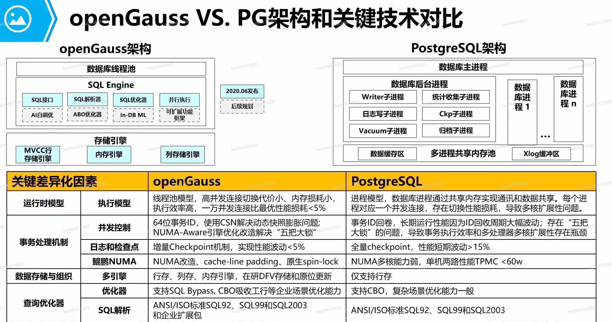

# DataBase

---

# SQL分类

---

**SQL 语句主要可以划分为以下 3 个类别**

- **DDL（Data Definition Languages）语句：**数据定义语言，这些语句定义了不同的数据段、数据库、表、列、索引等数据库对象的定义。常用的语句关键字主要包括 create、drop、alter等。
- **DML（Data Manipulation Language）语句：**数据操纵语句，用于添加、删除、更新和查询数据库记录，并检查数据完整性，常用的语句关键字主要包括 insert、delete、udpate 和select 等。(增添改查）
- **DCL（Data Control Language）语句：**数据控制语句，用于控制不同数据段直接的许可和访问级别的语句。这些语句定义了数据库、表、字段、用户的访问权限和安全级别。主要的语句关键字包括 grant、revoke 等。

# 数据库

----

## 创建

```mysql
CREATE DATABASE database_name
```


## 查看

```mysql
SELECT datname FROM pg_database; # OpenGauss 查看所有数据库 '\l'亦可
\c dbname;	# OpenGauss 连接数据库
```


# 模式

---

## 创建


## 查看

```mysql
set search_path to schemaname;	# OpenGauss 指定模式位置，默认的模式为public
show search_path; # OpenGauss 查看当前模式位置
```


# 表

---

## 创建

```mysql
create table TableName
(
	ColName1 type [NOT NULL] [UNIQUE] [PRIMARY KEY] ,
    [FOREIGN KEY () REFERENCES TableName(ColName)]
);
```


# 约束

---

## 约束类型

1. 主键约束（primary key constraint）

   要求主键列数据唯一，且不能为空

2. 唯一约束（unique constraint）

   要求该列唯一，可以为空，但不能出现一个空值

   > 主键和唯一的区别：
   >
   >  
   >
   > 　　a.主键不能为NULL，唯一可以为NULL
   >
   >  
   >
   > 　　b.主键可以是复合主键，也可以是单值主键
   >
   >  
   >
   > 　　c.一张表中只能设置一次主键（复合主键），但唯一键可以设置多次

3. 外键约束（foreign key constraint）

   用于两表间建立连接，需要指定引用主表的哪一列

4. 检查约束（check constraint）

   某列取值范围限制，格式限制等，如有关年龄的约束

5. 非空约束（not null constraint）

   用于确保列不能为NULL，如果在列上定义了非空约束，那么当插入数据时，必须为该列提供数据，当更新列数据时，不能将其值设置为NULL

6. 默认约束（default constraint）

   用于为数据表中的字段指定默认值，即当在表中插入一条新纪录时，如果没有给这个字段赋值，那么数据库系统会自动为这个字段插入默认值


## 表级约束

与列定义相互独立，不包含在列定义中;通常用于对多个列一起进行约束，与定义用","分隔;必须指出要约束的列的名称

> 某些特殊情况只能使用表级约束，列级约束无法完成创建，例如：
>
> - 创建复合索引就必须使用表级索引，才能创建成功

- 主键
- 外键
- 唯一
- 检查

```mysql
[Constraint <约束名>] Primary Key( <列名> [{<列名>}])
[Constraint <约束名>] Foreign key  References <外表名>( <列名> [{<列名>}])
[Constraint <约束名>] Unique  ( <列名> [{<列名>}])
[Constraint <约束名>] Check (<条件>)

e.g.:
　　create table student2(
　　stuno number(3) ,
　　stuname varchar2(10) ,
　　stuaddress varchar2(20) ,
　　stubid number(3),
　　constraint PK_sno primary key(stuno) ,
　　constraint UQ_sname_subid unique(stuname,stubid),
　　constraint CK_saddress check( length(stuAddress)>2)
　　);
```


## 列级约束

包含在列定义中;直接跟在该列的其他定义之后，用空格分隔;不必指定列名

> 某些特殊情况只能使用列级约束，表级约束无法完成创建，例如：
>
> - 创建非空约束，必须在列级进行定义，不能在表级创建

- 主键
- 外键
- 唯一
- 检查
- 默认
- 非空

```mysql
[Constraint <约束名>] Primary Key
[Constraint <约束名>] Foreign key (列名)  References <外表名>(列名)
[Constraint <约束名>] Unique
[Constraint <约束名>] Check (<条件>)
[Constraint <约束名>] Default  约束条件
[Constraint <约束名>] Null | Not Null

e.g.:
　　create table student (
　　stuno number(3) constraint PK_stuno primary key,　
　　stuname varchar2(10) constaint UQ_stuname unique constraint NN_stuname not null,　
　　stuaddress varchar2(20) default '广东省广州市'  constraint CK_stuaddress check(length(stuaddress)>2)　
　　);
```


## 约束命名

规范：constraint 约束类型_字段名

1、主键约束：PK_字段名

2、检查约束：CK_字段名

3、唯一约束：UQ_字段名

4、非空约束：NN_字段名

5、外键约束：FK_子表_父表

6、默认约束：一般不需要命名


# ALTER

---

```mysql
ALTER TABLE 表名 DROP COLUMN 列名	# 删除列
ALTER TABLE 表名 ADD COLUMN 列名 属性 [约束]	#	增加列
ALTER TABLE 表名 CHANGE COLUMN 列名 新列名	#修改列的类型信息
ALTER TABLE 表名字 CHANGE COLUMN 列名 新列名 属性	# 重命名列
ALTER TABLE 表名 RENAME TO 表新名	# 重命名表
Alter TABLE 表名 DROP CONSTRAINT 约束名	# 删除表中约束
ALTER TABLE 表名 ADD CONSTRAINT 约束名 约束	# 添加约束
ALTER TABLE 表名 ADD index 索引名 (列名)	# 添加索引
ALTER TABLE 表名 MODIFY COLUMN 要修改属性的列名 新属性	# 修改列的属性
```


# 集合操作

1. 并集

   ```mysql
      SELECT column_name(s) FROM table1
      UNION
      SELECT column_name(s) FROM table2;
   ```

   这个查询会返回来自`table1`和`table2`的所有唯一记录。如果需要包含重复记录，只需更改上述查询，将`UNION`替换为`UNION ALL`即可

2. 交集

   ```mysql
      SELECT column_name(s) FROM table1
      INTERSECT
      SELECT column_name(s) FROM table2;
   ```

3. 差集

   ```mysql
      SELECT column_name(s) FROM table1
      EXCEPT
      SELECT column_name(s) FROM table2;
   ```

> 上述集合操作（并集UNION，交集INTERSECT和差集EXCEPT）在多种数据库系统中都被广泛支持，包括但不限于以下数据库：
>
> 1. MySQL: MySQL支持并集(UNION)操作，但不直接支持交集(INTERSECT)和差集(EXCEPT)。然而，你可以通过其他方法实现类似的功能，例如使用INNER JOIN（等同于交集），或者使用LEFT JOIN和WHERE（等同于差集）
> 2. PostgreSQL: PostgreSQL全面支持并集(UNION)，交集(INTERSECT)，以及差集(EXCEPT)的操作 
> 3. SQLite: SQLite也全面支持并集(UNION)，交集(INTERSECT)，以及差集(EXCEPT)的操作 
> 4. SQL Server: SQL Server也全面支持并集(UNION)，交集(INTERSECT)，以及差集(EXCEPT)的操作 
> 5. Oracle: Oracle也全面支持并集(UNION)，交集(INTERSECT)，以及差集(MINUS，Oracle中的差集关键词是MINUS而不是EXCEPT)的操作
>
> 需要注意的是，虽然这些集合操作在SQL标准中有定义，但是不同的数据库系统可能会有不同的实现方式和细微的语法差异。在使用时，建议查阅具体的数据库文档或者使用数据库相关的查询工具来确保正确的使用。


# 索引

---


> ### 索引的特点
>
> 优点：
>
> - 通过创建唯一索引，可以保证数据库表中每一行数据的唯一性。
> - 可以大大加快数据的查询速度。
> - 加速表和表之间的连接。
> - 在使用分组和排序子句进行数据查询时，可以有效减少分组和排序的时间。
>
> 缺点：
>
> - 创建索引和维护索引要耗费时间。且随着数据量的增加而增加。
> - 索引需要占用磁盘空间。
> - 当表中的数据进行增加、删除或修改时，所以也要动态维护，降低了数据的维护速度。
>
> 
>
> ### 索引的种类
>
> 聚簇索引、非聚簇索引
>
> - ​	**聚簇索引**：物理排序，在索引上按顺序，数据存放也按顺序排
> - ​	**非聚簇索引**：逻辑排序，仅索引排序，数据无序存放
>
> 唯一值索引、非唯一值索引：索引键值是否允许重复
>
> 单列索引与复合索引：单列与多列
>
> 反键索引、函数索引、倒排索引....

```mysql
CREATE[UNIQUE|FULLTEXT|SPATIAL]INDEX index_name
ON table_name (col_name[length],...)[ASC | DESC]

# 创建聚簇索引
CREATE INDEX index_name ON table_name(col_name);
CLUSTER table_name USING index_name;
```

> - `UNIQUE`：创建的索引应该包含唯一的值。如果表中有重复的值，那么这个索引将会失败。
>
> - `FULLTEXT`：创建的索引应该用于全文搜索。这个选项只在某些数据库系统中可用，例如 MySQL。
>
> - `SPATIAL`：创建的索引应该用于空间查询。这个选项只在某些数据库系统中可用，例如 MySQL。
>
> - `ASC` 和 `DESC`：这些选项用于设置索引的排序方式。默认是 `ASC`，即升序。如果你设置为 `DESC`，那么索引将按照降序排列。
>
> 
>
> 我们需要注意的是，在新插入数据时，PostgreSQL 并不会维护索引的正确性（即后续插入的数据并不是按照聚簇索引的顺序在物理上排序），我们需要再次使用 `CLUSTER` 命令来维护聚簇索引的正确性。


# 自定义函数

---

1. 标量型函数（Scalar functions）：返回一个标量值

   ```mysql
   CREATE FUNCTION function_name([paraments]) RETURNS type AS
   BEGIN
   	block
   END
   ```

2. 表值函数

   1. 内联表值型函数（Inline table-valued functions）

      > 内联表值型函数以表的形式返回一个返回值，即它返回的是一个表内联表值型函数没有由BEGIN-END 语句括起来的函数体。其返回的表由一个位于RETURN 子句中的SELECT 命令段从数据库中筛选出来。内联表值型函数功能相当于一个参数化的视图。

      ```mysql
      CREATE FUNCTION function_name([paraments]) RETURNS table AS
      RETURN(SQL_expression)
      ```

   2. 多声明表值型函数（Multi-statement table-valued functions）

      > 多声明表值型函数可以看作标量型和内联表值型函数的结合体。它的返回值是一个表，但它和标量型函数一样有一个用BEGIN-END 语句括起来的函数体，返回值的表中的数据是由函数体中的语句插入的。由此可见，它可以进行多次查询，对数据进行多次筛选与合并，弥补了内联表值型函数的不足。 　

      ```mysql
      CREATE FUNCTION function_name([paraments]) RETURNS table_name(column_name) AS
      BEGIN
      	block
      END
      ```

3. MySQL语法

   1. 局部变量

      > 局部变量是定义在sql语句块中的变量，常见于存储过程和函数的 begin ... end 中，语句块执行完后局部变量则结束生命周期

      1. 声明` DECLARE @localVar dataType;`

      > - `@localVar`是变量名
      > - `dataType`是变量的数据类型
      >
      > declare声明定义语句，必须放在begin...end函数体中最前面的位置

      1. 赋值

      ```mysql
          set var = expression [, var = expression, ...];
          set var := expression [, var = expression, ...];
          select filed1 [, ...] into var1 [, ...] from tableName where conditon
      ```

      >  sql下的 **=** 操作符是比较(判定是否相等)操作符，只有在**set**语句中可作为赋值操作符使用。故在其他语句中，赋值操作应该使用 **:=** 操作符
      >
      > 通过select语句将所查询出的字段数据依次赋值到 **into** 后的变量中。值得一提的是，当select查询结果为空时(即，无记录)，则不对变量进行赋值操作；当select查询的结果不止一条时，MySQL将报错，函数执行失败

   2. 用户变量

      > 定义在当前客户端的连接下的变量，其作用域在当前客户端连接下均有效，当当前客户端断开连接后则该变量结束生命周期。其对其他客户端连接不可见

      1. 声明

         用户变量无需先行声明创建，直接赋值使用即可。赋值时，当前客户端下若无该用户变量，则会自动创建并完成赋值；查看一个不存在的用户变量时(e.g., select @foo)返回null。需要注意的是，用户变量的变量名必须以 **@** 开头

      2. 赋值

         ```mysql
         set @varName = val;     # 对名为 @varName 用户变量赋值
         set @varName := val;    # 对名为 @varName 用户变量赋值
         select @varName:=field [as field] [, ...] from tableName where condition;
         select @varName:=Val;
         ```

         > 通过select语句将所查询出的字段数据赋值到变量中，只能使用 **:=** 操作符赋值

   3. 判断语句

      ```mysql
          if condition then
              statements
          [ elseif condition then
              statements ]
          [ else
              statements ]
          end if;
      ```

   4. 循环语句

      ```mysql
          [label:] while condition do
              statments
          end while [label]
      ```

      > ```mysql
      >     leave label;    # 跳出label所标注的循环结构
      >     iterate label;  # 跳过循环体的剩余部分，直接开始label所标注的下一次循环
      > ```

   5. 其他操作

      ```mysql
      show function status [like functionName];	# 查看函数状态
      show create function functionName;	# 查看函数定义
      alter function functionName [characteristic ...];	# 修改函数特性
      drop function [if exists] functionName;	# 删除函数
      ```

      > - 通过show status 命令查看函数的相关信息。可以在其后面使用 like 语句进行函数名匹配，其中functionName同样支持 **%** 进行模糊匹配
      > - 通过alter function实现对函数特性characteristic的修改，注意，不是对函数定义内容的修改
      > - 通过drop function 删除函数。当指定函数不存在时，会报错，可以添加 **if exists** 避免出现报错

   6. 修改结束符

      > 在命令行中其默认将 **;** 符号作为结束符来执行语句。所以如果我们在命令行中创建函数，需要使用 delimiter 命令重定义结束符。先通过 **delimiter $$** 将结束符更改为 **$$** (可随意更改，一般常用\$\$)再创建函数。函数创建完毕后，通过我们重定义后的结束符结束(即 **$$** )。最后不要忘记，通过 **delimiter ;** 将结束符重新修改为 **;**


# 触发器

---

> 系统为每一个触发器建立临时变量NEW和OLD
>
> - New.column_name：update或insert事件对应“新”元组，column_name对应新元组上的对应的列值
> - OLD.column_name：update或insert事件对应“老”元组，column_name对应老元组上的对应的列值

## **openGauss**

1. 创建触发器

   ```mysql
   CREATE TRIGGER trigger_name { BEFORE | AFTER | INSTEAD OF } { event [ OR ... ] }
       ON table_name
       [ FOR [ EACH ] { ROW | STATEMENT } ]
       [ WHEN ( condition ) ]
       EXECUTE PROCEDURE function_name ( arguments );
   ```

   > - **trigger_name**
   >
   >    触发器名称。
   >
   > - **BEFORE**
   >
   >    触发器函数是在触发事件发生前执行。
   >
   > - **AFTER**
   >
   >    触发器函数是在触发事件发生后执行。
   >
   > - **INSTEAD OF**
   >
   >    触发器函数直接替代触发事件。
   >
   > - **event**
   >
   >    启动触发器的事件，取值范围包括：INSERT、UPDATE、DELETE或TRUNCATE，也可以通过OR同时指定多个触发事件。
   >
   > - **table_name**
   >
   >    触发器对应的表名称。
   >
   > - **FOR EACH ROW | FOR EACH STATEMENT**
   >
   >    触发器的触发频率。
   >
   >    - FOR EACH ROW是指该触发器是受触发事件影响的每一行触发一次。
   >    - FOR EACH STATEMENT是指该触发器是每个SQL语句只触发一次。
   >
   >    未指定时默认值为FOR EACH STATEMENT。约束触发器只能指定为FOR EACH ROW。
   >
   > - **function_name**
   >
   >    用户定义的函数，必须声明为不带参数并返回类型为触发器，在触发器触发时执行。
   >
   > - **arguments**
   >
   >    执行触发器时要提供给函数的可选的以逗号分隔的参数列表。

2. 修改触发器

   ```mysql
   ALTER TRIGGER trigger_name ON table_name RENAME TO new_trigger_name;
   ```

   > - **new_trigger_name**
   >
   >    修改后的新触发器名称。

3. 删除触发器

   ```mysql
   DROP TRIGGER trigger_name ON table_name [ CASCADE | RESTRICT ];
   ```

4. 创建触发器函数

   ```mysql
   CREATE OR REPLACE FUNCTION function_name() RETURNS TRIGGER AS
   	$$
   	DECLARE
   	BEGIN
   		function_block;
   		RETURN [NEW|OLD];
   		[raise exception 'message';]
   	END
   	$$ LANGUAGE PLPGSQL;
   ```
   
   > OpenGuass在创建触发器之前，需要先创建一个函数，如果返回值是Trigger，那么该函数就是触发器函数，否则是普通函数。同一个触发器可以指定多个触发事件，每个事件发生时都能激活触发器来执行触发器的动作。
   >
   > `RETURN`语句的作用是触发器函数执行完成后返回`OLD`或`NEW`元组或NULL(异常)，`RETURN`语句只在`BEFORE`定义的触发器中有效，对于`AFTER`定义的触发器其返回值会被忽略；在 `DELETE` 触发器中，`NEW` 是空的，因此返回 `NEW` 通常没有意义，在 `DELETE` 触发器中，通常会返回 `OLD`，即被删除的行；对于 `AFTER INSERT` 和 `AFTER UPDATE` 触发器，它们的返回值会被忽略，因为在这些触发器执行完毕后，新行已经被插入或更新到数据库中了；返回`NULL`异常时，`INSERT`、`UPDATE` 和 `DELETE` 操作会被取消；使用raise可以抛出异常。

**示例**

```mysql
# 创建源表及触发表
	CREATE TABLE test_trigger_src_tbl(id1 INT, id2 INT, id3 INT);
	CREATE TABLE test_trigger_des_tbl(id1 INT, id2 INT, id3 INT);

# 创建触发器函数
	CREATE OR REPLACE FUNCTION tri_insert_func() RETURNS TRIGGER AS
           $$
           DECLARE
           BEGIN
                   INSERT INTO test_trigger_des_tbl VALUES(NEW.id1, NEW.id2, NEW.id3);
                   RETURN NEW;
           END
           $$ LANGUAGE PLPGSQL;

	CREATE OR REPLACE FUNCTION tri_update_func() RETURNS TRIGGER AS
           $$
           DECLARE
           BEGIN
                   UPDATE test_trigger_des_tbl SET id3 = NEW.id3 WHERE id1=OLD.id1;
                   RETURN OLD;
           END
           $$ LANGUAGE PLPGSQL;

	CREATE OR REPLACE FUNCTION TRI_DELETE_FUNC() RETURNS TRIGGER AS
           $$
           DECLARE
           BEGIN
                   DELETE FROM test_trigger_des_tbl WHERE id1=OLD.id1;
                   RETURN OLD;
           END
           $$ LANGUAGE PLPGSQL;

# 创建INSERT触发器
	CREATE TRIGGER insert_trigger
           BEFORE INSERT ON test_trigger_src_tbl
           FOR EACH ROW
           EXECUTE PROCEDURE tri_insert_func();

# 创建UPDATE触发器
	CREATE TRIGGER update_trigger
           AFTER UPDATE ON test_trigger_src_tbl  
           FOR EACH ROW
           EXECUTE PROCEDURE tri_update_func();

# 创建DELETE触发器
	CREATE TRIGGER delete_trigger
           BEFORE DELETE ON test_trigger_src_tbl
           FOR EACH ROW
           EXECUTE PROCEDURE tri_delete_func();

# 执行INSERT触发事件并检查触发结果
	INSERT INTO test_trigger_src_tbl VALUES(100,200,300);
	SELECT * FROM test_trigger_src_tbl;
	SELECT * FROM test_trigger_des_tbl;

# 执行UPDATE触发事件并检查触发结果
	UPDATE test_trigger_src_tbl SET id3=400 WHERE id1=100;
	SELECT * FROM test_trigger_src_tbl;
	SELECT * FROM test_trigger_des_tbl;

# 执行DELETE触发事件并检查触发结果
	DELETE FROM test_trigger_src_tbl WHERE id1=100;
	SELECT * FROM test_trigger_src_tbl;
	SELECT * FROM test_trigger_des_tbl;

# 修改触发器
	ALTER TRIGGER delete_trigger ON test_trigger_src_tbl RENAME TO delete_trigger_renamed;

# 删除触发器
	DROP TRIGGER insert_trigger ON test_trigger_src_tbl;
	DROP TRIGGER update_trigger ON test_trigger_src_tbl;
	DROP TRIGGER delete_trigger_renamed ON test_trigger_src_tbl;
```


# 边边角角

---

## CHAR与VARCHAR比较

CHAR类型是定长的，MySQL总是根据定义的字符串长度分配足够的空间。当保存CHAR值时，**在它们的右边填充空格以达到指定的长度**，当检索到CHAR值时，尾部的空格被删除掉。

VARCHAR类型用于存储可变长字符串，**存储时，如果字符没有达到定义的位数，也不会在后面补空格**。但是，由于行是变长的，在UPDATE时可能使行变得比原来更长，这就导致需要做额外的工作。如果一个行占用的空间增长，并且在页内没有更多的空间可以存储，在这种情况下InnoDB需要分裂页来使行可以放进页内，这样会增加碎片。

**CHAR适合存储很短的字符串，或者所有值都接近同一个长度。**例如，CHAR非常适合存储密码的MD5值，因为这是一个定长的值。**对于经常变更的数据，CHAR也比VARCHAR更好，因为定长的CHAR类型不容易产生碎片。对于非常短的列，CHAR比VARCHAR在存储空间上也更有效率。**例如用CHAR(1)来存储只有Y和N的值，如果采用单字节字符集只需要一个字节，但是VARCHAR(1)却需要两个字节，因为还有一个记录长度的额外字节。

下面这些情况下使用VARCHAR是合适的：**字符串很长或者所要存储的字符串长短不一，差别很大；字符串列的最大长度比平均长度大得多；列的更新很少，所以碎片不是问题。**

额外说明下，我们在定义字段最大长度时应该按需分配，提前做好预估。特别是对于VARCHAR字段，有人认为反正VARCHAR数据类型是根据实际的需要来分配长度的，还不如给大一点呢。但事实不是这样的，比如现在需要存储一个地址信息，根据评估，只要使用100个字符就可以了，我们可以使用VARCHAR(100)或VARCHAR(200)来存储，虽然它们用来存储90个字符的数据，其存储空间相同，但是对于内存的消耗是不同的。更长的列会消耗更多的内存，因为MySQL通常会分配固定大小的内存块来保存内部值，尤其是使用内存临时表进行排列或者操作时会特别糟糕。所以我们在分配VARCHAR数据类型时仍然不能够太过于慷慨。还是要评估实际需要的长度，然后选择一个最长的字段来设置字符长度。如果为了考虑冗余，可以留10%左右的字符长度。千万不能认为VARCHAR是根据实际长度来分配存储空间，而随意的分配长度，或者说干脆使用最大的字符长度。


## EXPLAIN ANALYZE分析查询代价

> 在 PostgreSQL 中，`EXPLAIN ANALYZE` 是一个非常有用的工具，可以帮助你理解一个查询的执行计划和性能。`EXPLAIN ANALYZE` 会执行查询，并返回查询的执行计划以及执行时间和资源使用情况。

```mysql
EXPLAIN ANALYZE SELECT * FROM table_name WHERE column_name = 'value';
```

查询执行计划是由多个节点组成的树形结构，每个节点表示一个查询操作。查询执行计划的各个部分包括：

- `Seq Scan`：表示全表扫描。
- `Index Scan`：表示索引扫描。
- `Sort`：表示排序操作。
- `Hash`：表示哈希操作。
- `Nested Loop`：表示嵌套循环操作。
- `Materialize`：表示物化操作。
- `Aggregate`：表示聚合操作。

每个节点的下面还会列出一些额外的信息，如扫描的行数、返回的行数、执行时间等，这些信息可以帮助你理解查询的性能。

> 需要注意的是，`EXPLAIN ANALYZE` 会执行查询，因此在生产环境中使用时需要谨慎，以免对数据库性能产生影响。在开发和测试环境中，或者在查询优化过程中，使用 `EXPLAIN ANALYZE` 是非常有用的。


## RTO和RPO

恢复时间目标（RTO）：RTO是指在发生灾难事件后，系统或服务需要恢复到正常运行状态所需的时间。RTO是一个时间窗口，表示业务或服务中断的最大可接受时间。较低的RTO意味着系统需要更快地恢复，以减少业务中断的时间。

恢复点目标（RPO）：RPO是指在发生灾难事件后，系统或服务需要恢复到的数据状态。RPO表示数据丢失的最大可接受程度。较低的RPO意味着系统需要更快地恢复到较新的数据状态，以减少数据丢失的量。

> 等保2.0对RTO的要求如下：
>
> 一级保护：RTO要求不超过2小时；
>
> 二级保护：RTO要求不超过4小时；
>
> 三级保护：RTO要求不超过8小时；
>
> 四级保护：RTO要求不超过24小时。
>
> 
>
> 等保2.0对RPO要求如下：
>
> 一级保护：RPO要求不超过1小时；
>
> 二级保护：RPO要求不超过4小时；
>
> 三级保护：RPO要求不超过8小时；
>
> 四级保护：RPO要求不超过24小时。


# 数据库特性

---

## openGauss




