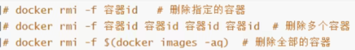

# Docker

---


# 概述

---

1. 工作目录`/var/lib/docker`

2. 设置镜像仓库

   ```shell
   yum-config-manager \
   --add-repo \
   https://download.docker.com/linux/centos/docker-ce.repo	# 默认是从国外的!
   
   yum-config-manager \
   --add-repo \
   http://mirrors.aliyun.com/docker-ce/linux/centos/docker-ce.repo	# 阿里云
   ```

   

# 基本命令

---


## 帮助命令

```shell
docker version	# 版本信息
docker info	# 系统信息
docker --help	# 帮助
docker xx --help	# 具体命令帮助
```


## 镜像命令

1. ```shell
   docker images # 查看docker的所有镜像
   ```

   

2. ```shell
   docker search xx	# 寻找镜像
   ```

3. ```shell
   docker pull xx[:tag]	# 拉取镜像，如果不写tag默认为最新版本
   ```

   

4. ```shell
   docker rmi -f id	#移除镜像
   ```

   


## 容器命令

1. ```dockerfile
   docker run [可选参数] iamge	# 通过镜像创建并启动容器，为容器分配id
   ```

   

   

   容器使用后台运行时必须要有前台进程，否则会自动停止
   
2. ```dockerfile
   docker ps	# 查看运行中的容器
   docker ps -a # 查看历史运行过的容器
   docker ps -n=x # 查看最近创建的容器
   ```

3. ```dockerfile
   docker rm id	# 删除指定容器
   docker rm -f $(docker ps -aq)	# 删除所有容器
   ```

   删除运行中的容器需要`-f`参数

4. 退出容器

   1. `exit`停止并退出
   2. `Ctrl + P + Q`不停止退出

5. 启动和停止容器

   ```dockerfile
   docker start id	# 启动
   docker restart id # 重启
   docker stop id # 停止
   docker kill id # 强制停止
   ```

6. ```dockerfile
   docker exec -it id Shell	# 进入运行中的容器并开启新终端
   docker attach id	# 进入运行中的容器而不启动新终端
   ```
   
6. `docker run` 与`docker start`的区别

   docker run 只在第一次运行时使用，将镜像放到容器中，以后再次启动这个容器时，只需要使用命令docker start即可。docker run相当于执行了两步操作：将镜像放入容器中（docker create）,然后将容器启动，使之变成运行时容器（docker start）。而docker start的作用是，重新启动已存在的镜像。也就是说，如果使用这个命令，我们必须事先知道这个容器的ID，或者这个容器的名字，我们可以使用docker ps找到这个容器的信息。


## 其他常用命令

1. ```shell
   docker logs -tf --tail number id	# 查看容器日志
   ```

   > -t：显示时间戳
   >
   > -f：跟踪日志输出
   >
   > --tail：仅列出最新number条容器日志
   >
   > --since :显示某个开始时间的所有日志
   
2. ```shell
   docker top id # 查看容器内部的进程
   ```

3. ```dockerfile
   docker inspect id	# 显示容器的元数据
   ```

4. ```dockerfile
   docker cp id:容器内路径 主机路径	# 从容器内拷贝文件到主机上
   ```

5. ```shell
   docker stats # 查看容器的资源占用
   ```

# Docker镜像

---

> 镜像是一种轻量级、可执行的独立软件包，用来打包软件运行环境和基于运行环境开发的软件，它包含运行某个软件所需的所有内容，包括代码、运行时、库、环境变量和配置文件。

## Docker镜像加载原理

> UnionFS( 联合文件系统):：Union文件系统 (UnionFS)是一种分层、轻量级并且高性能的文件系统，它支持对文件系统的修改作为一次提交来一层层的叠加，同时可以将不同目录挂数到同一个虚拟文件系统下(unite several directories into a single virtuafilesystem)。Union 文件系统是 Docker镜像的基础。镜像可以通过分层来进行继承，基于基础镜像(没有父镜像)，可以制作出各种具体的应用镜像。
>
> 特性：一次同时加载多个文件系统，但从外面看起来，只能看到一个文件系统，联合加载会把各层文件系统叠加起来，这样最终的文件系统会包含所有底层的文件和目录。

bootfs(boot file system)主要包含bootloader和kernel,bootloader主要是引导加载kernel,Linux刚启动时会加载bootfs文件系统，在Docker镜像的最底层是bootfs。这一层与我们典型的Linux/Unix系统是一样的，包含boot加载器和内核。当boot加载完成之后整个内核就都在内存中了，此时内存的使用权已由bootfs转交给内核，此时系统也会卸载bootfs。

rootfs (root file system),在bootfs之上，包含的就是典型 Linux 系统中的 /dev,proc,/bin, /etc 等标准目录和文件。rootfs就是各种不同的操作系统发行版，比如Ubuntu，Centos等等。

对于一个精简的OS，rootfs 可以很小，只需要包含最基本的命令，工具和程序库就可以了，因为底层直接用Host的kernel，自己只需要提供rootfs就可以了。由此可见对于不同的linux发行版,bootfs基本是一致的,rootfs会有差别,因此不同的发行版可以公用bootfs.


## 分层加载

所有的 Docker 镜像都起始于一个基础镜像层，当进行修改或增加新的内容时就会在当前镜像层之上创建新的镜像层，在添加额外的镜像层的同时，镜像始终保持是当前所有镜像的组合，上层镜像层中的文件覆盖底层镜像层文件会使文件的更新版本作为一个新镜像层添加到镜像中。

举一个简单的例子，假如基于 Ubuntu Linux 16.04 创建一个新的镜像，这就是新镜像的第一层;如果在该镜像中添加 Python包就会在基础镜像层之上创建第二个镜像层;如果继续添加一个安全补丁，就会创建第三个镜像层。

Docker 通过存储引擎(新版本采用快照机制 ) 的方式来实现镜像层堆栈，并保证多镜像层对外展示为统一的文件系统。Linux 上可用的存储引擎有 AUFS、Overlay2、Device Mapper、 Btrfs 以及 ZFS。顾名思义,每种存引擎都基于 Linux 中对应的文件系统或者块设备技术，并且每种存储引警都有其独有的性能特点。
Docker 在 Windows 上仅支持 windowsfilter 一种存储擎，该引擎基于 NTFS 文件系统实现了分层和 CoW。

Docker镜像都是只读的，当容器启动时，一个新的可写层被加载到镜像的顶部，这一层就是我们通常说的容器层，容器之下的都叫镜像层。


## commit镜像

```shell
docker commit -m="" -a=author id NAME:[TAG]
```


## 发布镜像

```shell
docker login [-u USERNAME] [-p PASSWORD]
docker push USERNAME/IMAGENAME:TAG
```


# 容器数据卷

---

> Docker容器数据卷是一种用于持久化存储数据的机制。它允许容器内的数据在容器被删除、重启或迁移时保留下来，以确保数据的持久性和可靠性。卷就是目录或文件，存在于一个或多个容器中，由docker挂载到容器，但不属于联合文件系统，因此能够绕过Union File System提供一些用于持续存储或共享数据的特性；卷的设计目的就是数据的持久化，完全独立于容器的生存周期，因此Docker不会在容器删除时删除其挂载的数据卷。
>
> 使用Docker数据卷，我们可以在创建容器时将一个目录或文件挂载到容器的指定路径上，使得容器内的应用程序可以访问和操作这个挂载的目录或文件。这样，无论容器被删除，还是新的容器替换了旧的容器，数据卷都会被保留下来，不会丢失。

1. ```shell
   docker run --privileged=true -v 主机目录:容器内目录[:rw/:ro]
   ```

   > rw：读写
   >
   > ro：只读，容器内无法写
   
2. 继承和共享

   ```shell
   docker run -it --privileged=true --volumes-from 父类  id
   ```

3. 多容器进行数据交换，除了多个容器挂载同一个数据卷，还可以使用数据卷容器

   ```shell
   docker run -it --name=c3 -v /volume centos:7 /bin/bash
   ```

   

4. 删除数据卷

   ```shell
   docker volume rm id
   ```

5. 先创建数据卷再挂载

   ```shell
   docker volume create name
   ```

6. 修改数据卷

   ```shell
   docker container inspect mycontainer | \
   jq '.[].Mounts |= map(if .Source == "/host/data" then .Source = "/newhost/data" else . end)' | \
   docker container update --stdin mycontainer
   # 这个命令会使用`jq`工具在容器详细信息的JSON数据中找到绑定的数据卷路径，并将其修改为新的路径。最后，使用`docker container update`命令将修改后的数据卷路径应用到容器中。
   ```
   
7. 查看卷信息

   ```shell
   docker volume ls
   docker volume inspect
   ```

8. 匿名挂载和具名挂载(不指定主机路径)

   ```shell
   docker run -v 容器内路径 id	# 匿名挂载
   docker run -v NAME:容器内路径 id	# 具名挂载
   ```

   > 具名挂载路径：/var/lib/docker/volumes/NAME/_data


# Dockerfile

---

>Dockerfile 是一个用来构建镜像的文本文件，文本内容包含了一条条构建镜像所需的指令和说明。
>
>Dockerfile 的指令每执行一次都会在 docker 上新建一层。所以过多无意义的层，会造成镜像膨胀过大。
>
>- 以 **&&** 符号连接命令
>- 命令都是大写的
>- \# 表示注释
>- scratch是空白镜像

```shell
docker build -f PATH [-t] NAME[:TAG] .	# 通过Dockerfile在当前目录构建镜像
```

> 这个指令最后一个 **.** 是上下文路径，上下文路径是指 docker 在构建镜像时有时候想要使用到本机的文件（比如复制），docker build 命令得知这个路径后，会将路径下的所有内容打包。
>
> **解析**：由于 docker 的运行模式是 C/S。我们本机是 C，docker 引擎是 S。实际的构建过程是在 docker 引擎下完成的，所以这个时候无法用到我们本机的文件。这就需要把我们本机的指定目录下的文件一起打包提供给 docker 引擎使用。
>
> 如果未说明最后一个参数，那么默认上下文路径就是 Dockerfile 所在的位置。
>
> **注意**：上下文路径下不要放无用的文件，因为会一起打包发送给 docker 引擎，如果文件过多会造成过程缓慢。

## 指令

| Dockerfile 指令 | 说明                                                         |
| :-------------- | :----------------------------------------------------------- |
| FROM            | 指定基础镜像，用于后续的指令构建。                           |
| MAINTAINER      | 指定Dockerfile的作者/维护者。（已弃用，推荐使用LABEL指令）   |
| LABEL           | 添加镜像的元数据，使用键值对的形式。                         |
| RUN             | 在构建过程中在镜像中执行命令。                               |
| CMD             | 指定容器创建时的默认命令。（可以被覆盖）                     |
| ENTRYPOINT      | 设置容器创建时的主要命令。（不可被覆盖）                     |
| EXPOSE          | 声明容器运行时监听的特定网络端口。                           |
| ENV             | 在容器内部设置环境变量。                                     |
| ADD             | 将文件、目录或远程URL复制到镜像中。                          |
| COPY            | 从上下文目录中复制文件或者目录到容器里指定路径。             |
| VOLUME          | 为容器创建挂载点或声明卷，定义匿名数据卷，在启动容器时忘记挂载数据卷会自动挂载到匿名卷。 |
| WORKDIR         | 设置后续指令的工作目录。                                     |
| USER            | 指定后续指令的用户上下文。                                   |
| ARG             | 定义在构建过程中传递给构建器的变量，可使用 "docker build" 命令设置。 |
| ONBUILD         | 当该镜像被用作另一个构建过程的基础时，添加触发器。           |
| STOPSIGNAL      | 设置发送给容器以退出的系统调用信号。                         |
| HEALTHCHECK     | 定义周期性检查容器健康状态的命令。                           |
| SHELL           | 覆盖Docker中默认的shell，用于RUN、CMD和ENTRYPOINT指令。      |

1. ```shell
   RUN <命令行命令>
   RUN ["可执行文件", "参数1", "参数2"]
   ```

2. ```shell
   VOLUME ["<路径1>", "<路径2>"...]
   VOLUME <路径>
   ```

3. ```shell
   COPY [--chown=<user>:<group>] <源路径1>...  <目标路径>
   COPY [--chown=<user>:<group>] ["<源路径1>",...  "<目标路径>"]
   ```

   > `[--chown=<user>:<group>]`：可选参数，用户改变复制到容器内文件的拥有者和属组。
   >
   > <源路径>：源文件或者源目录，这里可以是通配符表达式，其通配符规则要满足 Go 的 filepath.Match 规则。
   >
   > <目标路径>：容器内的指定路径，该路径不用事先建好，路径不存在的话，会自动创建。

4. ADD 指令和 COPY 的使用格式类似（同样需求下，官方推荐使用 COPY）。功能也类似，不同之处如下：

   - ADD 的优点：在执行 <源文件> 为 tar 压缩文件的话，压缩格式为 gzip, bzip2 以及 xz 的情况下，会自动复制并解压到 <目标路径>。
   - ADD 的缺点：在不解压的前提下，无法复制 tar 压缩文件。会令镜像构建缓存失效，从而可能会令镜像构建变得比较缓慢。具体是否使用，可以根据是否需要自动解压来决定。

5. CMD类似于 RUN 指令，用于运行程序，但二者运行的时间点不同:

   - CMD 在docker run 时运行。
   - RUN 是在 docker build。

   **作用**：为启动的容器指定默认要运行的程序，程序运行结束，容器也就结束。CMD 指令指定的程序可被 docker run 命令行参数中指定要运行的程序所覆盖。

   **注意**：如果 Dockerfile 中如果存在多个 CMD 指令，仅最后一个生效。

   ```shell
   CMD <shell 命令> 
   CMD ["<可执行文件或命令>","<param1>","<param2>",...] 
   CMD ["<param1>","<param2>",...]  # 该写法是为 ENTRYPOINT 指令指定的程序提供默认参数
   ```

6. ENTRYPOINT类似于 CMD 指令，但其不会被 docker run 的命令行参数指定的指令所覆盖，而且这些命令行参数会被当作参数送给 ENTRYPOINT 指令指定的程序。但是, 如果运行 docker run 时使用了 --entrypoint 选项，将覆盖 ENTRYPOINT 指令指定的程序。

   **优点**：在执行 docker run 的时候可以指定 ENTRYPOINT 运行所需的参数。

   **注意**：如果 Dockerfile 中如果存在多个 ENTRYPOINT 指令，仅最后一个生效。

   ```shell
   ENTRYPOINT ["<executeable>","<param1>","<param2>",...]
   ```

   

7. ```shell
   ENV <key> <value>
   ENV <key1>=<value1> <key2>=<value2>...
   ```

8. ARG构建参数，与 ENV 作用一致，不过作用域不一样。ARG 设置的环境变量仅对 Dockerfile 内有效，也就是说只有 docker build 的过程中有效，构建好的镜像内不存在此环境变量。

   构建命令 docker build 中可以用 --build-arg <参数名>=<值> 来覆盖

   ```shell
   ARG <参数名>[=<默认值>]
   ```

9. 用 WORKDIR 指定的工作目录，会在构建镜像的每一层中都存在。以后各层的当前目录就被改为指定的目录，如该目录不存在，WORKDIR 会帮你建立目录。

   docker build 构建镜像过程中的，每一个 RUN 命令都是新建的一层。只有通过 WORKDIR 创建的目录才会一直存在。

10. ONBUILD用于延迟构建命令的执行。简单的说，就是 Dockerfile 里用 ONBUILD 指定的命令，在本次构建镜像的过程中不会执行（假设镜像为 test-build）。当有新的 Dockerfile 使用了之前构建的镜像 FROM test-build ，这时执行新镜像的 Dockerfile 构建时候，会执行 test-build 的 Dockerfile 里的 ONBUILD 指定的命令。

11. ```shell
    LABEL <key>=<value> <key>=<value> <key>=<value> ...
    LABEL org.opencontainers.image.authors="runoob"
    ```


# Docker网络

---

## Docker0

1. docker0是Docker守护程序在Linux主机上创建的默认网络接口。它是一个虚拟以太网桥，它用于管理容器之间的网络通信。当Docker守护程序启动时，它会在主机上自动创建docker0接口，它将用于与主机上其他网络接口通信和将容器连接到网络。
2. docker0接口有一个默认的IP地址192.168.42.1，并且它可以通过Docker配置文件进行配置。任何安装了Docker的Linux主机都将拥有docker0接口。当您在主机上运行Docker容器时，它们将自动连接到docker0接口，并且Docker守护程序将自动配置网络。容器可以使用docker0接口进行通信，也可以通过端口映射来公开服务。
3. 桥接网卡，使用veth-pair技术实现容器与容器、容器与主机间通信
4. 容器公用主机的docker0网卡，任何一个容器启动默认都是docker0网络，docker默认会给容器分配一个可用ip
5. Docker使用Linux桥接，在宿主机虚拟一个Docker容器网桥(docker0)，Docker启动一个容器时会根据Docker网桥的网段分配给容器一个IP地址，称为Container-IP，同时Docker网桥是每个容器的默认网关。因为在同一宿主机内的容器都接入同一个网桥，这样容器之间就能够通过容器的Container-IP直接通信


## --link(不建议使用)

```shell
docker run --name container2 --link container1 image # container2的hosts文件中添加ontainer1的映射
```

官方文档中已经**不推荐**使用 [--link](https://docs.docker.com/network/links/) 参数，并且最终可能会被删除，所以最好不要使用 --link 参数来连接两个容器，并且它有多个缺点。如果使用 --link 参数，需要在容器之间手动创建链接，这些链接需要双向创建，如果容器多于两个的话，将会很困难。或者也可以通过编辑 hosts 文件的方式来指定解析结果，但是这样将会非常难以调试。


## 自定义网络

1. 查看docker网络

   ```shell
   docker network ls
   
   docker network inspect NAME
   ```

   > - bridge 是默认的网卡，网络驱动是 bridge 模式，类似于 Vmware 的 NAT 模式，如果容器启动时不指定网卡，则会默认连接到这块网卡上。如果需要访问容器内部的端口需要设置端口映射。
   > - host 是直接使用主机的网络，网络驱动是 host 模式，类似于 Vmware 的桥接模式，可能会和主机的端口存在冲突，不需要设置端口映射即可连接到容器端口。
   > - none 禁止所有联网，没有网络驱动，一般情况下用不到。
   >
   > 
   >
   > - bridge：桥接(默认)
   > - none：不配置网络
   > - host：和宿主机共享网络
   > - container：容器网络连通(不常用)

2. 创建网络

   ```shell
   docker run --net bridge --name NAME image
   
   docker network create --driver bridge --subnet 192.168.0.0/16 --gateway 192.168.0.1 NAME
   ```

3. 在Docker中，容器之间默认是互相隔离的，每个容器都有自己的网络环境和IP地址。Docker使用Linux的桥接技术，当启动一个Docker容器时，Docker会给这个容器分配一个IP，这个IP是分配在Docker的默认网桥docker0上的[[2\]](https://blog.csdn.net/qq_40585800/article/details/109085209)。

   而docker0网桥就像一个路由器，每个通过docker0启动的容器，都会在这个"路由器"上注册自己的地址。因此，容器之间可以通过IP地址进行互相访问[[4\]](https://www.cnblogs.com/Kit-L/p/13246782.html)。

   但是，使用docker0网桥的默认网络模式，容器之间的通信需要通过IP地址进行。这样有一个问题，那就是当容器重启后，IP地址可能会发生变化，这就导致了不能直接通过IP地址来访问容器[[5\]](https://zhuanlan.zhihu.com/p/92102647)。

   那么如何解决这个问题呢？解决方法就是使用Docker的自定义网络[[2\]](https://blog.csdn.net/qq_40585800/article/details/109085209)。当使用自定义网络启动容器时，Docker会帮我们维护好自定义网络中的对应关系，可以支持通过容器名进行访问，而不是通过IP。这样，即使容器重启，我们也能通过容器名稳定地访问到容器。

   总的来说，使用docker0网桥时不能直接通过域名访问其他Docker容器，原因就在于docker0默认的网络模式需要通过IP地址进行容器之间的通信，而IP地址在容器重启后可能会发生变化。解决方法就是使用Docker的自定义网络，这样就可以通过容器名进行稳定的访问。

   >官方特意解释了这两个网卡的[区别](https://docs.docker.com/network/bridge/#differences-between-user-defined-bridges-and-the-default-bridge)
   >
   >>**User-defined bridges provide automatic DNS resolution between containers**.
   >>Containers on the default bridge network can only access each other by IP addresses, unless you use the --link option, which is considered legacy. On a user-defined bridge network, containers can resolve each other by name or alias.
   >
   >翻译过来大意：**用户自定义的网卡可以在容器之间提供自动的 DNS 解析**，缺省的桥接网络上的容器只能通过 IP 地址互相访问，除非使用 --link 参数。在用户自定义的网卡上，容器直接可以通过名称或者别名相互解析。


## 网络连通

```shell
docker network connect NETWORK CONTAINER
```

实现一个容器多个ip

# Docker Compose

---


# CI/CD之Jenkins

---

> 持续集成和持续交付/持续部署的缩写分别为CI和CD。CI/CD 的核心概念是**持续集成、持续交付和持续部署**。它是作为一个面向开发和运营团队的解决方案，主要针对在集成新代码时所引发的问题（也称为：“集成地狱”）。简而言之，CI/CD是一套现代软件开发方法，常常一致地逐步更改代码。CI触发的自动构建和测试阶段保证了提交到源代码库中的代码更改是可靠的。
>
> CI/CD 可让持续自动化和持续监控贯穿于应用的整个生命周期（从集成和测试阶段，到交付和部署）。
>
> 这些关联的事务通常被统称为 **CI/CD 管道**，由开发和运维团队以敏捷方式协同支持。
>
> CI/CD管道通过结合集成、测试、交付和部署等多个流程，为DevOps服务创建了敏捷工作流程。它采用测试自动化，更早地发现可能存在的陷阱，并将代码更改提交到不同的环境。测试自动化评估几乎所有方面，包括API的性能和保护，这是管道质量管理的一个关键部分。
