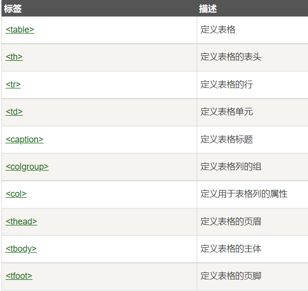
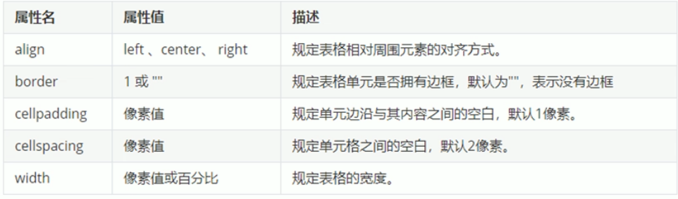
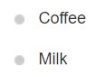
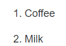
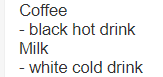
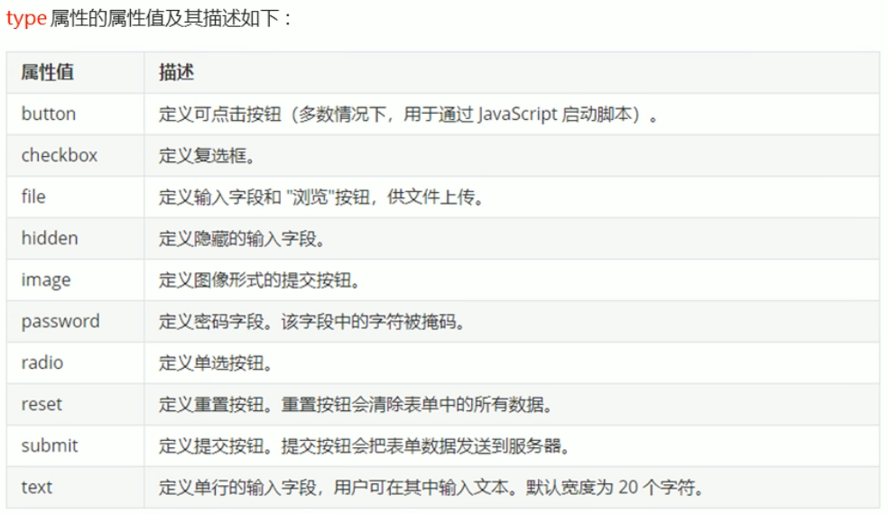
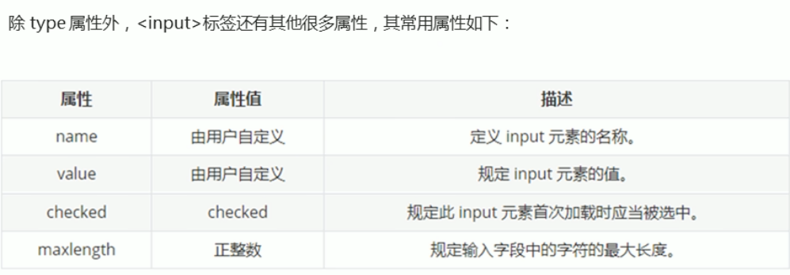

#   HTML

---

# 简介

超文本标记语言（英语：HyperText Markup Language，简称：HTML）是一种用于创建网页的标准标记语言。

您可以使用 HTML 来建立自己的 WEB 站点，HTML 运行在浏览器上，由浏览器来解析。

HTML5是HTML最新的修订版本，2014年10月由万维网联盟（W3C）完成标准制定。

HTML5的设计目的是为了在移动设备上支持多媒体。

所谓超文本有两层含义：

- 它可以加入图片、声音、动画、多媒体等内容(超越文本限制)
- 它可以从一个文件跳转到另一个文件，与世界各地主机的文件连接(超级链接文本)


# 元素和标签的区别

**标签**：形如`<p>`，由一对尖括号和表示标签含义的“关键字”构成。

**元素**：形如`<p>`一些内容`</p>`，由开始标签、结束标签以及标签中包含的内容构成。

HTML元素就是构成HTML文件的基本对象，HTML元素就是通过使用HTML标签进行定义的


# 区块元素与内联元素

大多数 HTML 元素被定义为**块级元素**或**内联元素**。

1. 块级元素在浏览器显示时，通常会以新行来开始（和结束）。

   实例: `<h1>, <p>, <ul>, <table>`

2. 内联元素在显示时通常不会以新行开始。

   实例: `<b>, <td>, <a>, `


# 标签

HTML 标记标签通常被称为 HTML 标签 (HTML tag)。

1. 基本语法

- HTML 标签是由*尖括号*包围的关键词，比如 `<html>`
- HTML 标签通常是*成对出现*的，即双标签，比如 `<b>` 和 `</b>`
- 双标签对中的第一个标签是*开始标签*，第二个标签是*结束标签*
- 开始和结束标签也被称为*开放标签*和*闭合标签*
- 没有闭合的标签称为空标签/单标签，比如`<br />`，并不常见

2. 标签关系：包含关系和并列关系

3. 基本结构标签


- **<!DOCTYPE html>** 声明为 HTML5 文档
- **<html>** 元素是 HTML 页面的根元素，是页面中最大的标签，称为根标签
- **<head>** 元素包含了文档的元（meta）数据，如 **<meta charset="utf-8">** 定义网页编码格式为 **utf-8**，是文档的头部
- **<title>** 元素描述了文档的标题，是head标签中必须设置的标签，可以让页面拥有一个属于自己的网页标题
- **<body>** 元素包含了可见的页面内容，是文档的主体，元素包含文档的所有内容
- **<h1>** 元素定义一个大标题
- **<p>** 元素定义一个段落

## 标签简称及全称

| 标签        | 英文全称                  | 中文说明                       |
| :---------- | :------------------------ | :----------------------------- |
| a           | Anchor                    | 锚                             |
| abbr        | Abbreviation              | 缩写词                         |
| acronym     | Acronym                   | 取首字母的缩写词               |
| address     | Address                   | 地址                           |
| alt         | alter                     | 替用(一般是图片显示不出的提示) |
| b           | Bold                      | 粗体（文本）                   |
| bdo         | Direction of Text Display | 文本显示方向                   |
| big         | Big                       | 变大（文本）                   |
| blockquote  | Block Quotation           | 区块引用语                     |
| br          | Break                     | 换行                           |
| cell        | cell                      | 巢                             |
| cellpadding | cellpadding               | 巢补白                         |
| cellspacing | cellspacing               | 巢空间                         |
| center      | Centered                  | 居中（文本）                   |
| cite        | Citation                  | 引用                           |
| code        | Code                      | 源代码（文本）                 |
| dd          | Definition Description    | 定义描述                       |
| del         | Deleted                   | 删除（的文本）                 |
| dfn         | Defines a Definition Term | 定义定义条目                   |
| div         | Division                  | 分隔                           |
| dl          | Definition List           | 定义列表                       |
| dt          | Definition Term           | 定义术语                       |
| em          | Emphasized                | 加重（文本）                   |
| font        | Font                      | 字体                           |
| h1~h6       | Header 1 to Header 6      | 标题1到标题6                   |
| hr          | Horizontal Rule           | 水平尺                         |
| href        | hypertext reference       | 超文本引用                     |
| i           | Italic                    | 斜体（文本）                   |
| iframe      | Inline frame              | 定义内联框架                   |
| ins         | Inserted                  | 插入（的文本）                 |
| kbd         | Keyboard                  | 键盘（文本）                   |
| li          | List Item                 | 列表项目                       |
| nl          | navigation lists          | 导航列表                       |
| ol          | Ordered List              | 排序列表                       |
| optgroup    | Option group              | 定义选项组                     |
| p           | Paragraph                 | 段落                           |
| pre         | Preformatted              | 预定义格式（文本 ）            |
| q           | Quotation                 | 引用语                         |
| rel         | Reload                    | 加载                           |
| s/ strike   | Strikethrough             | 删除线                         |
| samp        | Sample                    | 示例（文本                     |
| small       | Small                     | 变小（文本）                   |
| span        | Span                      | 范围                           |
| src         | Source                    | 源文件链接                     |
| strong      | Strong                    | 加重（文本）                   |
| sub         | Subscripted               | 下标（文本）                   |
| sup         | Superscripted             | 上标（文本）                   |
| td          | table data cell           | 表格中的一个单元格             |
| th          | table header cell         | 表格中的表头                   |
| tr          | table row                 | 表格中的一行                   |
| tt          | Teletype                  | 打印机（文本）                 |
| u           | Underlined                | 下划线（文本）                 |
| ul          | Unordered List            | 不排序列表                     |
| var         | Variable                  | 变量（文本）                   |


## <!DOCTYPE> 声明

文档类型声明标签，不是一个HTML标签

<!DOCTYPE>声明有助于浏览器中正确显示网页

网络上有很多不同的文件，如果能够正确声明HTML的版本，浏览器就能正确显示网页内容

doctype 声明是不区分大小写的

\<!DOCTYPE> 声明位于文档中的最前面的位置，处于 \<html> 标签之前

\<!DOCTYPE> 标签没有结束标签。

\<!DOCTYPE> 声明不是一个 HTML 标签；它是用来告知 Web 浏览器页面使用了哪种 HTML 版本

在 HTML 4.01 中，<!DOCTYPE> 声明需引用 DTD （文档类型声明），因为 HTML 4.01 是基于 SGML （Standard Generalized Markup Language 标准通用标记语言）。DTD 指定了标记语言的规则，确保了浏览器能够正确的渲染内容。

HTML5 不是基于 SGML，因此不要求引用 DTD。

1. **HTML5**

`<!DOCTYPE html>`

2. **HTML 4.01 Strict**

这个 DTD 包含所有 HTML 元素和属性，但不包括表象或过时的元素（如 font ）。框架集是不允许的。

`<!DOCTYPE HTML PUBLIC "-//W3C//DTD HTML 4.01//EN" "http://www.w3.org/TR/html4/strict.dtd">`

3. **HTML 4.01 Transitional**

这个 DTD 包含所有 HTML 元素和属性，包括表象或过时的元素（如 font ）。框架集是不允许的。

`<!DOCTYPE HTML PUBLIC "-//W3C//DTD HTML 4.01 Transitional//EN" "http://www.w3.org/TR/html4/loose.dtd">`

4. **HTML 4.01 Frameset**

这个 DTD 与 HTML 4.01 Transitional 相同，但是允许使用框架集内容。

`<!DOCTYPE HTML PUBLIC "-//W3C//DTD HTML 4.01 Frameset//EN" "http://www.w3.org/TR/html4/frameset.dtd">`

5. **XHTML 1.0 Strict**

这个 DTD 包含所有 HTML 元素和属性，但不包括表象或过时的元素（如 font ）。框架集是不允许的。结构必须按标准格式的 XML 进行书写。

`<!DOCTYPE html PUBLIC "-//W3C//DTD XHTML 1.0 Strict//EN" "http://www.w3.org/TR/xhtml1/DTD/xhtml1-strict.dtd">`

6. **XHTML 1.0 Transitional**

这个 DTD 包含所有 HTML 元素和属性，包括表象或过时的元素（如 font ）。框架集是不允许的。结构必须按标准格式的 XML 进行书写。

`<!DOCTYPE html PUBLIC "-//W3C//DTD XHTML 1.0 Transitional//EN" "http://www.w3.org/TR/xhtml1/DTD/xhtml1-transitional.dtd">`

7. **XHTML 1.0 Frameset**

这个 DTD 与 XHTML 1.0 Transitional 相同，但是允许使用框架集内容。

`<!DOCTYPE html PUBLIC "-//W3C//DTD XHTML 1.0 Frameset//EN" "http://www.w3.org/TR/xhtml1/DTD/xhtml1-frameset.dtd">`

8. **XHTML 1.1**

这个 DTD 与 XHTML 1.0 Strict 相同，但是允许您添加模块（例如为东亚语言提供 ruby 支持）。

`<!DOCTYPE html PUBLIC "-//W3C//DTD XHTML 1.1//EN" "http://www.w3.org/TR/xhtml11/DTD/xhtml11.dtd">`


## meta标签

```html
<meta name="keywords" content="HTML, CSS, XML, XHTML, JavaScript">
<meta name="description" content="免费 Web & 编程 教程">
<meta name="author" content="Runoob">
<meta http-equiv="refresh" content="30">
```

meta标签描述了一些基本的元数据。

`<meta> `标签提供了元数据.元数据不显示在页面上，但会被浏览器解析。

META 元素通常用于指定网页的描述，关键词，文件的最后修改时间，作者，和其他元数据。

元数据可以使用于浏览器（如何显示内容或重新加载页面），搜索引擎（关键词），或其他Web服务。

`<meta> `一般放置于 `<head>` 区域


## 字符集(Character set)

字符集是多个字符的集合，以便计算机能够识别和存储各种文字

可以通过`<meta>`标签的charset属性来规定HTML文档使用的字符编码

```html
<meta charset="UTF-8">
<meta charset="GBK">
```


## 标题标签

```html
<h1>这是一个标题。</h1>
<h2>这是一个标题。</h2>
<h3>这是一个标题。</h3>
```

标题（Heading）是通过 `<h1> - <h6>` 标签进行定义的。

`<h1>` 定义最大的标题。 `<h6>` 定义最小的标题。

 每个标题独占一行，浏览器会自动地在标题的前后添加空行。

搜索引擎使用标题为您的网页的结构和内容编制索引。

因为用户可以通过标题来快速浏览您的网页，所以用标题来呈现文档结构是很重要的。

应该将 h1 用作主标题（最重要的），其后是 h2（次重要的），再其次是 h3，以此类推。

不要仅仅是为了生成**粗体**或**大号**的文本而使用标题。


## 段落标签

```html
<p>这是一个段落 </p>
<p>这是另一个段落</p>
```

段落是通过` <p>` 标签定义的。

浏览器会自动地在段落的前后添加空行。（</p> 是块级元素）

即使忘了使用结束标签，大多数浏览器也会正确地将 HTML 显示出来，但不要依赖这种做法，忘记使用结束标签会产生意想不到的结果和错误。

当显示页面时，浏览器会**移除源代码中多余的空格和空行**。所有连续的空格或空行都会被算作一个空格。需要注意的是，HTML 代码中的所有连续的空行（换行）也被显示为一个空格。

文本在一个段落中会根据浏览器窗口的大小自动换行

段落和段落之间保有空隙


### 折行

如果希望在不产生一个新段落的情况下进行换行（新行），可以使用 `<br>`标签，不会和段落一样插入垂直间距

```html
<p>这个<br>段落<br>演示了分行的效果</p>
```

> ` <br>, <br/> 以及 <br />（带有空格）`的区别：
>
> `<br>` 是 HTML 写法。
>
> `<br/>`是 XHTML1.1 的写法, 也是 XML 写法。
>
> `<br />` 是 XHTML 为兼容 HTML 的写法,也是 XML 写法。
>
> HTML5 因为兼容 XHTML，所以三种写法都可以使用。
>
> 如果要省一到二个字节的文件大小，使用第一种。
> 如果要方便地转成XML而且也要省一个字节的文件大小，使用第二种。
> 如要要方便地转成XML而且要兼容老的浏览器，使用第三种。
>
> 早期发布的 HTML 规范当中，`<br>` 与 `` 等元素是不用封闭自身的，但是这种元素造成了 HTML 规范的不严谨，于是在之后发布的 XHTML 语言中，参考了更为严谨的 XML 规范，在这些不用自身封闭的元素后加 **/** 来表示自行封闭，在逻辑上来讲等同于`<br>....</br>`（但是没有 `</br> `这种写法），这样一来保证了较少的代码量，二来保证了规范的严谨。
>
> **建议使用第三种**


## 文本格式化标签

```html
<strong>加粗</strong>
<b>加粗文本("bold")</b>
<em>倾斜</em>
<i>斜体文本("italic") </i>
<del>删除线</del>
<s>删除线</s>
<ins>下划线</ins>
<u>下划线</u>
<code>电脑自动输出</code>
<sub> 下标</sub> 
<sup> 上标</sup>
```

为文字设置粗体、斜体、下划线等效果，使文字以特殊的方式显示

> 通常标签 `<strong> `替换加粗标签` <b>` 来使用, `<em>` 替换 `<i>`标签使用。
>
> 然而，这些标签的含义是不同的：
>
> `<b>` 与`<i> `定义粗体或斜体文本。
>
> `<strong>` 或者 `<em>`意味着你要呈现的文本是重要的，所以要突出显示。现今所有主要浏览器都能渲染各种效果的字体。不过，未来浏览器可能会支持更好的渲染效果。


## div和span标签

HTML 可以通过 `<div>`和` <span>`将元素组合起来。

1. HTML `<div>` 元素是**块级元素**，它可用于组合其他 HTML 元素的容器。

   `<div>` 元素没有特定的含义。除此之外，由于它属于块级元素，浏览器会在其前后显示折行。

   如果与 CSS 一同使用，`<div>` 元素可用于对大的内容块设置样式属性。

   `<div>` 元素的另一个常见的用途是文档布局。它取代了使用表格定义布局的老式方法。使用 `<table>` 元素进行文档布局不是表格的正确用法。`<table>` 元素的作用是显示表格化的数据。

2. HTML `<span>` 元素是**内联元素**，可用作文本的容器

   `<span>` 元素也没有特定的含义。

   当与 CSS 一同使用时，`<span>` 元素可用于为部分文本设置样式属性。


## 图像标签

在 HTML 中，图像由`` 标签定义。

`` 是空标签，意思是说，它只包含属性，并且没有闭合标签。

浏览器将图像显示在文档中图像标签出现的地方。如果你将图像标签置于两个段落之间，那么浏览器会首先显示第一个段落，然后显示图片，最后显示第二段。

```html

```

> src 指 "source"。源属性的值是图像的 URL 地址。URL 指存储图像的位置。
>
> alt 属性用来为图像定义一串预备的可替换的文本。替换文本属性的值是用户定义的。在浏览器无法载入图像时，替换文本属性告诉读者失去的信息。此时，浏览器将显示这个替代性的文本而不是图像。为页面上的图像都加上替换文本属性是个好习惯，这样有助于更好的显示信息，并且对于那些使用纯文本浏览器的人来说是非常有用的。
>
> height（高度） 与 width（宽度）属性用于设置图像的高度与宽度。属性值默认单位为像素。指定图像的高度和宽度是一个很好的习惯。如果图像指定了高度宽度，页面加载时就会保留指定的尺寸。如果没有指定图片的大小，加载页面时有可能会破坏HTML页面的整体布局。如果只设置其中一个属性会等比缩放。
>
> title属性是提示文本，鼠标放到图像上显示的文本。
>
> border属性可以设置图像的边框粗细，默认单位为像素，但主要使用CSS进行设置。


## 链接标签

```html
<a href="url" target="_blank" rel="noopener noreferrer" id="tips">链接文本/图片</a>

eg:
在HTML文档中插入ID:
<a id="tips">有用的提示部分</a>

在HTML文档中创建一个链接到"有用的提示部分(id="tips"）"：
<a href="#tips">访问有用的提示部分</a>

或者，从另一个页面创建一个链接到"有用的提示部分(id="tips"）"：
<a href="https://www.runoob.com/html/html-links.html#tips">访问有用的提示部分</a>
```

> HTML使用标签 `<a>`(anchor)来设置超文本链接。
>
> 在标签`<a>` 中使用了href属性来描述链接的地址，"#"为空链接，如果地址为一个文件(.exe .zip 等)会下载这个文件，"#id"可以快速定位到页面中的锚点名为"id"的某个位置。
>
> 使用 target 属性，你可以定义被链接的文档在何处显示，"\_self"为默认值，如果设置为 "_blank", 链接将在新窗口打开。
>
> id 属性可用于创建一个 HTML 文档书签(锚点)，书签不会以任何特殊方式显示，即在 HTML 页面中是不显示的，所以对于读者来说是隐藏的。

HTML 使用超级链接与网络上的另一个文档相连。几乎可以在所有的网页中找到链接。点击链接可以从一张页面跳转到另一张页面。

超链接可以是一个字，一个词，或者一组词，也可以是一幅图像，您可以点击这些内容来跳转到新的文档或者当前文档中的某个部分。

当您把鼠标指针移动到网页中的某个链接上时，箭头会变为一只小手。

默认情况下，链接将以以下形式出现在浏览器中：

- 一个未访问过的链接显示为蓝色字体并带有下划线。
- 访问过的链接显示为紫色并带有下划线。
- 点击链接时，链接显示为红色并带有下划线。

应该始终将正斜杠添加到**文件夹**末尾。假如这样书写链接：href="https://www.runoob.com/html"，就会向服务器产生两次 HTTP 请求。这是因为服务器会添加正斜杠到这个地址，然后创建一个新的请求，就像这样：href="https://www.runoob.com/html/"。在传统意义上说，网址末尾是没有反斜杠的。有没有反斜杠的意义在于该 url 是指向一个文件还是一个目录。对于服务器来说，如果访问目录，则会根据规则访问改目录下的默认文件（`index.html`、`index.htm`之类）。如访问`/abc/`服务器会寻找`/abc/index.html`文件，而访问`/abc`服务器则会寻找`/abc`文件。当 Web 服务器接收到某个末尾不含斜杠的 url 请求时，例如 `http://www.abc.com/abc`，这时服务器会搜索网站根目录下有没有名为 `abc` 的文件，如果没有就把 abc 当做目录处理，然后返回 abc 目录下的默认首页。


## 注释标签

```html
<!-- 注释 -->
```

注释中的内容不会执行和显示，添加注释便于相关开发人员理解和阅读代码


## 表格标签



```html
<table border="1" cellspacing="0" cellpadding="5" width="200">
        <thead>
            <tr>
                <th>表格头1</th>
                <th>表格头2</th>
            </tr>
        </thead>
        <tbody>
            <tr align="center">
                <td>123</td>
                <td>456</td>
            </tr>
            <tr align="center">
                <td>789</td>
                <td>101</td>
            </tr>
        </tbody>
        <colgroup>
            <col>
            <col>
        </colgroup>
    </table>
```

> `<th>`表头单元格也是单元格，常用于表格第一行，突出重要性，表头单元格里面的文字会加粗居中显示
>
> `<thead>`标签表示表格的头部区域，与表头单元格不同
>
> `<tbody>`标签表示表格的主体区域
>
> 如果不定义border边框属性，表格将不显示边框。
>
> 
>
> 

### 合并单元格

```html
<!-- 跨行合并 -->
<td rowspan="2">表格头</td>
<!-- 跨列合并 -->
<td colspan="2">表格头</td>
```

> 跨行合并以最上侧单元格为目标单元格
>
> 跨列合并以最左侧单元格为目标单元格
>
> 合并后需要删除多余单元格


## 列表标签

```html
<!-- 无序列表 -->
<ul>
<li>Coffee</li>
<li>Milk</li>
</ul>

<!-- 有序列表 -->
<ol>
<li>Coffee</li>
<li>Milk</li>
</ol>

<!-- 自定义列表 -->
<dl>
<dt>Coffee</dt>
<dd>- black hot drink</dd>
<dt>Milk</dt>
<dd>- white cold drink</dd>
</dl>
```

1. 无序列表是一个项目的列表，此列项目使用粗体圆点（典型的小黑圆圈）进行标记。

   无序列表的各个列表项之间没有顺序级别之分，是并列的

   无序列表中只能嵌套`<li></li>`，直接输入其他标签或者文字的做法是不被允许的

   `<li></li>`之间相当于一个容器，可以容纳所有元素

   

2. 有序列表也是一列项目，列表项目使用数字进行标记。

   与无序列表相同，有序列表中只能嵌套`<li></li>`

   

3. 自定义列表不仅仅是一列项目，而是项目及其注释的组合。

   自定义列表以` <dl>` 标签开始。每个自定义列表项以 `<dt>` (定义项目/名字)开始。每个自定义列表项的定义以 `<dd>` (描述每一个项目/名字)开始。

   


## 表单标签

HTML 表单用于收集用户的输入信息。

HTML 表单表示文档中的一个区域，此区域包含交互控件，将用户收集到的信息发送到 Web 服务器。

表单元素是允许用户在表单中输入内容，比如：文本域（textarea）、下拉列表（select）、单选框（radio-buttons）、复选框（checkbox） 等等。

在HTML中，一个完整的表单通常由表单域、表单控件(表单元素)和提示信息三个部分组成。


### 表单域

表单域是一个包含表单元素的区域

在HTML标签汇总，`<form>`标签用于定义表单域，以实现用户信息的收集和传递。

`<form>`会把它范围内的表单元素信息提交给服务器

```html
<form action="url" method="提交方式" name="表单域名称">
    表单元素
</form>
```


### 表单控件(表单元素)

在表单域中可以定义各种表单元素，这些表单元素就是允许用户在表单中输入或者选择的内容控件

1.  input输入表单元素

   ```html
   <input type="属性值" name="元素名称" value="元素值"/ >
   ```

   `<input />`是单标签

   type属性设置不同的属性值用来指定不同的控件类型

   

   

   label定义标注(标签)用于绑定一个表单元素，当点击`<label>`标签内的文本时，浏览器就会自动将焦点(光标)转到或者选择对应的表单元素上，用来增加用户体验

   ```html
   <label for="name"></label>
   ```

2. select下拉表单元素

   ```html
   <select name="cars">
   <option value="volvo">Volvo</option>
   <option value="saab">Saab</option>
   <option value="fiat">Fiat</option>
   <option value="audi">Audi</option>
   </select>
   ```

   至少包含一对option

   在option中定义`selected="selected"`时，当前项即为默认选中项

3. textarea文本域元素

   ```html
   <textarea name="" id="" cols="30" rows="10"></textarea>
   ```

   用户输入内容较多的情况下可以使用`<textarea>`文本域用于多行文本输入

   


# 属性

1. HTML 元素可以设置**属性**

2. 属性可以在元素中添加**附加信息**

3. 属性一般描述于**开始标签**

4. 属性总是以名称/值对的形式出现，**比如：name="value"**。

5. 属性值应该始终被包括在引号内。

   双引号是最常用的，不过使用单引号也没有问题。

   在某些个别的情况下，比如属性值本身就含有双引号，那么您必须使用单引号

6. 属性和属性值对大小写不敏感。

   不过，万维网联盟在其 HTML 4 推荐标准中推荐小写的属性/属性值。

   而新版本的 (X)HTML 要求使用小写属性。


## 全局属性

| 属性            | 描述                                                       |
| :-------------- | :--------------------------------------------------------- |
| accesskey       | 设置访问元素的键盘快捷键。                                 |
| class           | 规定元素的类名（classname）                                |
| contenteditable | 规定是否可编辑元素的内容。                                 |
| contextmenu     | 指定一个元素的上下文菜单。当用户右击该元素，出现上下文菜单 |
| data-*          | 用于存储页面的自定义数据                                   |
| dir             | 设置元素中内容的文本方向。                                 |
| draggable       | 指定某个元素是否可以拖动                                   |
| dropzone        | 指定是否将数据复制，移动，或链接，或删除                   |
| hidden          | hidden 属性规定对元素进行隐藏。                            |
| id              | 规定元素的唯一 id                                          |
| lang            | 设置元素中内容的语言代码。                                 |
| spellcheck      | 检测元素是否拼写错误                                       |
| style           | 规定元素的行内样式（inline style）                         |
| tabindex        | 设置元素的 Tab 键控制次序。                                |
| title           | 规定元素的额外信息（可在工具提示中显示）                   |
| translate       | 指定是否一个元素的值在页面载入时是否需要翻译               |


## lang属性

```html
<html lang="en">
<html lang="zh-CN">
```

定义当前文档显示的语言，但并非限定文档的语言，这个属性主要对浏览器和搜索引擎起作用

- en定义语言为英语
- zh-CN定义语言为中文
