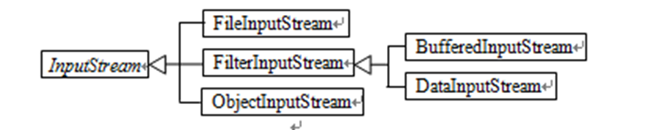
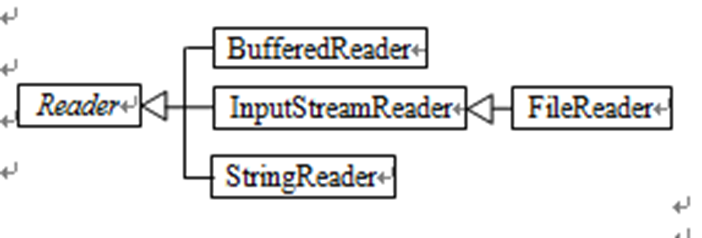
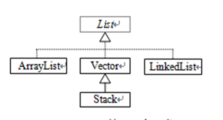

#	Java

---

#	JRE与JDK

---

JRE(Java Runtime Environment ) Java运行环境，用来运行JAVA程序，由JVM和Java类库共同构建。

JDK(Java Development Kit) Java开发工具包，包含JRE。因此只需要下载安装JDK即可。

JDK是Sun Microsystems针对Java开发员的产品，JSP(Java Server Pages，是由Sun Microsystems公司主导创建的一种动态网页技术标准)需要JDK的支持。

JDK 是整个Java的核心，包括了Java运行环境，Java工具和Java基础的类库。

JDK是Java语言的软件开发工具包(SDK)。

没有JDK的话，无法编译Java程序，如果想只运行Java程序，要确保已安装相应的JRE。

#	JavaEE JavaME JavaSE

---

SE(J2SE)，standard edition，标准版，是我们通常用的一个版本，从JDK5.0开始，改名为JavaSE，用来开发客户端的应用程序，应用程序可以独立运行或作为Applet在Web浏览器中运行。

EE(J2EE)，enterprise edition，企业版，使用这种JDK开发J2EE应用程序，从JDK5.0开始，改名为JavaEE，用来开发服务端的应用程序，例如，Java Servlet、JSP、JSF。

ME(J2ME)，micro edition，微型版，主要用于移动设备、嵌入式设备上的java应用程序，从JDK5.0开始，改名为JavaME，用来开发移动设备上运行的应用程序。


#	JVM

---

JVM(Java Virtual Machine)，是JRE的一部分。它是一个虚构出来的计算机，是通过在实际的计算机上仿真模拟各种计算机功能来实现的。

JVM是一种用于计算设备的规范，它是一个虚构出来的机器，是通过在实际的计算机上仿真模拟各种功能实现的。
JVM包含一套字节码指令集，一组寄存器，一个栈，一个垃圾回收堆和一个存储方法域。
JVM屏蔽了与具体操作系统平台相关的信息，使Java程序只需生成在JVM上运行的目标代码（字节码，即.class文件）,就可以在多种平台上不加修改地运行。
JVM在执行字节码时，实际上最终还是把字节码解释成具体平台上的机器指令执行。

JVM有自己完善的硬件架构，如处理器、堆栈、寄存器等，还具有相应的指令系统。
Java语言最重要的特点就是跨平台运行。使用JVM就是为了支持与操作系统无关，实现跨平台。

JVM执行程序的过程：

1. 加载.class文件
2. 管理并分配内存
3. 执行垃圾收集

JRE（java运行时环境）是由JVM构造的java程序的运行环，也是Java程序运行的环境，但是他同是一个操作系统的一个应用程序一个进程，因此他也有他自己的运行的生命周期，也有自己的代码和数据空间。
JVM在整个jdk中处于最底层，负责于操作系统的交互，用来屏蔽操作系统环境，提供一个完整的Java运行环境。

当一个Java程序执行时，JVM首先会用一个称为类加载器(class loader)的程序将类的字节码加载到内存中，如果程序还要用到其他类，类加载程序会在需要它们之前动态地加载它们。当加载该类后，JVM使用一个称为字节码验证器(bytecode verifier)的程序校验字节码的合法性，最后通过的字节码由运行时解释器(rutime interpreter)翻译和执行。


#	Java特性

---

Java是一门面向对象的编程语言，不仅吸收了C++语言的各种优点，还摒弃了C++里难以理解的多继承、指针等概念，因此Java语言具有功能强大和简单易用两个特征。Java语言作为静态面向对象编程语言的代表，极好地实现了面向对象理论，允许程序员以优雅的思维方式进行复杂的编程。

Java具有简单性、面向对象、分布式、健壮性、安全性、**平台独立**与可移植性、多线程、动态性等特点，Java的强类型机制、异常处理、垃圾的自动收集等是Java程序健壮性的重要保证，Java可以编写桌面应用程序、Web应用程序、分布式系统和嵌入式系统应用程序等。


#	.java文件和.class文件

---

.java文件是一个文本文件，就是我们用java语言写成的源程序。

.class文件是一种二进制文件，即字节码文件，.java文件是通过javac(编译器)编译生成的一个文件，可以由JVM装载(类装载)，然后由java(解释器)解释执行。

注意：

1. class文件名和类名保持一致
2. 公共类的类名要和.java文件名保持一致
3. 一个.java文件可以支持多个类，但是最多只能有一个公共类
4. java文件可以创建多个类，有几个类就能编译生成几个.class文件，如果.java文件中的类名出现大小写最后的结果是最后一类的内容


#	内存划分

---

1. 栈(Stack)：存放的是方法中的**局部变量**和**被调用方法参数**，局部变量一旦超出作用域会立刻从栈内存中消失，方法在栈中运行
2. 堆(Heap)：存放的是**new出来的对象**，堆内存中存放的数据都有一个16进制的地址值，**堆内存中的数据都有默认值**，整数类型默认为0，浮点类型默认为0.0，字符类型默认为\u0000，布尔类型默认为false，引用类型默认为null
3. 方法区(Method Area)：存储.class文件的相关信息，包含方法的信息
4. 本地方法栈(Native Method Stack)：与操作系统相关
5. 寄存器(pc Register)：与CPU相关

# IntelliJ IDEA

---

## 项目结构

> 项目(Project)
>
> > 模块(Module)
> >
> > > 包(Package)
> > >
> > > > 文件(File)


##	.iml文件

IDEA的配置文件


# 源文件声明规则

---

当在一个源文件中定义多个类，并且还有import语句和package语句时，要特别注意这些规则：

1. 一个源文件中只能有一个 public 类
2. 一个源文件可以有多个非 public 类
3. 源文件的名称应该和 public 类的类名保持一致。例如：源文件中 public 类的类名是 Employee，那么源文件应该命名为Employee.java。
4. 如果一个类定义在某个包中，那么 package 语句应该在源文件的首行。
5. 如果源文件包含 import 语句，那么应该放在 package 语句和类定义之间。如果没有 package 语句，那么 import 语句应该在源文件中最前面。
6. import 语句和 package 语句对源文件中定义的所有类都有效。在同一源文件中，不能给不同的类不同的包声明。

#	基础语法

---

1. Java 是**大小写敏感**的
2. **源文件名必须和类名相同**。当保存文件的时候，你应该使用类名作为文件名保存（切记 **Java 是大小写敏感**的），文件名的后缀为 **.java**。（如果文件名和类名不相同则会导致编译错误）
3. 所有的 Java 程序由 **public static void main(String[] args)** 方法开始执行。


## 标识符

1. 类名、变量名以及方法名都被称为标识符
2. 所有的标识符都应该以字母（A-Z 或者 a-z）,美元符（$）、或者下划线（_）开始
3. 首字符之后可以是字母（A-Z 或者 a-z）,美元符（$）、下划线（_）或数字的任何字符组合
4. **关键字不能用作标识符**
5. 标识符是**大小写敏感**的
6. 合法标识符举例：age、$salary、_value、__1_value
7. 非法标识符举例：123abc、-salary
8. **命名规范**
   1. 类名规范：首字母大写，后面的每个单词首字母大写(大驼峰式)
   1. 接口规范：同类名
   2. 变量名规范：首字母小写，后面的每个单词首字母大写(小驼峰式)
   3. 方法名规范：同变量名


##	修饰符

Java可以使用修饰符来修饰类中方法和属性，通常放在语句的最前端。主要有两类修饰符：

- 访问控制修饰符 : default, public , protected, private
- 非访问控制修饰符 : final, abstract, static, synchronized

1. 访问修饰符
   1. default : 在**同一包内可见**，不使用任何修饰符。使用对象：类、接口、变量、方法。
   2. private : 在**同一类内可见**。使用对象：变量、方法。 **注意：不能修饰类（外部类）**。私有访问修饰符是最严格的访问级别，所以被声明为 **private** 的方法、变量和构造方法只能被所属类访问，并且类和接口不能声明为 **private**。
   3. public : **对所有类可见**。使用对象：类、接口、变量、方法
   4. protected : **对同一包内的类和所有子类可见**。使用对象：变量、方法。 **注意：不能修饰类（外部类）**
      1. **子类与基类在同一包中**：被声明为 protected 的变量、方法和构造器能被同一个包中的任何其他类访问；
      2. **子类与基类不在同一包中**：那么在子类中，子类实例可以访问其从基类继承而来的 protected 方法，而不能访问基类实例的protected方法。
2. 非访问修饰符
   1. static 修饰符，用来修饰**类方法和类变量**。
   2. final 修饰符，用来修饰类、方法和变量，**final 修饰的类不能够被继承，修饰的方法不能被继承类重新定义，修饰的变量为常量，是不可修改的**。
   3. abstract 修饰符，用来**创建抽象类和抽象方法**。
   4. synchronized 和 volatile 修饰符，主要用于**线程**的编程。


##	关键字

关键字是有特殊含义的、被保留的、完全小写的 、不能随意使用的字符，保留字不能用于常量、变量、和任何标识符的名称。

1. 访问控制

   | 关键字    | 说明     |
   | --------- | -------- |
   | private   | 私有的   |
   | protected | 受保护的 |
   | public    | 公共的   |
   | default   | 默认     |

2. 类、方法和变量修饰符

   | 关键字       | 说明                           |
   | ------------ | ------------------------------ |
   | abstract     | 声明抽象                       |
   | class        | 类                             |
   | extends      | 扩充,继承                      |
   | final        | 最终值,不可改变的              |
   | implements   | 实现（接口）                   |
   | interface    | 接口                           |
   | native       | 本地，原生方法（非 Java 实现） |
   | new          | 新,创建                        |
   | static       | 静态                           |
   | strictfp     | 严格,精准                      |
   | synchronized | 线程,同步                      |
   | transient    | 短暂                           |
   | volatile     | 易失                           |

3. 程序控制语句

   | 关键字     | 说明                       |
   | ---------- | -------------------------- |
   | break      | 跳出循环                   |
   | case       | 定义一个值以供 switch 选择 |
   | continue   | 继续                       |
   | default    | 默认                       |
   | do         | 运行                       |
   | else       | 否则                       |
   | for        | 循环                       |
   | if         | 如果                       |
   | instanceof | 实例                       |
   | return     | 返回                       |
   | switch     | 根据值选择执行             |
   | while      | 循环                       |

4. 错误处理

   | 关键字  | 说明                   |
   | ------- | ---------------------- |
   | assert  | 断言表达式是否为真     |
   | catch   | 捕捉异常               |
   | finally | 有没有异常都执行       |
   | throw   | 抛出一个异常对象       |
   | throws  | 声明一个异常可能被抛出 |
   | try     | 捕获异常               |

5. 包相关

   | 关键字  | 说明 |
   | ------- | ---- |
   | import  | 引入 |
   | package | 包   |

6. 基本类型

   | 关键字  | 说明       |
   | ------- | ---------- |
   | boolean | 布尔型     |
   | byte    | 字节型     |
   | char    | 字符型     |
   | double  | 双精度浮点 |
   | float   | 单精度浮点 |
   | int     | 整型       |
   | long    | 长整型     |
   | short   | 短整型     |

7. 变量引用

   | 关键字 | 说明      |
   | ------ | --------- |
   | super  | 父类,超类 |
   | this   | 本类      |
   | void   | 无返回值  |

8. 保留关键字

   | 关键字 | 说明                 |
   | ------ | -------------------- |
   | goto   | 是关键字，但不能使用 |
   | const  | 是关键字，但不能使用 |


##	运算符

> 结合性是指对某个运算符构成的表达式，计算时如果先取运算符左边的操作数，后取运算符，则该运算符是左结合的，若先取运算符右侧的操作数，后取运算符，则是右结合的。
>
> 所有的二元运算符（如+、<<等）都是左结合的，而赋值运算符（=、+=等）是右结合的。

1. 算数运算符

   | 操作符 | 描述                                                         | 例子               |
   | :----- | :----------------------------------------------------------- | :----------------- |
   | +      | 加法 - 相加运算符两侧的值，也可用于连接字符串对象            | A + B 等于 30      |
   | -      | 减法 - 左操作数减去右操作数                                  | A – B 等于 -10     |
   | *      | 乘法 - 相乘操作符两侧的值                                    | A * B等于200       |
   | /      | 除法 - 左操作数除以右操作数，如果两个操作数是整数，商为整数  | B / A等于2         |
   | ％     | 取余 - 左操作数除以右操作数的余数，当操作数含有负数时，余数的符号与被除数相同且余数的绝对值小于除数的绝对值 | B%A等于0           |
   | ++     | 自增: 操作数的值增加1                                        | B++ 或 ++B 等于 21 |
   | --     | 自减: 操作数的值减少1                                        | B-- 或 --B 等于 19 |

2. 关系运算符

   | 运算符 | 描述                                                         | 例子             |
   | :----- | :----------------------------------------------------------- | :--------------- |
   | ==     | 检查如果两个操作数的值是否相等，如果相等则条件为真。         | （A == B）为假。 |
   | !=     | 检查如果两个操作数的值是否相等，如果值不相等则条件为真。     | (A != B) 为真。  |
   | >      | 检查左操作数的值是否大于右操作数的值，如果是那么条件为真。   | （A> B）为假。   |
   | <      | 检查左操作数的值是否小于右操作数的值，如果是那么条件为真。   | （A <B）为真。   |
   | >=     | 检查左操作数的值是否大于或等于右操作数的值，如果是那么条件为真。 | （A> = B）为假。 |
   | <=     | 检查左操作数的值是否小于或等于右操作数的值，如果是那么条件为真。 | （A <= B）为真。 |

3. 位运算符

   | 操作符 | 描述                                                         | 例子                           |
   | :----- | :----------------------------------------------------------- | :----------------------------- |
   | ＆     | 如果相对应位都是1，则结果为1，否则为0                        | （A＆B），得到12，即0000 1100  |
   | \|     | 如果相对应位都是 0，则结果为 0，否则为 1                     | （A \| B）得到61，即 0011 1101 |
   | ^      | 如果相对应位值相同，则结果为0，否则为1                       | （A ^ B）得到49，即 0011 0001  |
   | 〜     | 按位取反运算符翻转操作数的每一位，即0变成1，1变成0。         | （〜A）得到-61，即1100 0011    |
   | <<     | 按位左移运算符。左操作数按位左移右操作数指定的位数。         | A << 2得到240，即 1111 0000    |
   | >>     | 按位右移运算符。左操作数按位右移右操作数指定的位数。         | A >> 2得到15即 1111            |
   | >>>    | 按位右移补零操作符。左操作数的值按右操作数指定的位数右移，移动得到的空位以零填充。 | A>>>2得到15即0000 1111         |

4. 逻辑运算符

   | 操作符 | 描述                                                         | 例子                |
   | :----- | :----------------------------------------------------------- | :------------------ |
   | &&     | 称为逻辑与运算符。当且仅当两个操作数都为真，条件才为真。     | （A && B）为假。    |
   | \| \|  | 称为逻辑或操作符。如果任何两个操作数任何一个为真，条件为真。 | （A \| \| B）为真。 |
   | ！     | 称为逻辑非运算符。用来反转操作数的逻辑状态。如果条件为true，则逻辑非运算符将得到false。 | ！（A && B）为真。  |

5. 赋值运算符

   | 操作符  | 描述                                                         | 例子                                     |
   | :------ | :----------------------------------------------------------- | :--------------------------------------- |
   | =       | 简单的赋值运算符，将右操作数的值赋给左侧操作数               | C = A + B将把A + B得到的值赋给C          |
   | + =     | 加和赋值操作符，它把左操作数和右操作数相加赋值给左操作数     | C + = A等价于C = C + A                   |
   | - =     | 减和赋值操作符，它把左操作数和右操作数相减赋值给左操作数     | C - = A等价于C = C - A                   |
   | * =     | 乘和赋值操作符，它把左操作数和右操作数相乘赋值给左操作数     | C * = A等价于C = C * A                   |
   | / =     | 除和赋值操作符，它把左操作数和右操作数相除赋值给左操作数     | C / = A，C 与 A 同类型时等价于 C = C / A |
   | （％）= | 取模和赋值操作符，它把左操作数和右操作数取模后赋值给左操作数 | C％= A等价于C = C％A                     |
   | << =    | 左移位赋值运算符                                             | C << = 2等价于C = C << 2                 |
   | >> =    | 右移位赋值运算符                                             | C >> = 2等价于C = C >> 2                 |
   | ＆=     | 按位与赋值运算符                                             | C＆= 2等价于C = C＆2                     |
   | ^ =     | 按位异或赋值操作符                                           | C ^ = 2等价于C = C ^ 2                   |
   | \| =    | 按位或赋值操作符                                             | C \| = 2等价于C = C \| 2                 |

6. 条件运算符：`condition?expression1:expression2`条件运算符也被称为三元运算符，condition为关系或逻辑表达式，其计算结果为布尔值，如果该值为true，则计算表达式expression1的值，并将计算结果作为条件表达式的结果；如果该值为false，则计算表达式expression2的值，并将计算结果作为条件表达式的结果

7. instanceof 运算符:该运算符用于操作对象实例，检查该对象是否是一个特定类型（类类型或接口类型）

   `( Object reference variable ) instanceof  (class/interface type)`

   如果运算符左侧变量所指的对象，是操作符右侧类或接口(class/interface)的一个对象，那么结果为真

8. 优先级

   | 类别     | 操作符                                     | 关联性   |
   | :------- | :----------------------------------------- | :------- |
   | 后缀     | () [] . (点操作符)                         | 左到右   |
   | 一元     | expr++ expr--                              | 从左到右 |
   | 一元     | ++expr --expr + - ～ ！                    | 从右到左 |
   | 乘性     | * /％                                      | 左到右   |
   | 加性     | + -                                        | 左到右   |
   | 移位     | >> >>>  <<                                 | 左到右   |
   | 关系     | > >= < <=                                  | 左到右   |
   | 相等     | == !=                                      | 左到右   |
   | 按位与   | ＆                                         | 左到右   |
   | 按位异或 | ^                                          | 左到右   |
   | 按位或   | \|                                         | 左到右   |
   | 逻辑与   | &&                                         | 左到右   |
   | 逻辑或   | \| \|                                      | 左到右   |
   | 条件     | ？：                                       | 从右到左 |
   | 赋值     | = + = - = * = / =％= >> = << =＆= ^ = \| = | 从右到左 |
   | 逗号     | ，                                         | 左到右   |


##	注释

```java
//	这是单行注释

/*
这是多行注释
*/

/**
这是文档注释，这是Java特有的注释方式，主要用来生成类定义的api文档
*/
```


##	代码块

1. 代码块是由大括号围起来的一组语句，如类体、方法体、初始化块等
2. 格式
   1. 行末格式，即左大括号写在上一行的末尾，右大括号写在下一行
   2. 次行格式，即将左大括号单独写在下一行，右大括号与左大括号垂直对齐

#	数据类型

---

> Java 的两大数据类型:
>
> - 基本数据类型
> - 引用数据类型


##	常量

1. 常量在程序运行时是不能被修改的

2. 在 Java 中使用 final 关键字来修饰常量，声明方式和变量类似

   ```java
   final double PI = 3.1415927;
   ```

3. 虽然常量名也可以用小写，但为了便于识别，通常使用大写字母表示常量

4. 分类

   1. 字符串常量：双引号引起来的部分
   2. 整形常量：直接写上的数字，没有小数点
   3. 浮点数常量：直接写上的数字，有小数点
   4. 字符常量：用单引号引起来的单个字符
   5. 布尔常量：true或false
   6. 空常量：null，代表无任何数据，也无法使用


##	变量

变量就是申请内存来存储值。也就是说，当创建变量的时候，需要在内存中申请空间

内存管理系统根据变量的类型为变量分配存储空间，分配的空间只能用来储存该类型数据

**在Java语言中，所有的变量在使用前必须声明**

> 1. 类变量：独立于方法之外的变量，用 static 修饰。
> 2. 实例变量：独立于方法之外的变量，不过没有 static 修饰。
> 3. 局部变量：类的方法中的变量。


###	变量的作用域

1. 变量的范围是程序中该变量可以被引用的部分。
2. 方法内定义的变量被称为局部变量。
3. 局部变量的作用范围从声明开始，直到包含它的块结束。
4. 局部变量必须声明才可以使用。
5. 方法的参数范围涵盖整个方法。参数实际上是一个局部变量。
6. for循环的初始化部分声明的变量，其作用范围在整个循环，但循环体内声明的变量其适用范围是从它声明到循环体结束。
7. 可以在一个方法里，不同的非嵌套块中多次声明一个具有相同的名称局部变量，但你不能在嵌套块内两次声明局部变量


###	局部变量

1. 局部变量**声明在方法、构造方法或者语句块中**
2. 局部变量在方法、构造方法、或者语句块被执行的时候创建，当它们执行完成后，变量将会被销毁
3. 访问修饰符不能用于局部变量
4. 局部变量只在声明它的方法、构造方法或者语句块中可见
5. 局部变量是在栈上分配的
6. 局部变量没有默认值，所以局部变量被声明后，必须经过初始化，才可以使用


###	实例变量(成员变量)

1. 实例变量声明**在一个类中，但在方法、构造方法和语句块之外**
2. 当一个对象被实例化之后，每个实例变量的值就跟着确定
3. 实例变量在对象创建的时候创建，在对象被销毁的时候销毁
4. 实例变量的值应该至少被一个方法、构造方法或者语句块引用，使得外部能够通过这些方式获取实例变量信息
5. 实例变量可以声明在使用前或者使用后
6. 访问修饰符可以修饰实例变量
7. 实例变量对于类中的方法、构造方法或者语句块是可见的。一般情况下应该把实例变量设为私有。通过使用访问修饰符可以使实例变量对子类可见
8. **实例变量具有默认值**。若声明时和构造方法中都没有对成员变量进行初始化，则新建对象的成员变量值都被赋予默认值，数值型变量的默认值是0，布尔型变量的默认值是false，引用类型变量的默认值是null。变量的值可以在声明时指定，也可以在构造方法中指定
9. 实例变量可以直接通过变量名访问。但在静态方法以及其他类中，就应该使用完全限定名：ObjectReference.VariableName
9. 在创建类的对象时，Java会对每个对象的实例变量分贝一块内存，**不同对象的实例变量占用不同的存储空间**


###	静态变量(类变量)

1. 类变量也称为静态变量，**在类中以 static 关键字声明，但必须在方法之外**
1. 在JVM进行类装载时会为每一个静态变量分配一块内存
2. 无论一个类创建了多少个对象，类只拥有类变量的一份拷贝**，所有实例共享同一块内存空间**
3. 静态变量除了被声明为常量外很少使用，静态变量是指声明为 public/private，final 和 static 类型的变量。静态变量初始化后不可改变
4. 静态变量储存在静态存储区。经常被声明为常量，很少单独使用 static 声明变量
5. 静态变量在第一次被访问时创建，在程序结束时销毁
6. 与实例变量具有相似的可见性。但为了对类的使用者可见，大多数静态变量声明为 public 类型
7. 默认值和实例变量相似。数值型变量默认值是 0，布尔型默认值是 false，引用类型默认值是 null。变量的值可以在声明的时候指定，也可以在构造方法中指定。此外，静态变量还可以在静态语句块中初始化
8. **静态变量通常通过类名访问**，即`ClassName.VariableName`，不推荐通过实例访问静态变量
9. 类变量被声明为 public static final 类型时，类变量名称一般建议使用大写字母。如果静态变量不是 public 和 final 类型，其命名方式与实例变量以及局部变量的命名方式一致


##	字面值(literals)

1. 字面值是某种类型值的表示形式
2. 字面值有三种类型
   1. 基本类型的字面值：基本类型的字面值有4种类型：整数型、浮点型、布尔型、字符型。如123、-789为int型字面值，3.456、2e3为double型字面值，true、false为布尔型字面值，‘g’、‘我’为字符字面值
   2. 字符串字面值：用双引号定界的字符序列，如“Hello”是一个字符串字面值 
   3. null字面值
3. Ø从Java 7开始，在数值型字面值中可以使用下划线（_）将一些数字进行分组，这可以增强代码的可读性


##	基本数据类型

> Java语言提供了八种基本类型。六种数字类型（四个整数型，两个浮点型），一种字符类型，还有一种布尔型
>
> ```java
> 基本类型：byte 二进制位数：8
> 包装类：java.lang.Byte
> 最小值：Byte.MIN_VALUE=-128
> 最大值：Byte.MAX_VALUE=127
> 
> 基本类型：short 二进制位数：16
> 包装类：java.lang.Short
> 最小值：Short.MIN_VALUE=-32768
> 最大值：Short.MAX_VALUE=32767
> 
> 基本类型：int 二进制位数：32
> 包装类：java.lang.Integer
> 最小值：Integer.MIN_VALUE=-2147483648
> 最大值：Integer.MAX_VALUE=2147483647
> 
> 基本类型：long 二进制位数：64
> 包装类：java.lang.Long
> 最小值：Long.MIN_VALUE=-9223372036854775808
> 最大值：Long.MAX_VALUE=9223372036854775807
> 
> 基本类型：float 二进制位数：32
> 包装类：java.lang.Float
> 最小值：Float.MIN_VALUE=1.4E-45
> 最大值：Float.MAX_VALUE=3.4028235E38
> 
> 基本类型：double 二进制位数：64
> 包装类：java.lang.Double
> 最小值：Double.MIN_VALUE=4.9E-324
> 最大值：Double.MAX_VALUE=1.7976931348623157E308
> 
> 基本类型：char 二进制位数：16
> 包装类：java.lang.Character
> 最小值：Character.MIN_VALUE=0
> 最大值：Character.MAX_VALUE=65535
> ```

1. Float和Double的最小值和最大值都是以科学记数法的形式输出的，结尾的"E+数字"表示E之前的数字要乘以10的多少次方
2. 当使用字面量的时候，前缀 **0** 表示 8 进制，前缀 **0x** 代表 16 进制，前缀0b或0B代表二进制
3. 数据范围与字节数不一定相关
4. 浮点数特殊值：
   - Infinity，-Infinity
    - NaN（Not A Number, 0.0/0.0）
5. 浮点数一般不能用 == 比较
6. 需要精确而无舍入误差的数字计算，可以使用java.math.BigDecimal类


###	byte

1. byte 数据类型是8位、有符号的，以二进制补码表示的整数
2. 最小值是 **-128（-2^7）**，最大值是 **127（2^7-1）**
3. 默认值是 **0**
4. byte 类型用在大型数组中节约空间，主要代替整数，因为 byte 变量占用的空间只有 int 类型的四分之一


###	**short**

1. short 数据类型是 16 位、有符号的以二进制补码表示的整数
2. 最小值是 **-32768（-2^15）**，最大值是 **32767（2^15 - 1）**
3. Short 数据类型也可以像 byte 那样节省空间。一个short变量是int型变量所占空间的二分之一
4. 默认值是 **0**


###	**int**

1. int 数据类型是32位、有符号的以二进制补码表示的整数
2. 最小值是 **-2,147,483,648（-2^31）**，最大值是 **2,147,483,647（2^31 - 1）**
3. 一般地整型变量默认为 int 类型
4. 默认值是 **0** 


###	**long**

1. long 数据类型是 64 位、有符号的以二进制补码表示的整数
2. 最小值是 **-9,223,372,036,854,775,808（-2^63）**，最大值是 **9,223,372,036,854,775,807（2^63 -1）**；
3. 这种类型主要使用在需要比较大整数的系统上
4. 默认值是 **0L**
5. 例子： **long a = 100000L**，**long b = -200000L**。
   "L"理论上不分大小写，但是若写成"l"容易与数字"1"混淆，不容易分辩。所以最好大写


###	**float**

1. float 数据类型是单精度、32位、符合IEEE 754标准的浮点数
2. float 在储存大型浮点数组的时候可节省内存空间
3. 默认值是 **0.0f**
4. 浮点数不能用来表示精确的值，如货币
5. 例子：float f1 = 234.5f


###	**double**

1. double 数据类型是双精度、64 位、符合 IEEE 754 标准的浮点数

2. 浮点数的默认类型为 double 类型

3. double类型同样不能表示精确的值，如货币

4. 默认值是 **0.0d**

5. 例子：

   ```java
   double   d1  = 7D 
   double   d2  = 7.
   double   d3  =  8.0
   double   d4  =  8.D
   double   d5  =  12.9867
   ```


###	 **boolean**

1. boolean数据类型表示一位的信息
2. 只有两个取值：true 和 false
3. 这种类型只作为一种标志来记录 true/false 情况
4. 默认值是 **false**
4. boolean不能与数值数据相互转换，即不对应1/0


###	**char**

1. char 类型是一个单一的 16 位 Unicode 字符，Unicode字符集使用两个字节（16位）为字符编码，可表示65 536个字符。

2. 最小值是 **\u0000**（十进制等效值为 0），最大值是 **\uffff**（即为 65535）

3. char 数据类型可以储存任何字符

4. char允许输入单个汉字

4. 字面值用**单引号**将字符括起来，大多数可见的字符都可用这种方式表示，如'a'、'@'、'我'等

4. 有些特殊字符用转义序列来表示。用反斜杠（\）表示转义

   | 转义序列 | 描述                     |
   | :------- | :----------------------- |
   | \t       | 在文中该处插入一个tab键  |
   | \b       | 在文中该处插入一个后退键 |
   | \n       | 在文中该处换行           |
   | \r       | 在文中该处插入回车       |
   | \f       | 在文中该处插入换页符     |
   | \'       | 在文中该处插入单引号     |
   | \"       | 在文中该处插入双引号     |
   | \\       | 在文中该处插入反斜杠     |


##	引用数据类型

1. 在Java中，引用类型的变量非常类似于C/C++的指针。引用类型指向一个对象，指向对象的变量是引用变量。这些变量在声明时被指定为一个特定的类型，比如 Employee、Puppy 等。变量一旦声明后，类型就不能被改变了。
2. 类、字符串、对象、数组、接口、lambda、枚举类型、注解类型都是引用数据类型。
3. 所有**引用类型的默认值都是null**。
4. 一个引用变量可以用来引用任何与之兼容的类型。
5. 所有的引用类型变量都可以赋一个null值，代表元素为空


###	数组

1. Java 语言中提供的数组是只能存储固定大小的同类型元素
2. 数组的长度在程序运行期间不可改变
2. 直接打印数组名称得到的是数组对应的内存地址的哈希值
2. 使用动态初始化数组时，数组中的元素会自动拥有一个默认值，整数类型默认0，浮点类型默认为0.0，字符类型默认为\u0000，布尔类型默认为false，引用类型默认为null
2. 数组地址可以直接赋值给新的数组变量，新的数组变量获得其在堆内存中的数组首地址，该方法没有新开辟数组空间而是在操作同一个数组
2. 数组作为方法的参数和返回值时传递的是数组在堆内存中的地址值


####	声明数组

```java
dataType[] arrayRefVar;   // 首选的方法
 
 
dataType arrayRefVar[];  // 效果相同，但不是首选方法
```

> datatype：数组中保存的数据类型
>
> []：声明为数组
>
> arrayRefVar：数组名

1. 必须声明数组变量，才能在程序中使用数组
2. `dataType arrayRefVar[]` 风格是来自 C/C++ 语言 ，在Java中采用是为了让 C/C++ 程序员能够快速理解java语言


####	创建数组

1. ```java
   arrayRefVar = new dataType[arraySize];
   ```

   上面的语法语句做了两件事：

   1. 使用 dataType[arraySize] 创建了一个数组。
   2. 把新创建的数组的引用赋值给变量 arrayRefVar。

2. 数组变量的声明，和创建数组可以用一条语句完成

   ```java
   dataType[] arrayRefVar = new dataType[arraySize];
   ```

3. 可以在创建数组的同时为数组中的元素赋值

   ```java
   dataType[] arrayRefVar = new dataType[] {value0, value1, ..., valuek};
   dataType[] arrayRefVar = {value0, value1, ..., valuek};//省略格式初始化时不可单独使用
   ```

4. 初始化

   1. 动态初始化：指定长度，java中数组的长度**可以用普通变量**而不必须是常量
   2. 静态初始化：指定内容


####	内存划分


####	数组方法

1. `array.length`：返回一个int数字，代表数组长度
2. 数组复制：System.arrycopy()方法、Arrays类的copyOf()或copyOfRange()方法


#### java.util.Arrays类

1. `sort()`：对数组排序，该方法的排序是稳定的，默认为升序
2. `binarySearch()`：在已排序的数组中查找指定元素
3. `copyOf()  copyOfRange()`：数组元素的拷贝
4. `equals()`：比较两个数组是否相等
5. `fill()`：将一个值填充到数组的每个元素中或几个连续元素中


#### 二维数组

1. 声明

   ```java
   elementType[][] arrayName;	//推荐
   elementType arrayName[][];
   elementType[] arrayName[];
   ```

2. 创建

   ```java
   arrayName = new elementType[row][col];
   arrayName = new elementType[row][];	//需要后续继续为每一行分配空间
   ```

   


###	字符串

#### String

1. 一旦创建一个String对象，就不能对其内容进行改变，所有的修改都会产生新的字符串
2. 创建字符串

```java
String str1 = "Hello"
String str2 = "Hello"
//此时字符串“Hello”在堆内存中，str1与str2指向同一块内存
    
String str1 = new String("Hello")
String str2 = new String("Hello")
//此时str1与str2指向不同的内存块
```

2. 一个字符串字面值不能分成两行来写

3. 对于较长的字符串，可以使用+号将两个字符串连接

4. 大小写转换：`toUpperCase()  toLowerCase()`

5. 删除前后空白字符：`trim()`

6. 连接字符串

   string1.concat(string2);返回 string2 连接 string1 的新字符串

   更常用的是使用'+'操作符来连接字符串

7. 返回指定位置的字符：`charAt(int index)`

8. 将字符串中的所有指定字符替换：`replace(char oldChar, char newChar)`

9. 字符串查找`indexOf()   lastIndexOf()`

10. 字符串不是数组，但能转换成字符数组或字节数组：`toCharArray()  getChars()   getBytes()`

11. 字符串比较

    1. 比较**内容**是否相等

       ```java
       boolean equals(String str)
       boolean equalsIgnoreCase(String str)
       ```

    2. 比较大小

       ```java
       int compareTo(String str)
       ```

    3. 判断前缀、后缀和包含

       ```java
       boolean startsWith(String prefix)
       boolean endsWith(String suffix)
       boolean contains(String str)
       ```

12. 字符串的拆分和组合

    ```java
    String[] split(String regex)
    static String join(CharSequence delimiter, CharSequence... elements)
    boolean matches(String regex)	//正则表达式
    ```


#### StringBuilder

1. StringBuilder能够被多次的修改，并且不产生新的未使用对象

2. StringBuilder的方法不是线程安全的（不能同步访问），但StringBuilder 相较于 StringBuffer 有速度优势

3. 创建StringBuilder对象时，系统除为字符串分配空间外还会分配16个字符的缓冲区方便对象的修改，如果修改后的长度超过容量则将容量修改为2倍

4. 创建

   ```java
   StringBuilder();	//初始容量为16个字符
   StringBuilder(int capacity);	//指定容量大小
   StringBuilder(String str);
   ```

5. 常用方法

   ```java
   length()
   charAt()
   indexOf()
   substring()
   int capacity()
   void setCharAt(int index, char ch)
   StringBuilder append(int n)
   StringBuilder append(String str)
   StringBuilder insert(int offset, int n)
   StringBuilder insert(int offset, String str)
   StringBuilder deleteCharAt(int index)
   StringBuilder delete(int start, int end)
   StringBuilder replace(int start, int end, String str)
   StringBuilder reverse() 
   void setLength(int newLength)


#### StringBuffer

1. 在使用 StringBuffer 类时，每次都会对 StringBuffer 对象本身进行操作，而不是生成新的对象
2. StringBuffer是线程安全的


### 枚举类型

1. 在实际编程中，有些数据的取值往往是有限的，只能是非常少量的整数，并且最好为每个值都取一个名字，以方便在后续代码中使用
2. 在Java中，枚举类型是一种特殊的引用类型，它的声明和使用与类和接口有类似的地方。枚举类型的声明使用**enum**关键字
3. 枚举类型都隐含地继承了**java.lang.Enum**抽象类，Enum类又是Object类的子类，同时实现了Comparable接口
4. 枚举类型可以作为顶层的类型声明，也可以像内部类一样在其他类的内部声明，但不能在方法内部声明
5. 每个枚举类型都包含了若干方法，下面是一些常用的。
      static E[] values()     返回一个包含所有枚举常量的数组，按照它们的声明顺序存储
      static E valueOf(String name)    返回指定名字的枚举常量
      final int compareTo(E o) 
      final String name() 
      final int ordinal()


### 注解类型

1. 注解以结构化的方式为程序元素提供信息，这些信息能够被外部工具（编译器、解释器等）自动处理

2. 在注解出现前XML被广泛用于元数据(metadata)。但是开发人员认为XML与Java语言本身接合较松散，应该有更好的语法来表示程序中的metadata

3. 注解有许多用途，其中包括：
     为编译器提供信息
     编译时或部署时处理
     运行时处理

4. 区分注解类型和注解

   1. 注解类型是一种特殊的接口类型，像使用类一样，要使用注解必须先定义注解类型（也可以使用语言本身提供的注解类型）
   2. 注解是注解类型的一个实例。就像接口一样，注解类型也有名称和成员。注解中包含的信息采用“键/值”对的形式，可以有零或多个“键/值”对，并且每个键有一个特定类型。它可以是一个Stirng、int或其他Java类型
   3. 没有键值对的注解类型称为标记注解类型，如果注解只需要一个键值对则称为单值注解类型

5. 在Java程序中为程序元素标注注解的语法：

   `@AnnotationType`或者`@AnnotationType(elementValuePairs)`

6. 对没有默认值的元素，都应该以name = value的形式对元素初始化

7. 如果注解类型是标记注解类型（无元素），或者所有的元素都具有默认值，那么就可以省略初始化器列表

8. 初始化的顺序并不重要，但每个元素只能出现一次，如果元素有默认值，可以不对该元素初始化，也可以用一个新值覆盖默认值

9. 如果注解类型只有一个元素，可以使用缩略的形式对注解元素初始化

10. 可以给Java包、类型（类、接口、枚举）、构造方法、方法、成员变量、参数及局部变量进行标注

11. 注解就像修饰符一样被使用，并应用于包、类 型、构造方法、方法、成员变量、参数、本地变量的声明中。这些信息被存储在annotation的“name=value”结构对中

12. 注解不会影响程序代码的执行，无论annotation怎么变化，代码都始终如一地执行。Java语言解释器在工作时会忽略这些annotation，因此在JVM 中这些annotation是“不起作用”的，只能通过配套的工具才能对这些annontaion类型的信息进行访问和处理

13. 定义在java.lang包中的标准注解

    1. @Override

       标记注解类型，可以用在一个方法的声明中，告诉编译器这个方法要覆盖父类中的某个方法。使用该注解可以防止程序员在覆盖某个方法时出错

    2. @Deprecated

       标记注解类型，可以应用于某个方法或某个类型，指明方法或类型已被弃用

       警告代码用户不应该使用或者覆盖该方法，或者不该使用或扩展该类型

       一个方法或类型被标记弃用通常是因为有了更好的方法或类型

    3. @SuppressWarnings

       指示编译器阻止某些类型的警告，具体警告类型可以用初始化该注解的字符串来定义

       该注解可应用于类型、构造方法、方法、成员变量、参数以及局部变量。它的用法是传递一个String数组，其中包含需要阻止的警告

14. 自定义注解类型

    1. 用户也可以自定义注解类型。注解类型的定义与接口类型的定义类似。注解类型的定义使用interface关键字，前面加上@符号

    2. ```java
       public @interface CustomAnnotation{
             // 元素或属性声明
          }
       ```

    3. 在注解类型中声明的方法称为注解类型的元素，它的声明类似于接口中的方法声明，没有方法体，但有返回类型

    4. 元素的类型有一些限制，如只能是基本类型、String、枚举类型、其他注解类型等，并且元素不能声明任何参数

    5. 在定义注解时可以使用default关键字为元素指定默认值

    6. 注解类型可以用来标注类和接口，也可以供其他注解类型使用

    7. 对于单值注解类型应将元素命名为value，这样才能采用缩略的形式

15. 标准元注解

    1. 元注解是对注解进行标注的注解
    2. Documented是标记注解类型，用于对一个注解类型的声明进行标注，使该注解类型的实例包含在用javadoc工具产生的文档中
    3. Inherited标记的注解类型的任何实例都会被继承，如果Inherited标注一个类则注解将会被这个人标注类的所有子类继承
    4. Retension指明标注的注解保留多长时间
    5. Target指明哪些程序元素可以利用被标注的注解类型进行标注


##	类型转换

###	自动类型转换

自动类型转换也称加宽转换，它是指将具有较少位数的数据类型转换为具有较多位数的数据类型

**整型、实型（常量）、字符型数据可以混合运算。运算中，不同类型的数据先转化为同一类型，然后进行运算。**

```java
低  ------------------------------------>  高

byte,short,char —> int —> long —> float —> double 
```

- 不能对boolean类型进行类型转换
- 不能把对象类型转换成不相关类的对象
- **必须满足转换前的数据类型的位数要低于转换后的数据类型**


###	强制类型转换

```java
(type) value
```

1. 数据类型必须是兼容的

2. 隐含强制类型转换：

   -  整数的默认类型是 int
   - 小数默认是 double 类型浮点型，在定义 float 类型时必须在数字后面跟上 F 或者 f
   - byte/short/char类型在运算时，都会首先被提升为int类型再进行运算
   - 对byte/short/char类型赋值时，如果右侧赋值的数据未超过这三种类型的最大范围，javac编译器会自动强制转换为byte/short/char类型
   
3. **在把容量大的类型转换为容量小的类型时必须使用强制类型转换**

   转换过程中可能导致溢出或损失精度

   浮点数到整数的转换是通过**舍弃小数**得到，而不是四舍五入


# 流程

---

##	选择结构

1. ```java
   if(布尔表达式)
   {
      //单分支if语句
      //如果布尔表达式为true将执行的语句
   }
   ```
   
2. ```java
   if(布尔表达式){
      //双分支if-else语句
      //如果布尔表达式的值为true
   }else{
      //如果布尔表达式的值为false
   }
   ```
   
3. ```java
   if(布尔表达式 1){
      //如果布尔表达式 1的值为true执行代码
   }else if(布尔表达式 2){
      //如果布尔表达式 2的值为true执行代码
   }else if(布尔表达式 3){
      //如果布尔表达式 3的值为true执行代码
   }else {
      //如果以上布尔表达式都不为true执行代码
   }
   ```

4. ```java
   switch(expression){
       case value :
          //语句
          break; //可选
       case value :
          //语句
          break; //可选
       //你可以有任意数量的case语句
       default : //可选
          //语句
   }
   ```

   > - switch 语句中的变量类型可以是： byte、short、int 或者 char。从 Java SE 7 开始，switch 支持字符串 String 类型了，同时 case 标签必须为字符串常量或字面量。
   > - switch 语句可以拥有多个 case 语句。每个 case 后面跟一个要比较的值和冒号。
   > - case 语句中的值的数据类型必须与变量的数据类型相同，而且只能是常量或者字面常量。
   > - 当表达式的值与 case 语句的值相等时，那么 case 语句之后的语句开始执行，**直到 break 语句出现才会跳出 switch 语句。**
   > - 当遇到 break 语句时，switch 语句终止。程序跳转到 switch 语句后面的语句执行。case 语句不必须要包含 break 语句。如果没有 break 语句出现，程序会继续执行下一条 case 语句，直到出现 break 语句。
   > - switch 语句可以包含一个 default 分支，该分支一般是 switch 语句的最后一个分支（可以在任何位置，但建议在最后一个）。default 在没有 case 语句的值和变量值相等的时候执行。default 分支不需要 break 语句。
   > - switch case 执行时，一定会先进行匹配，匹配成功返回当前 case 的值，再根据是否有 break，判断是否继续输出，或是跳出判断。


##	循环结构

1. ```java
   while( 布尔表达式 ) {
     //while循环
     //循环内容
   }
   ```
   
2. ```java
   do {
          //do-while循环
          //代码语句
   }while(布尔表达式);
   ```
   
   > do…while 循环至少会执行一次
   
3. ```java
   for(初始化; 布尔表达式; 更新) {
       //for循环
       //代码语句
   }
   ```
   
   > - 最先执行初始化步骤。可以声明一种类型，但可初始化一个或多个循环控制变量，也可以是空语句。
   > - 然后，检测布尔表达式的值。如果为 true，循环体被执行。如果为false，循环终止，开始执行循环体后面的语句。
   > - 执行一次循环后，更新循环控制变量。
   > - 再次检测布尔表达式。循环执行上面的过程。
   
4. ```java
   for(声明语句 : 表达式)
   {
      //For-Each循环
      //代码句子
   }
   
   eg:
   public class TestArray {
      public static void main(String[] args) {
         double[] myList = {1.9, 2.9, 3.4, 3.5};
    
         // 打印所有数组元素
         for (double element: myList) {
            System.out.println(element);
         }
      }
   }
   ```
   
   > 声明语句：声明新的局部变量，该变量的类型必须和数组元素的类型匹配。其作用域限定在循环语句块，其值与此时数组元素的值相等。
   >
   > 表达式：表达式是要访问的数组名，或者是返回值为数组的方法。
   >
   > 类似于Python中的in关键字
   
5. break语句

   1. 直接执行break语句，跳出当前循环体
   2. 使用带标签的break语句，跳出指定的循环体或带标签的语句块

6. continue语句

   1. 直接执行continue语句，终止执行当前的迭代，不跳出当前循环体，开始下一次的迭代
   2. 使用带标签的continue语句，跳出指定的迭代，开始下一次的迭代


#	对象和类

---

> - **对象**：一个抽象概念，表示任意存在的事物，通常将对象划分为静态部分和动态部分。静态部分被称为"属性"，任何对象都有自身属性；动态部分被称为"行为"，即对象执行的动作，属于某个类的具体对象称为该类的一个实例，实例是一个具体概念
> - **类**：类是封装对象的属性和行为的载体，即具有相似特征和行为的一类实体被称为类，是一组相关属性和行为的集合

每个类都有构造方法。如果没有显式地为类定义构造方法，Java 编译器将会为该类提供一个默认构造方法。

在创建一个对象的时候，至少要调用一个构造方法。构造方法的名称必须与类同名，一个类可以有多个构造方法。


##	包与类的导入

1. 包(package)

   > Java语言使用包来组织类库，包实际是一组相关类或接口的集合。Java类库中的类都是通过包来组织的，用户自己编写的类也可以通过包来组织。包实际上提供了类的访问权限和命名管理机制。具体来说，包主要有下面几个作用：
   >
   > - 将功能相关的类和接口放到一个包中
   > - 通过包实现命名管理机制，不同包中可以有同名的类
   > - 通过包还可以实现对类的访问控制
   >
   > **包在计算机系统中实际上对应于文件系统的目录(文件夹)**

   1. package语句

      如果在定义类时没有指定类属于哪个包，则该类属于默认包(default package)，即当前目录

      默认包中的类只能被该包中的类访问

      要将某个类放入包中，应在定义类时使用package语句指明属于哪个包

      ```java
      package packagepath
      ```

      为了使用户的包名唯一，建议将域名进行反转，然后中间用.号分隔作为包的名称

      一个源文件只能有一条package语句，该语句必须作为源文件的第一条非注释语句

   2. 类的完全限定名

      如果一个类属于某个包，可以使用类的完全限定名(fully qualified name)来表示

2. 类的导入

   1. 使用java.lang包和默认包(当前目录)中的类不需要使用import语句将其导入，编译器会自动导入该包中的类

   2. 不使用import语句而在使用某个类时指明该类所属的包

   3. import语句导入指定包中的类或接口

      ```java
      import package1[.package2[.package3[...]]].ClassName|* ;
      ```

      通配符"*"表示导入包中所有类，导入某个包中所有类并不是将所有类都加载进源文件中，而是使用哪个类才导入哪个，如果这种方式导入的类中有同名的类，则在使用时需要指明类的全名即使用完全限定名

   4. import static语句导入类或接口中的静态成员

      ```java
      import static package1[.package2[.package3[...]]].ClassName|* ;
      ```

      


##	类的定义

类的定义包括两个部分：类声明和类体的定义

1. 类声明

   ```java
   [public] [abstract|final] class ClassName [extends SuperClass] [implements InterfaceNameList]{
       //1.成员变量的声明
       //2.构造方法的定义
       //2.成员方法的定义
   }
   ```

   > 1. 类的修饰符
   >
   >    类的访问修饰符可以是public或缺省，若类用public修饰，则该类称为公共类，公共类可以被任何包中的类使用；若不加public修饰符，类只能被同一包中其他类使用；若使用abstract修饰符，则该类为抽象类；若使用final修饰符，则该类为最终类
   >
   > 2. extends SuperClass
   >
   >    如果一个类要继承某个类需使用extends指明该类的父类，SuperClass为父类名，如果定义类时没有指明所继承的父类则自动继承Object类
   >
   > 3. implements InterfaceNamelist
   >
   >    如果定义的类需要实现接口，则使用implements InterfaceNamelist选项。一个类可以实现多个接口，若实现多个接口，接口名中间用逗号分开
   >
   > 4. 类体
   >
   >    类声明结束后是一对大括号，大括号括起来的部分称为类体(class body)，构造方法用于创建类实例，成员变量定义对象状态，成员方法定义对象行为

2. 类体的定义

   1. 成员变量

      ```java
      [public|protected|private] [static|final] type variableName [=value];
      ```

      > 1. 变量的访问修饰符
      >
      >    [public|protected|private]为变量的访问修饰符，用public修饰的变量为公共变量，公共变量可以被任何方法访问；用protected修饰的变量称为保护变量，保护变量可以被同一个包中的类或子类访问；用private修饰的变量称为私有变量，私有变量只能被同一个类的方法访问；没有使用访问修饰符则该变量只能被同一个包中的类访问
      >
      > 2. 实例变量和静态变量
      >
      >    变量用static修饰则该变量称为静态变量/类变量，否则称为实例变量
      >
      > 3. 使用final修饰的变量叫做最终变量，也称为标识符常量，一旦尾气赋值就不能再改变了

   2. 构造方法

   3. 成员方法


## 对象初始化和清除

1. 实例变量的初始化：

   1. 在类的定义中如果没有为变量赋初值，则编译器为每一个成员变量指定一个默认值

   2. 在变量声明时初始化，可以使用方法为变量初始化：`double marks = f();`(方法返回对应数据类型的值)

   3. 使用初始化块初始化：在类体重使用一对大括号定义一个初始化块，在该块中可以对实例变量初始化

      ```java
      {
          parament = value;
      }
      ```

   4. 使用构造方法初始化，此时成员变量先执行自动初始化，即先初始化为默认值，然后才赋予指定值

2. 静态变量的初始化

   除了声明时初始化和构造方法初始化外，还可以使用静态初始化块，在静态初始化块中只能使用静态变量

   ```java
   static{
       parament = value;
   }
   ```

3. 初始化次序

   1. 用默认值给静态变量赋值，然后执行静态初始化块为static变量赋值
   2. 用默认值给实例变量赋值，然后执行初始化块为实例变量赋值
   3. 最后使用构造方法初始化静态变量和实例变量

4. 垃圾回收器

   - 当对象不再被引用时，Java运行系统就在后台自动运行垃圾回收器这个线程，终结该对象并释放其所占的内存空间，这个过程称为垃圾回收(garbage collection,GC)
   - 一个对象可能有多个引用，只有在所有的引用都被删除后对象才有可能被回收
   - 强制执行垃圾回收器：`System.gc();`或者`Runtime rt = Runtime.getRuntime;	rt.gc();`
   - 启动垃圾回收器并不意味着马上能回收无用的对象

   

##	创建对象

> 对象是根据类创建的。在Java中，使用关键字 new 来创建一个新的对象。

1. **声明**：声明一个对象，包括对象名称和对象类型，声明是对类的引用，引用名保存着实际对象的内存地址
2. **实例化**：使用关键字 new 来创建一个对象
3. **初始化**：使用 new 创建对象时，会调用构造方法初始化对象

```java
引用类型名 对象名 = new 类名称()
```

若对象仅在创建处使用，可以不声明引用名而直接使用对象的方法


##	使用对象

1. 使用成员变量：`对象名.成员变量名`
2. 使用成员方法：`对象名.成员方法名(参数列表)`


##	对象引用赋值

对于基本数据类型的变量赋值是将变量的值的一个副本给另一个变量；对于对象的赋值是将对象的引用(地址)赋值给变量，对一个对象内容的修改会直接影响所有指向这个对象的引用

​	

##	单例模式(singleton)

> 在Java类的设计中有时希望一个类在任何时候都只能有一个实例，这时可以将该类设计为单例模式
>
> 这种模式涉及到一个单一的类，该类负责创建自己的对象，同时确保只有单个对象被创建。这个类提供了一种访问其唯一的对象的方式，可以直接访问，不需要实例化该类的对象。
>
> 单例模式的特点：
>
> 1. 单例类只能有一个实例。
> 2. 单例类必须自己创建自己的唯一实例。
> 3. 单例类必须给所有其他对象提供这一实例。
>
> - 意图：
>
>    保证一个类仅有一个实例，并提供一个访问它的全局访问点。
>
> - 主要解决：
>
>    一个全局使用的类频繁地创建与销毁。
>
> - 何时使用：
>
>    当想控制实例数目，节省系统资源的时候。
>
> - 如何解决：
>
>    判断系统是否已经有这个单例，如果有则返回，如果没有则创建。
>
> - 关键代码：
>
>    构造函数是私有的。
>
> - 优点：
>
>    1、在内存里只有一个实例，减少了内存的开销，尤其是频繁的创建和销毁实例（比如首页页面缓存）。
>    2、避免对资源的多重占用（比如写文件操作）。
>
> - 缺点：
>
>    没有接口，不能继承，与单一职责原则冲突，一个类应该只关心内部逻辑，而不关心外面怎么样来实例化。
>
> - 使用场景：
>
>    1、要求生产唯一序列号。
>    2、WEB 中的计数器，不用每次刷新都在数据库里加一次，用单例先缓存起来。
>    3、创建的一个对象需要消耗的资源过多，比如 I/O 与数据库的连接等。

1. **懒汉式，线程不安全**

   **是否 Lazy 初始化：**是

   **是否多线程安全：**否

   **实现难度：**易

   **描述：**这种方式是最基本的实现方式，这种实现最大的问题就是不支持多线程。因为没有加锁 synchronized，所以严格意义上它并不算单例模式。
   这种方式 lazy loading 很明显，不要求线程安全，在多线程不能正常工作。

   ```java
   public class Singleton {  
       private static Singleton instance;  
       private Singleton (){}  //将构造方法用private修饰
     
       public static Singleton getInstance() {  
           if (instance == null) {  
               instance = new Singleton();  
           }  
           return instance;  
       }  
   }
   ```

2. **懒汉式，线程安全**

   **是否 Lazy 初始化：**是

   **是否多线程安全：**是

   **实现难度：**易

   **描述：**这种方式具备很好的 lazy loading，能够在多线程中很好的工作，但是，效率很低，99% 情况下不需要同步。
   优点：第一次调用才初始化，避免内存浪费。
   缺点：必须加锁 synchronized 才能保证单例，但加锁会影响效率。
   getInstance() 的性能对应用程序不是很关键（该方法使用不太频繁）。

   ```java
   public class Singleton {  
       private static Singleton instance;  
       private Singleton (){}  //将构造方法用private修饰
       
       public static synchronized Singleton getInstance() {  
           if (instance == null) {  
               instance = new Singleton();  
           }  
           return instance;  
       }  
   }
   ```

3. **饿汉式**

   **是否 Lazy 初始化：**否

   **是否多线程安全：**是

   **实现难度：**易

   **描述：**这种方式比较常用，但容易产生垃圾对象。
   优点：没有加锁，执行效率会提高。
   缺点：类加载时就初始化，浪费内存。
   它基于 classloader 机制避免了多线程的同步问题，不过，instance 在类装载时就实例化，虽然导致类装载的原因有很多种，在单例模式中大多数都是调用 getInstance 方法， 但是也不能确定有其他的方式（或者其他的静态方法）导致类装载，这时候初始化 instance 显然没有达到 lazy loading 的效果。

   ```java
   public class Singleton {  
       private static Singleton instance = new Singleton();  
       private Singleton (){}  
       public static Singleton getInstance() {  
       return instance;  
       }  
   }
   ```

4. **双检锁/双重校验锁（DCL，即 double-checked locking）**

   **JDK 版本：**JDK1.5 起

   **是否 Lazy 初始化：**是

   **是否多线程安全：**是

   **实现难度：**较复杂

   **描述：**这种方式采用双锁机制，安全且在多线程情况下能保持高性能。
   getInstance() 的性能对应用程序很关键。

   ```java
   public class Singleton {  
       private volatile static Singleton singleton;  
       private Singleton (){}  
       public static Singleton getSingleton() {  
       if (singleton == null) {  
           synchronized (Singleton.class) {  
               if (singleton == null) {  
                   singleton = new Singleton();  
               }  
           }  
       }  
       return singleton;  
       }  
   }
   ```

5. **登记式/静态内部类**

   **是否 Lazy 初始化：**是

   **是否多线程安全：**是

   **实现难度：**一般

   **描述：**这种方式能达到双检锁方式一样的功效，但实现更简单。对静态域使用延迟初始化，应使用这种方式而不是双检锁方式。这种方式只适用于静态域的情况，双检锁方式可在实例域需要延迟初始化时使用。
   这种方式同样利用了 classloader 机制来保证初始化 instance 时只有一个线程，它跟第 3 种方式不同的是：第 3 种方式只要 Singleton 类被装载了，那么 instance 就会被实例化（没有达到 lazy loading 效果），而这种方式是 Singleton 类被装载了，instance 不一定被初始化。因为 SingletonHolder 类没有被主动使用，只有通过显式调用 getInstance 方法时，才会显式装载 SingletonHolder 类，从而实例化 instance。想象一下，如果实例化 instance 很消耗资源，所以想让它延迟加载，另外一方面，又不希望在 Singleton 类加载时就实例化，因为不能确保 Singleton 类还可能在其他的地方被主动使用从而被加载，那么这个时候实例化 instance 显然是不合适的。这个时候，这种方式相比第 3 种方式就显得很合理。

   ```java
   public class Singleton {  
       private static class SingletonHolder {  
       private static final Singleton INSTANCE = new Singleton();  
       }  
       private Singleton (){}  
       public static final Singleton getInstance() {  
           return SingletonHolder.INSTANCE;  
       }  
   }
   ```

6. **枚举**

   **JDK 版本：**JDK1.5 起

   **是否 Lazy 初始化：**否

   **是否多线程安全：**是

   **实现难度：**易

   **描述：**这种实现方式还没有被广泛采用，但这是实现单例模式的最佳方法。它更简洁，自动支持序列化机制，绝对防止多次实例化。
   这种方式是 Effective Java 作者 Josh Bloch 提倡的方式，它不仅能避免多线程同步问题，而且还自动支持序列化机制，防止反序列化重新创建新的对象，绝对防止多次实例化。不过，由于 JDK1.5 之后才加入 enum 特性，用这种方式写不免让人感觉生疏，在实际工作中，也很少用。
   不能通过 reflection attack 来调用私有构造方法。

   ```java
   public enum Singleton {  
       INSTANCE;  
       public void whateverMethod() {  
       }  
   }
   ```


# 方法

---

> Java方法是语句的集合，它们在一起执行一个功能。
>
> - 方法是解决一类问题的步骤的有序组合
> - 方法包含于类或对象中，而不包含在方法中
> - 方法在程序中被创建，在其他地方被引用
>
>  在一些其它语言中方法指过程和函数。一个返回非void类型返回值的方法称为函数；一个返回void类型返回值的方法叫做过程。

1. 方法的名字的第一个单词应以小写字母作为开头，后面的单词则用大写字母开头写，不使用连接符，即小驼峰。例如：`addPerson`
2. 下划线可能出现在 JUnit 测试方法名称中用以分隔名称的逻辑组件。一个典型的模式是：`test<MethodUnderTest>_<state>`，例如 `testPop_emptyStack`
3. 对于一个没有返回值的方法，关键字return可写可不写，如果选择添加return，则return后不能有返回值
4. 一个方法中可以有多个return语句，但是必须保证同时只有一个会被执行到
5. 一般地，把能够返回成员变量值的方法称为访问方法(accessor method)，把能够修改成员变量值的方法称为修改方法(mutator method)。访问方法名一半为getXXX()，因此访问方法也称getter方法；修改方法一般为setXXX()，因此修改方法一般也称setter方法


##	方法的定义

```java
修饰符 返回值类型 方法名(参数类型 参数名){
    ...
    方法体
    ...
    return 返回值;
}
```

> **修饰符：**`[public|protected|private] [static] [abstract|final]`-修饰符是可选的，定义了该方法的访问类型，告诉编译器如何调用该方法。用public修饰的方法可以在任何类中调用；用protected修饰的方法可以在同一个类、同一个包中的类以及子类中调用；用private修饰的方法只能在同一个类中调用；若果缺省访问修饰符，则称包可访问的，即可以被同一个类的方法访问和同一个包中的类访问。用static修饰的方法称为静态方法；用final修饰的方法称为最终方法，最终方法不能被覆盖；用abstract修饰的方法称为抽象方法。
>
> **返回值类型 ：**方法可能会返回值。returnValueType 是方法返回值的数据类型。有些方法执行所需的操作，但没有返回值，在这种情况下，returnValueType 是关键字**void**。
>
> **方法名：**是方法的实际名称。方法名和参数表共同构成方法签名，使用小驼峰命名法 
>
> **参数类型：**参数像是一个占位符。当方法被调用时，传递值给参数，这个值被称为实参或变量。参数列表是指方法的参数类型、顺序和参数的个数。参数是可选的，方法可以不包含任何参数，此时不能进行参数的初始化。
>
> **方法体：**方法体包含具体的语句，定义该方法的功能。

1. 方法的定义不能存在嵌套包含关系
2. 不同方法的定义前后顺序不影响使用
2. 方法定义后不会执行，只有调用时才会执行


##	构造方法

```java
[public|protected|private] ClassName([paramList]){
}
```

1. 构造方法也叫构造器(constructor)，是类的一种特殊方法
2. 当一个对象被创建时候，构造方法用来初始化该对象
3. 构造方法和它所在类的名字相同
4. 构造方法不能有返回值
5. 通常会使用构造方法给一个类的实例变量赋初值，或者执行其它必要的步骤来创建一个完整的对象
6. 不管是否自定义构造方法，所有的类都有构造方法，因为 Java 自动提供了一个默认构造方法，默认构造方法的访问修饰符和类的访问修饰符相同(类为 public，构造函数也为 public；类改为 protected，构造函数也改为 protected)
7. 一旦你定义了自己的构造方法，默认构造方法就会失效
8. 构造方法分类：
   1. 无参数构造方法(no-args constructor)
   2. 带参数构造方法：创建对象时可以传入参数进行新对象的初始化
   3. 默认构造方法(default constructor)：无参数构造方法，方法体为空


##	方法的调用

1. 当方法返回一个值的时候，方法调用通常被当做一个值；如果方法返回值是void，方法调用一定是一条语句。
2. 与C语言不同，调用方法时不需要提前声明
3. 调用方法
   1. 单独调用：方法名称(参数)
   2. 打印调用：System.out.println(方法名称(参数))
   3. 赋值调用：数据类型 变量名称 = 方法名称(参数)


## 方法的重载(overload)

1. 一个类的两个方法拥有相同的名字，但是有不同的参数列表(参数个数、参数类型、参数的多类型顺序)
2. Java编译器根据方法签名判断哪个方法应该被调用，方法签名的定义不包括方法的返回值
3. 方法重载可以让程序更清晰易读。执行密切相关任务的方法应该使用相同的名字
4. 重载的方法必须拥有**不同的参数列表**，不能仅仅依据修饰符或者返回类型的不同来重载方法，不同的参数名称也不能重载方法
4. 调用重载的方法时可能会发生自动类型转换
4. 通过方法重载可实现编译时多态(静态多态)
4. 构造方法也可以进行重载


##	this关键字

1. this关键字表示对象本身，在一个方法的方法体或参数中可能会声明与成员变量同名的局部变量或形参名，此时的局部变量会隐藏成员变量，即局部变量优先，因此要使用成员变量就需要在前面加上this关键字
2. this关键字的另一个作用是在一个构造方法中调用该类的另一个构造方法，此时this语句必须是**调用方法体中的第一条语句**
3. this关键字**只能用在非static方法中**，实际上，在对象调用一个非static方法时向方法传递了一个引用，这个引用就是对象本身


##	参数传递

1. 在Java语言中方法的参数传递是按值传递(pass by value)，即在调用方法时将实际参数值的一个副本传递给方法中的形式参数，方法调用结束后时间参数的值并不改变，形式参数是局部白能量，其作用域只在方法内部，离开方法后自动释放

2. 对于基本数据类型的参数的参数传递方式是值传递，但对于可改变的引用类型的参数的参数传递是引用传递，即在方法内部有可能改变原来的对象

3. 可变参数

   ```java
   typeName... parameterName
   ```

   在方法定义中，在指定参数类型后加一个省略号(...) 

   一个方法中只能指定一个可变参数，它**必须是方法的最后一个参数**，任何普通的参数必须在它之前声明


##	静态方法

1. 静态方法为使用static修饰的方法
2. 静态方法属于类，它只能访问静态变量和调用静态方法
3. 静态方法通常用类名调用
4. 静态方法中不能使用this和super关键字
5. 调用静态方法前不需要对类进行实例化可直接调用，因此main()方法需要用static修饰


# 封装

---

1. 封装性是面向对象的一个重要特征。在Java语言中，对象就是一组变量和方法的封装体

2. 通过对象的封装，用户不必了解对象是如何实现的，只须通过对象提供的接口与对象进行交互就可以

3. 封装性实现了模块化和信息隐藏，有利于程序的可移植性和对象的管理

4. 对象的封装是通过两种方式实现的：

   1. 通过包实现封装性。在定义类时使用package语句指定类属于哪个包。包是Java语言最大的封装单位，它定义了程序对类的访问权限。
   2. 通过类和类的成员的访问权限实现封装性。

5. 类的访问权限

   1. 类（也包括接口和枚举等）的访问权限通过访问修饰符实现，它定义哪些类可以使用该类
   2. 类的访问修饰符可以是public或缺省，若类用public修饰，则该类称为公共类，公共类可以被任何包中的类使用；若不加public修饰符，类只能被同一包中其他类使用

6. 类成员的访问权限

   | 修饰符    | 类本身 | 同一个包的类 | 不同包的子类 | 任何类 |
   | --------- | ------ | ------------ | ------------ | ------ |
   | private   | √      |              |              |        |
   | 默认      | √      | √            |              |        |
   | protected | √      | √            | √            |        |
   | public    | √      | √            | √            | √      |

   |                  | **private** | **默认** | **protected** | **public** |
   | ---------------- | ----------- | -------- | ------------- | ---------- |
   | 在同一个类中     | 可见        | 可见     | 可见          | 可见       |
   | 相同包中的子类   | 不可见      | 可见     | 可见          | 可见       |
   | 相同包中的非子类 | 不可见      | 可见     | 可见          | 可见       |
   | 不同包中的子类   | 不可见      | 不可见   | 可见          | 可见       |
   | 不同包中的非子类 | 不可见      | 不可见   | 不可见        | 可见       |


# 继承

---

## 实现

1. 继承就是子类继承父类的特征和行为，使得子类对象（实例）具有父类的实例域和方法，或子类从父类继承方法，使得子类具有父类相同的行为

2. 在Java中，被继承的类称为父类或超类，继承的类称为子类或派生类

3. 使用**extends**关键字实现类的继承

   ```java
   [public] class SubClass  extends SuperClass{
         // 类体定义
     }
   ```

4. 子类继承父类中非private的成员变量和成员方法

5. 省略extends，定义的类继承java.lang.Object类

6. Java仅支持单继承，但可以通过接口实现多重继承


## 方法覆盖

1. 在子类中可以定义与父类中的名字、参数列表、返回值类型都相同的方法，这时子类的方法就叫做**覆盖**（overriding）或**重写**了父类的方法
2. 子类不能覆盖超类的private方法
3. 父类中static方法可以被继承，但不能被覆盖
4. 为了避免在覆盖方法时写错方法头，可以在要覆盖的方法前面使用`@Override`注解语法，如果具有该注解的方法没有覆盖父类的方法则编译器会报错


## super关键字

1. 在子类中可以使用**super**关键字，它用来引用当前对象的父类对象

2. 在子类中调用父类中被覆盖的方法，格式为：

    `super.methodName([paramlist])`

3. 在子类中调用父类的构造方法，格式为：

     `super([paramlist])`

4. 在子类中访问父类中被隐藏的成员变量，格式为：

     `super.variableName`


## 调用父类的构造方法

1. 子类**不能**继承父类的构造方法。要创建子类对象，需要使用默认构造方法或为子类定义构造方法。

2. Java语言规定，在创建子类对象时，必须先创建该类的所有父类对象。因此，在编写子类的构造方法时，**必须保证**它能够调用父类的构造方法。

3. 在子类的构造方法中调用父类的构造方法有两种方式

   1. 使用super来调用父类的构造方法

         `super([paramlist]);`

   2. 当没有super语句时，编译器在子类的构造方法的第一句自动加上，调用父类的默认构造方法，如果父类没有默认的构造方法，将编译出错。

         `super();`

4. 在任何情况下，创建一个类的实例时，将会沿着继承链调用所有父类的构造方法，这叫做**构造方法链**。


## final关键字

1. final修饰类，则该类就为最终类（final class），最终类不能被继承，隐含定义了其中的所有方法都是final的

2. final修饰方法，则该方法不能被子类覆盖

3. final修饰变量，包括类的成员变量、方法的局部变量和方法的参数，则该变量为常值变量，一旦赋值便不能改变

   对于类的成员变量一般使用static和final组合定义类常量，编译器可以将该常量值带入任何可能用到它的表达式中，减轻运行时的负担

   如果一个引用变量使用final修饰，表示该变量的引用(地址)不能改变，但对象本身是可以改变的，Java没有提供任何机制使对象本身保持不变


## 抽象类

1. 抽象类（abstract class）是包含抽象方法的类，使用abstract修饰
2. 抽象方法（abstract method）是**只有声明，没有实现**的方法，使用abstract修饰
3. 抽象类不能被实例化
4. 包含抽象方法的类必须定义为抽象类
5. 抽象方法的作用是为所有子类提供统一的接口
6. 抽象类中可以定义构造函数，但不能被实例化，可以被子类调用
7. 抽象类的子类如果没有实现抽象方法则仍然为抽象类
8. 抽象类中可以没有抽象方法，但仍然需要被子类继承后才能实例化

# 多态

---

## 对象转换

1. 子类定义的类型称为子类型，而父类（或接口）定义的类型称为父类型

2. 子类对象和父类对象在一定条件下可以相互转换，这种转换一般称为**对象转换**或**造型**（casting）

3. 对象转换分为

   1. 自动转换  upcasting   向上转换	

      子类对象可以自动转换为父类对象。可以将子类型的引用赋值给父类型的引用

   2. 强制转换  向下转换    使用()运算符  

      将父类对象强制转换为子类对象。可以将父类型的引用赋值给子类型的引用

4. 不是任何情况下都可以进行强制类型转换

5. 转换只发生在有继承关系的类或接口之间


## instanceof运算符

1. `variable instanceof TypeName`
2. instanceof运算符用来测试一个实例是否是某种类型的实例，这里的类型可以是类、抽象类、接口等返回值为布尔值
3. 如果一个实例是某种类型的实例，那么该实例也是该类型的所有父类型的实例


## 多态与动态类型绑定

1. 多态（polymorphism）就是多种形式，它是指Java程序中一个类或多个类中可以定义多个同名方法，这多个同名方法完成的操作不同，这就是多态

2. Java语言支持两种类型的多态

   1. 静态多态：也叫编译时多态，它通过方法重载(Overload)实现
   2. 动态多态：也叫运行时多态，它通过方法覆盖(Override)实现

3. 方法绑定:将方法调用与方法体关联起来称方法绑定（binding）

   1. 若在程序执行前进行绑定，叫前期绑定，如C语言的函数调用都是前期绑定
   2. 若在程序运行时根据对象的类型进行绑定，则称后期绑定或动态绑定
   3. Java中除static方法和final方法外都是后期绑定

4. 对重载的方法，Java运行时系统根据传递给方法的参数个数和类型确定调用哪个方法

   对覆盖的方法，运行时系统根据实例类型(创建的对象类型，而不是变量声明类型的）决定调用哪个方法

   对子类的一个实例，如果子类覆盖了父类的方法，运行时系统调用子类的方法，如果子类继承了父类的方法，则运行时系统调用父类的方法


#	输入输出

---

> 1. 目前Java支持文件I/O和流式I/O，流式I/O分为输入流和输出流
>
>    
>
> 2. 按照处理数据的类型分，数据流又可分为:
>
>    1. 二进制流，也称为字节流。  单位：字节
>    2. 文本流，也称为字符流。 单位：字符
>
> 3. 输入、输出流提供一条通道程序，可以使用这条通道读取源中的数据或把数据传送到目的地。把输入流的指向称作源，程序从指向源的输入流中读取源中的数据；而输出流的指向是数据要去的一个目的地，程序通过向输出流中写入数据把数据传送到目的地
>
> 4. 虽然I/O流经常与磁盘文件存取有关,但是程序的源和目的地也可以是键盘、鼠标、内存或显示器窗口
>
> 5. Java的I/O流库提供大量的流类(在包**java.io**中)。所有输入流类都是抽象类InputStream（字节输入流）或抽象类Reader（字符输入流）的子类，而所有输出流都是抽象类OutputStream(字节输出流)或抽象类Writer(字符输出流)的子类
>
> 6. 文件通常可以分为**文本文件**和**二进制文件**，使用二进制I/O向文件写入一个数据，就是将内存中的值复制到文件中；使用文本I/O将字符串“123”写入文件，那么每个字符的二进制编码都会写入到文件
>
>    
>
>    
>
> 7. 流的另一种分类：节点流和处理流（过滤流）
>
>    1. 节点流：直接从指定的位置进行IO操作，如磁盘文件（如FileInputStream、FileReader）、内存区域（CharArrayReader、StringReader）等，一般只对流定义简单操作
>    2. 处理流：用于对节点流进行更方便地处理，如（BufferedInputStream、DataInputStream、LineNumberInputStream、PushBackInputStream等），一般都对原有流添加了一些特殊操作
>
>    


## 标准I/O流

1. Java系统事先定义了两个对象System.in和System.out，分别与系统的标准输入和标准输出相联系，另外还定义了标准错误输出流System.err

2. **System.in**  是InputStream类的实例

   **System.out** 是PrintStream类的实例

   **System.err**  是PrintStream类的实例


## 格式化输出

```java
System.out.printf(String format, Object... args) 
```


##	Scanner类

1. 使用Scanner类从键盘读取数据，还可以关联文本文件，从文本文件中读取数据，Scanner类的常用的构造方法有：

     Scanner(String source)
   
     Scanner(InputStream source)
   
1. 创建

   ```java
   import java.util.Scanner; 
   
   Scanner s = new Scanner(System.in);
   ```

2. | 变量和类型            | 方法                                              | 描述                                                         |
   | :-------------------- | :------------------------------------------------ | :----------------------------------------------------------- |
   | `void`                | `close()`                                         | 关闭此扫描仪。                                               |
   | `Pattern`             | `delimiter()`                                     | 返回 `Pattern`这 `Scanner`目前用于匹配分隔符。               |
   | `Stream<MatchResult>` | `findAll(String patString)`                       | 返回与提供的模式字符串匹配的匹配结果流。                     |
   | `Stream<MatchResult>` | `findAll(Pattern pattern)`                        | 返回此扫描程序的匹配结果流。                                 |
   | `String`              | `findInLine(String pattern)`                      | 尝试查找从指定字符串构造的下一个模式，忽略分隔符。           |
   | `String`              | `findInLine(Pattern pattern)`                     | 尝试查找指定模式的下一个匹配项，忽略分隔符。                 |
   | `String`              | `findWithinHorizon(String pattern, int horizon)`  | 尝试查找从指定字符串构造的下一个模式，忽略分隔符。           |
   | `String`              | `findWithinHorizon(Pattern pattern, int horizon)` | 尝试查找指定模式的下一个匹配项。                             |
   | `boolean`             | `hasNext()`                                       | 如果此扫描器的输入中有另一个标记，则返回true。               |
   | `boolean`             | `hasNext(String pattern)`                         | 如果下一个标记与从指定字符串构造的模式匹配，则返回true。     |
   | `boolean`             | `hasNext(Pattern pattern)`                        | 如果下一个完整标记与指定模式匹配，则返回true。               |
   | `boolean`             | `hasNextBigDecimal()`                             | 如果此扫描器输入中的下一个标记可以使用 `nextBigDecimal()`方法解释为 `BigDecimal`则返回true。 |
   | `boolean`             | `hasNextBigInteger()`                             | 如果此扫描器输入中的下一个标记可以使用 `nextBigInteger()`方法在默认基数中解释为 `BigInteger` ，则返回true。 |
   | `boolean`             | `hasNextBigInteger(int radix)`                    | 如果此扫描器输入中的下一个标记可以使用 `nextBigInteger()`方法在指定的基数中解释为 `BigInteger` ，则返回true。 |
   | `boolean`             | `hasNextBoolean()`                                | 如果使用从字符串“true \| false”创建的不区分大小写的模式，可以将此扫描器输入中的下一个标记解释为布尔值，则返回true。 |
   | `boolean`             | `hasNextByte()`                                   | 如果使用 [`nextByte()`](https://www.runoob.com/manual/jdk11api/java.base/java/util/Scanner.html#nextByte())方法将此扫描器输入中的下一个标记解释为默认基数中的字节值，则返回true。 |
   | `boolean`             | `hasNextByte(int radix)`                          | 如果使用 [`nextByte()`](https://www.runoob.com/manual/jdk11api/java.base/java/util/Scanner.html#nextByte())方法将此扫描器输入中的下一个标记解释为指定基数中的字节值，则返回true。 |
   | `boolean`             | `hasNextDouble()`                                 | 如果使用 [`nextDouble()`](https://www.runoob.com/manual/jdk11api/java.base/java/util/Scanner.html#nextDouble())方法将此扫描仪输入中的下一个标记解释为double值，则返回true。 |
   | `boolean`             | `hasNextFloat()`                                  | 如果使用 [`nextFloat()`](https://www.runoob.com/manual/jdk11api/java.base/java/util/Scanner.html#nextFloat())方法将此扫描器输入中的下一个标记解释为浮点值，则返回true。 |
   | `boolean`             | `hasNextInt()`                                    | 如果使用 [`nextInt()`](https://www.runoob.com/manual/jdk11api/java.base/java/util/Scanner.html#nextInt())方法将此扫描器输入中的下一个标记解释为默认基数中的int值，则返回true。 |
   | `boolean`             | `hasNextInt(int radix)`                           | 如果此扫描器输入中的下一个标记可以使用 [`nextInt()`](https://www.runoob.com/manual/jdk11api/java.base/java/util/Scanner.html#nextInt())方法解释为指定基数中的int值，则返回true。 |
   | `boolean`             | `hasNextLine()`                                   | 如果此扫描器的输入中有另一行，则返回true。                   |
   | `boolean`             | `hasNextLong()`                                   | 如果使用 [`nextLong()`](https://www.runoob.com/manual/jdk11api/java.base/java/util/Scanner.html#nextLong())方法将此扫描器输入中的下一个标记解释为默认基数中的长值，则返回true。 |
   | `boolean`             | `hasNextLong(int radix)`                          | 如果使用 [`nextLong()`](https://www.runoob.com/manual/jdk11api/java.base/java/util/Scanner.html#nextLong())方法可以将此扫描器输入中的下一个标记解释为指定基数中的长值，则返回true。 |
   | `boolean`             | `hasNextShort()`                                  | 如果使用 [`nextShort()`](https://www.runoob.com/manual/jdk11api/java.base/java/util/Scanner.html#nextShort())方法可以将此扫描器输入中的下一个标记解释为默认基数中的短值，则返回true。 |
   | `boolean`             | `hasNextShort(int radix)`                         | 如果此扫描器输入中的下一个标记可以使用 [`nextShort()`](https://www.runoob.com/manual/jdk11api/java.base/java/util/Scanner.html#nextShort())方法解释为指定基数中的短值，则返回true。 |
   | `IOException`         | `ioException()`                                   | 返回 `IOException`最后通过此抛出 `Scanner`的基本 `Readable` 。 |
   | `Locale`              | `locale()`                                        | 返回此扫描程序的语言环境。                                   |
   | `MatchResult`         | `match()`                                         | 返回此扫描程序执行的上次扫描操作的匹配结果。                 |
   | `String`              | `next()`                                          | 从此扫描仪查找并返回下一个完整令牌。                         |
   | `String`              | `next(String pattern)`                            | 如果它与从指定字符串构造的模式匹配，则返回下一个标记。       |
   | `String`              | `next(Pattern pattern)`                           | 如果匹配指定的模式，则返回下一个标记。                       |
   | `BigDecimal`          | `nextBigDecimal()`                                | 将输入的下一个标记扫描为[`BigDecimal`](https://www.runoob.com/manual/jdk11api/java.base/java/math/BigDecimal.html) 。 |
   | `BigInteger`          | `nextBigInteger()`                                | 将输入的下一个标记扫描为[`BigInteger`](https://www.runoob.com/manual/jdk11api/java.base/java/math/BigInteger.html) 。 |
   | `BigInteger`          | `nextBigInteger(int radix)`                       | 将输入的下一个标记扫描为[`BigInteger`](https://www.runoob.com/manual/jdk11api/java.base/java/math/BigInteger.html) 。 |
   | `boolean`             | `nextBoolean()`                                   | 将输入的下一个标记扫描为布尔值并返回该值。                   |
   | `byte`                | `nextByte()`                                      | 将输入的下一个标记扫描为 `byte` 。                           |
   | `byte`                | `nextByte(int radix)`                             | 将输入的下一个标记扫描为 `byte` 。                           |
   | `double`              | `nextDouble()`                                    | 将输入的下一个标记扫描为 `double` 。                         |
   | `float`               | `nextFloat()`                                     | 将输入的下一个标记扫描为 `float` 。                          |
   | `int`                 | `nextInt()`                                       | 将输入的下一个标记扫描为 `int` 。                            |
   | `int`                 | `nextInt(int radix)`                              | 将输入的下一个标记扫描为 `int` 。                            |
   | `String`              | `nextLine()`                                      | 使此扫描器前进超过当前行并返回跳过的输入。                   |
   | `long`                | `nextLong()`                                      | 将输入的下一个标记扫描为 `long` 。                           |
   | `long`                | `nextLong(int radix)`                             | 将输入的下一个标记扫描为 `long` 。                           |
   | `short`               | `nextShort()`                                     | 将输入的下一个标记扫描为 `short` 。                          |
   | `short`               | `nextShort(int radix)`                            | 将输入的下一个标记扫描为 `short` 。                          |
   | `int`                 | `radix()`                                         | 返回此扫描器的默认基数。                                     |
   | `void`                | `remove()`                                        | `Iterator`的此实现不支持删除操作。                           |
   | `Scanner`             | `reset()`                                         | 重置此扫描仪。                                               |
   | `Scanner`             | `skip(String pattern)`                            | 跳过与指定字符串构造的模式匹配的输入。                       |
   | `Scanner`             | `skip(Pattern pattern)`                           | 跳过与指定模式匹配的输入，忽略分隔符。                       |
   | `Stream<String>`      | `tokens()`                                        | 从此扫描程序返回分隔符分隔的标记流。                         |
   | `String`              | `toString()`                                      | 返回此 `Scanner`的字符串表示 `Scanner` 。                    |
   | `Scanner`             | `useDelimiter(String pattern)`                    | 将此扫描仪的分隔模式设置为从指定的 `String`构造的模式。      |
   | `Scanner`             | `useDelimiter(Pattern pattern)`                   | 将此扫描仪的分隔模式设置为指定的模式。                       |
   | `Scanner`             | `useLocale(Locale locale)`                        | 将此扫描程序的语言环境设置为指定的语言环境。                 |
   | `Scanner`             | `useRadix(int radix)`                             | 将此扫描仪的默认基数设置为指定的基数。                       |

3. next() 与 nextLine() 区别

   next():

   - 一定要读取到有效字符后才可以结束输入。
   - 对输入有效字符之前遇到的空白，next() 方法会自动将其去掉。
   - 只有输入有效字符后才将其后面输入的空白作为分隔符或者结束符。
   - next() 不能得到带有空格的字符串。

   nextLine()：

   - 以Enter为结束符,也就是说 nextLine()方法返回的是输入回车之前的所有字符。
   - 可以获得空白。


## java.io.File类

1. java.io.File类用来表示物理磁盘上的实际文件或目录，但它不表示文件中数据，即创建对象后不会创建实际的文件

2. ```java
     public boolean exists()
     public long length()
     public boolean createNewFile()
     public boolean renameTo(File newName)
     public boolean delete()
     public long lastModified()
   ```


## 二进制I/O流

1. InputStream类是二进制输入流的根类，它有多个子类

   

   ```java
     public int read()
     public int read(byte[] b)
     public void close()
   ```

2. OutputStream类是二进制输出流的根类，它有多个子类

   

   ```java
     public void write(int b)
     public void write(byte[] b)
     public void flush()
     public void close()
   ```

3. FileInputStream类和FileOutputStream类用来实现文件的输入输出处理

   FileInputStream类和FileOutputStream类都实现了java.lang.AutoClosable接口，因此可以在try-with-resources语句中使用，当流使用完自动将它们关闭

4. BufferedInputStream为缓冲输入流，BufferedOutputStream为缓冲输出流，这两个类用来对流实现缓冲功能，使用缓冲流可以减少读写数据的次数，加快输入输出的速度

5. DataInputStream和DataOutputStream类分别是数据输入流和数据输出流。使用这两个类可以实现基本数据类型的输入输出

6. PrintStream类为打印各种类型的数据提供了方便。该类定义了多个print()和println()方法，可以打印输出各种类型的数据，这些方法都是把数据转换成字符串，然后输出。如果输出到文件中则可以用记事本浏览

   System.out对象就是PrintStream类的一个实例，用于向控制台输出数据


## 文本I/O流

1. 文本I/O流以字符为基本单位，也叫字符I/O流

2. 抽象类**Reader**和**Writer**分别是文本输入流和输出流的根类

   

   

3. Reader类是文本输入流的根类，主要方法有:

   ```java
     int read()    返回值0-65535之间
   
     int read(char[] cbuf) 
   
     void close()
   ```

4. Writer是字符输出流的根类，主要方法有：

   ```java
      void write(int c)           写入c的低16位
      void write(char [] cbuf)
      void write(String str)
      void close()
   ```

5. FileReader类实现二进制输入流向文本输入流的转换功能，构造方法有：
      FileReader(String fileName) 
      FileReader(File file)

6. FileWriter类实现文本输出流向二进制输出流的转换，构造方法有：
      FileWriter(String fileName) 
      FileWriter(File file) 
      FileWriter(String fileName, boolean append)

7. BufferedReader类的构造方法如下：
     BufferedReader(Reader in) 
     BufferedReader(Reader in, int sz)

8. BufferedWriter类的构造方法如下：
     BufferedWriter(Writer out)
     BufferedWriter(Writer out, int sz)

9. PrintWriter类实现文本打印输出流，构造方法如下：
      PrintWriter(Writer out) 
      PrintWriter(Writer out, boolean autoFlush)


## 对象I/O流

> 将程序中的对象输出到外部设备(如文件、网络)中，称为对象序列化(serialization)，反之，从外部设备将对象读入程序中称为对象反序列化(deserialization)。

1. 一个类的对象要实现序列化，必须实现java.io.Serializable接口，该接口的定义如下：
        public interface Serializable{ }

   Serializable接口只是标识性接口，其中没有定义任何方法，一个类的对象要序列化除了实现该接口外还需要创建对象输出流和对象输入流

2. ObjectInputStream与ObjectOutputStream

   1. ObjectInputStream是对象输入流，继承了InputStream类，实现了ObjectInput接口，构造方法为：
         `ObjectOutputStream(OutputStream out)`

   2. ObjectOutputStream是对象输出流，继承了OutputStream类，实现了ObjectOutput接口，构造方法为：
         `public ObjectInputStream(InputStream in)`

      readObject()读出对象时，其类型和顺序必须与写入时一致，且需要适当的类型转换

3. 序列化只能保存对象的非static成员，不能保存任何成员方法和static成员变量，而且序列化保存的只是变量的值

4. 用transient关键字修饰的变量为临时变量，也不能被序列化

5. 如果成员变量为引用类型，引用的对象也被序列化

6. 序列化数组

   数组是对象，也可以被序列化。如果数组中的所有元素都是可序列化的，这个数组就是可序列化的

   一个完整的数组可以用writeObject()方法存入文件，之后用readObject()方法读取到程序中


## 随机文件访问类

1. 使用RandomAccessFile类来创建一个随机访问文件流。RandomAccessFile类创建的流的指向既可以作为源也可以作为目的地
2. 随机访问文件的行为类似存储在文件系统中的一个大型 byte 数组，存在指向该隐含数组的光标或索引，称为文件指针
3. 如果随机访问文件以读取/写入模式创建，则输出操作也可用；输出操作从文件指针开始写入字节，并随着对字节的写入而前移此文件指针。写入隐含数组的当前末尾之后的输出操作导致该数组扩展。该文件指针可以通过 getFilePointer 方法读取，并通过 seek 方法设置
4. 


## NIO和NIO.2

> 为了增强Java I/O功能，在JDK 1.4中增加了一些新的API，称为New I/O（NIO）， NIO API是java.nio包及其子包中定义的。
>
> 在JDK 7中又新引进了一些包，称作NIO.2，用来对现有技术进行补充。NIO.2的接口和类通过java.nio.file包及其子包提供。
>
> IO、NIO、NIO.2，也分别被称作BIO、NIO、AIO。
>
> 
>
> NIO和NIO.2的实现均要依靠操作系统API，因此在不同操作系统中实现不同，调用是相同的！对于需要高性能、高伸缩性的网络服务器而言，操作系统级的API和c编程是必须的，Java可以在一定程度上利用操作系统的这些功能

1. FileSystem表示一个文件系统，它是一个抽象类，可以调用FileSystems类的getDefault()静态方法来获取当前的文件系统

   常用方法：

   ```java
      abstract Path getPath(String first, String …more)
      abstract String getSeparator()
      abstract Iterable<Path>getRootDirectores()
      abstract boolean isOpen()
      abstract boolean isReadOnly()
   ```

2. Path对象

   1. 在Java 7中应使用NIO.2的java.nio.file.Path接口对象代替java.io.File
   2. 由于文件和目录都是一个路径，所以Path对象在文件系统中表示文件或目录
   3. 可以使用Paths（注意是复数）类的get()方法创建Path对象
   4. 创建Path对象不意味着在物理系统上创建一个文件或目录
   5. Path对象可以看做是一个名称序列，每一级目录可以通过索引指定。目录结构的最顶层索引为0，目录结构的最底层元素索引是n-1，n是总层数

3. java.nio.file.Files类操作

   1. 创建、删除目录与文件

      

   2. 文件属性操作

      使用Files类的方法返回Path对象表示的文件或目录是否存在、是否可读、是否可写、是否可执行等

      ```java
        static long size(Path path) 
        static boolean isDirectory(Path path) 
        static boolean isHidden(Path path) 
        static FileTime getLastModifiedTime(Path path)
        static boolean exists(Path path)  
        static boolean notExists(Path path) 
        static boolean isReadable(Path path) 
        static boolean isWritable(Path path) 
        static boolean isExecutable(Path path) 
        static boolean isRegularFile(Path path)
      ```

   3. 复制、移动目录与文件

      

      

   4. 小文件的读写

      

      向文件写入若干行：`static Path write(Path path, Iterable<extends CharSequence> lines, Charset cs, OpenOption…options)`

      从文件读取所有字节：`static byte[] readAllBytes(Path path)`

      从文件读取所有行：`static List<String> readAllLines(Path path, Charset cs) `

   5. 创建流对象

      1. 调用Files.newInputStream()获得与文件关联的InputStream对象来读取数据
      2. 调用Files.newOutputStream() 获得与文件关联的OutputStream对象向文件写数据
      3. 使用Files类的newBufferedReader()和newBufferedWriter()方法也可创建BufferedReader和BufferedWriter对象

# 核心类

---

## java.lang.Object

1. 所有类的根类，定义类时没有用extends指明继承的父类则自动继承Object类

2. toString()方法

   调用对象的toString()方法可以返回对象的字符串表示

   该方法在Object类中的定义是放回类名加一个@符号再加一个十六进制整数

   实际上，还可以仅使用对象名输出对象的字符串形式

3. equals()方法

   equals()方法主要用来比较两个对象是否相等，使用格式为：`obj1.equals(obj2)`

   相当于两个对象使用“==”号进行比较

   该方法比较的是两个对象的引用

4. hashCode()方法

   hashCode()方法返回对象的哈希码（hash code）值

   在覆盖Object类的hashCode()方法时，要保证相同对象的哈希码必须相同

5. clone()方法

   使用Object类的clone()方法可以克隆一个对象，即创建一个对象的副本。要使类的对象能够克隆，类必须实现Cloneable接口

   使用Object继承的clone()方法克隆对象是浅拷贝

6. finalize()方法

   每个对象都有一个finalize()方法，在对象销毁前垃圾回收器允许对象调用该方法进行清理工作，这个过程称为对象终结

   每个对象的finalize()方法仅被调用一次

   `protected void finalize() throws Throwable`


## java.lang.Math

1. java.lang.Math类中定义了一些方法实现数学上的基本函数功能：
   - 指数函数
   - 对数函数
   - 平方根函数
   - 三角函数
   - 两个常量PI和E
2. Math类中定义的所有的方法都static的，因此仅能通过类名访问
3. Math类时final类，不能被继承，也不能被实例化
4. Math类中的random()方法用来生成大于等于0.0小于1.0的double型随机数 （0.0<=Math.random()<1.0）


## 基本类型包装类

| 基本类型 | 对应的包装类 | 基本类型 | 对应的包装类 |
| -------- | ------------ | -------- | ------------ |
| boolean  | Boolean      | int      | Integer      |
| char     | Character    | long     | Long         |
| byte     | Byte         | float    | Float        |
| short    | Short        | double   | Double       |

1. Java语言是一个面向对象的语言，但是Java中的基本数据类型却是不面向对象的，这在实际使用时存在很多的不便（例如做条件判断的时候），为了解决这个不足，在设计类时为每个基本数据类型设计了一个对应的类进行代表，这样八个和 基本数据类型对应的类统称为包装类

2. 对于包装类来说，这些类的用途主要包含两种：

   1. 作为和基本数据类型对应的类类型存在
   2. 包含每种基本数据类型的相关属性如最大值、最小值等，以及相关的操作方法

3. 自动装箱（autoboxing）是指基本类型的数据可以自动转换为包装类的实例

   自动拆箱（unboxing）是指包装类的实例自动转换为基本类型的数据

4. 与基本数据类型的差异

   - 包装类是对象，拥有方法和字段，对象的调用都是通过引用对象的地址；基本类型不是。
   - 包装类型是引用的传递；基本类型是值的传递
   - 声明方式不同：
      - 基本数据类型不需要new关键字；
      - 包装类型需要new在堆内存中进行new来分配内存空间
   - 存储位置不同：
      - 基本数据类型直接将值保存在值栈中；
      - 包装类型是把对象放在堆中，然后通过对象的引用来调用他们
   - 初始值不同：
      - int的初始值为 0 、 boolean的初始值为false
      - 包装类型的初始值为null
   - 使用方式不同：
      - 基本数据类型直接赋值使用就好；
      - 包装类型是在集合如 coolectionMap时使用

5. 每种包装类型的对象中包装的值是不可改变的

6. 将字符串转换为基本数据类型可以使用包装类的parseXxx()静态方法实现

   将基本数据类型转换为字符串可以使用String类中定义的valueOf()静态方法


## BigInteger和BigDecimal类

1. 表示非常大的整数或非常高精度的浮点数，在java.math包中定义
2. 扩展了Number类并实现了Comparable接口，它们的实例都是不可变的


## 日期-时间API

1. java.util.Date

   Date()使用Date类的无参数构造方法创建的对象可以获取本地当前时间

   Date(long time)使用long型参数创建指定的时间

2. System类的静态方法 public long currentTimeMillis() 获取系统当前时间

3. java.util.Calendar

   使用Calendar类的static方法 getInstance()可以初始化一个日历对象

   Calendar对象可以调用方法：
   public final void set(int year,int month,int date)
   public final void set(int year,int month,int date,int hour,int minute)
   public final void set(int year,int month, int date, int hour, int minute,int second)
   将日历翻到任何一个时间 

4. Java 8开始提供了一个新的日期-时间API，它们定义在java.time包中

   1. 本地日期类LocalDate

      LocalDate对象用来表示带年月日的本地日期，它不带时区和时间信息

      使用下列方法创建LocalDate对象：
        static LocalDate now()
        static LocalDate of(int year, int month, int dayOfMonth)
        static LocalDate of(int year, Month month, int dayOfMonth)

   2. 本地时间类LocalTime

      LocalTime对象表示本地时间，包含时、分和秒，它是不可变对象，最小精度是纳秒。时间对象中不包含日期和时区。

      使用下面方法创建LocalTime对象：

        static LocalTime now()
        static LocalTime of(int hour, int minute,  int second)
        static LocalTime of(int hour, int minute,  int second, int nanoOfSecond)

   3. 本地日期时间类LocalDateTime

      LocalDateTime类用来处理日期和时间，该类对象实际是LocalDate和LocalTime对象的组合

      可用下列方法创建LocalDateTime类对象：
         static LocalDateTime now()
         static LocalDateTime of(int year, int month, int dayOfMonth, int hour, int minute,  int  seconds)

   4. Instant, Duration, Period

      1. Instant表示时间轴上的一个点
      2. Duration表示以秒或纳秒为单位的一段时间，如果创建时起始点在结束点后则值为负值
      3. Period表示基于日期的一段时间

   5. 日期时间解析和格式化

      1. 时态数据解析（字符串→日期）

         1. LocalDate类的带一个参数的parse(CharSequence)方法使用ISO_LOCAL_DATE格式化器将一个字符串（如"2015-07-09"）解析成日期数据
         2. 若需要指定不同的格式化器，可使用带两个参数的parse(CharSequence, DateTimeFormatter)方法
         3. 若字符串不能解析成对应的日期-时间数据，将抛出java.time.format.DateTimeParseException异常

      2. 时态数据格式化（日期→字符串）

         LocalDate类的format(DateTimeFormatter)方法使用指定的格式器将时态对象表示成字符串


# 内部类

---

1. Java支持在一个类中声明另一个类(接口、枚举或注解)，这样的类称作内部类或嵌套类，而包含内部类的类称为内部类的外嵌类

2. Java使用内部类的目的是增强两个类之间的联系，对只在一处使用的类进行分组，提高封装性，增强代码的可读性和可维护性

3. 按照是否使用static修饰可将内部类分为静态和非静态的，使用static声明的称为静态嵌套类，非静态嵌套类称为内部类

4. 内部类可以分为：成员内部类、局部内部类、匿名内部类和静态内部类

   1. 成员内部类

      1. 定义在外层类的类体中且没有用static修饰

      2. 在成员内部类中可以定义自己的成员变量和方法，也可以定义自己的构造方法

      3. 访问修饰符可是private、public、protected或缺省

      4. 成员内部类中不能定义static变量和static方法

      5. 成员内部类也可以使用final和abstract修饰

      6. 成员内部类类似于一个成员变量，因此可以访问外层类的所有成员

      7. 在外层类的方法中可以直接创建内部类的实例，但是必须先创建一个外层类的对象，应为内部类对象对外层类对象有一个隐含的引用

         ```java
         OuterClass outer = new OuterClass();
         OuterClass.InnerClass inner = outer.new InnerClass();
         -------------------------------------------------------
         OuterClass.InnerClass inner = new OuterClass().new InnerClass();
         ```

         

   2. 局部内部类

      1. 在方法体或语句块 （包括方法、构造方法、局部块、初始化块或静态初始化块) 内部定义的类称为局部内部类（local inner class）
      2. 只在定义它的块内有效，同局部变量一样，在定义它的块之外不能访问，因此也不能有任何访问修饰符
      3. 可以使用final或abstract修饰
      4. 局部内部类可以访问外层类成员，若要访问其所在方法的参数和局部变量，这些参数和局部变量不能修改
      5. static方法中定义的局部内部类可以访问外层类中定义的static成员

   3. 匿名内部类

      1. 若某个类的实例只使用一次，可以将类的定义和实例的创建在一起完成，或者说在定义类的同时就创建一个实例，以这种方式定义的没有名字的类称为匿名内部类

      2. ```java
         new TypeName(){
              /* 此处为类体 */
           }
         
         TypeName  obj = new TypeName(){ /* 此处为类体 */   };
         
         someMethod(new TypeName() {
                   /* 此处为类体 */
               }
           );
         
         ```

         > TypeName为匿名内部类所继承的类或实现的接口
         >
         > 如果实现一个接口，该类是Object的直接子类
         >
         > 匿名内部类不能同时继承一个类或实现一个接口，也不能实现多个接口

      3. 因为匿名内部类没有名称，所以类体中不能定义构造方法

   4. 静态内部类

      1. 静态内部类定义在外层类中，使用static修饰，静态内部类也称嵌套类（nested class）
      2. 静态内部类中可以定义静态成员，而成员内部类不能
      3. 静态内部类只能访问外层类的静态成员
      4. 创建静态内部类的实例不需要先创建一个外层类的实例，必须使用完整的类名创建对象
      5. 静态内部类实际是一种外部类，它不存在对外部类的引用，不通过外部类的实例就可以创建一个对象，有时也称为顶层类

5. 在类或接口中还可以定义内部接口，接口不能被实例化，所以内部接口只有在是静态的时才有意义

6. 匿名内部类和局部内部类可以精简部分代码，在事件驱动程序、线程程序等等中有广泛的应用。实际上，它提供了一种闭包（closure）或者回调（callback）功能 ，以弥补java缺乏指针或者匿名函数的功能

7. 每个内部类都能独立继承一个接口的实现，因此内部类使得多继承的解决方案变得完整

8. 在内部类中还可以定义下一层的内部类，形成类的多层嵌套


# 接口(Interface)

---

## 定义

1. 接口在JAVA编程语言中是一个抽象类型，是抽象方法的集合，接口通常以interface来声明。一个类通过继承接口的方式，从而继承接口的抽象方法

2. 接口定义了一种可以被类层次中任何类实现行为的协议，是常量、抽象方法、默认方法和静态方法的集合

3. 接口可以抽象出重要的行为标准，该行为标准用抽象方法来表示

4. 除非实现接口的类是抽象类，否则该类要定义接口中的所有方法

5. 接口无法被实例化，但是可以被实现。一个实现接口的类，必须实现接口内所描述的**所有抽象方法**，否则就必须声明为抽象类。另外，在 Java 中，接口类型可用来声明一个变量，他们可以成为一个空指针，或是被绑定在一个以此接口实现的对象

6. 接口声明使用interface关键字

   ```java
   [public] interface InterfaceName  [extends SuperInterfaces ]{
        // 1. 常量的定义
        // 2. 抽象方法的定义
        // 3. 静态方法的定义
        // 4. 默认方法的定义
   }
   ```

7. 接口通常表示某种能力，因此接口名后缀通常是able

8. 方法省略修饰符编译器会自动加上public abstract，接口的访问修饰符只有public，不能用private和protected修饰，因此实现接口的时候注意方法不能降低访问权限

9. 接口中的变量会被隐式的指定为 public static final 变量，因此它们都是常量

10. 如果多个父接口中有同名常量，则子接口中不能继承，但子接口可以定义一个同名的常量

11. 实现接口就是实现接口定义的抽象方法，这需要在类声明中用implements子句来表示实现接口

    ```java
    [public] class ClassName implements InterfaceList {
          // 类体定义
     }
    ```

12. 接口方法的访问修饰符都是public，所以类在实现方法时必须显式使用public修饰符

13. 一个类可以实现多个接口，需要在implements子句中指定要实现的接口并用逗号分隔

14. 与类的继承不同，一个接口可以继承一个或多个接口，接口的继承使用extends关键字，在这种情况下如果把接口理解成特殊的类则可以看做实现了多继承

15. 一个类实现多个接口中的抽象方法，接口中的常量和默认方法都会被继承，但静态方法不会被继承

16. 接口的上转型：可以把实现接口的类的对象的引用赋值给接口变量，该接口变量可以调用被该类实现的接口方法，即体现该类根据接口里的行为标准给出的具体行为（从语义上来说，接口非常像只有抽象方法的抽象类）


## 使用


```java
AA aa = new DD();         // 向上自动类型转换
BB bb = new DD();
CC cc = new DD();
aa.display();   // 调用实现类的方法  
bb.show();    
cc.print();    // 调用继承的默认方法
```

1. 接口也是一种引用类型，任何实现该接口的实例都可以存储在该接口类型的变量中
2. 当通过接口对象调用某个方法时，Java运行时系统确定该调用哪个类中的方法


## 静态方法

1. 在Java 8中，可以在接口中定义静态方法，定义静态方法使用**static**关键字，默认的访问修饰符是public
2. 接口的静态方法不能被子接口继承，也不被实现类继承
3. 接口的静态方法使用“接口名.方法名()”的形式访问。静态方法在哪个接口中定义，就使用哪个接口名访问


## 默认方法

1. 可以给接口中任何方法提供一个默认实现，这称为**默认方法**（default method）。默认方法需要使用**default**关键字定义
2. 默认方法可以被子接口和实现类继承，但子接口中若定义相同的默认方法，父接口的默认方法被隐藏
3. 默认方法需要通过引用变量调用
4. 默认方法是Java8扩展的，但仅仅是出于兼容性考虑的一种解决方案
5. 如果一个类实现了两个接口，其中一个接口有个默认方法，另一个接口也有一个名称和参数类型相同的方法（默认方法或非默认方法），此时将产生冲突，解决方法是这个类必须提供接口方法，或者委托其中一个父接口中的默认方法
6. 如果一个类继承于一个类并实现了一个接口，其中一个接口有个默认方法，父类中也有一个名称和参数类型相同的方法，此时将按照“类优先原则”，只继承父类的方法，而忽略接口中的默认方法


# Lambda表达式

> Lambda表达式是可以传递给方法的一段代码，它可以是一个语句，也可以是一个代码块


## 函数式接口

1. 函数式接口（function interface）是指仅包含一个抽象方法的接口，因此也称为单抽象方法（SAM，Single Abstract Method）接口
2. 每一个Lambda表达式都对应一个函数式接口类型，可以将Lambda表达式看作实现函数式接口的类的一个实例
3. 在Java类库中有些接口就只含有一个抽象方法，如Runnable接口、Comparable接口和Comparator接口等。此外，java.util.function中包含几十个函数式接口
4. 在定义函数式接口时可以给接口添加@FunctionalInterface注解，如果接口定义多于一个的抽象方法，编译器会报错


## 语法

1. 使用Lambda表达式将代码传递给方法，有两种方式指定Lambda表达式，一般格式如下：

    ```java 
    (参数1, 参数2, ...) -> 表达式
    (参数1, 参数2, ...) -> { /* 代码块 */ }
    ```

2. 如果Lambda表达式没有参数，仍然需要提供一对空的小括号，就像不带参数的方法一样

3. 对于函数体只有一行代码的，可以去掉大括号以及return关键字

4. 如果Lambda表达式的参数类型是可以推导的，那么还可以省略它们的类型

5. 如果Lambda表达式只含有一个参数，并且该参数的类型可以被推导出来，则参数的小括号也可以省略


## 方法引用

1. Java中有许多方法带一个**函数式接口对象作为参数**。如果传递的表达式有实现的方法，可以使用一种特殊的语法，方法引用（method referencing）代替Lambda表达式

2. 方法引用是类名或对象引用，后跟两个冒号（::），然后是方法名。可以引用静态方法、实例方法甚至构造方法

3. 方法引用有以下三种方式：

     对象::实例方法名

     类名::静态方法名

     类名::实例方法名

4. 构造方法引用与方法引用类似，构造方法引用有下面两种格式：

     类名::new

     数组::new

5. 当有多个同名的重载方法时，编译器会试图从上下文中找到匹配的那个


# 泛型

> 在jdk1.2之后，Java提供了实现常见数据结构的类，这些实现数据结构的类通称为Java集合框架。在JDK1.5后，Java集合框架开始支持泛型。
>
> 泛型（Generics）是在JDK1.5中推出的，其主要目的是可以建立具有类型安全的集合框架。泛型适用于许多许多类型，类型的多态，也称为参数化类型

## 泛型类型

1. 类型参数可以是任何类或接口，但不能是基本数据类型

2. 声明：定义一个泛型`Name<T>`类表示节点，类型参数T表示节点中存放的值

3. 使用泛型类型的与方法调用类似，方法调用需向方法传递参数，使用泛型需传递一个类型参数，即用某个具体的类型替换T

   要实例化泛型类对象，也使用new运算符，但在类名后面需加上要传递的具体类型

   如`Node<Integer> intNode = new Node<Integer>();`

4. 由于编译器能从上下文推断泛型参数的类型，所以从Java SE 7开始，在创建泛型类型时可以使用菱形语法，即仅使用一对尖括号

   `Node<Integer> intNode = new Node<>();`

5. 按照约定，类型参数名使用单个大写字母表示，常用的类型参数名有E(元素)、K(键)、N(数字)、T(类型)、V(值)等，每个参数名必须是唯一的


## 泛型方法

1. 泛型方法（generic method）是带类型参数的方法。类的成员方法和构造方法都可以定义为泛型方法
2. 泛型方法的类型参数的作用域仅限于声明的方法和构造方法内，可以分为静态和非静态的
3. 声明：`public <T> void method(T t){}`
4. 调用：`ClassName.<Type>method()`
5. 调用泛型方法时可以省略显示指定参数类型，靠编译器推断所需要的类型


## 通配符"?"

1. 泛型类型本身是一个Java类型，为泛型类型传递不同的类型参数会产生不同的类型
2. 使用"?"通配符表示方法可接受的元素是任何类型的对象


## 有界类型参数

1. 有时需要限制传递给泛型的参数的类型，例如要求一个方法只接受元素是Number类或其子类的List实例，这就需要使用有界类型参数（bounded type parameter）

2. 有界类型分为上界和下界

   1. 上界用extends指定

      `List<? extends Number>`

   2. 下界用super指定

      `List<? super Integer> `

   3. PECS：Producer Extends, Consumer Super

3. 如果还要求类型实现某个接口，则应使用"&"符号

4. 


## 类型擦除

1. 当实例化泛型类型时，编译器使用一种叫类型擦除（type erasure）的技术转换这些类型。在编译时，编译器将清除类和方法中所有与类型参数有关的信息
2. 例如，`Node<Integer>`被转换成Node，它称为源类型（raw type）。源类型是不带任何类型参数的泛型类或接口名。这说明在运行时找不到泛型类使用的是什么类型


# 集合框架

> Java提供了一个集合框架（Collections Framework），该框架定义了一组接口和类，使得处理对象组更容易。

1. **集合**是指集中存放一组对象的一个对象
2. 集合相当于一个**容器**，它提供了保存、获取和操作其他元素的方法
3. Java集合框架由两种类型构成：
   1. Collection，用于存放一组对象。包括List、Queue和Set3种数据结构
   2. Map ，用于存放一组“关键字/值”的对象
   3. 
4. 集合都是泛型类型，在声明时需要指定要传递的具体类型


## 遍历集合元素

1. 使用简单的for循环

2. 使用增强的for循环

   使用这种方法只能顺序访问集合中的元素，不仅能修改和删除集合元素

3. 使用迭代器

   1. 迭代器是一个可以遍历集合中每个元素的对象，调用集合对象的iterator()方法可以得到Iterator对象，在调用这个Iterator对象的方法就可以遍历集合中 每个元素

   2. 当用户需要遍历集合中的对象时，应当使用该集合提供的迭代器，而不是让集合本身来遍历其中的对象。由于迭代器遍历集合的方法在找到集合中的一个对象的同时，也得到待遍历的后继对象的引用，因此迭代器可以快速地遍历集合

   3. ØIterator接口定义了3个方法。

        boolean hasNext()      是否有下一个元素

        E next()               返回下一个元素

        void remove()          删除下一个元素


## Collection接口


### List接口



1. List接口实现一种线性表的数据结构

2. 存放在 List中的元素有一个下标（从0开始），可通过下标访问List中的元素

3. List中可以包含重复元素

4. 常用方法

   ```java
     E get(int index)
     E set(int index, E element)
     void add(int index, E element)
     E remove(int index)
     int indexOf(Object o)
     int lastIndexOf(Object o)
     List<E> subList(int from, int to)
   ```

5. List提供了listIterator()方法返回**ListIterator**对象。它可以从前后两个方向遍历线性表中元素

6. java.util.Arrays类提供了一个asList()方法，它将数组转换成List对象，返回的List对象是不可变的

7. ArrayList类实际上实现了一个变长的对象数组，其元素可以动态地增加和删除

   1. 它的定位访问时间是常量时间

   2. 构造方法

      ```java
          ArrayList()	//默认初始容量10
          ArrayList(Collection c)	
          ArrayList(int initialCapacity)	//指定初始容量
      ```

8. LinkedList类创建的对象以链表结构存储数据，习惯上称LinkedList类创建的对象为链表对象


### Set接口及实现类

1. Set接口对象类似于数学上的集合概念，其中不允许有重复的元素，只包含从Collection接口继承的方法

2. HashSet类用散列方法存储元素，具有最好的存取性能，但元素没有顺序

   HashSet类的构造方法有：

   ```java
   HashSet() 初始容量是16，默认装填因子是0.75
   
   HashSet(Collection c)
   
   HashSet(int initialCapacity)
   ```

   装填因子决定何时对散列表进行再散列

3. 用Set对象实现集合操作

   使用Set对象的批量操作方法，可以实现标准集合代数运算

   ```java
     s1.addAll(s2)：实现集合s1与s2的并运算。
     s1.retainAll(s2)：实现集合s1与s2的交运算。
     s1.removeAll(s2)：实现集合s1与s2的差运算。
     s1.containAll(s2)：如果s2是s1的子集，该方法返回true	
   ```

4. TreeSet实现一种树集合，它使用红-黑树算法为元素排序

   添加到TreeSet中的元素必须是可比较的，即元素的类必须实现`Comparable<T>`接口

   构造方法如下

   ```java
     TreeSet()
   
     TreeSet(Collection c)
   
     TreeSet(Comparator c)
   ```

5. 对象顺序

   创建TreeSet类对象时如果没有指定比较器对象，集合中的元素按自然顺序排序

   **自然顺序**（natural order）是指集合对象实现了Comparable接口的compareTo()方法，对象则根据该方法排序

   如果需要指定新的比较规则，可以定义一个类实现Comparator接口，然后为集合提供一个新的**比较器**


### Queue接口及实现类


> Queue接口以先进先出（First-In-First-Out，FIFO）的方式排列其元素，称为队列(queue)

1. 

2. Deque接口实现**双端队列**，它支持从两端插入和删除元素，它同时实现了Stack和Queue的功能

   | 操作类型 | 队首元素操作               | 队尾元素操作             |
   | -------- | -------------------------- | ------------------------ |
   | 插入元素 | addFirst(e)  offerFirst(e) | addLast(e)  offerLast(e) |
   | 删除元素 | removeFirst()  pollFirst   | removeLast()  pollLast() |
   | 返回元素 | getFirst()  peekFirst()    | getLast()  peekLast()    |

3. ArrayDeque类和LinkedList类是Deque的实现类，前者是可变数组的实现，后者是线性链表的实现

4. 除了LinkedList类外不能插入null元素


### Collections类

1. java.util .Collections类是工具类，这个类提供了若干static方法实现集合对象的操作，这些操作大多对**List**操作
2. 


## Map接口


> Map是用来存储“键/值”对的对象。

1. 在Map中存储的关键字和值都必须是对象，并要求关键字是唯一的，而值可以重复

2. 

3. HashMap类以散列方法存放“键/值”对，默认装填因子0.75

   ```java
       HashMap()
       HashMap(int initialCapacity)
       HashMap(Map m)

4. TreeMap类实现了SortedMap接口，保证Map中的“键/值”对按关键字升序排序

   ```java
      TreeMap()
      TreeMap(Comparator c)
      TreeMapHashMap(Map m)
   ```

5. Hashtable类时Java早期版本提供的实现类，实现了一种散列表，且方法都是同步的，因此它是线程安全的

   作为关键字的对象必须实现hashCode()和equals()方法


## Stream API

>1. 流（stream）指的是数据流，它像一个管道，可以将数据从源传输到目的地。
>2. 流看起来像集合，但流并不是存储对象的数据结构，它仅用来移动数据，因此不能像集合一样向流中添加元素。
>3. 使用流的主要原因是它支持顺序的和并行的聚集（高阶函数）操作。例如，可以很容易地排序、过滤或转换流中的元素。
>4. 流可分为顺序流和并行流。如果计算机支持多核CPU，使用并行流将大大提高效率。
>5. Stream API定义在java.util.stream包中。Stream接口是最常用的类型。Stream对象可用来传输任何类型的对象。还有一些特殊的流，如IntStream、LongStream和DoubleStream等
>6. Stream接口中定义了大量方法，其中有些方法执行中间操作，有些方法执行终止操作。
>     **中间操作**是将一个流转换成另一个流，sorted、filter和map方法执行中间操作。
>     **终止操作**产生一个最终结果，count、forEach方法执行终止操作。
>     值得注意的是，流操作是延迟的，在源上的计算只有当执行终止操作时才开始执行。

1. 创建和获得流

   1. 创建顺序流
      1. 使用Stream接口的of()静态方法，可以将值的列表或数组传递给该方法，创建一个顺序流
      2. 用java.util.Arrays类的stream()静态方法可以将一个数组转换成顺序流
      3. java.util.Collection.stream()方法返回顺序流
   2. java.util.Collection.parallelStream()方法返回并行流
   3. 创建无限流
      1. Stream.generate()接受一个无参数的函数(Supplier<T>)，当需要一个Stream值时就调用该方法产生一个值
      2. Stream.iterate()接受一个种子值和一个函数(从技术上讲是一个UnaryOperator<T>接口的对象)，并且会对之前的值重复应用该函数

2. Stream接口的concat()静态方法用于将两个流连接起来。方法返回一个新流，结果是第一个流的后面接第二个流的所有元素

3. Stream接口的sorted()方法对流排序，有两个sorted() 。其中一个用于其元素实现了Comparable接口的流，另一个接受一个Comparator对象

4. 使用limit(n)方法可以限制返回流的元素个数，它返回一个包含n个元素的新流（如果原始流的长度小于n，则返回原始流）。这个方法特别适合裁剪指定长度的流

5. 过滤流是按某种规则选择流中的元素，它返回一个包含选择元素的新流。调用Stream对象的**filter()**方法过滤流，传递一个Predicate对象，Predicate决定元素是否包含在新流中

6. 流转换

   可将流中的值进行某种形式的转换。这时可以使用map()方法，并且给它传递一个进行转换的函数。distinct()方法会根据原始流中的元素返回一个具有相同顺序、不包含重复元素的新流

7. 流规约(Reduce)

   经常需要从流中获得一个结果，例如，返回流中元素的数量。此时，可以使用流的count()方法实现。这样的方法称为归约方法（reduction），规约是终止操作

   Stream接口提供了几个简单的归约方法，除count()方法外，还有max()和min()方法，它们分别返回流中的最大值和最小值，需要注意的是，这两个方法返回一个Optional<T>类型的值，它可能会封装返回值，也可能表示没有返回（当流为空时）

8. 收集结果

   当处理完流后，可能需要查看一下结果或将结果收集到其他容器中

   可以调用toArray()方法将流中所有元素转换成数组。因为不可能在运行时创建一个泛型数组，所以表达式stream.toArray()返回一个Object[]类型数组。如果想获得相应类型数组，将类型传递给数组的构造方法：`String[] result = stream.toArray(String[]::new);`

   可以将流中元素收集到另一个集合，Stream有一个方便的方法collect()，它接受一个Collection接口实例。Collectors类为普通集合提供了大量工厂方法，要将一个流收集到List或Set中，可以直接调用：

   ```java
   List<String> result =  stream.collect(Collectors.toList());
   Set<String> result =  stream.collect(Collectors.toSet());
   ```

9. 基本类型流

   为了直接将基本类型值存储到流中而不需要进行包装，Stream类库提供了IntStream、LongStream和DoubleStream类型，对short、char、byte、boolean类型使用IntStream类型，对float值使用DoubleStream类型

   要创建一个IntStream，可以调用IntStream.of()方法或Arrays.stream()方法

   IntStram和LongStream拥有range()和rangeClosed()静态方法，用来生成步长为1的一个整数范围

10. 并行流

    使用Collection的paralellStream()方法可以从任何集合获得一个并行流

    使用paralell()方法可将顺序流转换成并行流


# 异常处理

---

> 异常（exception）是在程序运行过程中产生的使程序终止正常运行的错误对象，如数组下标越界、整数除法中零作除数、文件找不到等都可能使程序终止运行。

1. Java定义了多种异常类。都是java.lang.Throwable类的子类，它是Object类的直接子类

2. Throwable类有两个子类

   1. Error类：描述的是系统内部错误，如动态链接失败，虚拟机错误等，通常Java程序不应该捕获这类例外，也不会抛出这种例外，除了通知用户及终止程序外几乎什么也不能做

   2. Exception类

      1. 非检查异常（运行时异常）：继承于RuntimeException，Java编译器允许程序不对它们做出处理，这种异常又称免检异常

         尽管编译器不对非检查异常处理，但程序运行时产生这类异常也不能正常结束，所以要么避免产生非检查异常要么对非检查异常进行处理

      2. 检查异常（非运行时异常）：除了运行时异常之外的其他由Exception继承来的异常类，有时也称为必检异常

         Java编译器要求程序必须捕获(catch)或者声明抛出（在方法中用throws关键字）这种异常，否则编译不能通过

   

   

3. 方法运行过程中如果产生了异常，在这个方法中就生成一个代表该异常类的对象，并把它交给运行时系统，运行时系统寻找相应的代码来处理该异常。这个过程称为抛出异常

4. 运行时系统在方法的调用栈中查找，从产生异常的方法开始进行回溯，直到找到包含相应异常处理的方法为止，这一过程称为捕获异常

5. try-catch-finally语句

   ```java
   try{
        // 需要处理的代码，可能抛出异常
   } catch (ExceptionType1 exceptionObject){  //捕获异常
       // 异常处理代码
   }[catch (ExceptionType2 exceptionObject){
       // 异常处理代码
   }
   finally{    // 最后处理代码  } 
       ]
   ```

   - 抛出异常的代码必须包含在try块中，抛出一个异常的实例
   - catch块用来捕获异常，括号中指明捕获的异常类型及异常引用名，相当于方法参数
   - 当try块中产生异常时，Java运行时系统按代码顺序依次检查异常对象与哪个catch块中的异常类型匹配（try块中抛出的异常是catch块中声明的异常类型的实例或者是catch块中声明的异常类型的子类的实例），就去执行相应的catch块中的代码
   - finally块可选，表示程序是否发生异常都会执行的代码。即使在catch块中执行了return，finally块中的代码也会被执行（除非在catch块中执行了System.exit）
   - 若有多个catch块，异常类型的排列顺序必须按照从特殊到一般的顺序，即子类异常放在父类异常前面
   - 如果在多个catch块捕获的异常使用相同的代码处理，则可以仅用一个catch块处理，而不必单独捕获每个异常，这就减少了代码重复，要在一个catch语句中处理多个异常，需要使用“或”运算符（|）分隔多个异常，多重捕获的每个形参隐含final，所以不能为其赋新值

6. throws语句

   ```java
   returnType methodName([paramlist]) throws ExceptionList{
            // 方法体中会有异常抛出
      } 
   ```

   - 有时方法中产生的异常不需要在该方法中处理，可能需要由调用该方法的方法处理，这时可以在声明方法时用throws（注意throws也是一个关键字）子句声明抛出异常，将异常传递给调用该方法的方法处理
   - 若父类的方法使用throws声明抛出了异常，子类的覆盖方法也可以使用throws声明异常，但子类方法抛出的异常必须是父类方法抛出的异常或子异常

7. throw语句

   可以创建一个异常对象，然后用throw语句抛出，或者将捕获到的异常对象用throw语句再次抛出

8. try-with-resources语句

   ```java
   try(声明和创建某种资源） 
   {
        // 使用资源
   }
    [catch(Exception  e){}]
    [finally{ 
    }]
   
   ```

   - JDK 7提供的自动关闭资源的功能为管理资源（如文件流、数据库连接等）提供了一种更加简便的方式。这种功能是通过一种新的try语句实现的，叫try-with-resources，有时称为自动资源管理
   - try-with-resources的主要好处是可以避免在资源（如文件流）不需要时忘记将其关闭
   - 只有实现了java.lang.AutoCloseable接口的close()方法的那些资源才可自动关闭
   - 小括号内可以创建多个资源，用分号间隔即可

9. 自定义异常类

   ```java
     class CustomException extends Exception {   
        public CustomException(){}  
        public CustomException(String message) {  
           super(message);    
        }
     }
   ```

10. 断言

    1. 所谓断言（assertion）是一个Java语句，其中指定一个布尔表达式，程序员认为在程序执行时该表达式的值应该为true，程序通过计算该布尔表达式执行断言，若该表达式为false程序会报告一个错误。通过验证断言是true，能够使程序员确信程序的正确性

    2. 断言是通过**assert**关键字来声明的，断言的使用有两种格式

       1. `assert expression ;`
       2. `assert expression : detailMessage ;`

       expression是布尔表达式，detailMessage是基本数据类型或Object类型的值

       如果值为true则什么也不做，否则抛出AssertionError异常

    3. 编译带有断言的程序与一般程序相同。默认情况下，断言在运行时是关闭的，要开启断言功能，在运行程序时需要使用 –enableassertions或-ea选项

    4. 通常来说，断言用于检查一些关键（简单）的值，并且这些值对整个应用程序或局部功能的实现有较大影响，并且当断言失败，这些错误是不容易恢复的

    5. 常见使用场景

       1. 检查控制流
          在if-else和switch-case结构中，可以在不应该发生的控制支流上加上assert false语句。如果这种情况发生了，断言就能够检查出来

          例如，假设x的值只能取1、2或3，可以编写下面的代码：

          ```java
            switch (x) {
              case 1: …;
              case 2: …;
              case 3: …;
              default: assert false : "x 值非法:" + x;
            }

       2. 检查前置条件（precondition）
          在private修饰的方法前检查输入参数是否有效。
          例如，某方法可能要求输入的参数param不能为null，就可以在方法的开头加上下面语句：
            assert param != null:"参数不能为null";

       3. 检查后置条件（postcondition）
          在方法计算之后检查结果是否有效。对于一些计算方法，运行完成后，某些值需要保证一定的性质。
          例如，对计算绝对值的方法可以在方法的结束处使用下面语句进行检查：
            assert value >= 0:"结果应该大于等于0:" + value; 

       4. 检查程序不变量
          在程序的运行过程中这些变量的值是不变的，称为不变量。这些不变量可能是一个简单表达式，也可能是一个复杂表达式。对于一些关键的不变量，可以通过assert进行检查。


# 并发编程

---

> Java语言内在支持多线程的程序设计。
>
> 多线程（multi-thread）是指在单个的程序内可以同时运行多个不同的线程完成不同的任务。
>
> 当Java应用程序的main()方法开始运行时，Java虚拟机就启动一个线程，该线程负责创建其他线程，因此称为主线程。

## 线程相关

1. 创建线程

   1. 为了创建新线程，应该首先定义该线程要执行的任务。一般来说，为了定义线程的任务，需要定义一个实现java.lang.Runnable接口的任务类

      Runnable接口只定义了一个方法，格式为：`public abstract void run()`

      线程要执行的任务就写在run()方法中， Runnable对象称为任务对象

   2. 继承Thread类

      Thread类实现了Runnable接口的run()方法，一个实例就是一个线程，所以可以通过继承Thread类，并覆盖run()方法定义任务代码，这时就可以用该类的实例作为线程的任务对象

      调用Thread类的构造方法

      ```java
      Thread(String name) 
      Thread(Runnable target)
      Thread(Runnable target, String name) 
      ```

      调用start()方法

   3. 第一种方法实现Runnable接口的缺点是编程稍微复杂一点，但这种方法可以扩展其他的类，更符合面向对象的设计思想
      第二种方法的继承Thread类的优点是比较简单，缺点是如果一个类已经继承了某个类，它就不能再继承Thread类（因为Java语言只支持单继承）

   4. run()方法：在本线程内调用该Runnable对象的run()方法，可以重复多次调用。直接调用run()方法并没有启动新的线程；
      start()方法：启动一个线程，调用该Runnable对象的run()方法，不能多次启动一个线程——即不能对一个线程对象多次调用start()方法，多次调用会导致线程抛出IllegalThreadStateException。start()方法是启动线程的方法，线程启动后何时执行以及它们启动后的执行顺序如何是无法判断的。

   5. Thread对象本身也可以是任务对象，若没有指定任务对象则以当前类对象为任务对象

2. 线程的状态与调度

   1. 一个线程从创建、运行到结束总是处于某种状态，Java通过java.lang.Thread.State枚举定义的常量表示这些状态

      

   2. 状态变换

      

      1. 当使用Thread类的构造方法创建一个线程对象后，它就处于新建状态（NEW），系统未分配资源
      2. 当线程调用start()方法即启动了线程。start()方法创建线程运行的系统资源，并调度线程运行run()方法。当start()方法返回后，线程就处于可运行状态（RUNNABLE），该状态下的线程不一定立即执行run()方法，需要获得CPU时间
      3. 当线程调用sleep(long millis)方法使线程进入等待指定时间状态（TIMED_WAITING），直到等待时间过后，线程再次进入可运行状态。当线程调用wait()方法使当前线程进入等待状态（WAITING），直到另一个线程调用了该对象的notify()方法或notifyAll()方法，该线程重新进入运行状态，恢复执行
      4. 所谓阻塞状态（BLOCKED）是正在运行的线程没有运行结束，暂时让出CPU，这时其他处于可运行状态的线程就可以获得CPU时间，进入运行状态
      5. 线程正常结束，即run()方法返回，线程运行就结束了，此时线程就处于终止状态（TERMINATED）

   3. 优先级

      1. 多个处于可运行状态的线程是由Java虚拟机的线程调度器（scheduler）来调度的

      2. 每个线程有一个优先级，当有多个线程处于可运行状态时，线程调度器根据线程的优先级调度线程运行

      3. 可以用下面方法设置和返回线程的优先级

         ```java
            final void setPriority(int newPriority)
            final int getPriority()
         ```

         线程的优先级的取值为1到10之间的整数，数值越大优先级越高

      4. 可以用Thread类定义的常量来设置线程的优先级，常量

         ```java
          MIN_PRIORITY  1
          NORM_PRIORITY 5
          MAX_PRIORITY  10
         ```

      5. 当创建线程时，如果没有指定它的优先级，则它从创建该线程那里继承优先级

      6. 一般来说，只有在当前线程停止或由于某种原因被阻塞，较低优先级的线程才有机会运行

      7. 线程优先级与操作系统有关，在不同操作系统中实现不同（有可能需要jvm选项去启动线程优先级）

      8. 线程优先级（不管是java语言中还是系统级的）都并不意味着高优先级的会先执行

   4. 通常，在线程任务中（run()方法）通过一个循环来控制线程的结束。如果循环是一个确定次数的循环，则循环结束后，线程运行就结束了，线程进入终止状态

      如果run()方法是一个不确定循环，一般是通过设置一个标志变量，在程序中通过改变标志变量的值实现结束线程

      Thread类中被标明为**不推荐使用**的方法：

      ```java
         void stop() 
         void suspend() 
         void resume()
      ```

3. 线程同步

   1. 多线程环境下，多个线程需要共享数据资源，因此可能存在多个并发线程同时访问同一资源，这可能引起线程冲突的情况

      当两个操作运行在不同线程中，对同一个数据的两个操作就可能产生冲突。其原因是有些操作看起来是简单操作，但不是原子的，虚拟机需要用多个步骤完成

      要防止多个线程同时访问同一资源产生冲突，就是防止多个线程同时执行共享对象的方法代码。程序中这样的代码称作临界区（critical section）

      为保证临界区中的代码在一段时间内只被一个线程执行，应在线程开始执行临界区代码时，给临界区加锁，这样，其他线程在这个临界区被解锁之前，无法执行临界区的代码，在其被解锁之后，其他线程才可以锁定并执行其中的代码

   2. Java的每个对象都有一个内在锁（intrinsic lock），有时也称作监视器锁（monitor lock），获得对象的内在锁是能够独占该对象访问权的一种方式。获得对象的内在锁与锁定对象是一样的，锁可以重入(reentrant)，即占用锁的线程还可以调用同一个对象的其他同步方法

   3. Java通过同步代码块实现内在锁，Java支持两种同步：

      1. 方法同步

         在定义方法时使用**synchronized**关键字

      2. 块同步

         如果使用类库中的类或别人定义的类时，调用的方法没有使用synchronized关键字修饰，又要获得对象锁，可以使用下面的格式：

         ```java
          synchronized(object){
            // 方法调用
           }
         ```

   4. 每个类也可以有类锁，类锁控制对类的synchronized static代码的访问

4. 并发工具

   1. 原子操作（atomic operation）是一组操作，对系统的其他部分而言，它们组合在一起，就像一个操作一样，不会导致线程冲突

      为了实现某些操作的原子操作，java.util.concurrent.atomic包中提供了一些类，这些类定义了一些方法以原子方式执行各种操作，例如：

      ```java
        AtomicInteger	//将一个整数封装在内部，并提供在这个整数上的一些原子操作，例如,incrementAndGet()、getAndIncrement()、get()等
        AtomicLong
        AtomicBoolean
        AtomicReference
      ```

   2. 线程池 Executor和ExecutorService

      1. 创建线程需要付出一定开销，为每个任务都创建一个线程,这会造成程序性能的下降。从Java 5.0开始，程序中如果需要执行多个子任务，应该优先使用线程执行器（Executor）对象

      2. java.util.concurrent.Executor或者它的子接口ExecutorService的一个实现，通过它的execute()方法来执行多个Runnable任务，创建线程的任务由线程执行器（Executor）对象完成

      3. Executor接口只定义一个execute()方法：`public void execute(Runnable task)`

         ExecutorService是Executor接口的一个扩展，它添加了关闭方法和提交Callable任务的方法

      4. 一般来说，不需要自己编写Executor接口（或ExecutorService接口）的实现，使用工具类Executors的静态方法就可得到Executor实例

      5. ```java
          static ExecutorService newSingleThreadExecutor()
          static ExecutorService newCachedThreadPool()
          static ExecutorService newFixedThreadPool (int numOfThread)
         ```

      6. 

      7. `Callable<V>`也是一项任务，是一个泛型接口，定义了一个call()方法，返回一个值，并抛出一个异常

         ```java
           public interface Callable<V>{
                 V call() throws Exception
           }
         ```

         Callable与Runnable类似，只不过Runnable的run()方法不带返回值或抛出异常

         要执行Callable任务，也可以使用一个ExecutorService实例，调用它的submit()方法将任务提交给执行器

         通过Future的get()方法可以获取`Callable<V>`任务（即调用call()方法）的返回值

         ```java
             ExecutorService executor = Executors.newCachedThreadPool();
             Callbale<V> task = … ; 
             Future<V> result = executor.submit(task);
         ```

   3. Lock接口

      1. 用修饰符synchronized锁定一个共享资源局限性。
             1）试图获取这种锁的线程是无法后退，如果无法获得锁，它就会无限期地阻塞
             2）锁定和解锁仅限于方法和块：无法在一个方法中将资源锁定，在另一个方法中释放它

      2. 并发工具提供了一些更高级的锁。如Lock接口，它提供了可以克服Java内置锁局限性的方法

      3. Lock接口提供了lock()和unlock()方法，这意味着只要保留对某个锁的引用，就可以在程序中的任何位置释放该锁

      4. 为了确保unlock()方法总是能被调用，在调用lock()方法之后，用finally子句中调用unlock()方法

         ```java
             Lock aLock = new ReentrantLock();
             …
             aLock.lock();      // 加锁
             try{
                // 临界区
             }finally{
                aLock.unlock();     // 释放锁
            }
         ```

      5. 锁对象必须定义为类的成员，这样每一个对象中的锁都是不同的对象

      


## 锁

> 锁是java并发编程中最重要的同步机制。JAVA中实现加锁是通过Synchronized关键字以及java.util.concurrent包下的相关类。

###	锁的概念

1. 自旋锁 ： 是指当一个线程在获取锁的时候，如果锁已经被其他线程获取，那么该线程将循环等待，然后不断判断锁是否能够被成功获取，直到获取到锁才会退出循环。
2. 乐观锁 ： 假定没有冲突，在修改数据时如果发现数据和之前获取的不一致，则读最新数据，修改后重试修改
3. 悲观锁 ：假定会发生并发冲突，同步所有对数据的相关操作，从读数据就开始上锁
4. 独享锁（写） ： 给资源加上写锁，拥有该锁的线程可以修改资源，其他线程不能再加锁（单写）
5. 共享锁（读） ： 给资源加上读锁后只能读不能改，其他线程也只能加读锁，不能加写锁 （多读）
6. 可重入锁 ：线程拿到一把锁后，可以自由进入同一把锁所同步的代码
7. 不可重入锁 ：线程拿到一把锁后，不可以自由进入同一把锁所同步的代码
8. 公平锁 ：争抢锁的顺序，按照先来后到的顺序
9. 非公平锁 ：争抢锁的顺序，不按照先来后到的顺序


###	锁的实现方式

synchronized, ReentrantLock, ReentrantReadWriteLock

###	锁优化

锁消除是发生在编译器级别的一种锁优化方式，是指虚拟机即时编译器在运行时，对一些代码上要求同步，但是被检测到不可能存在共享数据竞争的锁进行削除（开启锁消除的参数：-xx:+DoEscapeAnalysis -XX:+EliminateLocks）

锁粗化：是指有些情况下我们反而希望把很多次锁的请求合并成一个请求，以降低短时间内大量锁请求、同步、释放带来的性能损耗

Note： synchronized关键字，不仅实现同步，JMM中规定，synchronized要保证可见性（不能够被缓存）
