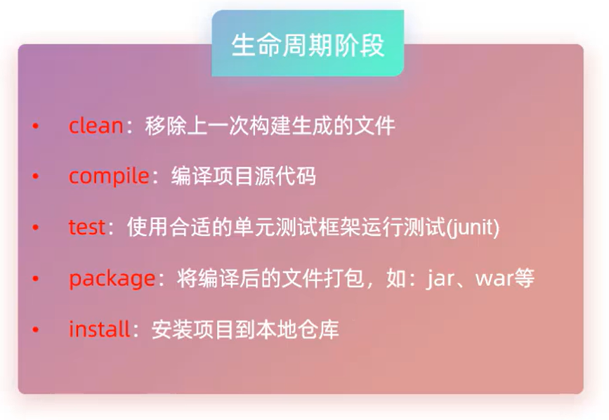
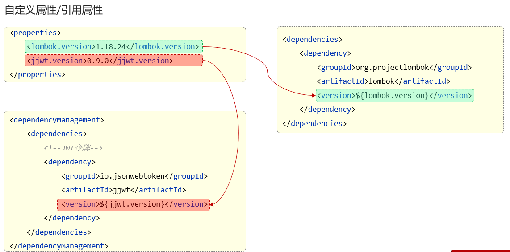
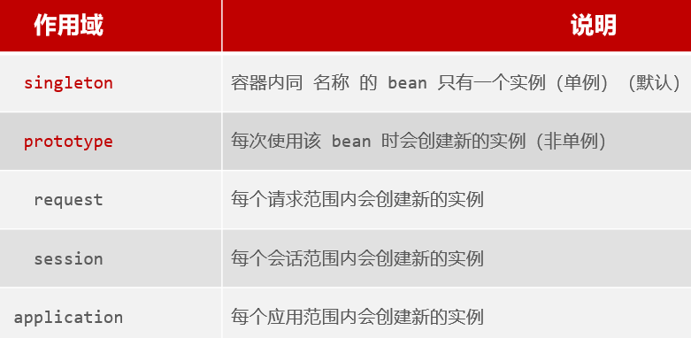
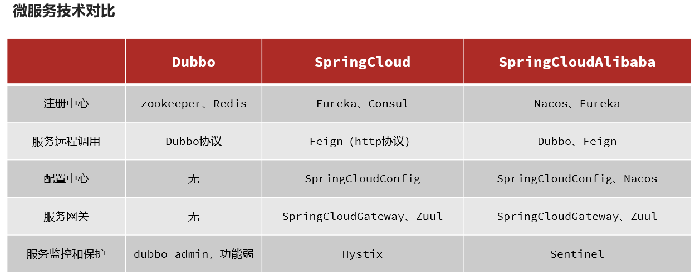
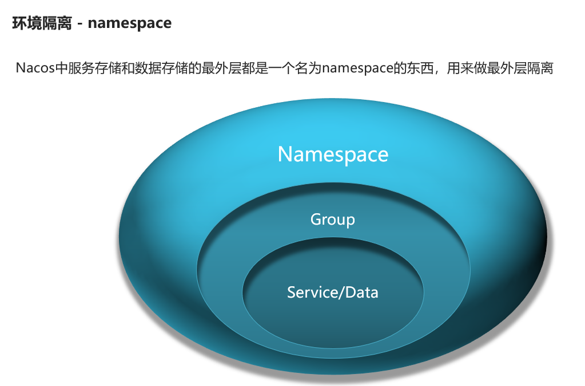
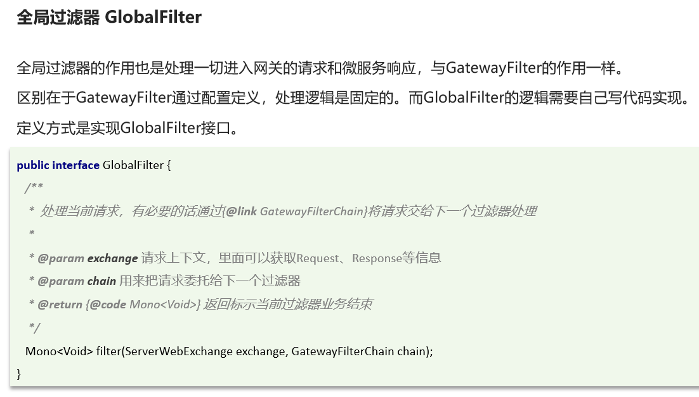

# JavaWeb

---

> 三大组件：Servlet、Filter、Listener

# Maven

> Maven是apache旗下的一个开源项目，是一款用于管理和构建java项目的工具，它基于项目对象模型(POM)的概念，通过一小段描述信息来管理项目的构建。

功能：

- 依赖管理：方便快捷的管理项目依赖的资源(jar包)，避免版本冲突问题

- 统一的项目结构：提供标准、统一的项目结构

    

- 标准的项目构建流程：标准跨平台(Linux、Windows、Macos)的自动化项目构建方式


> 仓库:用于存储资源，管理各种jar包。
>
> - 本地仓库:自己计算机上的一个目录。
> - 中央仓库:由Maven团队维护的全球唯一的。仓库地址:https://repo1.maven.org/maven2/
> - 远程仓库(私服):一般由公司团队搭建的私有仓库。

1. 坐标：Maven 中的坐标是资源的唯一标识，通过该坐标可以唯一定位资源位置

    1. 使用坐标来定义项目或引入项目中需要的依赖。
    2. 主要组成
        - groupId:定义当前Maven项目隶属组织名称(通常是域名反写)
        - artifactld:定义当前Maven项目名称(通常是模块名称)
        - version:定义当前项目版本号

2. 依赖管理

    1. 依赖配置

        - 依赖：指当前项目运行所需要的jar包，一个项目中可以引入多个依赖。
        - 配置：
            - 在 pom.xml中编写`<dependencies>`标签
            - 在`<dependencies>`标签中使用`<dependency>`引入坐标
            - 定义坐标的 groupld，artifactld，version
            - 点击刷新按钮，引入最新加入的坐标

    2. 依赖传递

        - 直接依赖:在当前项目中通过依赖配置建立的依赖关系
        - 间接依赖:被依赖的资源如果依赖其他资源，当前项目间接依赖其他资源
        - 排除依赖:主动断开依赖的资源，被排除的资源无需指定版本
            - 在`<dependency>`标签中使用`<exclusions>`标签
            - 在`<exclusions>`标签中使用`<exclusion>`标签
            - 定义 groupld，artifactld
            - 点击刷新按钮，引入最新加入的坐标

    3. 依赖范围

        - 依赖的jar包，默认情况下，可以在任何地方使用。

        - 可以通过`<scope>..</ scope>`设置其作用范围。

            - 主程序范围有效。(main文件夹范围内)
            - 测试程序范围有效。(test文件夹范围内)
            - 是否参与打包运行。(package指令范围内)

            

3. 生命周期：为了对所有的maven项目构建过程进行抽象和统一

    Maven中有3套相互独立的生命周期:

    - clean:清理工作
    - default:核心工作，如:编译、测试、打包、安装、部署等
    - site:生成报告、发布站点等

    

    

    > 在**同一套生命周期中**，当运行后面的阶段时，前面的阶段都会运行。

4. 继承

    - 继承描述的是两个工程间的关系，与java中的继承相似，子工程可以继承父工程中的配置信息，常见于依赖关系的继承。

    - 作用：简化依赖配置、统一管理依赖

    - 实现

        ```xml
        <parent>
            <groupId></groupId>
            <artifactId></artifactId>
            <version></version> 
            <relativePath></relativePath>	<!--pom文件的相对路径-->
        </parent>
        ```

    - 只能单继承 

    - 使用`<packaging>pom</packaging>`打包为pom文件

        > jar：普通模块打包，springboot项目基本都是jar包(内嵌tomcat运行)
        >
        > war：普通web程序打包，需要部署在外部的tomcat服务器中运行
        >
        > pom：父工程或聚合工程，该模块不写代码，仅进行依赖管理

    - 在子工程中，配置了继承关系之后，坐标中的groupId是可以省略的，因为会自动继承父工程的

    - relativePath指定父工程的pom文件的相对位置(如果不指定，将从本地仓库/远程仓库查找该工程)

    - 若父子工程都配置了同一个依赖的不同版本，以子工程的为准

5. 版本锁定

    - 在maven中，可以在父工程的pom文件中通过 `<dependencyManagement> `来统一管理依赖版本

        > `<dependencies> `是直接依赖,在父工程配置了依赖,子工程会直接继承下来。 
        >
        > `<dependencyManagement> `是统一管理依赖版本,不会直接依赖，还需要在子工程中引入所需依赖(无需指定版本)

    - 子工程引入依赖时，无需指定 `<version> `版本号，父工程统一管理。变更依赖版本，只需在父工程中统一变更。

    - 

    - 

6. 聚合

    > 聚合
    >
    >    将多个模块组织成一个整体，同时进行项目的构建。
    >
    > 聚合工程
    >
    >    一个不具有业务功能的“空”工程（有且仅有一个pom文件）
    >
    > 作用
    >
    >    快速构建项目（无需根据依赖关系手动构建，直接在聚合工程上构建即可）

    - maven中可以通过` <modules>` 设置当前聚合工程所包含的子模块名称

    - ```xml
        <!--聚合-->
        <modules>
            <module></module>
        </modules>
        ```

    - 聚合工程中所包含的模块，在构建时，会自动根据模块间的依赖关系设置构建顺序，与聚合工程中模块的配置书写位置无关。

7. 

8. 私服配置

    使用私服，需要在maven的settings.xml配置文件中，做如下配置：

    1. 需要在 **servers** 标签中，配置访问私服的个人凭证(访问的用户名和密码)

        ```xml
        <server>
            <id>maven-releases</id>
            <username>admin</username>
            <password>admin</password>
        </server>
            
        <server>
            <id>maven-snapshots</id>
            <username>admin</username>
            <password>admin</password>
        </server>
        ```

        

    2. 在 **mirrors** 中只配置我们自己私服的连接地址(如果之前配置过阿里云，需要直接替换掉)

        ```xml
        <mirror>
            <id>maven-public</id>
            <mirrorOf>*</mirrorOf>
            <url>http://192.168.150.101:8081/repository/maven-public/</url>
        </mirror>
        ```

        

    3. 需要在 **profiles** 中，增加如下配置，来指定snapshot快照版本的依赖，依然允许使用

        ```xml
        <profile>
            <id>allow-snapshots</id>
                <activation>
                	<activeByDefault>true</activeByDefault>
                </activation>
            <repositories>
                <repository>
                    <id>maven-public</id>
                    <url>http://192.168.150.101:8081/repository/maven-public/</url>
                    <releases>
                    	<enabled>true</enabled>
                    </releases>
                    <snapshots>
                    	<enabled>true</enabled>
                    </snapshots>
                </repository>
            </repositories>
        </profile>
        ```

        

    4. 如果需要上传自己的项目到私服上，需要在项目的pom.xml文件中，增加如下配置，来配置项目发布的地址(也就是私服的地址)

        ```xml
        <distributionManagement>
            <!-- release版本的发布地址 -->
            <repository>
                <id>maven-releases</id>
                <url>http://192.168.150.101:8081/repository/maven-releases/</url>
            </repository>
            
            <!-- snapshot版本的发布地址 -->
            <snapshotRepository>
                <id>maven-snapshots</id>
                <url>http://192.168.150.101:8081/repository/maven-snapshots/</url>
            </snapshotRepository>
        </distributionManagement>
        ```

        

    5. 发布项目，直接运行 deploy 生命周期即可 (发布时，建议跳过单元测试)


# Tomcat


# Spring

> Spring 是一个开源的 Java 框架，用于构建企业级 Java 应用程序。它包含了多种模块，如 IOC、AOP、JDBC、MVC、Security 等，这些模块可以帮助开发者快速构建健壮、灵活且易于维护的系统。Spring 的核心技术是控制反转（Inversion of Control，IoC）和面向切面编程（Aspect-Oriented Programming，AOP），它允许开发者通过依赖注入(Dependency Injection）)的方式避免硬编码对象间的依赖关系，并通过面向切面的编程提高系统的可维护性和安全性。
>
> **Spring平台的主要组件：**
>
> 1. **Spring Core Container:** 提供了Spring框架的基础，包括IoC容器和依赖注入。
> 2. **Spring AOP (Aspect-Oriented Programming):** 提供了面向切面编程的支持，可以更容易地管理横切关注点，如事务管理、日志记录等。
> 3. **Spring Data Access:** 提供了用于数据访问的抽象层，简化了数据库访问和事务管理。
> 4. **Spring MVC:** 一个基于模型-视图-控制器（MVC）的Web框架，用于构建Web应用程序。
> 5. **Spring Security:** 用于身份验证和授权的安全框架。
> 6. **Spring Boot:** 一个用于快速构建基于Spring的应用程序的项目。它简化了Spring应用程序的配置和部署，提供了默认配置，以便快速启动项目。
> 7. **Spring Cloud:**Spring Cloud是构建分布式系统的一套工具和框架，基于Spring Boot提供了一系列的解决方案，用于处理分布式系统中的常见问题，如配置管理、服务注册与发现、负载均衡、断路器模式、消息总线等。Spring Cloud是在Spring Boot的基础上构建的，旨在简化构建分布式系统的复杂性，支持微服务架构。
> 8. **Spring Framework:**Spring Framework是Spring的基础。Spring Framework是一个全面的Java应用程序开发框架，提供了广泛的基础设施支持，包括依赖注入（Dependency Injection），面向切面编程（Aspect-Oriented Programming），事务管理，数据访问等。它的设计目标是简化企业级Java应用程序的开发，提高应用程序的模块化、可维护性和可扩展性。
>
> Spring Framework是Spring的基础
>
> 


## SpringBoot

> Spring Boot 是 Spring 框架的一部分，但它并不是 Spring 本身。它是 Spring 社区为了简化 Spring 应用的初始搭建和开发过程而创造的工具。Spring Boot 使用特定的方式来进行配置，使得开发人员不再需要定义样板化的配置。它消除了设置 Spring 应用程序所需的复杂配置，并且提供了许多额外的便利，如嵌入式的 web 服务器、自动配置、健康检查等，这些都是为了简化开发人员的日常任务，让他们能够更加专注于应用程序的业务逻辑。
>
> **Spring Boot内置Tomcat**
>
> 
>
> Springboot项目的静态资源(html,css,js等前端资源)默认存放目录为:`classpath:/static`、`classoath:/public`、`classpath:/resources`
>
> 
>


### 自定义starter起步依赖

1. 创建 xxx-spring-boot-starter 模块
2. 创建 xxx-spring-boot-autoconfigure 模块，在starter中引入该模块
3. 在 xxx-spring-boot-autoconfigure 模块中的定义自动配置功能，并定义自动配置文件 META-INF/spring/xxxx.imports


### Bean管理

> IOC容器对象为`ApplicationContext`类型

- **获取bean**

默认情况下，Spring项目启动时，会把bean都创建好放在IOC容器中(默认的单例非延迟加载的bean)，如果想要主动获取这些bean，可以通过如下方式：


- **作用域**

Spring支持五种作用域，后三种在web环境才生效：



**可以通过 `@Scope("domain")` 注解来进行配置作用域**

默认singleton的bean，在容器启动时被创建，可以使用@Lazy注解来延迟初始化（延迟到第一次使用时）。

prototype的bean，每一次使用该bean的时候都会创建一个新的实例。

实际开发当中，绝大部分的Bean是单例的，也就是说绝大部分Bean不需要配置scope属性。

- **第三方bean**

如果要管理的bean对象来自于第三方(不是自定义的)，是无法用 @Component及衍生注解声明bean的，就需要用到 @Bean注解。Spring 容器会在初始化时调用将方法返回的实例注册为一个 Bean。

通过@Bean注解的name或value属性可以声明bean的名称，如果不指定，默认bean的名称就是方法名。

如果第三方bean需要依赖其它bean对象，直接在bean定义方法中设置形参即可，容器会根据类型自动装配。

若要管理的第三方bean对象，建议对这些bean进行集中分类配置，可以通过 @Configuration 注解声明一个**配置类**。

```java
// 方法一：配置类
@Configuration
public class CommonConfig {
    @Bean 
    public SAXReader saxReader(){
        return new SAXReader();
    }
}

// 方法二：启动类
@SpringBootApplication
public class SpringbootWebConfig2Application {
    @Bean //将方法返回值交给IOC容器管理,成为IOC容器的bean对象
    public SAXReader saxReader(){
        return new SAXReader();
    }
}
```


### 自动配置

SpringBoot的自动配置就是当spring容器启动后，一些配置类、bean对象就自动存入到了IOC容器中，不需要我们手动去声明，从而简化了开发，省去了繁琐的配置操作。

使用`@Import`导入的类会被Spring加载到IOC容器中，导入形式主要有以下几种：

- 导入 普通类
- 导入 配置类(类中为`@Bean`注解的方法)
- 导入 ImportSelector 接口的实现类(实现类的selectImports方法返回值为要导入的全类名数组)
- 导入**`@EnableXxxx`注解，这是第三方自定义的注解，其中封装@Import注解** 

**条件配置@Conditional**

- 作用：按照一定的条件进行判断，在满足给定条件后才会注册对应的bean对象到Spring IOC容器中。

- 位置：方法、类

- @Conditional 本身是一个父注解，派生出大量的子注解：

    - @ConditionalOnClass：判断环境中是否有对应字节码文件，才注册bean到IOC容器。

    - @ConditionalOnMissingBean：判断环境中没有对应的bean（类型 或 名称） ，才注册bean到IOC容器。

        value属性指定类型，name属性指定名称

    - @ConditionalOnProperty：判断配置文件中有对应属性和值，才注册bean到IOC容器。


### @SpringBootApplication

- 该注解标识在SpringBoot工程引导类上，是SpringBoot中最重要的注解。该注解由三个部分组成：
    - @SpringBootConfiguration：该注解与 @Configuration 注解作用相同，用来声明当前也是一个配置类。
    - @ComponentScan：组件扫描，默认扫描当前引导类所在包及其子包。
    - @EnableAutoConfiguration：SpringBoot实现自动化配置的核心注解。


### 配置文件

> application.properties文件与application.yml文件同理
>
> SpringBoot 除了支持配置文件属性配置，还支持Java系统属性和命令行参数的方式进行属性配置。
>
> >  优先级(低到高)
> >
> > - application.yaml（忽略）
> > - application.yml
> > - application.properties
> > - java系统属性（-Dxxx=xxx）
> > - 命令行参数（--xxx=xxx）

```properties
spring.datasource.driver-class-name=com.mysql.cj.jdbc.Driver
spring.datasource.url=jdbc:mysql://ip:port/dbname
spring.datasource.username=username
spring.datasource.password=password

# 可选
# 指定mybatis输出日志的位置,输出控制台
mybatis.configuration.log-impl=org.apache.ibatis.logging.stdout.StdOutImpl
# 开启mybatis的驼峰命名自动映射开关	a_column------> aColumn
mybatis.configuration.map-underscore-to-camel-case=true
# 配置单个文件最大上传大小
spring.servlet.multipart.max-file-size=10MB
# 配置单个请求最大上传大小(一次请求可以上传多个文件)
spring.servlet.multipart.max-request-size=100MB
# 事务管理日志
logging.level.org.springframework.jdbc.support.JdbcTransactionManager=debug
```

> 虽然springboot支持多种格式配置文件，但是在项目开发时，推荐统一使用一种格式的配置 （yml是主流）。


### 请求

> ```java
> // 映射 HTTP 请求路径和方法，可以用在控制器类和方法上，用于定义请求路径和处理方法。
> @RequestMapping(value = "path", method = RequestMethod.XXX)
> @GetMapping ("path")
> @PostMapping ("path")
> @PutMapping ("path")
> @DeleteMapping ("path")
> 
> // 从 HTTP 请求中获取请求参数的值，并将其绑定到方法的参数上
> @RequestParam(name = "requestname", required = boolean, defaultValue = "defaultvalue", )
> ```
>
> **特殊类**
>
> - `MultipartFile`：接收文件，形参名要与表单中的元素名一致否则需使用`@RequestParam`注解
>
>     ```java
>     String getOriginalFilename(); //获取原始文件名
>     void transferTo(File dest); //将接收的文件转存到磁盘文件中
>     long getSize(); //获取文件的大小，单位:字节
>     byte[] getBytes(); //获取文件内容的字节数组
>     InputStream getlnputStream(); //获取接收到的文件内容的输入流
>     ```

1. 简单参数

    - 参数名与形参变量名相同，定义形参即可接收参数。

        ```java
        // http://localhost:8080/simpleParam?name=Tom&age=10
        
        @RestController
        public class RequestController {
        
            @RequestMapping("/simpleParam")
            public String simpleParam(String name, Integer age) {
                System.out.println(name + ":" + age);
                return "OK";
            }
        }
        ```

    - 如果方法形参名称与请求参数名称不匹配，可以使用 @RequestParam 完成映射。

        ```java
        // http://localhost:8080/simpleParam?name=Tom&age=10
        
        @RestController
        public class RequestController {
        
            @RequestMapping("/simpleParam")
            public String simpleParam(@RequestParam(name = "name") String username, Integer age) {
                System.out.println(username + ":" + age);
                return "OK";
            }
        }
        ```

        > @RequestParam中的required属性默认为true，代表该请求参数必须传递，如果不传递将报错。如果该参数是可选的，可以将required属性设置为false。

2. 实体参数

    - 简单实体参数：请求参数名与形参对象属性名相同，定义POJO接收即可

        ```java
        // http://localhost:8080/simplePojo?name=Tom&age=16
        
        // User.java
        public class User {
            private String name;
            private Integer age;
        
            public String getName() {
                return name;
            }
        
            public void setAge(Integer age) {
                this.age = age;
            }
        
            public Integer getAge() {
                return age;
            }
        
            @Override
            public String toString() {
                return "User{" +
                        "name='" + name + '\'' +
                        ", age=" + age +
                        '}';
            }
        
            public void setName(String name) {
                this.name = name;
            }
        
            public User() {
            }
        
            public User(String name, Integer age) {
                this.name = name;
                this.age = age;
            }
        }
        
        // controller
        @RestController
        public class RequestController {
            @RequestMapping("/simplePojo")
            public String simplePojo(User user){
                System.out.println(user);
                return "OK";
            }
        }
        ```

    - 复杂实体对象:请求参数名与形参对象属性名相同，按照对象层次结构关系即可接收嵌套POI0属性参数。

        ```java
        // http://localhost:8080/complexPojo?name=Tom&age=10&address.province=beijing&address.city=beijing
        
        // User.java
        public class User {
            private String name;
            private Integer age;
        
            private Address address;
        
            public Address getAddress() {
                return address;
            }
        
            public void setAddress(Address address) {
                this.address = address;
            }
        
            public String getName() {
                return name;
            }
        
            @Override
            public String toString() {
                return "User{" +
                        "name='" + name + '\'' +
                        ", age=" + age +
                        ", address=" + address +
                        '}';
            }
        
            public void setAge(Integer age) {
                this.age = age;
            }
        
            public Integer getAge() {
                return age;
            }
        
            public void setName(String name) {
                this.name = name;
            }
        
            public User() {
            }
        
            public User(String name, Integer age) {
                this.name = name;
                this.age = age;
            }
        }
        
        // Address.java
        public class Address {
            private String province;
            private String city;
        
            @Override
            public String toString() {
                return "Address{" +
                        "province='" + province + '\'' +
                        ", city='" + city + '\'' +
                        '}';
            }
        
            public String getProvince() {
                return province;
            }
        
            public void setProvince(String province) {
                this.province = province;
            }
        
            public String getCity() {
                return city;
            }
        
            public void setCity(String city) {
                this.city = city;
            }
        }
        
        // controller
        @RestController
        public class RequestController {
            @RequestMapping("/complexPojo")
            public String complexPojo(User user){
                System.out.println(user);
                return "OK";
            }
        }
        ```

3. 数组集合参数

    - 数组参数：请求参数名与形参数组名称相同且请求参数为多个，定义数组类型形参即可接收参数

        ```java
        // http://localhost:8080/arrayParam?hobby=game&hobby=java&hobby=sing
        
        @RequestMapping("/arrayParam")
            public String arrayParam(String[] hobby){
                System.out.println(Arrays.toString(hobby));
                return "OK";
            }
        ```

    - 集合参数：请求参数名与形参集合名称相同且请求参数为多个，@RequestParam 绑定参数关系

        ```java
        // http://localhost:8080/listParam?hobby=game&hobby=java&hobby=sing
        
        @RequestMapping("/listParam")
            public String listParam(@RequestParam List<String> hobby){
                System.out.println(Arrays.toString(hobby.toArray()));
                return "OK";
            }
        ```

4. 日期参数：使用 @DateTimeFormat 注解完成日期参数格式转换

    ```java
    // http://localhost:8080/dateParam?updateTime=2022-12-12 10:05:45
    
     @RequestMapping("/dateParam")
        public String dateParam(@DateTimeFormat(pattern = "yyyy-MM-dd HH:mm:ss") LocalDateTime updateTime) {
            System.out.println(updateTime);
            return "OK";
        }
    ```

5. JSON参数：JSON数据键名与形参对象属性名相同，定义POJO类型形参即可接收参数，需要使用 @RequestBody 标识

    ```java
    /*
    http://localhost:8080/jsonParam
    
    {
        "name": "TOM",
        "age": 10,
        "address": {
            "province": "Beijing",
            "city": "Beijing"
        }
    }
    */
    
    @RequestMapping("/jsonParam")
        public String jsonParam(@RequestBody User user) {
            System.out.println(user);
            return "OK";
        }
    ```

6. 路径参数：通过请求URL直接传递参数，使用{...}来标识该路径参数，需要使用 @PathVariable 获取路径参数

    ```java
    // http://localhost:8080/path/1/Tom
    
    @RequestMapping("/path/{id}/{name}")
        public String pathParam(@PathVariable Integer id, @PathVariable String name) {
            System.out.println(id + ":" + name);
            return "OK";
        }
    ```


### 响应


```java
public class Result {
    private Integer code;
    private String msg;
    private Object data;

    public Result(Integer code, String msg, Object data) {
        this.code = code;
        this.msg = msg;
        this.data = data;
    }

    public Result() {
    }

    public Integer getCode() {
        return code;
    }

    public void setCode(Integer code) {
        this.code = code;
    }

    public String getMsg() {
        return msg;
    }

    public void setMsg(String msg) {
        this.msg = msg;
    }

    public Object getData() {
        return data;
    }

    public void setData(Object data) {
        this.data = data;
    }

    public static Result success(Object data) {
        return new Result(1, "success", data);
    }

    public static Result success() {
        return new Result(1, "success", null);
    }

    public static Result success(String msg) {
        return new Result(1, msg, null);
    }

    @Override
    public String toString() {
        return "Result{" +
                "code=" + code +
                ", msg='" + msg + '\'' +
                ", data=" + data +
                '}';
    }
```


### 三层架构


1. controller:控制层，接收前端发送的请求，对请求进行处理，并响应数据。
2. service:业务逻辑层，处理具体的业务逻辑。
3. dao:数据访问层(Data Access Object)(持久层)，负责数据访问操作，包括数据的增、删、改、查


### IOC & DI

> 控制反转: Inversion Of Control，简称IOC。对象的创建控制权由程序自身转移到外部(容器)，这种思想称为控制反转。
>
> 依赖注入: Dependency Injection，简称DI。容器为应用程序提供运行时所依赖的资源，称之为依赖注入。
>
> Bean对象:IOC容器中创建、管理的对象，称之为bean，名称默认为类名首字母小写
>

1. 将当前类交给IOC容器管理，成为IOC容器中的bean

    

    声明bean的时候，可以通过value属性指定bean的名字，如果没有指定，默认为类名首字母小写。
    使用以上四个注解都可以声明bean，但是在springboot集成web开发中，声明控制器bean只能用@Controller。

2. Bean组件扫描

    前面声明bean的四大注解要想生效，还需要被组件扫描注解`@ComponentScan`扫描。

    `@ComponentScan`注解虽然没有显式配置，但是实际上已经包含在了启动类声明注解`@SpringBootApplication`中，默认扫描的范围是启动类所在包及其子包。

3. `@Autowired`

    运行时，IOC容器会提供 该类型的bean对象，并赋值给该变量

    默认是按照类型进行，如果存在多个相同类型的bean将会报错

    解决方法：

    - `@Primary`：加在`@Component`及其衍生注解前设定优先级
    - `@Qualifier(className)`：加在`@Autowired`注解后指定实现类
    - `@Resource(name = "className")`：直接使用该注解指定类名(该注解由JDK提供而不是Spring框架)

    `@Autowired`默认是按照类型注入，而`@Resource`默认是按照名称注入。


### 配置注入

- 使用`application.properties`文件或`application.yml`文件

- `@Value` 注解通常用于外部配置的属性注入，具体用法为:`@Value("${配置文件中的key}")`

- `@ConfigurationProperties(prefix = "prefixpath")`可以自动将配置文件中对应的值注入到被注解的类/接口中的同名成员变量，要求变量名同名且被IOC容器管理

    ```xml
    <dependency>
        <groupId>org.springframework.boot</groupId>
        <artifactId>spring-boot-configuration-processor</artifactId>
    </dependency>
    ```


### 校验


- **会话技术**

    > - 会话：用户打开浏览器访问web服务器的资源，会话建立，直到有一方断开连接，会话结束。在一次会话中可以包含多次请求和响应。
    >
    > - 会话跟踪：一种维护浏览器状态的方法，服务器需要识别多次请求是否来自于同一浏览器，以便在同一次会话的多次请求间共享数据。
    >
    >     - 客户端会话跟踪技术:Cookie
    >
    >         
    >
    >     - 服务端会话跟踪技术:Session
    >
    >         
    >
    >     - 令牌技术
    >
    >         

    - **JWT令牌**

        > 全称:JSON Web Token
        >
        > 定义了一种简洁的、自包含的格式，用于在通信双方以json数据格式安全的传输信息。由于数字签名的存在，这些信息是可靠的。
        >
        > **组成**
        >
        > - 第一部分：Header(头）， 记录令牌类型、签名算法等。 例如：{"alg":"HS256","type":"JWT"}
        > - 第二部分：Payload(有效载荷），携带一些自定义信息、默认信息等。 例如：{"id":"1","username":"Tom"}
        > - 第三部分：Signature(签名），防止Token被篡改、确保安全性。将header、payload，并加入指定秘钥，通过指定签名算法计算而来。

        ```xml
        <dependency>
            <groupId>io.jsonwebtoken</groupId>
            <artifactId>jjwt</artifactId>
            <version>0.9.1</version>
        </dependency>
        ```

        ```java
        public void genJWT() {
                Map<String, Object> claims = new HashMap<>();
                claims.put("id", 1);
                claims.put("name", "Tom");
                String jwt = Jwts.builder()
                        .signWith(SignatureAlgorithm.HS256, "secret_key")   //签名算法
                        .setClaims(claims)  //载荷
                        .setExpiration(new Date(System.currentTimeMillis() + 3000 * 1000))  //有效期
                        .compact();
            }
        
        public void parseJWT(String jwt) {
                Claims body = Jwts.parser()
                        .setSigningKey("secret_key")
                        .parseClaimsJws(jwt)
                        .getBody();
            }
        ```

        JWT校验时使用的签名秘钥，必须和生成JWT令牌时使用的秘钥是配套的。

        如果JWT令牌解析校验时报错，则说明JWT令牌被篡改或失效了，令牌非法。

    - **Filter过滤器**

        > 过滤器可以把对资源的请求拦截下来，从而实现一些特殊的功能。
        >
        > 过滤器一般完成一些通用的操作，比如：登录校验、统一编码处理、敏感字符处理等。

        1. 定义Filter：定义一个类，实现 Filter 接口，并重写其所有方法。
        2. 配置Filter：Filter类上加 @WebFilter 注解，配置拦截资源的路径。引导类上加 @ServletComponentScan 开启Servlet组件支持。

        ```java
        @WebFilter(urlPatterns = "/*")
        public class DemoFilter implements Filter {
        
            @Override   // 初始化方法
            public void init(FilterConfig filterConfig) throws ServletException {
                Filter.super.init(filterConfig);
            }
        
            @Override   // 拦截逻辑
            public void doFilter(ServletRequest servletRequest, ServletResponse servletResponse, FilterChain filterChain) throws IOException, ServletException {
        		// 放行前逻辑
                
                // 放行
                HttpServletRequest req = (HttpServletRequest) servletRequest;
                HttpServletResponse resp = (HttpServletResponse) servletResponse;
                String url = req.getRequestURL().toString();
                if (url.contains("login")) {
                    filterChain.doFilter(servletRequest, servletResponse);
                    return;
                } else {
                    String jwt = req.getHeader("token");
                    if (!StringUtils.hasLength(jwt)) {
                        Result error = Result.error("NOT_LOGIN");
                        String notLogin = JSONObject.toJSONString(error);
                        resp.getWriter().write(notLogin);
                        return;
                    } else {
                        try {
                            JwtUtils.parseJWT(jwt);
                        } catch (Exception e) {
                            e.printStackTrace();
                            Result error = Result.error("NOT_LOGIN");
                            String notLogin = JSONObject.toJSONString(error);
                            resp.getWriter().write(notLogin);
                            return;
                        }
                        filterChain.doFilter(servletRequest, servletResponse);
                    }
                }
                
                // 放行后逻辑
                
            }
        
            @Override   // 销毁方法
            public void destroy() {
                Filter.super.destroy();
            }
        }
        
        @ServletComponentScan
        @SpringBootApplication
        public class ExampleApplication {
        
            public static void main(String[] args) {
                SpringApplication.run(ExampleApplication.class, args);
            }
        
        }
        
        
        ```

        3. 拦截路径

            

        4. 过滤器链

            一个web应用中，可以配置多个过滤器，这多个过滤器就形成了一个过滤器链。

            顺序：注解配置的Filter，优先级是按照过滤器类名（字符串）的自然排序。

            

    - **Interceptor拦截器**

        > 一种动态拦截方法调用的机制，类似于过滤器。Spring框架中提供的，用来动态拦截控制器方法的执行。
        >
        > 作用：拦截请求，在指定的方法调用前后，根据业务需要执行预先设定的代码。

        1. 定义拦截器，实现HandlerInterceptor接口，并重写其所有方法。

            ```java
            @Component
            public class LoginCheckInterceptor implements HandlerInterceptor {
                @Override   // 目标资源方法执行前执行，放回true：放行，返回false：不放行
                public boolean preHandle(HttpServletRequest request, HttpServletResponse response, Object handler) throws Exception {
                    String url = request.getRequestURL().toString();
                    if (url.contains("login")) {
                        return true;
                    } else {
                        String jwt = request.getHeader("token");
                        if (!StringUtils.hasLength(jwt)) {
                            Result error = Result.error("NOT_LOGIN");
                            String notLogin = JSONObject.toJSONString(error);
                            response.getWriter().write(notLogin);
                            return false;
                        } else {
                            try {
                                JwtUtils.parseJWT(jwt);
                            } catch (Exception e) {
                                e.printStackTrace();
                                Result error = Result.error("NOT_LOGIN");
                                String notLogin = JSONObject.toJSONString(error);
                                response.getWriter().write(notLogin);
                                return false;
                            }
                            return true;
                        }
                    }
                }
            
                @Override   // 目标资源方法执行后执行
                public void postHandle(HttpServletRequest request, HttpServletResponse response, Object handler, ModelAndView modelAndView) throws Exception {
            //        HandlerInterceptor.super.postHandle(request, response, handler, modelAndView);
                }
            
                @Override   // 视图渲染完毕后执行，最后执行
                public void afterCompletion(HttpServletRequest request, HttpServletResponse response, Object handler, Exception ex) throws Exception {
            //        HandlerInterceptor.super.afterCompletion(request, response, handler, ex);
                }
            }
            ```

        2. 注册拦截器

            ```java
            @Configuration
            public class WebConfig implements WebMvcConfigurer {
            
                @Autowired
                private LoginCheckInterceptor loginCheckInterceptor;
            
                @Override
                public void addInterceptors(InterceptorRegistry registry) {
                    registry.addInterceptor(loginCheckInterceptor)
                            .addPathPatterns("/**")
                            .excludePathPatterns("/login");
                }
            }
            ```

        3. 拦截路径

            

    - 过滤器与拦截器执行流程

        

        > **差异**
        >
        > - 接口规范不同：过滤器需要实现Filter接口，而拦截器需要实现HandlerInterceptor接口。
        > - 拦截范围不同：过滤器Filter会拦截所有的资源，而Interceptor只会拦截Spring环境中的资源。


### 异常处理


```java
@RestControllerAdvice
public class GlobalExceptionHandler {

    @ExceptionHandler(Exception.class)
    public Result ex(Exception ex) {
        ex.printStackTrace();
        return Result.error("Error");
    }
}
```

> @RestControllerAdvice = @ControllerAdvice + @ResponseBody


### 事务管理 

> 事务是一组操作的集合，它是一个不可分割的工作单位，这些操作 要么同时成功，要么同时失败。

**`@Transactional`**

- 位于业务（service）层的方法上、类上、接口上

- 将当前方法交给spring进行事务管理，方法执行前，开启事务；成功执行完毕，提交事务；出现异常，回滚事务

- 默认情况下，只有出现 RuntimeException 才回滚异常

- `rollbackFor`属性用于控制出现何种异常类型使回滚事务。

- `propagation`属性控制传播行为

    > l事务传播行为：指的就是当一个事务方法被另一个事务方法调用时，这个事务方法应该如何进行事务控制。

    


### AOP

> AOP：Aspect Oriented Programming（面向切面编程、面向方面编程），其实就是面向特定方法编程。
>
> 动态代理是面向切面编程最主流的实现。而SpringAOP是Spring框架的高级技术，旨在管理bean对象的过程中，主要通过底层的动态代理机制，对特定的方法进行编程。
>
> 

```xml
<dependency>
    <groupId>org.springframework.boot</groupId>
    <artifactId>spring-boot-starter-aop</artifactId>
</dependency>
```

```java
@Component
@Aspect
public class TimeAspect {
    @Around("execution(* packagename.ClassName.methodName(..)")
    public Object recordTime(ProceedingJoinPoint joinPoint) throws Throwable {
        // 调用原始方法前逻辑

        // 调用原始方法
        Object result = joinPoint.proceed();
        // 调用原始方法后逻辑

        return result;
    }
}
```

1. 通知类型

    - @Around：环绕通知，此注解标注的通知方法在目标方法前、后都被执行

        @Around环绕通知需要自己调用 ProceedingJoinPoint.proceed() 来让原始方法执行，其他通知不需要考虑目标方法执行

        @Around环绕通知方法的返回值，必须指定为Object，来接收原始方法的返回值。

    - @Before：前置通知，此注解标注的通知方法在目标方法前被执行

    - @After ：后置通知，此注解标注的通知方法在目标方法后被执行，无论是否有异常都会执行

    - @AfterReturning ： 返回后通知，此注解标注的通知方法在目标方法后被执行，有异常不会执行

    - @AfterThrowing ： 异常后通知，此注解标注的通知方法发生异常后执行

2. `@PointCut`：该注解的作用是将公共的切点表达式抽取出来，需要用到时引用该切点表达式即可。

3. 通知顺序

    - 不同切面类中，默认按照切面类的类名字母排序
        - 目标方法前的通知方法：字母排名靠前的先执行
        - 目标方法后的通知方法：字母排名靠前的后执行
    - 用 `@Order(数字) `加在切面类上来控制顺序
        - 目标方法前的通知方法：数字小的先执行
        - 目标方法后的通知方法：数字小的后执行

4. 切点表达式

    - 描述切入点方法的一种表达式

    - 主要用来决定项目中的哪些方法需要加入通知

    - 常见形式：

        - `execution(……)`：根据方法的返回值、包名、类名、方法名、方法参数等信息来匹配

            - `execution(访问修饰符? 返回值 包名.类名.?方法名(方法参数) throws 异常?)`

                其中带 ? 的表示可以省略的部分

                - 访问修饰符：可省略（比如: public、protected）
                - 包名.类名： 可省略
                - throws 异常：可省略（注意是方法上声明抛出的异常，不是实际抛出的异常）

            - `*`：单个独立的任意符号，可以通配任意返回值、包名、类名、方法名、任意类型的一个参数，也可以通配包、类、方法名的一部分

            - `.. `：多个连续的任意符号，可以通配任意层级的包，或任意类型、任意个数的参数

            - 根据业务需要，可以使用 且（&&）、或（||）、非（!） 来组合比较复杂的切入点表达式。

            - 书写建议

                - 所有业务方法名在命名时尽量规范，方便切入点表达式快速匹配。如：查询类方法都是 find 开头，更新类方法都是 update开头。
                - 描述切入点方法通常基于接口描述，而不是直接描述实现类，增强拓展性。
                - 在满足业务需要的前提下，尽量缩小切入点的匹配范围。如：包名匹配尽量不使用 ..，使用 * 匹配单个包。

        - `@annotation(注解全类名)`：匹配标识有特定注解的方法

5. 连接点

    在Spring中用JoinPoint抽象了连接点，用它可以获得方法执行时的相关信息，如目标类名、方法名、方法参数等。

    ```java
    @Before("")
    public void before(JoinPoint joinPoint) {
        String className = joinPoint.getTarget().getClass().getName(); //获取目标类名
        Signature signature = joinPoint.getSignature(); //获取目标方法签名
        String methodName = joinPoint.getSignature().getName(); //获取目标方法名
        Object[] args = joinPoint.getArgs(); //获取目标方法运行参数 
    }
    
    @Around("")
    public Object around(ProceedingJoinPoint joinPoint) throws Throwable {
        String className = joinPoint.getTarget().getClass().getName(); //获取目标类名
        Signature signature = joinPoint.getSignature(); //获取目标方法签名
        String methodName = joinPoint.getSignature().getName(); //获取目标方法名
        Object[] args = joinPoint.getArgs(); //获取目标方法运行参数 
        Object res = joinPoint.proceed(); //执行原始方法,获取返回值（环绕通知）
        return res;
    }
    
    ```

    对于 @Around 通知，获取连接点信息只能使用 ProceedingJoinPoint

    对于其他四种通知，获取连接点信息只能使用 JoinPoint ，它是 ProceedingJoinPoint 的父类型


### 杂七杂八

- SpringBoot为什么可以自动注入`HttpServletRequest`

    > 1. **Servlet 容器的集成：** Spring Boot 应用程序通常运行在 Servlet 容器中，比如 Tomcat、Jetty 等。这些 Servlet 容器负责接收和处理客户端发起的 HTTP 请求，然后将请求转发给 Spring Boot 应用程序进行处理。由于 Spring Boot 应用程序运行在 Servlet 容器中，因此可以直接访问到 Servlet 容器中的请求对象，即 `HttpServletRequest`。
    > 2. **Spring 框架的集成：** Spring 框架具有依赖注入（DI）和控制反转（IOC）的特性，它能够管理和注入应用程序中的各种组件。Spring Boot 利用了 Spring 框架的这些特性，可以方便地在控制器、服务等组件中注入 `HttpServletRequest` 对象，从而方便地获取客户端发起的 HTTP 请求信息。
    > 3. **内置的默认配置：** Spring Boot 对于常见的 Web 开发场景提供了默认的配置和自动化的配置方式。在 Spring Boot 应用程序中，可以通过 `@Autowired` 注解来自动注入 `HttpServletRequest` 对象，而无需手动创建或配置它。Spring Boot 会根据应用程序的上下文环境和配置信息，自动将 `HttpServletRequest` 对象注入到需要的地方。


## SpringCloud

> 微服务是一种经过良好架构设计的**分布式**架构方案，微服务架构特征：
>
> - 单一职责：微服务拆分粒度更小，每一个服务都对应唯一的业务能力，做到单一职责，避免重复业务开发
> - 面向服务：微服务对外暴露业务接口
> - 自治：团队独立、技术独立、数据独立、部署独立
> - 隔离性强：服务调用做好隔离、容错、降级，避免出现级联问题
>
> > **单体架构特点？**
> >
> > - 简单方便，高度耦合，扩展性差，适合小型项目。例如：学生管理系统
> >
> > **分布式架构特点？**
> >
> > - 松耦合，扩展性好，但架构复杂，难度大。适合大型互联网项目，例如：京东、淘宝
> >
> > **微服务：一种良好的分布式架构方案**
> >
> > - 优点：拆分粒度更小、服务更独立、耦合度更低
> >
> >     -缺点：架构非常复杂，运维、监控、部署难度提高
>
> ### 微服务技术栈
>
> 
>
> 
>
> 

### RPC

#### RestTemplate

`RestTemplate` 是 Spring Framework 提供的用于访问 RESTful 服务的客户端工具。它简化了与 RESTful 服务的交互，并提供了许多便捷的方法来发送 HTTP 请求和处理响应。

`RestTemplat`需要使用第三方Bean导入的方法进行IOC管理

`RestTemplate` 支持各种 HTTP 方法，包括 GET、POST、PUT、DELETE 等，并且可以发送请求和接收响应的各种数据格式，比如 JSON、XML 等。它还提供了一系列方法来处理请求参数、请求头、响应体等。

以下是 `RestTemplate` 的一些常用功能：

1. **发送 GET 请求：**

    ```java
    ResponseEntity<String> response = restTemplate.getForEntity("http://example.com/api/resource", String.class);
    ```

2. **发送 POST 请求：**

    ```java
    ResponseEntity<String> response = restTemplate.postForEntity("http://example.com/api/resource", requestObject, String.class);
    ```

3. **发送 PUT 请求：**

    ```java
    restTemplate.put("http://example.com/api/resource/{id}", requestObject, id);
    ```

4. **发送 DELETE 请求：**

    ```java
    restTemplate.delete("http://example.com/api/resource/{id}", id);
    ```

5. **处理请求参数和请求头：**

    ```java
    HttpHeaders headers = new HttpHeaders();
    headers.setContentType(MediaType.APPLICATION_JSON);
    HttpEntity<String> requestEntity = new HttpEntity<>(requestJson, headers);
    ResponseEntity<String> response = restTemplate.exchange(url, HttpMethod.POST, requestEntity, String.class);
    ```

6. **处理响应体：**

    ```java
    ResponseEntity<MyObject> response = restTemplate.getForEntity(url, MyObject.class);
    MyObject responseBody = response.getBody();
    ```

通过 `RestTemplate`，开发者可以方便地访问 RESTful 服务，发送各种类型的请求，并处理响应数据。它简化了与 RESTful 服务的交互，提高了开发效率。


#### Feign

> Feign 是一个声明式、模板化的 HTTP 客户端，它使得编写 HTTP 客户端变得更加简单和优雅。Feign 是 Netflix 开源的一个项目，它与 Spring Cloud 紧密集成，可以帮助开发者在微服务架构中进行服务间的通信。
>
> 以下是 Feign 的一些主要特点和工作原理：
>
> 1. **声明式 API：** 使用 Feign 可以通过编写接口的方式来定义 HTTP 客户端的请求和响应。Feign 提供了一个注解式的编程模型，开发者只需要定义接口和方法，并添加相应的注解，而不需要编写具体的 HTTP 请求和处理逻辑。
> 2. **模板化请求：** 在 Feign 中，接口的方法对应于远程服务的 HTTP 请求。Feign 根据接口定义自动生成相应的 HTTP 请求，并执行请求发送到远程服务。开发者只需要调用接口的方法，Feign 会自动将方法参数转换为 HTTP 请求参数，并将响应结果转换为方法返回值。
> 3. **集成负载均衡：** Feign 与 Ribbon 负载均衡器紧密集成，可以通过 Ribbon 实现对服务实例的负载均衡。Feign 在发送 HTTP 请求时会自动选择可用的服务实例，并将请求发送到选定的实例上。
> 4. **服务发现：** Feign 可以与服务发现框架（如 Eureka、Consul 等）集成，自动从服务注册中心获取可用的服务实例列表。开发者只需要通过服务名来调用服务，Feign 会自动解析服务名并选择相应的服务实例。
> 5. **错误处理：** Feign 提供了丰富的错误处理机制，可以自定义异常处理逻辑，并将远程服务的错误信息转换为相应的异常抛出。

```xml
<dependency>
    <groupId>org.springframework.cloud</groupId>
    <artifactId>spring-cloud-starter-openfeign</artifactId> 
</dependency>
```

```java
@EnableFeignClients
@SpringBootApplication
```

```java
@FeignClient("xxxservice")
public interface XxxClient{
    @XxxMapping("path")
    method
}
```

1. 自定义配置

    

    1. 配置文件方式

        

    2. 代码方式

        

2. 连接池配置

    

3. 最佳实践

    

    
    
4. 


### Eureka注册中心

> Eureka 是 Netflix 开源的一个基于 REST 的服务发现框架，用于构建和管理微服务架构中的服务注册和发现。它可以帮助开发者构建弹性、高可用的微服务架构，实现服务之间的自动发现和负载均衡。
>
> 以下是 Eureka 的一些主要特点和工作原理：
>
> 1. **服务注册与发现：** 微服务启动时会向 Eureka 服务器注册自己的信息，包括服务名、IP 地址、端口等。其他服务可以通过 Eureka 服务器查询可用的服务列表，从而实现服务之间的自动发现。
> 2. **心跳检测：** Eureka 客户端会定期向 Eureka 服务器发送心跳以保持注册信息的最新状态。如果某个服务长时间未发送心跳，则会被视为不可用，Eureka 服务器将从注册列表中移除该服务。
> 3. **服务治理：** Eureka 提供了一些管理工具，用于监控、管理和维护微服务架构。开发者可以通过 Eureka 控制台查看注册的服务信息、查看服务健康状态、手动下线服务等。
> 4. **客户端负载均衡：** Eureka 客户端可以通过负载均衡算法选择可用的服务实例。当客户端向 Eureka 服务器请求服务列表时，Eureka 服务器会返回一个服务列表，客户端可以根据负载均衡策略选择其中一个服务实例进行调用。
> 5. **集群化部署：** Eureka 支持集群化部署，可以部署多个 Eureka 服务器构成一个高可用的集群，以提高系统的可靠性和容错性。
> 6. **与 Spring Cloud 集成：** Eureka 与 Spring Cloud 框架紧密集成，通过使用 Spring Cloud Netflix 提供的注解和配置，可以快速实现微服务架构中的服务注册和发现。
>
> 

1. Eureka服务搭建

```xml
<dependency>
    <groupId>org.springframework.cloud</groupId>
    <artifactId>spring-cloud-starter-netflix-eureka-server</artifactId>
    <version></version>
</dependency>
```

```yaml
server:
  port: 8081  # 服务端口
spring:
  application:
    name: eurekaserver  # eureka的服务名称
eureka:
  client:
    service-url:  # eureka的地址信息
      defaultZone: http://localhost:8081/eureka
```

```java
@EnableEurekaServer
@SpringBootApplication
public class EurekaApplication {
    public static void main(String[] args) {
        SpringApplication.run(EurekaApplication.class,args);
    }
}
```

2. Eureka服务注册

    ```xml
    <dependency>
        <groupId>org.springframework.cloud</groupId>
        <artifactId>spring-cloud-starter-netflix-eureka-client</artifactId>
    </dependency>
    ```

    ```yaml
    spring:
      application:
        name: userservice
    eureka:
      client:
        service-url:
          defaultZone: http://localhost:8081/eureka/
    ```

3. 服务拉取

    1. 修改访问的url路径，用服务名代替ip、端口
    2. 在第三方RestTemplate上添加负载均衡注解`@LoadBalanced`


### Ribbon负载均衡

> Ribbon 是 Netflix 开源的一个基于 HTTP 和 TCP 客户端的负载均衡器，用于在分布式系统中对服务实例进行负载均衡。它可以帮助开发者构建弹性、可靠的分布式系统，提高系统的可用性和性能。
>
> 以下是 Ribbon 的一些主要特点和工作原理：
>
> 1. **负载均衡：** Ribbon 通过在客户端进行负载均衡，将请求分发到多个服务实例中，从而实现了服务的高可用和高性能。它支持多种负载均衡算法，包括轮询、随机、加权轮询等。
> 2. **服务发现：** Ribbon 可以与服务发现框架（如 Eureka、Consul 等）集成，动态地从服务注册中心获取可用的服务实例列表，实现了服务的自动发现和注册。
> 3. **健康检查：** Ribbon 支持对服务实例的健康检查，可以定期向服务实例发送心跳检测请求，检测服务实例的健康状态，并将不可用的服务实例从负载均衡池中移除。
> 4. **超时和重试：** Ribbon 支持设置请求的超时时间和重试次数，可以处理网络延迟、故障和错误，提高系统的稳定性和可靠性。
> 5. **自定义配置：** Ribbon 提供了丰富的配置选项，可以根据实际需求进行定制化配置，包括负载均衡策略、超时设置、重试策略等。
> 6. **与 Spring Cloud 集成：** Ribbon 与 Spring Cloud 框架紧密集成，通过使用 Spring Cloud Netflix 提供的注解和配置，可以快速实现在微服务架构中对服务实例的负载均衡。
>
> 
>
> 

1. 负载均衡策略

    

    

    1. 方法一：定义一个新的IRule

        ```java
        @Bean
        public IRule randomRule(){
            return new RandomRule();
        }
        ```

    2. 方法二：在配置文件中修改

        ```yaml
        userservice:
        	ribbon:
        		NFLoadBalancerRuleClassName: com.netflix.loadbalancer.RandomRule	# 负载均衡规则 
        ```
    
2. 懒加载与饥饿加载

    > #### 懒加载
    >
    > 懒加载（Lazy Loading）是一种延迟加载的策略，它在需要时才加载对象或执行操作，而不是在程序启动时或对象创建时立即加载或执行。懒加载可以节省资源和提高性能，特别是在处理大量数据或资源较为昂贵的情况下。
    >
    > 在软件开发中，懒加载通常应用于以下场景：
    >
    > 1. **延迟加载对象：** 在面向对象编程中，懒加载可以用于延迟加载对象的属性或关联对象。例如，在关系数据库中，如果一个对象有很多关联对象，可以延迟加载这些关联对象，只有在需要访问时才从数据库中加载。
    > 2. **延迟加载资源：** 在 web 开发中，懒加载可以用于延迟加载页面中的资源，如图片、视频、脚本等。当用户滚动页面或执行特定操作时，再加载这些资源，可以提高页面加载速度和用户体验。
    > 3. **延迟初始化：** 在单例模式中，懒加载可以用于延迟初始化单例对象，只有在第一次获取单例对象时才进行初始化操作。这样可以避免在程序启动时即初始化单例对象，节省资源。
    > 4. **延迟计算：** 在函数式编程中，懒加载可以用于延迟计算函数的返回值。例如，可以使用延迟计算来处理无限序列或大数据集，只有在需要时才进行计算，节省内存和计算资源。
    >
    > 懒加载的优点包括节省资源、提高性能、减少初始化时间等。但也需要注意懒加载可能会引入额外的复杂性和潜在的线程安全问题，需要根据具体情况进行权衡和设计。在实际应用中，可以根据需求和性能要求选择合适的加载策略。
    >
    > 
    >
    > #### 饥饿加载
    >
    > 饥饿加载（Eager Loading）是与懒加载相对的一种加载策略，它在对象创建或程序启动时立即加载所有需要的资源或执行必要的操作。饥饿加载的主要特点是尽可能提前加载所有需要的内容，以便在后续使用时能够立即访问。
    >
    > 在软件开发中，饥饿加载通常应用于以下场景：
    >
    > 1. **预加载数据：** 在数据库查询中，饥饿加载可以用于一次性加载所有需要的数据，以减少后续查询的延迟。例如，使用 JOIN 操作一次性获取所有相关联的数据，而不是在需要时逐个查询。
    > 2. **预加载资源：** 在 web 开发中，饥饿加载可以用于预加载页面中的资源，如图片、样式表、脚本等。在页面加载完成之前就预先加载这些资源，以提高用户体验和页面性能。
    > 3. **预初始化：** 在单例模式中，饥饿加载可以用于在程序启动时立即初始化单例对象。这样可以确保在需要时单例对象已经准备好，并且避免了延迟初始化可能引起的竞态条件和线程安全问题。
    > 4. **预计算：** 在函数式编程中，饥饿加载可以用于预先计算函数的返回值，以避免在需要时进行计算，从而提高性能。例如，预先计算斐波那契数列或其他数学序列的值。
    >
    > 饥饿加载的优点包括提高性能、降低延迟、简化使用等。但也需要注意饥饿加载可能会增加系统的初始化时间和资源消耗，特别是在加载大量数据或资源时。因此，在实际应用中，需要根据具体情况进行权衡和选择合适的加载策略。

    Ribbon默认是采用懒加载，即第一次访问时才会去创建LoadBalanceClient，请求时间会很长。

    而饥饿加载则会在项目启动时创建，降低第一次访问的耗时，通过下面配置开启饥饿加载：

    ```yaml
    ribbon:
    	eager-load:
    		enabled: true # 开启饥饿加载 
    		clients: userservice # 指定对userservice这个服务饥饿加载
    ```

    

### Nacos注册中心

> 
>
> 
>
> 
>
> 

1. 启动服务

    Nacos的默认端口是8848，如果你电脑上的其它进程占用了8848端口，请先尝试关闭该进程。

    **如果无法关闭占用8848端口的进程**，也可以进入nacos的conf目录，修改配置文件中的端口

    启动非常简单，进入bin目录然后执行命令即可：

    - windows命令：

        ```
        startup.cmd -m standalone
        ```

    - linux命令：

        在nacos/bin目录中，输入命令启动Nacos：

        ```sh
        sh startup.sh -m standalone
        ```


    默认的账号和密码都是nacos

2. 服务注册

    ```xml
    <!--在父工程中添加spring-cloud-alilbaba的管理依赖-->
    <dependency>
        <groupId>com.alibaba.cloud</groupId>
        <artifactId>spring-cloud-alibaba-dependencies</artifactId>
        <version>2.2.6.RELEASE</version>
        <type>pom</type>
        <scope>import</scope>
    </dependency>
    
    <!--添加nacos的客户端依赖-->
    <dependency>
        <groupId>com.alibaba.cloud</groupId>
        <artifactId>spring-cloud-starter-alibaba-nacos-discovery</artifactId>
    </dependency>
    ```

    ```yaml
    spring:
    	cloud:
    		nacos:
    			server-addr: localhost:8848 # nacos 服务端地址 
    ```

3. 配置集群

    ```yaml
    spring:
        cloud:
            nacos:
                server-addr: localhost:8848 # nacos 服务端地址
                discovery:
                    cluster-name: HZ # 配置集群名称，也就是机房位置，例如：HZ，杭州
    ```

4. 根据集群负载均衡(优先会寻找与自己同集群的服务，再采用随机选择)

    ```yaml
    userservice:
    	ribbon:
            NFLoadBalancerRuleClassName: com.alibaba.cloud.nacos.ribbon.NacosRule # 负载均衡规则 
    ```

5. 根据权重负载均衡(Nacos提供了权重配置来控制访问频率，权重越大则访问频率越高)

6. 命名空间配置(不同namespace下的服务互相不可见)

    ```yaml
    spring:
        cloud:
            nacos:
                server-addr: localhost:8848
                discovery:
                    cluster-name: SH # 上海
                    namespace: 492a7d5d-237b-46a1-a99a-fa8e98e4b0f9 # 命名空间，填ID
    ```

7. 临时实例和非临时实例

    ```yaml
    spring:
        cloud:
            nacos:
                discovery:
                    ephemeral: false # 设置为非临时实例
    ```

    > 临时实例宕机时，会从nacos的服务列表中剔除，而非临时实例则不会

8. 配置管理

    > - 不是所有的配置都适合放到配置中心，维护起来比较麻烦
    > - 建议将一些关键参数，需要运行时调整的参数放到nacos配置中心，一般都是自定义配置
    > - 微服务启动时会从nacos读取多个配置文件：
    >     - [spring.application.name]-[spring.profiles.active].yaml，例如：userservice-dev.yaml
    >     - [spring.application.name].yaml，例如：userservice.yaml
    >     - 无论profile如何变化，[spring.application.name].yaml这个文件一定会加载，因此多环境共享配置可以写入这个文件

    1. 统一配置管理

        

        > bootstrap.yml文件是引导文件，优先级高于application.yml

        

        ```xml
        <!--nacos配置管理依赖-->
        <dependency>
            <groupId>com.alibaba.cloud</groupId>
            <artifactId>spring-cloud-starter-alibaba-nacos-config</artifactId>
        </dependency>
        ```

        ```yaml
        # resources/bootstrap.yml
        spring:
            application:
        		name: userservice # 服务名称
        	profiles:
        		active: dev #开发环境，这里是dev 
        	cloud:
        		nacos:
        			server-addr: localhost:8848 # Nacos地址
        			config:
        				file-extension: yaml # 文件后缀名
        ```

    2. 配置热更新

        1. 在@Value注入的变量所在类上添加注解`@RefreshScope`
        2. 使用`@ConfigurationProperties`注解

    3. 配置优先级

        1. 服务名-profile.yaml 
        2. 服务名称.yaml 
        3. 本地配置

    4. 配置共享

        1. 
        2. 

9. 搭建集群

    > 


### Gateway统一网关

> 
>
> 

```xml
<!--网关依赖-->
<dependency>
    <groupId>org.springframework.cloud</groupId>
    <artifactId>spring-cloud-starter-gateway</artifactId>
</dependency>
<!--nacos服务发现依赖-->
<dependency>
    <groupId>com.alibaba.cloud</groupId>
    <artifactId>spring-cloud-starter-alibaba-nacos-discovery</artifactId> 
</dependency>

```


1. 路由断言工厂 Route Predicate Factory

    我们在配置文件中写的断言规则只是字符串，这些字符串会被Predicate Factory读取并处理，转变为路由判断的条件

    

2. 路由过滤器 GatewayFilter

    GatewayFilter是网关中提供的一种过滤器，可以对进入网关的请求和微服务返回的响应做处理

    

    > - 请求路由后，会将当前路由过滤器和DefaultFilter、GlobalFilter，合并到一个过滤器链（集合）中，排序后依次执行每个过滤器
    > - 每一个过滤器都必须指定一个int类型的order值，order值越小，优先级越高，执行顺序越靠前。
    > - GlobalFilter通过实现Ordered接口，或者添加@Order注解来指定order值，由我们自己指定
    > - 路由过滤器和defaultFilter的order由Spring指定，默认是按照声明顺序从1递增。
    > - 当过滤器的order值一样时，会按照 defaultFilter > 路由过滤器 > GlobalFilter的顺序执行。

    

    

    3. 默认过滤器

    

    4. 全局过滤器

    
    
    
    
    5. 限流过滤器
    
        > 限流：对应用服务器的请求做限制，避免因过多请求而导致服务器过载甚至宕机。限流算法常见的包括：
        >
        > - 计数器算法，又包括窗口计数器算法、滑动窗口计数器算法
        > - 漏桶算法(Leaky Bucket)
        > - 令牌桶算法（Token Bucket）
    
        1. 计数器算法
    
            
    
        2. 漏桶算法
    
            
    
        3. 令牌桶算法
    
            
    
    6. 跨域
    
    


#  持久层


## 连接池

```xml
<!--        切换Druid数据库连接池-->
<dependency>
	<groupId>com.alibaba</groupId>
	<artifactId>druid</artifactId>
	<version>1.2.8</version>
</dependency>
<!--在application.properties文件中添加属性-->
spring.datasource.type=com.alibaba.druid.pool.DruidDataSource

<dependency>
	<groupId>com.alibaba</groupId>
	<artifactId>druid-spring-boot-starter</artifactId>
	<version>1.2.21</version>
</dependency>
```


## Lombok

> Lombok是一个实用的]ava类库，能通过注解的形式自动生成构造器、getter/setter、equals、hashcode、tostring
> 等方法，并可以自动化生成日志变量，简化java开发、提高效率。

```xml
<dependency>
    <groupId>org.projectlombok</groupId>
    <artifactId>lombok</artifactId>
</dependency>
```


- `@Slf4j`：生成一个slf4j的日志对象，对象名为log


## MyBatis

> MyBatis 是一款优秀的持久层框架，它支持自定义 SQL、存储过程以及高级映射。MyBatis 免除了几乎所有的 JDBC 代码以及设置参数和获取结果集的工作。MyBatis 可以通过简单的 XML 或注解来配置和映射原始类型、接口和 Java POJO（Plain Old Java Objects，普通老式 Java 对象）为数据库中的记录。
>
> MyBatis本是 Apache的一个开源项目iBatis,2010年这个项目由apache迁移到了google code，并且改名为MyBatis。2013年11月迁移到Github。

### 基础语法

1. XML映射文件

    XML映射文件的名称与Mapper接口名称一致，并且将XML映射文件和Mapper接口放置在相同包下(同包同名)

    XML映射文件的namespace属性为Mapper接口全限定名一致。

    XML映射文件中sql语句的id与Mapper接口中的方法名一致，并保持返回类型一致(单条记录所封装的类型全限定名)。

    ```xml
    <?xml version="1.0" encoding="UTF-8" ?>
    <!DOCTYPE mapper
            PUBLIC "-//mybatis.org//DTD Mapper 3.0//EN"
            "http://mybatis.org/dtd/mybatis-3-mapper.dtd">
    <mapper namespace="com.demo.mapper.UserMapper">
        <select id="list" resultType="com.demo.pojo.users">
            select *
            from users
        </select>
    </mapper>
    ```

2. 动态SQL

    > 动态SQL可生成预编译SQL，性能更高且更安全(防止SQL注入)

    - 占位符
        - `#{name}`执行SQL时，会将`#{..}`替换为`?`生成预编译SQL，会自动设置参数值，参数传递都使用这个方法，如果形参只有一个普通类型的参数，则占位符可使用任意属性名
        - `${name}`拼接SQL，直接将参数拼接在SQL语句中，存在SQL注入问题，对表名、列表进行动态设置时使用
        - 如果传入多个形参，或这些形参类中存在同名成员变量，则需要使用`@Param("newname")`限定形参，然后再在SQL语句中对重名变量使用这别名进行限定
        
    - 数据封装
        - 实体类属性名 和 数据库表查询返回的字段名一致，mybatis会自动封装
        - 如果实体类属性名 和 数据库表查询返回的字段名不一致，不能自动封装
    - **`<if>` 元素用于条件判断，根据条件决定是否包含其中的 SQL 片段。使用test属性进行条件判断，如果条件为true，则拼接SQL**

    ```xml
    <select id="findUsers" parameterType="User" resultType="User">
      SELECT * FROM users
      WHERE 1=1
      <if test="name != null">AND name = #{name}</if>
      <if test="age != null">AND age = #{age}</if>
    </select>
    ```

    在这个例子中，`<if>` 元素根据传入的 `User` 对象的属性动态生成条件部分，只有在属性不为 `null` 时才包含相应的条件。

    - **`<choose>` 元素用于根据多个条件选择其中一个分支。它通常与 `<when>` 元素一起使用。**

    ```xml
    <select id="findUsers" parameterType="User" resultType="User">
      SELECT * FROM users
      WHERE 1=1
      <choose>
        <when test="name != null">AND name = #{name}</when>
        <when test="age != null">AND age = #{age}</when>
        <otherwise>AND status = 'ACTIVE'</otherwise>
      </choose>
    </select>
    ```

    在这个例子中，`<choose>` 元素根据条件选择一个分支。如果 `name` 不为 `null`，则使用 `AND name = #{name}`；如果 `age` 不为 `null`，则使用 `AND age = #{age}`；否则，使用 `AND status = 'ACTIVE'`。

    - **`<where>` 元素用于在 SQL 语句中生成 `WHERE` 关键字，并自动处理第一个条件的前置关键字。where 元素只会在子元素有内容的情况下才插入where子句，而且会自动去除子句的开头多余的AND 或 OR。**

    ```xml
    <select id="findUsers" parameterType="User" resultType="User">
      SELECT * FROM users
      <where>
        <if test="name != null">AND name = #{name}</if>
        <if test="age != null">AND age = #{age}</if>
      </where>
    </select>
    ```

    在这个例子中，`<where>` 元素自动处理第一个条件的前置关键字，不需要手动添加 `WHERE` 关键字。

    - **`<foreach>` 元素用于循环遍历集合，生成相应的 SQL 片段。**

        > collection:遍历的集合名
        >
        > item:遍历出来的元素
        >
        > separator:分隔符
        > open:遍历开始前拼接的SQL片段
        >
        > close:遍历结束后拼接的SQL片段

    ```xml
    <update id="updateBatch" parameterType="java.util.List">
      UPDATE users
      SET status = #{status}
      WHERE id IN
      <foreach collection="list" item="id" open="(" separator="," close=")">
        #{id}
      </foreach>
    </update>
    ```

    在这个例子中，`<foreach>` 元素用于循环遍历传入的 `List` 中的元素，生成对应的 `IN` 子句。

    - **`<set>` 动态地在行首插入 SET关键字，并会删掉额外的逗号。(用在update语句中)**

        ```xml
        <update id="updateUser" parameterType="User">
          UPDATE users
          <set>
            <if test="name != null">name = #{name},</if>
            <if test="age != null">age = #{age},</if>
            <if test="email != null">email = #{email},</if>
          </set>
          WHERE id = #{id}
        </update>
        ```

    - **`<sql>`标签是用于定义 SQL 片段（或者称为 SQL 特殊字符集）的元素。它可以在一个地方定义 SQL 片段，并在其他地方引用这个片段，以提高 SQL 语句的重用性和可维护性。**

        ```xml
        <sql id="userColumns">
          id, username, password
        </sql>
        
        <select id="selectUser" resultType="User">
          SELECT
          <include refid="userColumns"/>
          FROM users
          WHERE id = #{id}
        </select>
        
        <select id="selectAllUsers" resultType="User">
          SELECT
          <include refid="userColumns"/>
          FROM users
        </select>
        
        ```

        需要注意的是，`<sql>` 标签并不会生成实际的 SQL 语句，它只是定义了一个可以在其他地方引用的 SQL 片段。除了用于定义字段列表，`<sql>` 标签还可以用于定义其他类型的 SQL 片段，例如条件语句、JOIN 子句等，以实现更灵活的 SQL 语句组合。

    - **`<include>` 标签是 MyBatis 中用于引用已定义的 SQL 片段的标签。它的主要作用是在一个 SQL 映射文件中，将已定义的 SQL 片段插入到其他 SQL 语句中，以提高 SQL 语句的重用性和可维护性。**

        ```xml
        <sql id="userColumns">
          id, username, password
        </sql>
        
        <select id="selectUser" resultType="User">
          SELECT
          <include refid="userColumns"/>
          FROM users
          WHERE id = #{id}
        </select>
        ```

        `<include>` 标签的主要属性是 `refid`，它指定了要引用的 SQL 片段的标识符。这样，可以在一个地方定义复杂的 SQL 片段，然后在多个地方通过 `<include>` 引用，提高了 SQL 语句的可读性和维护性。

        在使用 `<include>` 时，注意以下几点：

        1. 引用的 SQL 片段必须在 `<include>` 标签之前已经定义，通常是通过 `<sql>` 标签定义的。
        2. 引用的 SQL 片段可以包含参数（使用 `#{}` 占位符），在引用时可以传入相应的参数。

3. `@Mapper`：在运行时会自动生成该接口的实现类对象(代理对象)，并且将该对象交给IOC容器管理

4. `@Select`

    - **指定 SQL 语句：** `@Select` 注解用于指定要执行的 SQL 查询语句。在注解中，你可以直接提供 SQL 查询语句的字符串。

    - **映射结果：** 通常情况下，`@Select` 注解用于查询操作，而查询的结果需要映射到 Java 对象。MyBatis 会尝试将查询结果映射为注解方法的返回类型。

    - **动态SQL：** `@Select` 注解也支持使用 MyBatis 的动态 SQL 功能。你可以在注解中使用动态 SQL 的语法，根据不同的条件构建不同的查询语句。

        ```java
        @Select({
            "<script>",
            "SELECT * FROM users",
            "<where>",
            "<if test='name != null'>AND name = #{name}</if>",
            "<if test='age != null'>AND age = #{age}</if>",
            "</where>",
            "</script>"
        })
        public List<User> findUsers(User user);
        ```

5. `@Insert`

    - 用于标识插入（INSERT）操作的 SQL 语句。
    - `@Options(keyProperty = "name", useGeneratedKeys = true)`会自动将生成的记录对应的主键值赋值给方法形参对象的对应成员变量上

6. `@Delete`

    - 用于标识删除（DELETE）操作的 SQL 语句。
    - 返回值为影响的记录数

7. `@Update`

    - 用于标识更新（UPDATE）操作的 SQL 语句。
    - 返回值为影响的记录数 

8. `@SelectKey`

    - **作用：** 用于配置返回插入操作后生成的主键值

9. `@Results` 和 `@Result` 注解：

    - **作用：** 用于配置结果映射，将查询结果映射到 Java 对象。

        ```java
        @Results({
                    @Result(column = "db_name", property = "objName")
            })
        ```


### pagehelper

> 帮助进行分页查询的mybatis插件

```xml
<dependency>
    <groupId>com.github.pagehelper</groupId>
    <artifactId>pagehelper-spring-boot-starter</artifactId>
    <version>1.4.2</version>
</dependency>
```

```java
// mapper
@Select("select * from table_name")
public List<xxx> list();

// service
@Override
    public PageBean page(Integer page, Integer pageSize) {
        PageHelper.startPage(page, pageSize);
        List<Emp> xxxList = xxxMapper.list();
        Page<Emp> p = (Page<Emp>) xxxList;
        return new PageBean(p.getTotal(), p.getResult());
    }
```


# 开发规范

## RESTful

> REST(REpresentational State Transfer)，表述性状态转换，它是一种软件架构风格
>
> RESTful 服务是一种基于 REST 架构风格设计的网络服务。它使用标准的 HTTP 协议（通常是基于 JSON 或 XML 格式的数据）进行通信，实现客户端和服务器之间的交互。
>
> 以下是 RESTful 服务的一些特点和原则：
>
> 1. **基于资源：** RESTful 服务将数据和功能抽象为资源，并使用统一的资源标识符（URI）来唯一标识资源。每个资源对应一个 URI，客户端可以通过 URI 访问和操作资源。
> 2. **HTTP 方法：** RESTful 服务使用标准的 HTTP 方法来对资源进行操作。常用的 HTTP 方法包括 GET（获取资源）、POST（创建资源）、PUT（更新资源）、DELETE（删除资源）等。
> 3. **状态无关性：** RESTful 服务是无状态的，即每个请求都是独立的，服务器不会保存客户端的状态信息。客户端请求必须包含所有必要的信息，服务器不会保存会话状态。
> 4. **资源的表现层：** RESTful 服务将资源的表现形式与资源本身分离。客户端可以通过不同的表示层（如 JSON、XML 等）来访问资源，服务器会根据客户端的请求返回相应的资源表现形式。
> 5. **统一接口：** RESTful 服务使用统一的接口规范来访问和操作资源，包括资源的标识、资源的操作、资源的表示等。这种统一接口使得不同的客户端可以通过相同的方式访问和操作资源。
> 6. **无状态通信：** RESTful 服务通过无状态的通信方式进行交互，即每个请求都包含了足够的信息来完成请求和响应，服务器不需要保存客户端的状态信息。

- URL定位资源，HTTP动词描述动作

    

- 前后端交互统一响应结果 Result

    

    > Spring Boot会使用消息转换器，将Object类型的data通过反射转换为它的实际类型并生成对应的JSON格式数据作为响应体返回

- REST是风格，是约定方式，约定不是规定，可以打破。

- 描述模块的功能通常使用复数，也就是加s的格式来描述，表示此类资源，而非单个资源。
