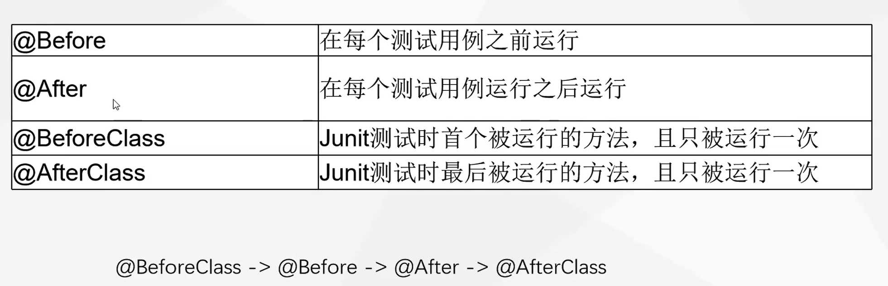
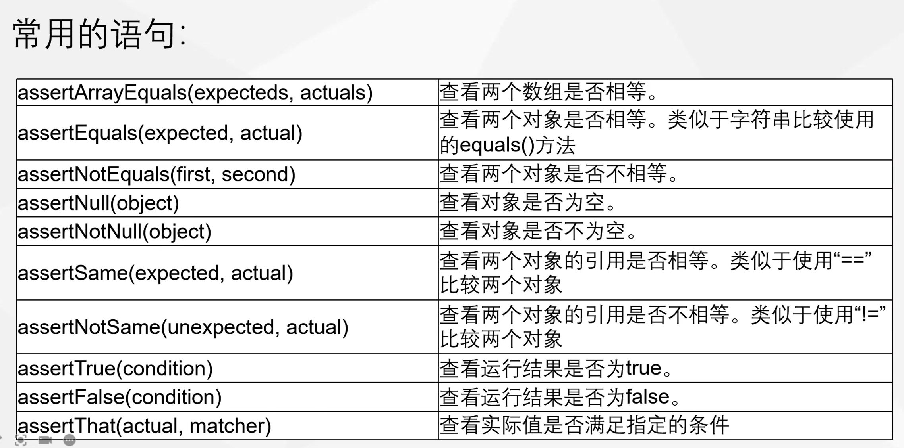

# Junit

---

Junit的方法都是包含在包中，所以，要使用相关的方法，必须包含必要的包。例如，断言的方法就要加入语句**import static org.junit.Assert.***。注意，static关键字是不可少的。


# 注解

---



| @Before      | 初始化方法                                         |
| ------------ | -------------------------------------------------- |
| @After       | 释放资源                                           |
| @Test        | 测试方法，在这里可以测试期望异常和超时时间         |
| @Ignore      | 忽略的测试方法                                     |
| @BeforeClass | 针对所有测试，只执行一次，且必须为static void      |
| @AfterClass  | 针对所有测试，只执行一次，且必须为static void      |
| @RunWith     | 指定测试类使用某个运行器                           |
| @Parameters  | 指定测试类的测试数据集合                           |
| @Rule        | 允许灵活添加或重新定义测试类中的每个测试方法的行为 |

# 断言

---



| assertArrayEquals(expecteds,  actuals) | 查看两个数组是否相等。                                   |
| -------------------------------------- | -------------------------------------------------------- |
| assertEquals(expected,  actual)        | 查看两个对象是否相等。类似于字符串比较使用的equals()方法 |
| assertNotEquals(first,  second)        | 查看两个对象是否不相等。                                 |
| assertNull(object)                     | 查看对象是否为空。                                       |
| assertNotNull(object)                  | 查看对象是否不为空。                                     |
| assertSame(expected,  actual)          | 查看两个对象的引用是否相等。类似于使用“==”比较两个对象   |
| assertNotSame(unexpected,  actual)     | 查看两个对象的引用是否不相等。类似于使用“!=”比较两个对象 |
| assertTrue(condition)                  | 查看运行结果是否为true。                                 |
| assertFalse(condition)                 | 查看运行结果是否为false。                                |
| assertThat(actual,  matcher)           | 查看实际值是否满足指定的条件                             |
| fail()                                 | 让测试失败                                               |


# 语法

---

1. 限时测试

   ```java
   	@Test(timeout=1000)		//	超时测试
   	public void testJudgeNumber2(){
   		assertEquals(true,prim.JudgeNumber(2));
   	}
   ```

   使用限时测试，可以检测某个方法是否运行超时。在使用时，要加上（timeout=?）。这里指明了一个时限，要测试的方法超时，返回的是Eorror,而不是Failure.

2. 参数化测试

   参数化测试实际是把多个测试用例一次性测试，而不必一个一个地进行测试，这对于测试用例多的情况是很有利的。

   ```java
   	@Parameters
   	public static Collection data(){
   		return Arrays.asList(new Object[][]{
   				{2,"Is Prime"},
   				{120,"Break Rules"},
   				{4,"Not Prime"}
   		});
   	}
   ```

   > 这里构造了一组的测试用例，并返回成Collection上转型。注意的是，这必须是两列的，一列是预期输出，一列是对应测试用例输入。
   > 在类中，还有定义了两个变量
   > String result; int para;
   > 一个是用于存放输入，一个用于存放预期输出。在测试类的构造函数中，应当有这样的指明。
   >
   > ```java
   > public Prim2Test(int para,String result){
   > 		this.result=result;
   > 		this.para=para;
   > 	}
   > 
   > ```
   >
   > 这样，在测试方法中，只需按照一般的测试方法写即可。但预期输出应当是定义的变量result
   >
   > ```java
   > 	@Test(timeout=1000)
   > 	public void testJudgeNumber(){
   > 		org.junit.Assert.assertEquals(result,prim.JudgePro(para));
   > 	}
   > ```

   一个重要的问题是，参数化测试需要指定一个Runner，这个Runner指明了Junit应当怎么运行代码。每一个Runner都有自己的特殊功能，而在参数化测试中，需要指定Runner，利用语句@RunWith(Parameterized.class)，同时，还应引入相应的包

   ```java
   import org.junit.runner.RunWith;
   import org.junit.runners.Parameterized;
   import org.junit.runners.Parameterized.Parameters;
   ```

3. 测试打包

   当需要运行多个测试类的时候，我们希望人工一次运行，就需要测试打包。这同样需要指定一个Runner,并且加入自己要测试的测试类。

   