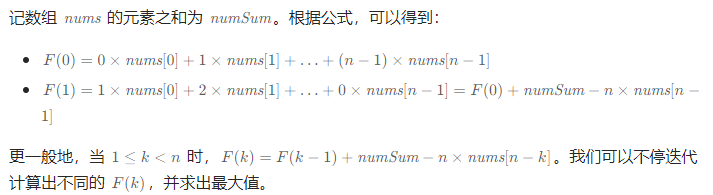
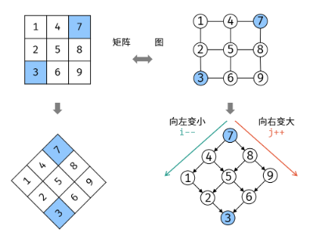
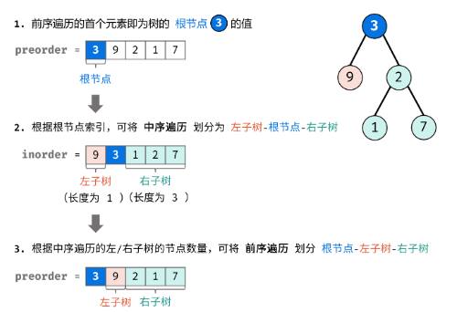
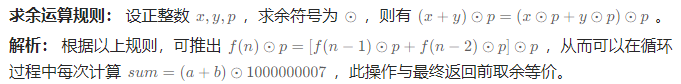
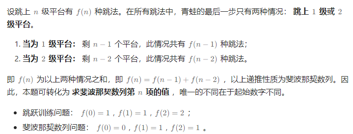
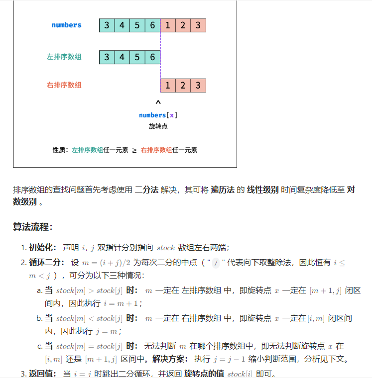

# LeetCode

----

# 线性表

---


## Q1	两数之和	-E

循环，O(mn)

```c++
class Solution {
public:
    vector<int> twoSum(vector<int> &nums, int target) {
        vector<int> result, larger, lower, equal;
        for (int i = 0; i < nums.size(); ++i) {
            if (nums[i] < target / 2) lower.push_back(i);
            else if (nums[i] == target / 2) equal.push_back(i);
            else larger.push_back(i);
        }
        if (equal.size() >= 2) {
            result.push_back(equal[0]);
            result.push_back(equal[1]);
            return result;
        } else if (equal.size() == 1) {
            if (target > 0)
                lower.push_back(equal[0]);
            else
                larger.push_back(equal[0]);
        }
        for (int i = 0; i < larger.size(); ++i) {
            for (int j = 0; j < lower.size(); ++j) {
                if (nums[larger[i]] + nums[lower[j]] == target) {
                    result.push_back(larger[i]);
                    result.push_back(lower[j]);
                }
            }
        }
        return result;
    }
};
```

哈希表，O(n)

```c++
class Solution {
public:
    vector<int> twoSum(vector<int>& nums, int target) {
        unordered_map<int, int> hashtable;
        for (int i = 0; i < nums.size(); ++i) {
            auto it = hashtable.find(target - nums[i]);
            if (it != hashtable.end()) {
                return {it->second, i};
            }
            hashtable[nums[i]] = i;
        }
        return {};
    }
};
```


## Q27	移除元素	-E

双指针，*O*(*n*)

```c
int removeElement(int *nums, int numsSize, int val) {
    int p = 0, q = 1;
    if (numsSize == 1) {
        if (nums[0] != val) {
            return 1;
        } else {
            return 0;
        }
    }else if (numsSize == 0){
        return 0;
    }
    for (; q < numsSize; q++) {
        if (nums[p] != val)
            p++;
        nums[p] = nums[q];
    }
    if (nums[p] == val && q == numsSize) p--;
    return p + 1;
}
```


双指针优化，O(n)

```c++
class Solution {
public:
    int removeElement(vector<int> &nums, int val) {
        if (nums.size() == 0) return 0;
        int p = 0, q = nums.size() - 1;
        while (p < q) {
            while (nums[p] != val && p < q) p++;
            while (nums[q] == val && p < q) q--;
            if (p < q) {
                nums[p] = nums[q];
                p++;
                q--;
            }
        }
        if (p == q)
            if (nums[p] == val)
                p--;
        if (p > q)
            p--;
        return p + 1;
    }
};

//官方：
class Solution {
public:
    int removeElement(vector<int>& nums, int val) {
        int left = 0, right = nums.size();
        while (left < right) {
            if (nums[left] == val) {
                nums[left] = nums[right - 1];
                right--;
            } else {
                left++;
            }
        }
        return left;
    }
};
```


## Q26	删除有序数组中的重复项	-E

```c
int removeDuplicates(int* nums, int numsSize){
    int p=0,q=1,tmp;
    for(;q<numsSize;q++){
        if(nums[p]!=nums[q])    p++;
        tmp=nums[p];
        nums[p]=nums[q];
        nums[q]=tmp;
    }
    return p+1;
}
```

```c++
class Solution {
public:
    int removeDuplicates(vector<int> &nums) {
        int p = 0;
        for (int i = 0; i < nums.size(); ++i) {
            if (nums[p] != nums[i]) p++;
            if (i - p >= 1)
                nums[p] = nums[i];
        }
        return p + 1;
    }
};
```


## Q1828	统计一个圆中点的数目	-M

```c++
class Solution {
public:
    vector<int> countPoints(vector<vector<int>> &points, vector<vector<int>> &queries) {
        vector<int> ans;
        float distance;
        for (int i = 0; i < queries.size(); ++i) {
            ans.push_back(0);
            for (int j = 0; j < points.size(); ++j) {
//                if (points[j][0]>queries[i][0]+queries[i][2]||points[j][0]<queries[i][0]-queries[i][2]) continue;
//                if (points[j][1]>queries[i][1]+queries[i][2]||points[j][1]<queries[i][1]-queries[i][2]) continue;

                distance = ::sqrt(::pow(points[j][0] - queries[i][0], 2) + ::pow(points[j][1] - queries[i][1], 2));
                if (distance <= queries[i][2])
                    ans[i]++;
            }
        }
        return ans;
    }
};
```


## Q1920	基于排列构建数组	-E

```c++
class Solution {
public:
    vector<int> buildArray(vector<int>& nums) {
        vector<int> result;
        for (int i = 0; i < nums.size(); ++i) {
            result.push_back(nums[nums[i]]);
        }
        return result;
    }
};
```


## Q2011	执行操作后的变量值	-E

```c++
class Solution {
public:
    int finalValueAfterOperations(vector<string>& operations) {
        int result=0;
        for (int i = 0; i < operations.size(); ++i) {
            if(operations[i][0]=='+'||operations[i][2]=='+')    result++;
            if(operations[i][0]=='-'||operations[i][2]=='-')    result--;
        }
        return result;
    }
};
```


## Q807	保持城市天际线	-M

```c++
class Solution {
public:
    int maxIncreaseKeepingSkyline(vector<vector<int>>& grid) {
        int result=0,rmax,cmax,n=grid[0].size();
        vector<int>row;
        vector<int>column;

        for (int i = 0; i < n; ++i) {
            rmax=grid[i][0];
            cmax=grid[0][i];
            for (int j = 0; j < n; ++j) {
                rmax=rmax<grid[i][j]?grid[i][j]:rmax;
                cmax=cmax<grid[j][i]?grid[j][i]:cmax;
            }
            row.push_back(rmax);
            column.push_back(cmax);
        }
        for (int i = 0; i < n; ++i) {
            for (int j = 0; j < n; ++j) {
                result+=(row[i]<=column[j]?row[i]-grid[i][j]:column[j]-grid[i][j]);
            }
        }
        return result;
    }
};
```


## Q1255	得分最高的单词集合	-H

回溯法

```c++
class Solution {
public:
    vector<string> m_words;
    vector<char> m_letters;
    vector<int> m_score;
    int count[26], tmp[26];
    int best = 0, curbest = 0;
    bool flag[26];
//    int x[5];

    int maxScoreWords(vector<string> &words, vector<char> &letters, vector<int> &score) {
        m_words = words;
        m_letters = letters;
        m_score = score;

        for (int i = 0; i < 25; ++i) {
            count[i] = 0;
        }
        for (int i = 0; i < letters.size(); ++i) {
            count[letters[i] - 97]++;
        }

        backtrack(0, words.size());
        return best;
    }

    void backtrack(int i, int n) {
        if (i == n) best = curbest >= best ? curbest : best;
        else {
            if (check(i)) {
//                x[i] = 1;
                cost(i);
                backtrack(i + 1, n);
                reset(i);
            }
//            x[i] = 0;
            backtrack(i + 1, n);
        }
    }

    bool check(int n) {
        for (int i = 0; i < 26; ++i) {
            flag[i] = false;
        }
        for (int i = 0; i < m_words[n].size(); ++i) {
            if (!flag[m_words[n][i] - 97]) {
                flag[m_words[n][i] - 97] = true;
                tmp[m_words[n][i] - 97] = 1;
            } else {
                tmp[m_words[n][i] - 97]++;
            }
            if (count[m_words[n][i] - 97] < tmp[m_words[n][i] - 97])
                return false;
        }
        return true;
    }

    void cost(int n) {
        for (int i = 0; i < m_words[n].size(); ++i) {
            count[m_words[n][i] - 97]--;
            curbest += m_score[m_words[n][i] - 97];
        }
    }

    void reset(int n) {
        for (int i = 0; i < m_words[n].size(); ++i) {
            count[m_words[n][i] - 97]++;
            curbest -= m_score[m_words[n][i] - 97];
        }
    }
};
```


## Q1769	移动所有球到每个盒子所需的最小操作数	-M

双循环，O(n^2^)

```c++
class Solution {
public:
    vector<int> minOperations(string boxes) {
        vector<int> box;
        vector<int> result;
        int sum;
        for (int i = 0; i < boxes.size(); ++i) {
            if(boxes[i] != '0')
            box.push_back(i);
        }

        for (int i = 0; i < boxes.size(); ++i) {
            sum = 0;
            for (int j = 0; j < box.size(); ++j) {
                sum += box[j] > i ? (box[j] - i) : (i - box[j]);
            }
            result.push_back(sum);
        }
        return result;
    }
};
```

两次遍历

```c++
class Solution {
public:
    vector<int> minOperations(string boxes) {
        vector<int> box;
        vector<int> result_l(boxes.size(), 0);
        vector<int> result_r(boxes.size(), 0);
        vector<int> count_l(boxes.size(), 0);
        vector<int> count_r(boxes.size(), 0);
        vector<int> result;
        for (int i = 0; i < boxes.size(); ++i)
            box.push_back(boxes[i] - '0');


        for (int i = 1; i < boxes.size(); ++i) {
            if (box[i - 1] == 1)
                count_l[i] = count_l[i - 1] + 1;
            else
                count_l[i] = count_l[i - 1];
            result_l[i] = result_l[i - 1] + count_l[i];
        }

        for (int i = boxes.size() - 2; i >= 0; --i) {
            if (box[i + 1] == 1)
                count_r[i] = count_r[i + 1] + 1;
            else
                count_r[i] = count_r[i + 1];
            result_r[i] = result_r[i + 1] + count_r[i];
        }

        for (int i = 0; i < boxes.size(); ++i)
            result.push_back(result_l[i] + result_r[i]);


        return result;
    }
};
```


## Q2208	将数组和减半的最少操作次数	-M

> 贪心+优先队列

```c++
class Solution {
public:
    int halveArray(vector<int> &nums) {
        double result = 0, tmp;
        int ans = 0;
        double sum = accumulate(nums.begin(), nums.end(), 0.0);
        priority_queue<double> q(nums.begin(), nums.end());
        while (result < sum / 2) {
            tmp = q.top();
            result += tmp / 2;
            q.pop();
            q.push(tmp / 2);
            ans++;
        }
        return ans;
    }

};
```


## Q2500	删除每行中的最大值	-E

排序

```c++
class Solution {
public:
    int deleteGreatestValue(vector<vector<int>> &grid) {
        int result = 0, max;
        int m = grid.size(), n = grid[0].size();
        for (int i = 0; i < m; ++i)
            sort(grid[i].begin(), grid[i].end());
        for (int i = 0; i < n; ++i) {
            max = 0;
            for (int j = 0; j < m; ++j) {
                max = max >= grid[j][i] ? max : grid[j][i];
            }
            result += max;
        }
        return result;
    }
};
```


## Q453 最小操作次数使数组元素相等 -M

> n-1个数同时+1，相当于每次有1个数自身-1，因为只能做减法，所以数组最后的数只能是最小值，这样的话每个元素减去最小值求其和就是答案。

```c++
class Solution {
public:

    int min;
    int minIndex;
    int n;

    int minMoves(vector<int> &nums) {
        int result = 0;
        n = nums.size();
        min = nums[0];
        minIndex = 0;
        for (int i = 1; i < n; ++i) {
            if (nums[i] < min) {
                min = nums[i];
                minIndex = i;
            }
        }
        for (int i = 0; i < n; ++i) {
            if (i != minIndex && nums[i] != min)
                result += (nums[i] - min);
        }
        return result;
    }
};
```


## Q665 非递减数列 -M

> 要满足题意，我们能够在数组中找到这两个数`[x, y]`，其中`y < x`。很明显`[..., x]`和`[y, ...]`满足非递减条件，如果不满足则说明修改次数必然超过1次。接下来我们再考虑边界问题：
>
> - 如果数组内元素数量n<=2，必然能够通过修改1次元素使数列满足非递减
> - 如果x是最左侧元素，则通过修改x使其小于y就能使数列满足非递减
> - 如果x是最右侧元素，则通过修改y使其大于x就能使数列满足非递减
> - 设x的上一个数为k，y的下一个数为t
>     - `k <= y`通过修改x可满足
>     - `t >= x`通过修改y可满足

```C++
class Solution {
public:

    bool checkIncremental(vector<int> nums, int beginIndex, int endIndex) {
        int begin = beginIndex < 0 ? 0 : beginIndex;
        int end = endIndex >= nums.size() ? nums.size() : endIndex;
        for (int i = begin + 1; i < end; ++i) {
            if (nums[i] < nums[i - 1])
                return false;
        }
        return true;
    }

    bool checkPossibility(vector<int> &nums) {
        if (nums.size() <= 2)
            return true;
        for (int i = 1; i < nums.size(); ++i) {
            if (nums[i] >= nums[i - 1])
                continue;

            if (!checkIncremental(nums, i,nums.size()))
                return false;
            if ((i + 1) < nums.size()) {
                if (nums[i + 1] > nums[i - 1])
                    return true;
                if ((i - 2) < 0)
                    return true;
                else if (nums[i] >= nums[i - 2])
                    return true;
                else
                    return false;
            } else
                return true;
        }
        return true;
    }
};
```


## Q283 移动零 -E

> 遍历数组，查找所有非零的元素并将其放置到数组前，使用双指针即可，左指针指向下一个待放置的位置，右指针寻找非0的元素

```cpp
class Solution {
public:
    int count = 0;
    int left = 0, right;

    void moveZeroes(vector<int> &nums) {
        for (right = 0; right < nums.size(); right++) {
            if (nums[right] != 0) {
                nums[left] = nums[right];
                left++;
            } else
                count++;
        }
        for (int i = nums.size() - count; i < nums.size(); ++i)
            nums[i] = 0;
    }
};
```


## Q189 旋转数组 -M

> **关键点：元素旋转后的位置 = (index+k)%n**
>
> - 方法一：使用额外的数组
>
> - 方法二：数组翻转
>
>     > ```
>     > nums = "----->-->"; k =3
>     > result = "-->----->";
>     > 
>     > reverse "----->-->" we can get "<--<-----"
>     > reverse "<--" we can get "--><-----"
>     > reverse "<-----" we can get "-->----->"
>     > this visualization help me figure it out :)
>     > ```
>     >
>     > https://leetcode.com/problems/rotate-array/solutions/54250/Easy-to-read-Java-solution/
>
> - 方法三：环状替换，只使用一个中间变量而不需要开辟新的数组

```cpp
class Solution {
public:
//    vector<int> tmp;
//    int n;

    void rotate(vector<int> &nums, int k) {
// 方法一
/*        n = nums.size();
        tmp.resize(n);
        for (int i = 0; i < nums.size(); ++i)
            tmp[(i + k) % n] = nums[i];
        nums.assign(tmp.begin(), tmp.end());*/
// 方法二
      k %= nums.size();
        reverse(nums.begin(), nums.end());
        reverse(nums.begin(), nums.begin() + k);
        reverse(nums.begin() + k, nums.end());
//方法三
/*        int n = nums.size();
        k = k % n;
        int count = gcd(k, n);
        for (int start = 0; start < count; ++start) {
            int current = start;
            int prev = nums[start];
            do {
                int next = (current + k) % n;
                swap(nums[next], prev);
                current = next;
            } while (start != current);
        }*/
    }
};
```


## Q396 旋转函数 -M

> 

```cpp
class Solution {
public:

    int maxRotateFunction(vector<int> &nums) {
        int n = nums.size();
        int sum = 0, res, tmp = 0;
        for (int i = 0; i < n; ++i)
            sum += nums[i];
        for (int i = 0; i < n; ++i) {
            tmp += i * nums[i];
            res = tmp;
        }
        for (int i = 1; i < n; ++i) {
            tmp = tmp + sum - n * nums[n - i];
            res = max(res, tmp);
        }
        return res;
    }
};
```


## Q245 错误的集合 -M

```cpp
/*
 * 方法一
 * 先排序
 * 如果相邻两个数相差2则说明丢失的数在这两个数中间
 * 如果相邻两个数相等则说明这是重复的数
 * 特别的，如果最后一个数不是n则丢失的数是n
 */
//class Solution {
//public:
//    vector<int> findErrorNums(vector<int> &nums) {
//        vector<int> errorNums(2);
//        sort(nums.begin(), nums.end());
//        int pre = 0;
//        int n = nums.size();
//        for (int i = 0; i < n; ++i) {
//            if (nums[i] == pre) {
//                errorNums[0] = pre;
//            } else if (nums[i] - pre > 1)
//                errorNums[1] = pre + 1;
//            pre = nums[i];
//        }
//        if (nums[n - 1] != n)
//            errorNums[1] = n;
//        return errorNums;
//    }
//};

/*
 * 使用哈希表
 */
class Solution {
public:
    vector<int> findErrorNums(vector<int> &nums) {
        vector<int> errorNums(2);
        int n = nums.size();
        unordered_map<int, int> mp;
        for (int i = 0; i < n; ++i)
            mp[nums[i]]++;
        for (int i = 1; i <= n; ++i) {
            if (mp[i] == 0)
                errorNums[1] = i;
            else if (mp[i] == 2)
                errorNums[0] = i;
        }
        return errorNums;
    }
};

/*
 *位运算
 */
class Solution {
public:
    vector<int> findErrorNums(vector<int>& nums) {
        int n = nums.size();
        int xorSum = 0;
        for (int num : nums) {
            xorSum ^= num;
        }
        for (int i = 1; i <= n; i++) {
            xorSum ^= i;
        }
        int lowbit = xorSum & (-xorSum);
        int num1 = 0, num2 = 0;
        for (int &num : nums) {
            if ((num & lowbit) == 0) {
                num1 ^= num;
            } else {
                num2 ^= num;
            }
        }
        for (int i = 1; i <= n; i++) {
            if ((i & lowbit) == 0) {
                num1 ^= i;
            } else {
                num2 ^= i;
            }
        }
        for (int num : nums) {
            if (num == num1) {
                return vector<int>{num1, num2};
            }
        }
        return vector<int>{num2, num1};
    }
};
```


## Q697 数组的度 -E

```cpp
/*
 * 使用哈希表
 */
class Solution {
public:
    int findShortestSubArray(vector<int> &nums) {
        unordered_map<int, vector<int>> mp;
        int maxNum = 0, minLen = 1;
        int n = nums.size();
        for (int i = 0; i < n; ++i) {
            if (mp.count(nums[i])) {
                mp[nums[i]][0]++;
                mp[nums[i]][2] = i;
            } else {
                mp[nums[i]] = {1, i, i};
            }
        }
        for (auto it = mp.begin(); it != mp.end(); it++) {
            if (it->second[0] > maxNum) {
                maxNum = it->second[0];
                minLen = it->second[2] - it->second[1] + 1;
            } else if (it->second[0] == maxNum) {
                if (minLen > (it->second[2] - it->second[1] + 1))
                    minLen = it->second[2] - it->second[1] + 1;
            }
        }
        return minLen;
    }
};
```


## Q448 找到所有数组中消失的数字 -E

```cpp
/*
 * 方法一：使用额外标志数组
 */
//class Solution {
//public:
//    vector<int> findDisappearedNumbers(vector<int> &nums) {
//        vector<int> result;
//        int n = nums.size();
//        vector<int> flag(n + 1);
//        for (int i = 0; i < n; ++i) {
//            flag[nums[i]] = 1;
//        }
//        for (int i = 1; i <= n; ++i) {
//            if (!flag[i])
//                result.push_back(i);
//        }
//        return result;
//    }
//};
/*
 * 方法二：哈希表
 */
//class Solution {
//public:
//    vector<int> findDisappearedNumbers(vector<int> &nums) {
//        vector<int> result;
//        int n = nums.size();
//        unordered_map<int, int> mp;
//        for (int i = 0; i < n; ++i) {
//            mp[nums[i]] = 1;
//        }
//        for (int i = 1; i <= n; ++i) {
//            if (!mp.count(i))
//                result.push_back(i);
//        }
//        return result;
//    }
//};

/*
 * 方法三：原地修改
 * 利用所有数都在[1, n]中的特性
 */
class Solution {
public:
    vector<int> findDisappearedNumbers(vector<int> &nums) {
        vector<int> result;
        int n = nums.size();

        for (int i = 0; i < n; ++i) {
            int x = (nums[i] - 1) % n;
            nums[x] += n;
        }
        for (int i = 0; i < n; ++i) {
            if (nums[i] <= n)
                result.push_back(i + 1);
        }
        return result;
    }
};
```


## Q442 数组中重复的数据 -M

```cpp
/*
 * 方法一：哈希表
 */
//class Solution {
//public:
//    vector<int> findDuplicates(vector<int> &nums) {
//        vector<int> result;
//        unordered_map<int, int> mp;
//        for (int i = 0; i < nums.size(); ++i) {
//            if (!mp.count(nums[i]))
//                mp[nums[i]] = 1;
//            else
//                mp[nums[i]]++;
//        }
//        for (auto it = mp.begin(); it != mp.end(); it++) {
//            if (it->second == 2)
//                result.push_back(it->first);
//        }
//        return result;
//    }
//};
/*
 * 方法二：与448相同，加n
 */
//class Solution {
//public:
//    vector<int> findDuplicates(vector<int> &nums) {
//        vector<int> result;
//        int n = nums.size();
//        for (int i = 0; i < n; ++i) {
//            int idx = (nums[i] - 1) % n;
//            nums[idx] += n;
//        }
//        for (int i = 0; i < n; ++i) {
//            if (nums[i] > (2 * n))
//                result.push_back(i + 1);
//        }
//        return result;
//    }
//};
/*
 * 方法三：使用正负号
 */
//class Solution {
//public:
//    vector<int> findDuplicates(vector<int> &nums) {
//        vector<int> result;
//        int n = nums.size();
//        for (int i = 0; i < n; ++i) {
//            int idx = abs(nums[i]) - 1;
//            if (nums[idx] < 0)
//                result.push_back(idx + 1);
//            else
//                nums[idx] = -nums[idx];
//        }
//
//        return result;
//    }
//};
/*
 * 方法四：交换元素
 */
class Solution {
public:
    vector<int> findDuplicates(vector<int>& nums) {
        int n = nums.size();
        for (int i = 0; i < n; ++i) {
            while (nums[i] != nums[nums[i] - 1]) {
                swap(nums[i], nums[nums[i] - 1]);
            }
        }
        vector<int> ans;
        for (int i = 0; i < n; ++i) {
            if (nums[i] - 1 != i) {
                ans.push_back(nums[i]);
            }
        }
        return ans;
    }
};
```


## Q41 缺失的第一个正数 -H

> 在一个长度为n的数组中，如果[1, n]中的所有数都出现在数组中，则最小正整数为n+1，反之，如果[1, n]中有数未出现在数组中，则最小正整数一定在[1, n]中，因为[1, n]是正数的最小片段。这样，我们就可以用这个长度为n的数组来记录[1, n]中的正数是否出现，出现则将对应索引的元素设置为负数，最终遍历数组，第一个出现的正数对应的索引+1即为最小正数。

```cpp
class Solution {
public:
    int firstMissingPositive(vector<int> &nums) {
        int n = nums.size();
        for (int i = 0; i < n; ++i) {
            if (nums[i] <= 0)
                nums[i] = n + 1;
        }
        for (int i = 0; i < n; ++i) {
            if (abs(nums[i]) <= n) {
                int idx = abs(nums[i]) - 1;
                if (nums[idx] > 0)
                    nums[idx] = -nums[idx];
            }
        }
        for (int i = 0; i < n; ++i) {
            if (nums[i] > 0)
                return i + 1;
        }
        return n + 1;
    }
};
```


## Q485 最大连续1的个数 -E

```cpp
/*
 * 遇1则加，遇0重置，比较大小，注意结尾
 */
class Solution {
public:
    int findMaxConsecutiveOnes(vector<int> &nums) {
        int count = 0, n = nums.size(), max = 0;
        for (int i = 0; i < n; ++i) {
            if (nums[i] == 1) {
                count++;
            } else if (nums[i] != 1) {
                max = max > count ? max : count;
                count = 0;
            }
        }
        max = max > count ? max : count;
        return max;
    }
};
```


## Q495 提莫攻击 -E

```cpp
/*
 * 方法一
 */
//class Solution {
//public:
//    int findPoisonedDuration(vector<int> &timeSeries, int duration) {
//        int end = -1, count = 0, n = timeSeries.size();
//        for (int i = 0; i < n; ++i) {
//            int step = timeSeries[i] + duration - 1;
//                if (timeSeries[i] > end)
//                    count += duration;
//                else
//                    count += (step - end);
//                end = step;
//        }
//        return count;
//    }
//};
/*
 * 方法二
 */
class Solution {
public:
    int findPoisonedDuration(vector<int> &timeSeries, int duration) {
        auto res = 0;
        for (auto i = 1; i < timeSeries.size(); ++i) {
            res += min(timeSeries[i] - timeSeries[i - 1], duration);
        }
        return res + duration;
    }
};
```


## Q414 第三大的数 -E

```cpp
/*
 * 方法一：排序
 */
//class Solution {
//public:
//    int thirdMax(vector<int> &nums) {
//        int count = 0, n = nums.size(), res;
//        sort(nums.begin(), nums.end(), greater<>());
//        for (int i = 0, pre = nums[i] - 1; i < n; ++i) {
//            if (count == 3)
//                break;
//            if (nums[i] != pre) {
//                count++;
//                res = nums[i];
//                pre = nums[i];
//            }
//        }
//        return count == 3 ? res : nums[0];
//    }
//};
/*
 * 方法二：有序集合
 */
//class Solution {
//public:
//    int thirdMax(vector<int> &nums) {
//        set<int> s;
//        for (int num : nums) {
//            s.insert(num);
//            if (s.size() > 3) {
//                s.erase(s.begin());
//            }
//        }
//        return s.size() == 3 ? *s.begin() : *s.rbegin();
//    }
//};
/*
 * 方法三：一次遍历(依赖元素范围)
 */
class Solution {
public:
    int thirdMax(vector<int> &nums) {
        long a = LONG_MIN, b = LONG_MIN, c = LONG_MIN;
        for (long num : nums) {
            if (num > a) {
                c = b;
                b = a;
                a = num;
            } else if (a > num && num > b) {
                c = b;
                b = num;
            } else if (b > num && num > c) {
                c = num;
            }
        }
        return c == LONG_MIN ? a : c;
    }
};
/*
 * 方法四：一次遍历(不依赖元素范围)
 */
class Solution {
public:
    int thirdMax(vector<int> &nums) {
        int *a = nullptr, *b = nullptr, *c = nullptr;
        for (int &num : nums) {
            if (a == nullptr || num > *a) {
                c = b;
                b = a;
                a = &num;
            } else if (*a > num && (b == nullptr || num > *b)) {
                c = b;
                b = &num;
            } else if (b != nullptr && *b > num && (c == nullptr || num > *c)) {
                c = &num;
            }
        }
        return c == nullptr ? *a : *c;
    }
};
```


# 树

---

## Q2569	更新数组后处理求和查询	-H

线段树

```c++
```


# Q146 LRU缓存 -M

```cpp
struct DLinkedNode {
    int key, value;
    DLinkedNode* prev;
    DLinkedNode* next;
    DLinkedNode(): key(0), value(0), prev(nullptr), next(nullptr) {}
    DLinkedNode(int _key, int _value): key(_key), value(_value), prev(nullptr), next(nullptr) {}
};
 
class LRUCache {
private:
    unordered_map<int, DLinkedNode*> cache;
    DLinkedNode* head;
    DLinkedNode* tail;
    int size;
    int capacity;
 
public:
    LRUCache(int _capacity): capacity(_capacity), size(0) {
        // 使用伪头部和伪尾部节点
        head = new DLinkedNode();
        tail = new DLinkedNode();
        head->next = tail;
        tail->prev = head;
    }
    
    int get(int key) {
        if (!cache.count(key)) {
            return -1;
        }
        // 如果 key 存在，先通过哈希表定位，再移到头部
        DLinkedNode* node = cache[key];
        moveToHead(node);
        return node->value;
    }
    
    void put(int key, int value) {
        if (!cache.count(key)) {
            // 如果 key 不存在，创建一个新的节点
            DLinkedNode* node = new DLinkedNode(key, value);
            // 添加进哈希表
            cache[key] = node;
            // 添加至双向链表的头部
            addToHead(node);
            ++size;
            if (size > capacity) {
                // 如果超出容量，删除双向链表的尾部节点
                DLinkedNode* removed = removeTail();
                // 删除哈希表中对应的项
                cache.erase(removed->key);
                // 防止内存泄漏
                delete removed;
                --size;
            }
        }
        else {
            // 如果 key 存在，先通过哈希表定位，再修改 value，并移到头部
            DLinkedNode* node = cache[key];
            node->value = value;
            moveToHead(node);
        }
    }
 
    void addToHead(DLinkedNode* node) {
        node->prev = head;
        node->next = head->next;
        head->next->prev = node;
        head->next = node;
    }
    
    void removeNode(DLinkedNode* node) {
        node->prev->next = node->next;
        node->next->prev = node->prev;
    }
 
    void moveToHead(DLinkedNode* node) {
        removeNode(node);
        addToHead(node);
    }
 
    DLinkedNode* removeTail() {
        DLinkedNode* node = tail->prev;
        removeNode(node);
        return node;
    }
};
```


# 剑指Offer

## LCR120 寻找文件副本 -E

```cpp
class Solution {
public:
    int findRepeatDocument(vector<int> &documents) {
        int res = 0, n = documents.size();
        for (int i = 0; i < n; ++i) {
            int idx = documents[i] % n;
            documents[idx] += n;
            if (documents[idx] >= (2 * n)) {
                res = idx;
                return res;
            }
        }
        return res;
    }
};
```


## LCR121 寻找目标值 - 二维数组 -M

> 旋转后形成二叉搜索树
>
> 

```cpp
class Solution {
public:
    bool findTargetIn2DPlants(vector<vector<int>> &plants, int target) {
        if (plants.size() == 0)
            return false;
        int i = plants[0].size() - 1, j = 0;    // j行 i列
        while (i >= 0 && j < plants.size()) {
            if (plants[j][i] == target)
                return true;
            if (plants[j][i] < target)
                j++;
            else
                i--;
        }
        return false;
    }
};
```


## LCR122 路径加密 -E

> 原题为替换空格为%20
>
> https://blog.csdn.net/2301_78694061/article/details/134123895

```cpp
class Solution {
public:
    string pathEncryption(string path) {
        string res;
        for (auto ch: path) {
            if (ch == '.')
                res += ' ';
            else
                res += ch;
        }
        return res;
    }
};
```


## LCR123 图书整理 I -E

> 翻转链表
>
> 栈

```cpp
class Solution {
public:
    vector<int> reverseBookList(ListNode *head) {
        ListNode *pre = nullptr, *cur = head, *tmp;
        vector<int> res;
        while (cur != nullptr) {
            tmp = cur->next;
            cur->next = pre;
            pre = cur;
            cur = tmp;
        }
        ListNode *p = pre;
        while (p != nullptr) {
            res.push_back(p->val);
            p = p->next;
        }
        return res;
    }
};
```


## LCR124 推理二叉树 -M

> 使用前序遍历确定(子)树根节点，再根据中序遍历确定该树的左右子树范围，因此需要通过left和right两个值来记录整棵树的范围，使用分治法和递归实现这个思想。
>
> 
>
> 前序遍历的左子树的根节点一定是**根节点的下一个**，右子树的根节点在**根节点+左子树节点数+1**

```cpp
struct TreeNode {
    int val;
    TreeNode *left;
    TreeNode *right;

    TreeNode() : val(0), left(nullptr), right(nullptr) {}

    TreeNode(int x) : val(x), left(nullptr), right(nullptr) {}

    TreeNode(int x, TreeNode *left, TreeNode *right) : val(x), left(left), right(right) {}
};


class Solution {
private:
    vector<int> my_preorder;
    unordered_map<int, int> mp;

    TreeNode *recur(int root, int left, int right) {
        if (left > right) return nullptr;
        TreeNode *node = new TreeNode(my_preorder[root]);
        int idx = mp[my_preorder[root]];
        node->left = recur(root + 1, left, idx - 1);
        node->right = recur(root + (idx - left + 1), idx + 1, right);
        return node;
    }

public:
    TreeNode *deduceTree(vector<int> &preorder, vector<int> &inorder) {
        TreeNode *root;
        my_preorder = preorder;
        for (int i = 0; i < inorder.size(); ++i) {
            mp[inorder[i]] = i;
        }
        root = recur(0, 0, preorder.size() - 1);
        return root;
    }
};
```


## LCR125 图书整理 II -E

```cpp
class CQueue {
private:
    stack<int> master, tmp;
public:
    CQueue() {

    }

    void appendTail(int value) {
        master.push(value);
    }

    int deleteHead() {
        int res;
        if (!tmp.empty()) { // tmp栈为master栈的逆序，实现队列
            res = tmp.top();
            tmp.pop();
            return res;
        }
        if (master.empty()) return -1;  // 如果tmp和master均为空则说明没有可删除的元素
        while (!master.empty()) {   // master不为空则将master中元素放入tmp实现逆序
            tmp.push(master.top());
            master.pop();
        }
        res = tmp.top();
        tmp.pop();
        return res;
    }
};
```


## LCR126 斐波那契数 -E

> 

```cpp
class Solution {
public:
    int fib(int n) {
        if (n < 2)
            return n;
        bool flag = true;
        int a = 0, b = 1, sum;
        for (int i = 1; i < n; ++i) {
            sum = (a + b) % 1000000007;
            if (flag)
                a = sum;
            else
                b = sum;
            flag = !flag;
        }
        return sum;
    }
};
```


## LCR127 跳跃训练 -E

> 

```cpp
class Solution {
public:
    int trainWays(int num) {
        if (num < 2)
            return 1;
        bool flag = true;
        int a = 1, b = 1, sum;
        for (int i = 1; i < num; ++i) {
            sum = (a + b) % 1000000007;
            if (flag)
                a = sum;
            else
                b = sum;
            flag = !flag;
        }
        return sum;
    }
};
```


## LCR128 库存管理 I

> 
>
> 当stock[m]=stock[j]时，如果m在左排序数组，因为左排序数组的元素大于等于右排序数组的元素且[m+1, j]的最大元素为stock[j]，所以[0:m]的元素都等于stock[m]；如果m在右排序数组，则因为单调递增的原则[m+1, j]均为stock[m]

```cpp
class Solution {
public:
    int stockManagement(vector<int> &stock) {
        int left = 0, right = stock.size() - 1;
        int mid;
        while (left < right) {
            if (left == right) break;
            mid = (left + right) / 2;
            if (stock[mid] > stock[right]) left = mid + 1;
            else if (stock[mid] < stock[right]) right = mid;
            else right -= 1;
        }
        return stock[left];
    }
};
```
