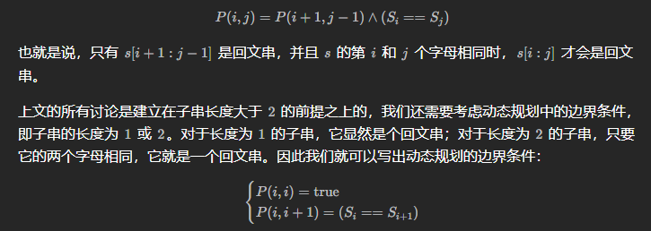

# LeetCode

----

# 线性表

---


## Q1	两数之和	-E

循环，O(mn)

```c++
class Solution {
public:
    vector<int> twoSum(vector<int> &nums, int target) {
        vector<int> result, larger, lower, equal;
        for (int i = 0; i < nums.size(); ++i) {
            if (nums[i] < target / 2) lower.push_back(i);
            else if (nums[i] == target / 2) equal.push_back(i);
            else larger.push_back(i);
        }
        if (equal.size() >= 2) {
            result.push_back(equal[0]);
            result.push_back(equal[1]);
            return result;
        } else if (equal.size() == 1) {
            if (target > 0)
                lower.push_back(equal[0]);
            else
                larger.push_back(equal[0]);
        }
        for (int i = 0; i < larger.size(); ++i) {
            for (int j = 0; j < lower.size(); ++j) {
                if (nums[larger[i]] + nums[lower[j]] == target) {
                    result.push_back(larger[i]);
                    result.push_back(lower[j]);
                }
            }
        }
        return result;
    }
};
```

哈希表，O(n)

```c++
class Solution {
public:
    vector<int> twoSum(vector<int> &nums, int target) {
        unordered_map<int, int> mp;
        for (int i = 0; i < nums.size(); ++i) {
            auto it = mp.find(target - nums[i]);
            if (it != mp.end()) 
                return {it->second, i};
            mp[nums[i]] = i;
        }
        return {};
    }
};
```


## Q27	移除元素	-E

双指针，*O*(*n*)

```c
int removeElement(int *nums, int numsSize, int val) {
    int p = 0, q = 1;
    if (numsSize == 1) {
        if (nums[0] != val) {
            return 1;
        } else {
            return 0;
        }
    }else if (numsSize == 0){
        return 0;
    }
    for (; q < numsSize; q++) {
        if (nums[p] != val)
            p++;
        nums[p] = nums[q];
    }
    if (nums[p] == val && q == numsSize) p--;
    return p + 1;
}
```


双指针优化，O(n)

```c++
class Solution {
public:
    int removeElement(vector<int> &nums, int val) {
        if (nums.size() == 0) return 0;
        int p = 0, q = nums.size() - 1;
        while (p < q) {
            while (nums[p] != val && p < q) p++;
            while (nums[q] == val && p < q) q--;
            if (p < q) {
                nums[p] = nums[q];
                p++;
                q--;
            }
        }
        if (p == q)
            if (nums[p] == val)
                p--;
        if (p > q)
            p--;
        return p + 1;
    }
};

//官方：
class Solution {
public:
    int removeElement(vector<int>& nums, int val) {
        int left = 0, right = nums.size();
        while (left < right) {
            if (nums[left] == val) {
                nums[left] = nums[right - 1];
                right--;
            } else {
                left++;
            }
        }
        return left;
    }
};
```


## Q26	删除有序数组中的重复项	-E

```c
int removeDuplicates(int* nums, int numsSize){
    int p=0,q=1,tmp;
    for(;q<numsSize;q++){
        if(nums[p]!=nums[q])    p++;
        tmp=nums[p];
        nums[p]=nums[q];
        nums[q]=tmp;
    }
    return p+1;
}
```

```c++
class Solution {
public:
    int removeDuplicates(vector<int> &nums) {
        int p = 0;
        for (int i = 0; i < nums.size(); ++i) {
            if (nums[p] != nums[i]) p++;
            if (i - p >= 1)
                nums[p] = nums[i];
        }
        return p + 1;
    }
};
```


## Q1828	统计一个圆中点的数目	-M

```c++
class Solution {
public:
    vector<int> countPoints(vector<vector<int>> &points, vector<vector<int>> &queries) {
        vector<int> ans;
        float distance;
        for (int i = 0; i < queries.size(); ++i) {
            ans.push_back(0);
            for (int j = 0; j < points.size(); ++j) {
//                if (points[j][0]>queries[i][0]+queries[i][2]||points[j][0]<queries[i][0]-queries[i][2]) continue;
//                if (points[j][1]>queries[i][1]+queries[i][2]||points[j][1]<queries[i][1]-queries[i][2]) continue;

                distance = ::sqrt(::pow(points[j][0] - queries[i][0], 2) + ::pow(points[j][1] - queries[i][1], 2));
                if (distance <= queries[i][2])
                    ans[i]++;
            }
        }
        return ans;
    }
};
```


## Q1920	基于排列构建数组	-E

```c++
class Solution {
public:
    vector<int> buildArray(vector<int>& nums) {
        vector<int> result;
        for (int i = 0; i < nums.size(); ++i) {
            result.push_back(nums[nums[i]]);
        }
        return result;
    }
};
```


## Q2011	执行操作后的变量值	-E

```c++
class Solution {
public:
    int finalValueAfterOperations(vector<string>& operations) {
        int result=0;
        for (int i = 0; i < operations.size(); ++i) {
            if(operations[i][0]=='+'||operations[i][2]=='+')    result++;
            if(operations[i][0]=='-'||operations[i][2]=='-')    result--;
        }
        return result;
    }
};
```


## Q807	保持城市天际线	-M

```c++
class Solution {
public:
    int maxIncreaseKeepingSkyline(vector<vector<int>>& grid) {
        int result=0,rmax,cmax,n=grid[0].size();
        vector<int>row;
        vector<int>column;

        for (int i = 0; i < n; ++i) {
            rmax=grid[i][0];
            cmax=grid[0][i];
            for (int j = 0; j < n; ++j) {
                rmax=rmax<grid[i][j]?grid[i][j]:rmax;
                cmax=cmax<grid[j][i]?grid[j][i]:cmax;
            }
            row.push_back(rmax);
            column.push_back(cmax);
        }
        for (int i = 0; i < n; ++i) {
            for (int j = 0; j < n; ++j) {
                result+=(row[i]<=column[j]?row[i]-grid[i][j]:column[j]-grid[i][j]);
            }
        }
        return result;
    }
};
```


## Q1255	得分最高的单词集合	-H

回溯法

```c++
class Solution {
public:
    vector<string> m_words;
    vector<char> m_letters;
    vector<int> m_score;
    int count[26], tmp[26];
    int best = 0, curbest = 0;
    bool flag[26];
//    int x[5];

    int maxScoreWords(vector<string> &words, vector<char> &letters, vector<int> &score) {
        m_words = words;
        m_letters = letters;
        m_score = score;

        for (int i = 0; i < 25; ++i) {
            count[i] = 0;
        }
        for (int i = 0; i < letters.size(); ++i) {
            count[letters[i] - 97]++;
        }

        backtrack(0, words.size());
        return best;
    }

    void backtrack(int i, int n) {
        if (i == n) best = curbest >= best ? curbest : best;
        else {
            if (check(i)) {
//                x[i] = 1;
                cost(i);
                backtrack(i + 1, n);
                reset(i);
            }
//            x[i] = 0;
            backtrack(i + 1, n);
        }
    }

    bool check(int n) {
        for (int i = 0; i < 26; ++i) {
            flag[i] = false;
        }
        for (int i = 0; i < m_words[n].size(); ++i) {
            if (!flag[m_words[n][i] - 97]) {
                flag[m_words[n][i] - 97] = true;
                tmp[m_words[n][i] - 97] = 1;
            } else {
                tmp[m_words[n][i] - 97]++;
            }
            if (count[m_words[n][i] - 97] < tmp[m_words[n][i] - 97])
                return false;
        }
        return true;
    }

    void cost(int n) {
        for (int i = 0; i < m_words[n].size(); ++i) {
            count[m_words[n][i] - 97]--;
            curbest += m_score[m_words[n][i] - 97];
        }
    }

    void reset(int n) {
        for (int i = 0; i < m_words[n].size(); ++i) {
            count[m_words[n][i] - 97]++;
            curbest -= m_score[m_words[n][i] - 97];
        }
    }
};
```


## Q1769	移动所有球到每个盒子所需的最小操作数	-M

双循环，O(n^2^)

```c++
class Solution {
public:
    vector<int> minOperations(string boxes) {
        vector<int> box;
        vector<int> result;
        int sum;
        for (int i = 0; i < boxes.size(); ++i) {
            if(boxes[i] != '0')
            box.push_back(i);
        }

        for (int i = 0; i < boxes.size(); ++i) {
            sum = 0;
            for (int j = 0; j < box.size(); ++j) {
                sum += box[j] > i ? (box[j] - i) : (i - box[j]);
            }
            result.push_back(sum);
        }
        return result;
    }
};
```

两次遍历

```c++
class Solution {
public:
    vector<int> minOperations(string boxes) {
        vector<int> box;
        vector<int> result_l(boxes.size(), 0);
        vector<int> result_r(boxes.size(), 0);
        vector<int> count_l(boxes.size(), 0);
        vector<int> count_r(boxes.size(), 0);
        vector<int> result;
        for (int i = 0; i < boxes.size(); ++i)
            box.push_back(boxes[i] - '0');


        for (int i = 1; i < boxes.size(); ++i) {
            if (box[i - 1] == 1)
                count_l[i] = count_l[i - 1] + 1;
            else
                count_l[i] = count_l[i - 1];
            result_l[i] = result_l[i - 1] + count_l[i];
        }

        for (int i = boxes.size() - 2; i >= 0; --i) {
            if (box[i + 1] == 1)
                count_r[i] = count_r[i + 1] + 1;
            else
                count_r[i] = count_r[i + 1];
            result_r[i] = result_r[i + 1] + count_r[i];
        }

        for (int i = 0; i < boxes.size(); ++i)
            result.push_back(result_l[i] + result_r[i]);


        return result;
    }
};
```


## Q2208	将数组和减半的最少操作次数	-M

> 贪心+优先队列

```c++
class Solution {
public:
    int halveArray(vector<int> &nums) {
        double result = 0, tmp;
        int ans = 0;
        double sum = accumulate(nums.begin(), nums.end(), 0.0);
        priority_queue<double> q(nums.begin(), nums.end());
        while (result < sum / 2) {
            tmp = q.top();
            result += tmp / 2;
            q.pop();
            q.push(tmp / 2);
            ans++;
        }
        return ans;
    }

};
```


## Q2500	删除每行中的最大值	-E

排序

```c++
class Solution {
public:
    int deleteGreatestValue(vector<vector<int>> &grid) {
        int result = 0, max;
        int m = grid.size(), n = grid[0].size();
        for (int i = 0; i < m; ++i)
            sort(grid[i].begin(), grid[i].end());
        for (int i = 0; i < n; ++i) {
            max = 0;
            for (int j = 0; j < m; ++j) {
                max = max >= grid[j][i] ? max : grid[j][i];
            }
            result += max;
        }
        return result;
    }
};
```


## Q453 最小操作次数使数组元素相等 -M

> n-1个数同时+1，相当于每次有1个数自身-1，因为只能做减法，所以数组最后的数只能是最小值，这样的话每个元素减去最小值求其和就是答案。

```c++
class Solution {
public:

    int min;
    int minIndex;
    int n;

    int minMoves(vector<int> &nums) {
        int result = 0;
        n = nums.size();
        min = nums[0];
        minIndex = 0;
        for (int i = 1; i < n; ++i) {
            if (nums[i] < min) {
                min = nums[i];
                minIndex = i;
            }
        }
        for (int i = 0; i < n; ++i) {
            if (i != minIndex && nums[i] != min)
                result += (nums[i] - min);
        }
        return result;
    }
};
```


## Q665 非递减数列 -M

> 要满足题意，我们能够在数组中找到这两个数`[x, y]`，其中`y < x`。很明显`[..., x]`和`[y, ...]`满足非递减条件，如果不满足则说明修改次数必然超过1次。接下来我们再考虑边界问题：
>
> - 如果数组内元素数量n<=2，必然能够通过修改1次元素使数列满足非递减
> - 如果x是最左侧元素，则通过修改x使其小于y就能使数列满足非递减
> - 如果x是最右侧元素，则通过修改y使其大于x就能使数列满足非递减
> - 设x的上一个数为k，y的下一个数为t
>     - `k <= y`通过修改x可满足
>     - `t >= x`通过修改y可满足

```C++
class Solution {
public:

    bool checkIncremental(vector<int> nums, int beginIndex, int endIndex) {
        int begin = beginIndex < 0 ? 0 : beginIndex;
        int end = endIndex >= nums.size() ? nums.size() : endIndex;
        for (int i = begin + 1; i < end; ++i) {
            if (nums[i] < nums[i - 1])
                return false;
        }
        return true;
    }

    bool checkPossibility(vector<int> &nums) {
        if (nums.size() <= 2)
            return true;
        for (int i = 1; i < nums.size(); ++i) {
            if (nums[i] >= nums[i - 1])
                continue;

            if (!checkIncremental(nums, i,nums.size()))
                return false;
            if ((i + 1) < nums.size()) {
                if (nums[i + 1] > nums[i - 1])
                    return true;
                if ((i - 2) < 0)
                    return true;
                else if (nums[i] >= nums[i - 2])
                    return true;
                else
                    return false;
            } else
                return true;
        }
        return true;
    }
};
```


## Q283 移动零 -E

> 遍历数组，查找所有非零的元素并将其放置到数组前，使用双指针即可，左指针指向下一个待放置的位置，右指针寻找非0的元素

```cpp
class Solution {
public:
    int count = 0;
    int left = 0, right;

    void moveZeroes(vector<int> &nums) {
        for (right = 0; right < nums.size(); right++) {
            if (nums[right] != 0) {
                nums[left] = nums[right];
                left++;
            } else
                count++;
        }
        for (int i = nums.size() - count; i < nums.size(); ++i)
            nums[i] = 0;
    }
};
```


## Q189 旋转数组 -M

> **关键点：元素旋转后的位置 = (index+k)%n**
>
> - 方法一：使用额外的数组
>
> - 方法二：数组翻转
>
>     > ```
>     > nums = "----->-->"; k =3
>     > result = "-->----->";
>     > 
>     > reverse "----->-->" we can get "<--<-----"
>     > reverse "<--" we can get "--><-----"
>     > reverse "<-----" we can get "-->----->"
>     > this visualization help me figure it out :)
>     > ```
>     >
>     > https://leetcode.com/problems/rotate-array/solutions/54250/Easy-to-read-Java-solution/
>
> - 方法三：环状替换，只使用一个中间变量而不需要开辟新的数组

```cpp
class Solution {
public:
//    vector<int> tmp;
//    int n;

    void rotate(vector<int> &nums, int k) {
// 方法一
/*        n = nums.size();
        tmp.resize(n);
        for (int i = 0; i < nums.size(); ++i)
            tmp[(i + k) % n] = nums[i];
        nums.assign(tmp.begin(), tmp.end());*/
// 方法二
      k %= nums.size();
        reverse(nums.begin(), nums.end());
        reverse(nums.begin(), nums.begin() + k);
        reverse(nums.begin() + k, nums.end());
//方法三
/*        int n = nums.size();
        k = k % n;
        int count = gcd(k, n);
        for (int start = 0; start < count; ++start) {
            int current = start;
            int prev = nums[start];
            do {
                int next = (current + k) % n;
                swap(nums[next], prev);
                current = next;
            } while (start != current);
        }*/
    }
};
```


## Q396 旋转函数 -M

> 

```cpp
class Solution {
public:

    int maxRotateFunction(vector<int> &nums) {
        int n = nums.size();
        int sum = 0, res, tmp = 0;
        for (int i = 0; i < n; ++i)
            sum += nums[i];
        for (int i = 0; i < n; ++i) {
            tmp += i * nums[i];
            res = tmp;
        }
        for (int i = 1; i < n; ++i) {
            tmp = tmp + sum - n * nums[n - i];
            res = max(res, tmp);
        }
        return res;
    }
};
```


## Q245 错误的集合 -M

```cpp
/*
 * 方法一
 * 先排序
 * 如果相邻两个数相差2则说明丢失的数在这两个数中间
 * 如果相邻两个数相等则说明这是重复的数
 * 特别的，如果最后一个数不是n则丢失的数是n
 */
//class Solution {
//public:
//    vector<int> findErrorNums(vector<int> &nums) {
//        vector<int> errorNums(2);
//        sort(nums.begin(), nums.end());
//        int pre = 0;
//        int n = nums.size();
//        for (int i = 0; i < n; ++i) {
//            if (nums[i] == pre) {
//                errorNums[0] = pre;
//            } else if (nums[i] - pre > 1)
//                errorNums[1] = pre + 1;
//            pre = nums[i];
//        }
//        if (nums[n - 1] != n)
//            errorNums[1] = n;
//        return errorNums;
//    }
//};

/*
 * 使用哈希表
 */
class Solution {
public:
    vector<int> findErrorNums(vector<int> &nums) {
        vector<int> errorNums(2);
        int n = nums.size();
        unordered_map<int, int> mp;
        for (int i = 0; i < n; ++i)
            mp[nums[i]]++;
        for (int i = 1; i <= n; ++i) {
            if (mp[i] == 0)
                errorNums[1] = i;
            else if (mp[i] == 2)
                errorNums[0] = i;
        }
        return errorNums;
    }
};

/*
 *位运算
 */
class Solution {
public:
    vector<int> findErrorNums(vector<int>& nums) {
        int n = nums.size();
        int xorSum = 0;
        for (int num : nums) {
            xorSum ^= num;
        }
        for (int i = 1; i <= n; i++) {
            xorSum ^= i;
        }
        int lowbit = xorSum & (-xorSum);
        int num1 = 0, num2 = 0;
        for (int &num : nums) {
            if ((num & lowbit) == 0) {
                num1 ^= num;
            } else {
                num2 ^= num;
            }
        }
        for (int i = 1; i <= n; i++) {
            if ((i & lowbit) == 0) {
                num1 ^= i;
            } else {
                num2 ^= i;
            }
        }
        for (int num : nums) {
            if (num == num1) {
                return vector<int>{num1, num2};
            }
        }
        return vector<int>{num2, num1};
    }
};
```


## Q697 数组的度 -E

```cpp
/*
 * 使用哈希表
 */
class Solution {
public:
    int findShortestSubArray(vector<int> &nums) {
        unordered_map<int, vector<int>> mp;
        int maxNum = 0, minLen = 1;
        int n = nums.size();
        for (int i = 0; i < n; ++i) {
            if (mp.count(nums[i])) {
                mp[nums[i]][0]++;
                mp[nums[i]][2] = i;
            } else {
                mp[nums[i]] = {1, i, i};
            }
        }
        for (auto it = mp.begin(); it != mp.end(); it++) {
            if (it->second[0] > maxNum) {
                maxNum = it->second[0];
                minLen = it->second[2] - it->second[1] + 1;
            } else if (it->second[0] == maxNum) {
                if (minLen > (it->second[2] - it->second[1] + 1))
                    minLen = it->second[2] - it->second[1] + 1;
            }
        }
        return minLen;
    }
};
```


## Q448 找到所有数组中消失的数字 -E

```cpp
/*
 * 方法一：使用额外标志数组
 */
//class Solution {
//public:
//    vector<int> findDisappearedNumbers(vector<int> &nums) {
//        vector<int> result;
//        int n = nums.size();
//        vector<int> flag(n + 1);
//        for (int i = 0; i < n; ++i) {
//            flag[nums[i]] = 1;
//        }
//        for (int i = 1; i <= n; ++i) {
//            if (!flag[i])
//                result.push_back(i);
//        }
//        return result;
//    }
//};
/*
 * 方法二：哈希表
 */
//class Solution {
//public:
//    vector<int> findDisappearedNumbers(vector<int> &nums) {
//        vector<int> result;
//        int n = nums.size();
//        unordered_map<int, int> mp;
//        for (int i = 0; i < n; ++i) {
//            mp[nums[i]] = 1;
//        }
//        for (int i = 1; i <= n; ++i) {
//            if (!mp.count(i))
//                result.push_back(i);
//        }
//        return result;
//    }
//};

/*
 * 方法三：原地修改
 * 利用所有数都在[1, n]中的特性
 */
class Solution {
public:
    vector<int> findDisappearedNumbers(vector<int> &nums) {
        vector<int> result;
        int n = nums.size();

        for (int i = 0; i < n; ++i) {
            int x = (nums[i] - 1) % n;
            nums[x] += n;
        }
        for (int i = 0; i < n; ++i) {
            if (nums[i] <= n)
                result.push_back(i + 1);
        }
        return result;
    }
};
```


## Q442 数组中重复的数据 -M

```cpp
/*
 * 方法一：哈希表
 */
//class Solution {
//public:
//    vector<int> findDuplicates(vector<int> &nums) {
//        vector<int> result;
//        unordered_map<int, int> mp;
//        for (int i = 0; i < nums.size(); ++i) {
//            if (!mp.count(nums[i]))
//                mp[nums[i]] = 1;
//            else
//                mp[nums[i]]++;
//        }
//        for (auto it = mp.begin(); it != mp.end(); it++) {
//            if (it->second == 2)
//                result.push_back(it->first);
//        }
//        return result;
//    }
//};
/*
 * 方法二：与448相同，加n
 */
//class Solution {
//public:
//    vector<int> findDuplicates(vector<int> &nums) {
//        vector<int> result;
//        int n = nums.size();
//        for (int i = 0; i < n; ++i) {
//            int idx = (nums[i] - 1) % n;
//            nums[idx] += n;
//        }
//        for (int i = 0; i < n; ++i) {
//            if (nums[i] > (2 * n))
//                result.push_back(i + 1);
//        }
//        return result;
//    }
//};
/*
 * 方法三：使用正负号
 */
//class Solution {
//public:
//    vector<int> findDuplicates(vector<int> &nums) {
//        vector<int> result;
//        int n = nums.size();
//        for (int i = 0; i < n; ++i) {
//            int idx = abs(nums[i]) - 1;
//            if (nums[idx] < 0)
//                result.push_back(idx + 1);
//            else
//                nums[idx] = -nums[idx];
//        }
//
//        return result;
//    }
//};
/*
 * 方法四：交换元素
 */
class Solution {
public:
    vector<int> findDuplicates(vector<int>& nums) {
        int n = nums.size();
        for (int i = 0; i < n; ++i) {
            while (nums[i] != nums[nums[i] - 1]) {
                swap(nums[i], nums[nums[i] - 1]);
            }
        }
        vector<int> ans;
        for (int i = 0; i < n; ++i) {
            if (nums[i] - 1 != i) {
                ans.push_back(nums[i]);
            }
        }
        return ans;
    }
};
```


## Q41 缺失的第一个正数 -H

> 在一个长度为n的数组中，如果[1, n]中的所有数都出现在数组中，则最小正整数为n+1，反之，如果[1, n]中有数未出现在数组中，则最小正整数一定在[1, n]中，因为[1, n]是正数的最小片段。这样，我们就可以用这个长度为n的数组来记录[1, n]中的正数是否出现，出现则将对应索引的元素设置为负数，最终遍历数组，第一个出现的正数对应的索引+1即为最小正数。

```cpp
class Solution {
public:
    int firstMissingPositive(vector<int> &nums) {
        int n = nums.size();
        for (int i = 0; i < n; ++i) {
            if (nums[i] <= 0)
                nums[i] = n + 1;
        }
        for (int i = 0; i < n; ++i) {
            if (abs(nums[i]) <= n) {
                int idx = abs(nums[i]) - 1;
                if (nums[idx] > 0)
                    nums[idx] = -nums[idx];
            }
        }
        for (int i = 0; i < n; ++i) {
            if (nums[i] > 0)
                return i + 1;
        }
        return n + 1;
    }
};
```


## Q485 最大连续1的个数 -E

```cpp
/*
 * 遇1则加，遇0重置，比较大小，注意结尾
 */
class Solution {
public:
    int findMaxConsecutiveOnes(vector<int> &nums) {
        int count = 0, n = nums.size(), max = 0;
        for (int i = 0; i < n; ++i) {
            if (nums[i] == 1) {
                count++;
            } else if (nums[i] != 1) {
                max = max > count ? max : count;
                count = 0;
            }
        }
        max = max > count ? max : count;
        return max;
    }
};
```


## Q495 提莫攻击 -E

```cpp
/*
 * 方法一
 */
//class Solution {
//public:
//    int findPoisonedDuration(vector<int> &timeSeries, int duration) {
//        int end = -1, count = 0, n = timeSeries.size();
//        for (int i = 0; i < n; ++i) {
//            int step = timeSeries[i] + duration - 1;
//                if (timeSeries[i] > end)
//                    count += duration;
//                else
//                    count += (step - end);
//                end = step;
//        }
//        return count;
//    }
//};
/*
 * 方法二
 */
class Solution {
public:
    int findPoisonedDuration(vector<int> &timeSeries, int duration) {
        auto res = 0;
        for (auto i = 1; i < timeSeries.size(); ++i) {
            res += min(timeSeries[i] - timeSeries[i - 1], duration);
        }
        return res + duration;
    }
};
```


## Q414 第三大的数 -E

```cpp
/*
 * 方法一：排序
 */
//class Solution {
//public:
//    int thirdMax(vector<int> &nums) {
//        int count = 0, n = nums.size(), res;
//        sort(nums.begin(), nums.end(), greater<>());
//        for (int i = 0, pre = nums[i] - 1; i < n; ++i) {
//            if (count == 3)
//                break;
//            if (nums[i] != pre) {
//                count++;
//                res = nums[i];
//                pre = nums[i];
//            }
//        }
//        return count == 3 ? res : nums[0];
//    }
//};
/*
 * 方法二：有序集合
 */
//class Solution {
//public:
//    int thirdMax(vector<int> &nums) {
//        set<int> s;
//        for (int num : nums) {
//            s.insert(num);
//            if (s.size() > 3) {
//                s.erase(s.begin());
//            }
//        }
//        return s.size() == 3 ? *s.begin() : *s.rbegin();
//    }
//};
/*
 * 方法三：一次遍历(依赖元素范围)
 */
class Solution {
public:
    int thirdMax(vector<int> &nums) {
        long a = LONG_MIN, b = LONG_MIN, c = LONG_MIN;
        for (long num : nums) {
            if (num > a) {
                c = b;
                b = a;
                a = num;
            } else if (a > num && num > b) {
                c = b;
                b = num;
            } else if (b > num && num > c) {
                c = num;
            }
        }
        return c == LONG_MIN ? a : c;
    }
};
/*
 * 方法四：一次遍历(不依赖元素范围)
 */
class Solution {
public:
    int thirdMax(vector<int> &nums) {
        int *a = nullptr, *b = nullptr, *c = nullptr;
        for (int &num : nums) {
            if (a == nullptr || num > *a) {
                c = b;
                b = a;
                a = &num;
            } else if (*a > num && (b == nullptr || num > *b)) {
                c = b;
                b = &num;
            } else if (b != nullptr && *b > num && (c == nullptr || num > *c)) {
                c = &num;
            }
        }
        return c == nullptr ? *a : *c;
    }
};
```


## Q343 整数拆分 -M

> 剑指Offer LCR131

```cpp
//class Solution {
//public:
//    int integerBreak(int n) {
//        if (n <= 3) return n - 1;
//        int res = 1, b = n % 3;
//        for (int i = 0; i < n / 3 - 1; ++i)
//            res *= 3;
//        if (b == 0) res *= 3;
//        else if (b == 1) res *= 4;
//        else res *= 6;
//        return res;
//    }
//};

class Solution {
public:
    int integerBreak(int n) {
        if (n <= 3) return n - 1;
        vector<int> dp(n + 1);
        int right, max;
        dp[1] = 1;
        dp[2] = 1;
        dp[3] = 2;
        for (int i = 4; i <= n; ++i) {
            max = 0;
            for (int j = 1; j < i; ++j) {
                right = i - j;
                int tmp = std::max(j * right, j * dp[right]);
                max = max > tmp ? max : tmp;
            }
            dp[i] = max;
        }
        return dp[n];
    }
};
```


## Q2960 统计已测试设备 -E

```cpp
class Solution {
public:
    int countTestedDevices(vector<int>& batteryPercentages) {
        int count = 0,res=0;
        int n = batteryPercentages.size();
        for(int i = 0;i<n;i++){
            if(batteryPercentages[i]-count>0){
                count++;
                res++;
            }
        }
        return res;
    }
};
```


## Q826 安排工作以达到最大收益 -M

```cpp
class Solution {
public:
    int maxProfitAssignment(vector<int> &difficulty, vector<int> &profit, vector<int> &worker) {
        int n = difficulty.size(), res = 0;
        vector<pair<int, int>> jobs(n);
        for (int i = 0; i < n; i++)
            jobs[i] = make_pair(difficulty[i], profit[i]);
        std::sort(jobs.begin(), jobs.end());
        std::sort(worker.begin(), worker.end());
        int idx = 0, tmp = 0;
        for (int i = 0; i < worker.size(); ++i) {
            while (idx < n && jobs[idx].first <= worker[i]) {
                tmp = std::max(tmp, jobs[idx].second);
                idx++;
            }
            res += tmp;
        }
        return res;
    }
};
```


## Q2903 找出满足差值条件的下标 I -E

> 
>
> 

```cpp
// 方法一：暴力
class Solution {
public:
    vector<int> findIndices(vector<int> &nums, int indexDifference, int valueDifference) {
        int n = nums.size();
        for (int i = 0; i < n; ++i)
            for (int j = i + indexDifference; j < n; ++j)
                if (abs(nums[i] - nums[j]) >= valueDifference)
                    return {i, j};
        return {-1, -1};
    }
};

// 方法二
class Solution {
public:
    vector<int> findIndices(vector<int> &nums, int indexDifference, int valueDifference) {
        int max_idx = 0, min_idx = 0;
        for (int j = indexDifference; j < nums.size(); j++) {
            int i = j - indexDifference;
            if (nums[i] > nums[max_idx])
                max_idx = i;
            else if (nums[i] < nums[min_idx])
                min_idx = i;

            if (nums[max_idx] - nums[j] >= valueDifference)
                return {max_idx, j};
            if (nums[j] - nums[min_idx] >= valueDifference)
                return {min_idx, j};
        }
        return {-1, -1};
    }
};
```


## Q2664 找出可整除性得分最大的整数 -E

```cpp
class Solution {
public:
    int maxDivScore(vector<int> &nums, vector<int> &divisors) {
        int res = divisors[0], curmax = 0;
        set<int> st;
        std::sort(nums.begin(), nums.end(), greater<int>());
        for (auto divisor: divisors) {
            if (st.find(divisor) != st.end())
                continue;
            st.insert(divisor);
            int tmp = 0;
            for (auto num: nums)
                if (num >= divisor) {
                    if (num % divisor == 0)
                        tmp++;
                } else
                    break;
            if (tmp > curmax) {
                curmax = tmp;
                res = divisor;
            } else if (tmp == curmax) {
                if (divisor < res)
                    res = divisor;
            }
        }
        return res;
    }
};
```


## Q2779 数组的最大美丽值 -M

> 排序+滑动窗口

```cpp
class Solution {
public:
    int maximumBeauty(vector<int>& nums, int k) {
        ranges::sort(nums);
        int ans = 0, left = 0;
        for (int right = 0; right < nums.size(); right++) {
            while (nums[right] - nums[left] > k * 2) {
                left++;
            }
            ans = max(ans, right - left + 1);
        }
        return ans;
    }
};
```


# 树

---

## Q2569	更新数组后处理求和查询	-H

线段树

```c++
```


# 栈

---

## Q20 有效的括号 -E

```cpp
class Solution {
public:
    bool isValid(string s) {
        stack<char> stk;
        unordered_map<char, char> mp;
        mp['('] = ')';
        mp['['] = ']';
        mp['{'] = '}';
        for (int i = 0; i < s.length(); i++) {
            if (s[i] == '(' || s[i] == '[' || s[i] == '{')
                stk.push(s[i]);
            else if (!stk.empty() && mp[stk.top()] == s[i]) {
                stk.pop();
            } else {
                return false;
            }
        }
        if (stk.empty())
            return true;
        else
            return false;
    }
};
```


# 贪心

---

## Q2244 完成所有任务需要的最少轮次 -M

> 

```cpp
class Solution {
public:
    int minimumRounds(vector<int> &tasks) {
        int res = 0;
        unordered_map<int, int> mp;
        for (auto i: tasks)
            mp[i]++;
        for (auto pair: mp) {
            if (pair.second > 1)
                res += (pair.second + 2) / 3;
            else
                return -1;
        }
        return res;
    }
};
```


## Q1953 你可以工作的最大周数 -M

> 

```CPP
class Solution {
public:
    long long numberOfWeeks(vector<int> &milestones) {
        long long longest = *max_element(milestones.begin(), milestones.end());
        long long res = accumulate(milestones.begin(), milestones.end(), 0ll) - longest;
        if (res >= longest - 1)
            return longest + res;
        else
            return 2 * res + 1;
    }
};
```

# 杂

## Q146 LRU缓存 -M

```cpp
struct DLinkedNode {
    int key, value;
    DLinkedNode* prev;
    DLinkedNode* next;
    DLinkedNode(): key(0), value(0), prev(nullptr), next(nullptr) {}
    DLinkedNode(int _key, int _value): key(_key), value(_value), prev(nullptr), next(nullptr) {}
};
 
class LRUCache {
private:
    unordered_map<int, DLinkedNode*> cache;
    DLinkedNode* head;
    DLinkedNode* tail;
    int size;
    int capacity;
 
public:
    LRUCache(int _capacity): capacity(_capacity), size(0) {
        // 使用伪头部和伪尾部节点
        head = new DLinkedNode();
        tail = new DLinkedNode();
        head->next = tail;
        tail->prev = head;
    }
    
    int get(int key) {
        if (!cache.count(key)) {
            return -1;
        }
        // 如果 key 存在，先通过哈希表定位，再移到头部
        DLinkedNode* node = cache[key];
        moveToHead(node);
        return node->value;
    }
    
    void put(int key, int value) {
        if (!cache.count(key)) {
            // 如果 key 不存在，创建一个新的节点
            DLinkedNode* node = new DLinkedNode(key, value);
            // 添加进哈希表
            cache[key] = node;
            // 添加至双向链表的头部
            addToHead(node);
            ++size;
            if (size > capacity) {
                // 如果超出容量，删除双向链表的尾部节点
                DLinkedNode* removed = removeTail();
                // 删除哈希表中对应的项
                cache.erase(removed->key);
                // 防止内存泄漏
                delete removed;
                --size;
            }
        }
        else {
            // 如果 key 存在，先通过哈希表定位，再修改 value，并移到头部
            DLinkedNode* node = cache[key];
            node->value = value;
            moveToHead(node);
        }
    }
 
    void addToHead(DLinkedNode* node) {
        node->prev = head;
        node->next = head->next;
        head->next->prev = node;
        head->next = node;
    }
    
    void removeNode(DLinkedNode* node) {
        node->prev->next = node->next;
        node->next->prev = node->prev;
    }
 
    void moveToHead(DLinkedNode* node) {
        removeNode(node);
        addToHead(node);
    }
 
    DLinkedNode* removeTail() {
        DLinkedNode* node = tail->prev;
        removeNode(node);
        return node;
    }
};
```


# 位运算

---

> - 向下整除 n//2 等价于n右移一位 n>>1
> - 取余数 n mod  2等价于判断二进制最右位 n&1
> - n-1会使n的1变0,1右侧的0都变成1

## Q231 2的幂 -E

```cpp
class Solution {
public:
    bool isPowerOfTwo(int n) {
        if(n<=0 || n&(n-1))
            return false;
        return true;
    }
};
```


# 单调栈

---

## LCR038 每日温度 -M

```cpp
class Solution {
public:
    vector<int> dailyTemperatures(vector<int> &temperatures) {
        int n = temperatures.size();
        stack<int> st;
        vector<int> res(n, 0);
        for (int i = 0; i < n; ++i) {
            while (!st.empty() && temperatures[st.top()] < temperatures[i]) {
                res[st.top()] = i - st.top();
                st.pop();
            }
            st.push(i);
        }
        return res;
    }
};
```


## Q42 接雨水 -H

> 当前遍历的元素与栈顶元素相同时，如果栈顶元素不出栈，则计算时当前柱子的高度为0结果也会为0，与出栈结果相同。 

```cpp
//相同高度出栈
class Solution {
public:
    int trap(vector<int> &height) {
        int n = height.size();
        int res = 0;
        stack<int> stk;
        for (int i = 0; i < n; ++i) {
            while (!stk.empty() && height[i] > height[stk.top()]) {
                int tmp = height[stk.top()];
                stk.pop();
                if (stk.empty())
                    break;
                int min = std::min(height[stk.top()], height[i]);
                res += (min - tmp) * (i - stk.top() - 1);
            }
            while (!stk.empty() && height[i] == height[stk.top()])
                stk.pop();
            stk.push(i);
        }
        return res;
    }
};

//相同高度不出栈
class Solution {
public:
    int trap(vector<int> &height) {
        int n = height.size();
        int res = 0;
        stack<int> stk;
        for (int i = 0; i < n; ++i) {
            while (!stk.empty() && height[i] > height[stk.top()]) {
                int tmp = height[stk.top()];
                stk.pop();
                if (stk.empty())
                    break;
                int min = std::min(height[stk.top()], height[i]);
                res += (min - tmp) * (i - stk.top() - 1);
            }
                stk.push(i);
        }
        return res;
    }
};
```


## Q1673 找出最具竞争力的子序列 -M

> 何时出栈：新元素小于栈顶元素，且剩余元素个数和出栈后栈内元素个数的和>=k时
>
> 何时入栈：栈不满

```cpp
class Solution {
public:
    vector<int> mostCompetitive(vector<int> &nums, int k) {
        int idx = 0, n = nums.size();
        for (int i = 0; i < n; ++i) {
            while (idx >= 1 && nums[idx - 1] > nums[i] && n - i + idx - 1 >= k)
                idx--;
            if (idx != k)
                nums[idx++] = nums[i];
        }
        nums.resize(k);
        return nums;
    }
};
```


# 字符串

---

## Q415 字符串相加 -E

```cpp
class Solution {
public:
    string addStrings(string num1, string num2) {
        int m = num1.length() - 1, n = num2.length() - 1;
        string res = "";
        int x, y, c = 0, tmp;
        while (m >= 0 || n >= 0 || c) {
            x = m >= 0 ? (num1[m] - '0') : 0;
            y = n >= 0 ? (num2[n] - '0') : 0;
            tmp = x + y + c;
            c = tmp >= 10 ? 1 : 0;
            res.push_back(tmp % 10 + '0');
            m--;
            n--;
        }
        std::reverse(res.begin(), res.end());
        return res;
    }
};
```


## Q28 找出字符串中第一个匹配项的下标 -E

> KMP算法

```cpp
// 暴力
class Solution {
public:
    int strStr(string haystack, string needle) {
        int n = haystack.size(), length = needle.size();
        for (int i = 0; i < n-length+1; ++i)
            if(haystack.substr(i,length)==needle)
                return i;
        return -1;
    }
};
```


## Q2981 找出出现至少三次的最长特殊子字符串I -M

> 

```cpp
class Solution {
public:
    int maximumLength(string s) {
        vector<int> groups[26];
        int cnt = 0, n = s.length();
        for (int i = 0; i < n; i++) {
            cnt++;
            if (i + 1 == n || s[i] != s[i + 1]) {
                groups[s[i] - 'a'].push_back(cnt); // 统计连续字符长度
                cnt = 0;
            }
        }

        int ans = 0;
        for (auto& a: groups) {
            if (a.empty()) continue;
            ranges::sort(a, greater());
            a.push_back(0);
            a.push_back(0); // 假设还有两个空串
            ans = max({ans, a[0] - 2, min(a[0] - 1, a[1]), a[2]});
        }

        return ans ? ans : -1;
    }
};
```


# 动态规划

---

## LCR99 最小路径和 -M

```cpp
class Solution {
public:
    int minPathSum(vector<vector<int>> &grid) {
        int m = grid.size(), n = grid[0].size();
        vector<vector<int>> dp(m, vector<int>(n, 0));
        dp[0][0] = grid[0][0];
        for (int i = 1; i < m; ++i)
            dp[i][0] = dp[i - 1][0] + grid[i][0];
        for (int i = 1; i < n; ++i)
            dp[0][i] = dp[0][i - 1] + grid[0][i];
        for (int i = 1; i < m; ++i)
            for (int j = 1; j < n; ++j)
                dp[i][j] = std::min(dp[i - 1][j] + grid[i][j], dp[i][j - 1] + grid[i][j]);
        return dp[m - 1][n - 1];
    }
};
```


## Q5 最长回文字符串 -M

> 

```cpp
class Solution {
public:
    string longestPalindrome(string s) {
        int n = s.length();
        if (n < 2) return s;

        vector<vector<bool>> dp(n, vector<bool>(n, false));
        for (int i = 0; i < n; ++i) {
            dp[i][i] = true;
        }

        int left, right;
        int maxLen = 0;
        string result;

        for (int length = 2; length <= n; ++length) {
            for (left = 0; left < n; left++) {
                right = left + length - 1;
                if (right >= n) break;
                if (length <= 3) {
                    if (s[left] == s[right])
                        dp[left][right] = true;
                } else {
                    if (s[left] == s[right] && dp[left + 1][right - 1])
                        dp[left][right] = true;
                }

            }
        }
        for (int i = 0; i < n; ++i) {
            for (int j = 0; j < n; ++j) {
                if (dp[i][j] && (j - i + 1) > maxLen) {
                    maxLen = j - i + 1;
                    result = s.substr(i, j - i + 1);
                }
            }
        }
        return result;
    }
};
```


# BFS

---

## Q994 腐烂的橘子 -M

```cpp
class Solution {
private:
    int res = 0;
    int count = 0;

    void bfs(vector<vector<int>> &grid) {
        int m = grid.size(), n = grid[0].size();
        queue<pair<int, int>> que;
        vector<vector<bool>> visited(m, vector<bool>(n, false));
        vector<pair<int, int>> dirs = {{1,  0},
                                       {-1, 0},
                                       {0,  1},
                                       {0,  -1}};
        for (int i = 0; i < m; i++)
            for (int j = 0; j < n; j++) {
                if (grid[i][j] == 1)
                    count++;
                if (grid[i][j] == 2) {
                    que.push(make_pair(i, j));
                    visited[i][j] = true;
                }
            }
        if (count == 0)
            return;
        while (!que.empty()) {
            int q_size = que.size();
            for (int k = 0; k < q_size; k++) {
                for (auto dir: dirs) {
                    int newx = que.front().first + dir.first;
                    int newy = que.front().second + dir.second;
                    if (0 <= newx && newx < m && 0 <= newy && newy < n &&
                        grid[newx][newy] == 1 && !visited[newx][newy]) {
                        que.push(make_pair(newx, newy));
                        visited[newx][newy] = true;
                        count--;
                    }
                }
                que.pop();
            }
            res++;
        }
        res--;
        if (count != 0)
            res = -1;
    }

public:
    int orangesRotting(vector<vector<int>> &grid) {
        bfs(grid);
        return res;
    }
};
```


# 剑指Offer

---

## LCR120 寻找文件副本 -E

```cpp
class Solution {
public:
    int findRepeatDocument(vector<int> &documents) {
        int res = 0, n = documents.size();
        for (int i = 0; i < n; ++i) {
            int idx = documents[i] % n;
            documents[idx] += n;
            if (documents[idx] >= (2 * n)) {
                res = idx;
                return res;
            }
        }
        return res;
    }
};
```


## LCR121 寻找目标值 - 二维数组 -M

> 旋转后形成二叉搜索树
>
> 

```cpp
class Solution {
public:
    bool findTargetIn2DPlants(vector<vector<int>> &plants, int target) {
        if (plants.size() == 0)
            return false;
        int i = plants[0].size() - 1, j = 0;    // j行 i列
        while (i >= 0 && j < plants.size()) {
            if (plants[j][i] == target)
                return true;
            if (plants[j][i] < target)
                j++;
            else
                i--;
        }
        return false;
    }
};
```


## LCR122 路径加密 -E

> 原题为替换空格为%20
>
> https://blog.csdn.net/2301_78694061/article/details/134123895

```cpp
class Solution {
public:
    string pathEncryption(string path) {
        string res;
        for (auto ch: path) {
            if (ch == '.')
                res += ' ';
            else
                res += ch;
        }
        return res;
    }
};
```


## LCR123 图书整理 I -E

> 辅助栈
>

```cpp
class Solution {
public:
    vector<int> reverseBookList(ListNode *head) {
        ListNode *p = head;
        stack<int> stk;
        vector<int> res;
        while (p != nullptr) {
            stk.push(p->val);
            p = p->next;
        }
        while (!stk.empty()) {
            res.push_back(stk.top());
            stk.pop();
        }
        return res;
    }
};
```


## LCR124 推理二叉树 -M

> 使用前序遍历确定(子)树根节点，再根据中序遍历确定该树的左右子树范围，因此需要通过left和right两个值来记录整棵树的范围，使用分治法和递归实现这个思想。
>
> 
>
> 前序遍历的左子树的根节点一定是**根节点的下一个**，右子树的根节点在**根节点+左子树节点数+1**

```cpp
struct TreeNode {
    int val;
    TreeNode *left;
    TreeNode *right;

    TreeNode() : val(0), left(nullptr), right(nullptr) {}

    TreeNode(int x) : val(x), left(nullptr), right(nullptr) {}

    TreeNode(int x, TreeNode *left, TreeNode *right) : val(x), left(left), right(right) {}
};


class Solution {
private:
    vector<int> my_preorder;
    unordered_map<int, int> mp;

    TreeNode *recur(int root, int left, int right) {
        if (left > right) return nullptr;
        TreeNode *node = new TreeNode(my_preorder[root]);
        int idx = mp[my_preorder[root]];
        node->left = recur(root + 1, left, idx - 1);
        node->right = recur(root + (idx - left + 1), idx + 1, right);
        return node;
    }

public:
    TreeNode *deduceTree(vector<int> &preorder, vector<int> &inorder) {
        TreeNode *root;
        my_preorder = preorder;
        for (int i = 0; i < inorder.size(); ++i) {
            mp[inorder[i]] = i;
        }
        root = recur(0, 0, preorder.size() - 1);
        return root;
    }
};
```


## LCR125 图书整理 II -E

```cpp
class CQueue {
private:
    stack<int> master, tmp;
public:
    CQueue() {

    }

    void appendTail(int value) {
        master.push(value);
    }

    int deleteHead() {
        int res;
        if (!tmp.empty()) { // tmp栈为master栈的逆序，实现队列
            res = tmp.top();
            tmp.pop();
            return res;
        }
        if (master.empty()) return -1;  // 如果tmp和master均为空则说明没有可删除的元素
        while (!master.empty()) {   // master不为空则将master中元素放入tmp实现逆序
            tmp.push(master.top());
            master.pop();
        }
        res = tmp.top();
        tmp.pop();
        return res;
    }
};
```


## LCR126 斐波那契数 -E

> 

```cpp
class Solution {
public:
    int fib(int n) {
        if (n < 2)
            return n;
        bool flag = true;
        int a = 0, b = 1, sum;
        for (int i = 1; i < n; ++i) {
            sum = (a + b) % 1000000007;
            if (flag)
                a = sum;
            else
                b = sum;
            flag = !flag;
        }
        return sum;
    }
};
```


## LCR127 跳跃训练 -E

> 

```cpp
class Solution {
public:
    int trainWays(int num) {
        if (num < 2)
            return 1;
        bool flag = true;
        int a = 1, b = 1, sum;
        for (int i = 1; i < num; ++i) {
            sum = (a + b) % 1000000007;
            if (flag)
                a = sum;
            else
                b = sum;
            flag = !flag;
        }
        return sum;
    }
};
```


## LCR128 库存管理 I

> 
>
> - stock[j]是右排序数组中的最大值，左排序数组中的任意元素都大于等于stock[j]
> - 当stock[m]=stock[j]时，如果m在左排序数组，因为左排序数组的元素大于等于右排序数组的元素且[m+1, j]的最大元素为stock[j]，所以[0:m]的元素都等于stock[m]；如果m在右排序数组，则因为单调递增的原则[m+1, j]均为stock[m]
> - 由于重复元素的存在，我们并不能确定 stock[m]究竟在最小值的左侧还是右侧，因此我们不能莽撞地忽略某一部分的元素。我们唯一可以知道的是，由于它们的值相同，所以无论stock[j]是不是最小值，都有一个它的「替代品」stock[m]，因此我们可以忽略二分查找区间的右端点。
> - 旋转数组，左排序数组与右排序数组的连接点即为stock[j]，将左排序数组和右排序数组拼接即可还原为一个单调递增的数组，那么二分查找的mid只需要比较与连接点j的大小关系。

```cpp
class Solution {
public:
    int stockManagement(vector<int> &stock) {
        int left = 0, right = stock.size() - 1;
        int mid;
        while (left < right) {
            if (left == right) break;
            mid = left + (right - left) / 2;
            if (stock[mid] > stock[right]) left = mid + 1;
            else if (stock[mid] < stock[right]) right = mid;
            else right -= 1;
        }
        return stock[left];
    }
};
```


## LCR129 字母迷宫 -M

> DFS + 回溯 + 剪枝

```cpp
class Solution {
private:
    bool check(vector<vector<char>>& grid, vector<vector<bool>>& visited, int i,
               int j, string str, int idx) {
        if (grid[i][j] != str[idx])
            return false;
        else if (idx == str.length() - 1)
            return true;

        visited[i][j] = true;
        vector<pair<int, int>> dirs{{0, 1}, {0, -1}, {1, 0}, {-1, 0}};
        bool result = false;
        for (auto dir : dirs) {
            int newi = i + dir.first;
            int newj = j + dir.second;
            if (0 <= newi && newi < grid.size() && 0 <= newj &&
                newj < grid[0].size()) {
                if (!visited[newi][newj]) {
                    bool flag = check(grid, visited, newi, newj, str, idx + 1);
                    if (flag) {
                        result = true;
                        break;
                    }
                }
            }
        }
        visited[i][j] = false;
        return result;
    }

public:
    bool wordPuzzle(vector<vector<char>>& grid, string target) {
        int m = grid.size(), n = grid[0].size();
        vector<vector<bool>> visited(m, vector<bool>(n));
        for (int i = 0; i < m; i++) {
            for (int j = 0; j < n; j++) {
                if (check(grid, visited, i, j, target, 0))
                    return true;
            }
        }
        return false;
    }
};
```


## LCR131 砍竹子 I -M

> 动态规划
>
> 
>
> 数学推导
>
> 

```cpp
class Solution {
public:
    int cuttingBamboo(int bamboo_len) {
        vector<int> dp(bamboo_len + 1);
        int max, tmp;
        for (int i = 2; i < bamboo_len + 1; ++i) {
            max = 0;
            for (int j = 1; j < i; ++j) {
                tmp = std::max(j * (i - j), j * dp[i - j]);
                max = max > tmp ? max : tmp;
            }
            dp[i] = max;
        }
        return dp[bamboo_len];
    }
};

class Solution {
public:
    int cuttingBamboo(int bamboo_len) {
        if(bamboo_len <= 3) return bamboo_len - 1;
        int a = bamboo_len / 3, b = bamboo_len % 3;
        if(b == 0) return pow(3, a);
        if(b == 1) return pow(3, a - 1) * 4;
        return pow(3, a) * 2;
    }
};
```


## LCR132 砍竹子 II -M

> 循环求余
>
> 
>
> 快速幂求余(LCR 134)
>
> 

```cpp
// 循环求余
//class Solution {
//public:
//    int cuttingBamboo(int bamboo_len) {
//        if (bamboo_len <= 3) return bamboo_len - 1;
//        int p = 1000000007, b = bamboo_len % 3;
//        long res = 1;
//        for (int i = 0; i < bamboo_len / 3 - 1; ++i) {
//            res = res * 3 % p;
//        }
//        if (b == 0) return (int) (res * 3 % p);
//        else if (b == 1) return (int) (res * 2 * 2 % p);
//        else return (int) (res * 3 * 2 % p);
//    }
//};

//快速幂求余
class Solution {
public:
    int cuttingBamboo(int bamboo_len) {
        if (bamboo_len <= 3) return bamboo_len - 1;
        int p = 1000000007, b = bamboo_len % 3;
        long res = 1, x = 3;

        for (int i = bamboo_len / 3 - 1; i > 0; i /= 2) {
            if (i % 2 == 1) res = res * x % p;
            x = x * x % p;
        }

        if (b == 0) return (int) (res * 3 % p);
        else if (b == 1) return (int) (res * 2 * 2 % p);
        else return (int) (res * 3 * 2 % p);
    }
};
```


## LCR133 位1的个数 -E

> 

```cpp
// n&1
//class Solution {
//public:
//    int hammingWeight(uint32_t n) {
//        int res = 0;
//        while (n != 0) {
//            res += n & 1;
//            n >>= 1;
//        }
//        return res;
//    }
//};

// n&(n-1)
//class Solution {
//public:
//    int hammingWeight(uint32_t n) {
//        int res = 0;
//        while (n != 0) {
//            res++;
//            n = n & (n - 1);
//        }
//        return res;
//    }
//};

// bitset
//class Solution {
//public:
//    int hammingWeight(uint32_t n) {
//        return bitset<32>(n).count();
//    }
//};

// 短除法思想，除以2取余
class Solution {
public:
    int hammingWeight(uint32_t n) {
        int cnt = 0;
        while(n != 0){
            cnt += n % 2;
            n /= 2;
        }
        return cnt;
    }
};
```


## LCR134 Pow(x, n) -M

> 快速幂
>
> 

```cpp
// 快速幂
class Solution {
public:
    double myPow(double x, int n) {
        double res = 1;
        long a = n;
        if (n < 0) {
            a = -a;
            x = 1 / x;
        }
        for (long i = a; i > 0;) {
            if (i & 1) res = res * x;  // 如果指数是基数，则将多出来的一个x乘入res中
            x = x * x;  // 将底数平方
            i >>= 1; // 指数除以2取整
        }
        return res;
    }
};
```


## LCR135 报数 -E

```cpp
class Solution {
public:
    vector<int> countNumbers(int cnt) {
        vector<int> res;
        for (int i = 1; i < pow(10, cnt); ++i) {
            res.push_back(i);
        }
        return res;
    }
};
```

大数形式

```cpp
class Solution {
public:
    string res;
    char *num;
    int length;
    char chs[10] = {'0', '1', '2', '3', '4', '5', '6', '7', '8', '9'};

    string countNumbers(int cnt) {
        length = cnt;
        num = new char[cnt];
        dfs(0);
        res=res.substr(0,res.length()-1);
        return res;
    }

    void dfs(int idx) {
        if (idx == length) {
            res = res + num + ',';
            return;
        }
        for (auto ch: chs) {
            num[idx] = ch;
            dfs(idx + 1);
        }
    }
};
```


## LCR136 删除链表节点 -E	

```cpp
/**
 * Definition for singly-linked list.
 * struct ListNode {
 *     int val;
 *     ListNode *next;
 *     ListNode(int x) : val(x), next(NULL) {}
 * };
 */
class Solution {
public:
    ListNode* deleteNode(ListNode* head, int val) {
        ListNode newHead = ListNode(0);
        newHead.next = head;
        ListNode* p = &newHead;
        while (p->next != NULL) {
            if (p->next->val == val) {
                p->next = p->next->next;
                break;
            }
            p = p->next;
        }
        return newHead.next;
    }
};
```


## LCR137 模糊搜索验证 -H

> 

```cpp
class Solution {
public:
    bool isMatch(string s, string p) {
        if (s == "")
            return false;
        if (s == p)
            return true;
        else if (p == ".")
            return true;
        else
            return false;
    }

    bool articleMatch(string s, string p) {
        int m = s.size(), n = p.size();
        vector<vector<bool>> dp(m + 1, vector<bool>(n + 1, false));
        dp[0][0] = true;
        for (int i = 0; i <= m; ++i) {
            for (int j = 1; j <= n; ++j) {
                string curs = (i == 0) ? "" : s.substr(i - 1, 1);

                if (p[j - 1] == '*') {
                    if (isMatch(curs, p.substr(j - 2, 1)))
                        dp[i][j] = (dp[i - 1][j] || dp[i][j - 2]);
                    else
                        dp[i][j] = dp[i][j - 2];
                } else {
                    if (isMatch(curs, p.substr(j - 1, 1)))
                        dp[i][j] = dp[i - 1][j - 1];
                }
            }
        }
        return dp[m][n];
    }
};
```


## LCR138 有效数字 -M

> 有限状态自动机

```cpp
class Solution {
public:
    enum State {
        STATE_INITIAL,
        STATE_INT_SIGN,
        STATE_INTEGER,
        STATE_POINT,
        STATE_POINT_WITHOUT_INT,
        STATE_FRACTION,
        STATE_EXP,
        STATE_EXP_SIGN,
        STATE_EXP_NUMBER,
        STATE_END
    };

    enum CharType {
        CHAR_NUMBER,
        CHAR_EXP,
        CHAR_POINT,
        CHAR_SIGN,
        CHAR_SPACE,
        CHAR_ILLEGAL
    };

    CharType toCharType(char ch) {
        if (ch >= '0' && ch <= '9') {
            return CHAR_NUMBER;
        } else if (ch == 'e' || ch == 'E') {
            return CHAR_EXP;
        } else if (ch == '.') {
            return CHAR_POINT;
        } else if (ch == '+' || ch == '-') {
            return CHAR_SIGN;
        } else if (ch == ' ') {
            return CHAR_SPACE;
        } else {
            return CHAR_ILLEGAL;
        }
    }

    bool validNumber(string s) {
        unordered_map<State, unordered_map<CharType, State>> transfer{
                {
                        STATE_INITIAL,           {
                                                         {CHAR_SPACE,  STATE_INITIAL},
                                                         {CHAR_NUMBER, STATE_INTEGER},
                                                         {CHAR_POINT, STATE_POINT_WITHOUT_INT},
                                                         {CHAR_SIGN,  STATE_INT_SIGN}
                                                 }
                },
                {
                        STATE_INT_SIGN,          {
                                                         {CHAR_NUMBER, STATE_INTEGER},
                                                         {CHAR_POINT,  STATE_POINT_WITHOUT_INT}
                                                 }
                },
                {
                        STATE_INTEGER,           {
                                                         {CHAR_NUMBER, STATE_INTEGER},
                                                         {CHAR_EXP,    STATE_EXP},
                                                         {CHAR_POINT, STATE_POINT},
                                                         {CHAR_SPACE, STATE_END}
                                                 }
                },
                {
                        STATE_POINT,             {
                                                         {CHAR_NUMBER, STATE_FRACTION},
                                                         {CHAR_EXP,    STATE_EXP},
                                                         {CHAR_SPACE, STATE_END}
                                                 }
                },
                {
                        STATE_POINT_WITHOUT_INT, {
                                                         {CHAR_NUMBER, STATE_FRACTION}
                                                 }
                },
                {
                        STATE_FRACTION,
                                                 {
                                                         {CHAR_NUMBER, STATE_FRACTION},
                                                         {CHAR_EXP,    STATE_EXP},
                                                         {CHAR_SPACE, STATE_END}
                                                 }
                },
                {
                        STATE_EXP,
                                                 {
                                                         {CHAR_NUMBER, STATE_EXP_NUMBER},
                                                         {CHAR_SIGN,   STATE_EXP_SIGN}
                                                 }
                },
                {
                        STATE_EXP_SIGN,          {
                                                         {CHAR_NUMBER, STATE_EXP_NUMBER}
                                                 }
                },
                {
                        STATE_EXP_NUMBER,        {
                                                         {CHAR_NUMBER, STATE_EXP_NUMBER},
                                                         {CHAR_SPACE,  STATE_END}
                                                 }
                },
                {
                        STATE_END,               {
                                                         {CHAR_SPACE,  STATE_END}
                                                 }
                }
        };

        int len = s.length();
        State st = STATE_INITIAL;

        for (int i = 0; i < len; i++) {
            CharType typ = toCharType(s[i]);
            if (transfer[st].find(typ) == transfer[st].end()) {
                return false;
            } else {
                st = transfer[st][typ];
            }
        }
        return st == STATE_INTEGER || st == STATE_POINT || st == STATE_FRACTION || st == STATE_EXP_NUMBER ||
               st == STATE_END;
    }
};

class Solution {
public:
    bool isNumber(string s) {
        //去掉首尾空格
        int i = 0;
        while (i < s.size() && s[i] == ' ')
            i++;
        s = s.substr(i);
        while (s.back() == ' ')
            s.pop_back();
            
        bool numFlag = false;
        bool dotFlag = false;
        bool eFlag = false;
        for (int i = 0; i < s.size(); i++) {
            // 判定为数字，则标记numFlag
            if (isdigit(s[i])) {
                numFlag = true;
            }
            // 判定为'.'需要没出现过'.'并且没出现过'e'
            else if (s[i] == '.' && !dotFlag && !eFlag) {
                dotFlag = true;
            }
            // 判定为'e'，需要没出现过'e'，并且出现过数字
            else if ((s[i] == 'e' || s[i] == 'E') && !eFlag && numFlag) {
                eFlag = true;
                numFlag = false; // 'e'后面必须跟着一个整数，所以出现'e'之后就标志为false
            }
            // 判定为'+''-'符号，只能出现在第一位或者紧接'e'后面
            else if ((s[i] == '+' || s[i] == '-') && (i == 0 || s[i - 1] == 'e' || s[i - 1] == 'E')) {
                
            } 
            // 其他情况，都是非法的
            else {
                return false;
            }
        }
        return numFlag;
    }
};

```


## LCR139 训练计划 I -E

```cpp
class Solution {
public:
    vector<int> trainingPlan(vector<int> &actions) {
        int left = 0, right = actions.size() - 1;
        while (left < right) {
            while (left <= right && actions[left] % 2 == 1)
                left++;
            while (left <= right && actions[right] % 2 == 0)
                right--;
            if (left <= right)
                swap(actions[left], actions[right]);
            left++;
            right--;
        }
        return actions;
    }
};
```


## LCR140 训练计划 II -E

> 链表中倒数第k个节点，使用快慢指针

```cpp
class Solution {
public:
    ListNode* trainingPlan(ListNode* head, int cnt) {
        ListNode *left = head, *right = head;
        for (int i = 0; i < cnt; i++)
            right = right->next;
        while (right != nullptr) {
            left = left->next;
            right = right->next;
        }
        return left;
    }
};
```


## LCR141 训练计划 III -E

> 反转链表

```cpp
class Solution {
public:
    ListNode *trainningPlan(ListNode *head) {
        ListNode *pre = nullptr, *cur = head, *tmp;
        while (cur != nullptr) {
            tmp = cur->next;
            cur->next = pre;
            pre = cur;
            cur = tmp;
        }
        return pre;
    }
};
```


## LCR142 训练计划 IV -E

> 合并两个排序的链表

```cpp
class Solution {
public:
    ListNode* trainningPlan(ListNode* l1, ListNode* l2) {
        ListNode* res = new ListNode();
        ListNode* cur = res;
        while(l1 != nullptr && l2 != nullptr) {
            if(l1->val < l2->val) {
                cur->next = l1;
                l1 = l1->next;
            }
            else {
                cur->next = l2;
                l2 = l2->next;
            }
            cur = cur->next;
        }
        cur->next = (l1 != nullptr) ? l1 : l2;
        return res->next;
    }
};
```


## LCR143 子结构判断 -M

> 遍历

````cpp
/**
 * Definition for a binary tree node.
 * struct TreeNode {
 *     int val;
 *     TreeNode *left;
 *     TreeNode *right;
 *     TreeNode(int x) : val(x), left(NULL), right(NULL) {}
 * };
 */
class Solution {
public:
    bool isSubStructure(TreeNode *A, TreeNode *B) {
        if (!A || !B)
            return false;
        if (A->val != B->val) {
            return isSubStructure(A->left, B) || isSubStructure(A->right, B);
        } else {
            if (preorder(A, B))
                return true;
            else
                return isSubStructure(A->left, B) ||
                       isSubStructure(A->right, B);
        }
    }

private:
    bool preorder(TreeNode *A, TreeNode *B) {
        if (B == NULL)
            return true;
        if (A == NULL || A->val != B->val)
            return false;
        return preorder(A->left, B->left) && preorder(A->right, B->right);
    }
};
````


## LCR144 翻转二叉树 -E

```cpp
/**
 * Definition for a binary tree node.
 * struct TreeNode {
 *     int val;
 *     TreeNode *left;
 *     TreeNode *right;
 *     TreeNode(int x) : val(x), left(NULL), right(NULL) {}
 * };
 */
class Solution {
private:
    void swap(TreeNode *root) {
        TreeNode *tmp = root->left;
        root->left = root->right;
        root->right = tmp;
    }

public:
    TreeNode *mirrorTree(TreeNode *root) {
        if (root == NULL)
            return NULL;
        swap(root);
        mirrorTree(root->left);
        mirrorTree(root->right);
        return root;
    }
};
```


## LCR145 判断对称二叉树 -E

```cpp
/**
 * Definition for a binary tree node.
 * struct TreeNode {
 *     int val;
 *     TreeNode *left;
 *     TreeNode *right;
 *     TreeNode() : val(0), left(nullptr), right(nullptr) {}
 *     TreeNode(int x) : val(x), left(nullptr), right(nullptr) {}
 *     TreeNode(int x, TreeNode *left, TreeNode *right) : val(x), left(left),
 * right(right) {}
 * };
 */
class Solution {
private:
    bool recur(TreeNode *leftNode, TreeNode *rightNode) {
        if (leftNode == nullptr && rightNode == nullptr)
            return true;
        if (leftNode == nullptr || rightNode == nullptr ||
            leftNode->val != rightNode->val)
            return false;
        return recur(leftNode->left, rightNode->right) &&
               recur(leftNode->right, rightNode->left);
    }

public:
    bool checkSymmetricTree(TreeNode *root) {
        if (root == nullptr)
            return true;
        else
            return recur(root->left, root->right);
    }
};
```


## LCR146 螺旋遍历二维数组 -E

```cpp
class Solution {
public:
    vector<int> spiralArray(vector<vector<int>> &array) {
        vector<int> res;
        if (array.empty()) return res;
        int left = 0, right = array[0].size() - 1, top = 0, bottom = array.size() - 1;
        while (true) {
            for (int i = left; i <= right; i++) res.push_back(array[top][i]); // left to right
            if (++top > bottom) break;
            for (int i = top; i <= bottom; i++) res.push_back(array[i][right]); // top to bottom
            if (left > --right) break;
            for (int i = right; i >= left; i--) res.push_back(array[bottom][i]); // right to left
            if (top > --bottom) break;
            for (int i = bottom; i >= top; i--) res.push_back(array[i][left]); // bottom to top
            if (++left > right) break;
        }
        return res;
    }
};
```


## LCR147 最小栈 -E

> 维护一个辅助栈，栈中维护一个主栈的非严格单调递减子序列，最小值即辅助栈的栈顶元素。入栈时如果该元素大于辅助栈的栈顶元素，说明这个元素出栈时不会对最小值有影响，所以可以放心出栈而不用添加到辅助栈。入辅助栈的元素代表着主栈某一段中的最小值。

```cpp
class MinStack {
public:
    /** initialize your data structure here. */
    stack<int> master, assist;

    MinStack() {
    }

    void push(int x) {
        master.push(x);
        if (assist.empty() || x <= assist.top())
            assist.push(x);
    }

    void pop() {
        int tmp = master.top();
        master.pop();
        if (tmp == assist.top())
            assist.pop();
    }

    int top() {
        return master.top();
    }

    int getMin() {
        return assist.top();
    }
};
```


## LCR148 验证图书取出顺序 -M

```cpp
class Solution {
public:
    bool validateBookSequences(vector<int>& putIn, vector<int>& takeOut) {
        stack<int> stk;
        int i = 0;
        for(int num : putIn) {
            stk.push(num); // num 入栈
            while(!stk.empty() && stk.top() == takeOut[i]) { // 循环判断与出栈
                stk.pop();
                i++;
            }
        }
        return stk.empty();
    }
};
```


## LCR149 彩灯装饰记录 I -M

```cpp
/**
 * Definition for a binary tree node.
 * struct TreeNode {
 *     int val;
 *     TreeNode *left;
 *     TreeNode *right;
 *     TreeNode() : val(0), left(nullptr), right(nullptr) {}
 *     TreeNode(int x) : val(x), left(nullptr), right(nullptr) {}
 *     TreeNode(int x, TreeNode *left, TreeNode *right) : val(x), left(left),
 * right(right) {}
 * };
 */
class Solution {
public:
    vector<int> decorateRecord(TreeNode* root) {
        vector<int> res;
        queue<TreeNode*> q;
        if (!root)
            return res;
        q.push(root);
        while (!q.empty()) {
            TreeNode* cur = q.front();
            res.push_back(cur->val);
            if (cur->left)
                q.push(cur->left);
            if (cur->right)
                q.push(cur->right);
            q.pop();
        }
        return res;
    }
};
```


## LCR150 彩灯装饰记录 II -E

```cpp
/**
 * Definition for a binary tree node.
 * struct TreeNode {
 *     int val;
 *     TreeNode *left;
 *     TreeNode *right;
 *     TreeNode() : val(0), left(nullptr), right(nullptr) {}
 *     TreeNode(int x) : val(x), left(nullptr), right(nullptr) {}
 *     TreeNode(int x, TreeNode *left, TreeNode *right) : val(x), left(left), right(right) {}
 * };
 */
class Solution {
public:
    vector<vector<int>> decorateRecord(TreeNode* root) {
        vector<vector<int>> res;
        queue<TreeNode*> q;
        TreeNode* cur;
        int n;
        if (!root)
            return res;
        q.push(root);
        while (!q.empty()) {
            n = q.size();
            vector<int> tmp;
            for (int i = 0; i < n; i++) {
                cur = q.front();
                tmp.push_back(cur->val);
                if (cur->left)
                    q.push(cur->left);
                if (cur->right)
                    q.push(cur->right);
                q.pop();
            }
            res.push_back(tmp);
        }
        return res;
    }
};
```


## LCR151 彩灯装饰记录 III -M

```cpp
/**
 * Definition for a binary tree node.
 * struct TreeNode {
 *     int val;
 *     TreeNode *left;
 *     TreeNode *right;
 *     TreeNode() : val(0), left(nullptr), right(nullptr) {}
 *     TreeNode(int x) : val(x), left(nullptr), right(nullptr) {}
 *     TreeNode(int x, TreeNode *left, TreeNode *right) : val(x), left(left),
 * right(right) {}
 * };
 */

// 层序遍历 + 倒序
class Solution {
public:
    vector<vector<int>> decorateRecord(TreeNode* root) {
        bool flag = false;
        vector<vector<int>> res;
        queue<TreeNode*> q;
        TreeNode* cur;
        int n;
        if (!root)
            return res;
        q.push(root);
        while (!q.empty()) {
            n = q.size();
            vector<int> tmp;
            for (int i = 0; i < n; i++) {
                cur = q.front();
                tmp.push_back(cur->val);
                if (cur->left)
                    q.push(cur->left);
                if (cur->right)
                    q.push(cur->right);
                q.pop();
            }
            if (flag)
                std::reverse(tmp.begin(), tmp.end());
            res.push_back(tmp);
            flag = !flag;
        }
        return res;
    }
};
```


## LCR152  验证二叉搜索树的后序遍历序列 -M

```cpp
// 分治
class Solution {
private:
    bool recur(vector<int> &postorder, int begin, int end) {
        if (begin >= end)
            return true;
        int firstMax = end;
        for (int i = begin; i < end; ++i) {
            if (postorder[i] < postorder[end])
                continue;
            firstMax = i;
            break;
        }
        for (int i = firstMax; i < end; ++i) {
            if (postorder[i] > postorder[end])
                continue;
            return false;
        }
        return recur(postorder, begin, firstMax - 1) && recur(postorder, firstMax, end - 1);
    }

public:
    bool verifyTreeOrder(vector<int> &postorder) {
        return recur(postorder, 0, postorder.size() - 1);
    }
};
```


## LCR153 二叉树中和为目标值的路径 -M

```cpp
/**
 * Definition for a binary tree node.
 * struct TreeNode {
 *     int val;
 *     TreeNode *left;
 *     TreeNode *right;
 *     TreeNode() : val(0), left(nullptr), right(nullptr) {}
 *     TreeNode(int x) : val(x), left(nullptr), right(nullptr) {}
 *     TreeNode(int x, TreeNode *left, TreeNode *right) : val(x), left(left), right(right) {}
 * };
 */
class Solution {
private:
    vector<vector<int>> res;
    vector<int> tmp;
    int cur = 0;

    void recur(TreeNode *root, int target) {
        if (root == nullptr)
            return;
        cur += root->val;
        tmp.push_back(root->val);
        if (cur == target && root->left == nullptr && root->right == nullptr) {
            res.push_back(tmp);
            cur -= root->val;
            tmp.pop_back();
            return;
        }
        recur(root->left, target);
        recur(root->right, target);
        cur -= root->val;
        tmp.pop_back();
    }

public:
    vector<vector<int>> pathTarget(TreeNode *root, int target) {
        recur(root, target);
        return res;
    }
};
```


## LCR154 复杂链表的复制 -M

```cpp
/*
// Definition for a Node.
class Node {
public:
    int val;
    Node* next;
    Node* random;

    Node(int _val) {
        val = _val;
        next = NULL;
        random = NULL;
    }
};
*/
// 哈希表
class Solution {
public:
    Node* copyRandomList(Node* head) {
        if(head == nullptr) return nullptr;
        Node* cur = head;
        unordered_map<Node*, Node*> mp;
        // 3. 复制各节点，并建立 “原节点 -> 新节点” 的 mp 映射
        while(cur != nullptr) {
            mp[cur] = new Node(cur->val);
            cur = cur->next;
        }
        cur = head;
        // 4. 构建新链表的 next 和 random 指向
        while(cur != nullptr) {
            mp[cur]->next = mp[cur->next];
            mp[cur]->random = mp[cur->random];
            cur = cur->next;
        }
        // 5. 返回新链表的头节点
        return mp[head];
    }
};

// 拼接+拆分
class Solution {
public:
    Node* copyRandomList(Node* head) {
        if (head == nullptr)
            return nullptr;
        Node *p = head, *tmp;
        while (p != NULL) {
            tmp = new Node(p->val);
            tmp->next = p->next;
            p->next = tmp;
            p = tmp->next;
        }
        p = head;
        while (p != NULL) {
            tmp = p->next;
            if (p->random != NULL)
                tmp->random = p->random->next;
            p = tmp->next;
        }
        p = head;
        tmp = p->next;
        Node* res = tmp;
        while (tmp->next != NULL) {
            p->next = tmp->next;
            tmp->next = tmp->next->next;
            p = p->next;
            tmp = tmp->next;
        }
        p->next = NULL;
        return res;
    }
};
```


## LCR155 将二叉搜索树转化为排序的双向链表 -M

```cpp
/*
// Definition for a Node.
class Node {
public:
    int val;
    Node* left;
    Node* right;

    Node() {}

    Node(int _val) {
        val = _val;
        left = NULL;
        right = NULL;
    }

    Node(int _val, Node* _left, Node* _right) {
        val = _val;
        left = _left;
        right = _right;
    }
};
*/
// 使用数组
class Solution {
public:
    vector<Node*> arr;
    void inorder(Node* root) {
        if (root == NULL)
            return;
        inorder(root->left);
        arr.push_back(root);
        inorder(root->right);
    }
    Node* treeToDoublyList(Node* root) {
        if (root == nullptr)
            return nullptr;
        inorder(root);
        int n = arr.size();
        for (int i = 0; i < n; i++) 
            arr[i]->right = arr[(i + 1) % n];
        arr[0]->left = arr[n - 1];
        for (int i = 1; i < n; i++) 
            arr[i]->left = arr[i - 1];
        return arr[0];
    }
};

//直接修改
class Solution {
public:
    Node* treeToDoublyList(Node* root) {
        if(root == nullptr) return nullptr;
        dfs(root);
        head->left = pre;
        pre->right = head;
        return head;
    }
private:
    Node *pre, *head;
    void dfs(Node* cur) {
        if(cur == nullptr) return;
        dfs(cur->left);
        if(pre != nullptr) pre->right = cur;
        else head = cur;
        cur->left = pre;
        pre = cur;
        dfs(cur->right);
    }
};
```


## LCR156 序列化与反序列化二叉树 -H

```cpp
/**
 * Definition for a binary tree node.
 * struct TreeNode {
 *     int val;
 *     TreeNode *left;
 *     TreeNode *right;
 *     TreeNode(int x) : val(x), left(NULL), right(NULL) {}
 * };
 */
class Codec {
public:
    // Encodes a tree to a single string.
    string serialize(TreeNode* root) {
        queue<TreeNode*> que;
        string res = "";
        if(root==nullptr) return res;
        que.push(root);
        while (!que.empty()) {
            TreeNode* tmp = que.front();
            que.pop();
            if (tmp == nullptr) {
                res += "null,";
                continue;
            }
            que.push(tmp->left);
            que.push(tmp->right);
            res += to_string(tmp->val) + ",";
        }
        res.pop_back();
        return res;
    }

    // Decodes your encoded data to tree.
    TreeNode* deserialize(string data) {
        stringstream ss(data);
        vector<string> arr;
        string tmp_str;
        while (getline(ss, tmp_str, ','))
            arr.push_back(tmp_str);
        if (arr.size() == 0)
            return nullptr;
        queue<TreeNode*> que;
        TreeNode *node, *tmp;
        int idx = 1;
        TreeNode* root = new TreeNode(stoi(arr[0]));
        que.push(root);
        while (!que.empty()) {
            node = que.front();
            if (arr[idx] != "null") {
                tmp = new TreeNode(stoi(arr[idx++]));
                node->left = tmp;
                que.push(tmp);
            } else {
                node->left = nullptr;
                idx++;
            }
            if (arr[idx] != "null") {
                tmp = new TreeNode(stoi(arr[idx++]));
                node->right = tmp;
                que.push(tmp);
            } else {
                node->right = nullptr;
                idx++;
            }
            que.pop();
        }
        return root;
    }
};

// Your Codec object will be instantiated and called as such:
// Codec codec;
// codec.deserialize(codec.serialize(root));
```


## LCR157 套餐内商品的排列顺序 -M

```cpp
// 暴力递归
class Solution {
public:
    vector<string> res;
    string tmp;
    unordered_map<string,bool> mp;
    void recur(string goods, vector<bool>& visited, int cur) {
        int n=goods.size();
        if (cur == n) {
            if(!mp.count(tmp))
                res.push_back(tmp);
            mp[tmp]=true;
            return;
        }
        for (int i = 0; i < n; i++) {
            if (!visited[i]) {
                tmp.push_back(goods[i]);
                visited[i] = true;
                recur(goods, visited, cur + 1);
                tmp.pop_back();
                visited[i] = false;
            }
        }
    }
    vector<string> goodsOrder(string goods) {
        int n = goods.length();
        if (n == 0)
            return res;
        vector<bool> visited(n, false);
        recur(goods, visited, 0);
        return res;
    }
};

// 回溯+剪枝
class Solution {
private:
    vector<string> res;
    void recur(string str, int idx) {
        if (idx == str.length()) {
            res.push_back(str);
            return;
        }
        set<char> st;
        for (int i = idx; i < str.length(); i++) {
            if (st.find(str[i]) != st.end())    // idx是否存在过str[i]字符，如果存在则没必要再交换一次
                continue;
            st.insert(str[i]);
            swap(str[idx], str[i]);
            recur(str, idx + 1);
            swap(str[idx], str[i]);
        }
    }

public:
    vector<string> goodsOrder(string goods) {
        recur(goods,0);
        return res;
    }
};

// 库函数
class Solution {
public:
    vector<string> goodsOrder(string goods) {
        vector<string> res;
        sort(goods.begin(), goods.end());
        do {
            res.push_back(goods);
        } while (next_permutation(goods.begin(), goods.end()));
        return res;
    }
};
```


## LCR158 库存管理II -E

> 摩尔投票法
>
> 

```cpp
// 排序
class Solution {
public:
    int inventoryManagement(vector<int>& stock) {
        int cur = 1;
        sort(stock.begin(), stock.end());
        return stock[stock.size()/2];
    }
};

// 哈希表
class Solution {
public:
    int inventoryManagement(vector<int>& stock) {
        unordered_map<int,int> mp;
        for(auto i : stock){
            if(mp.count(i)){
                if(++mp[i]>(stock.size()/2))
                return i;
            }else{
                mp[i]=1;
            }
        }
        return stock[0];
    }
};

// 摩尔投票法
class Solution {
public:
    int inventoryManagement(vector<int>& stock) {
        int vote = 0, cur;
        for (int i = 0; i < stock.size(); i++) {
            if (vote == 0) {
                cur = stock[i];
                vote = 1;
                continue;
            }
            if (stock[i] != cur)
                vote--;
            else
                vote++;
        }
        return cur;
    }
};
```


## LCR159 库存管理III -E

```cpp
// 排序
class Solution {
public:
    vector<int> inventoryManagement(vector<int>& stock, int cnt) {
        sort(stock.begin(), stock.end());
        vector<int> res;
        for (int i = 0; i < cnt; i++)
            res.push_back(stock[i]);
        return res;
    }
};

// 大根堆(优先队列)
class Solution {
public:
    vector<int> inventoryManagement(vector<int>& stock, int cnt) {
        vector<int> res;
        if (cnt == 0)
            return res;
        priority_queue<int> que;
        for (int i = 0; i < cnt; i++)
            que.push(stock[i]);
        for (int i = cnt; i < stock.size(); i++) {
            if (stock[i] < que.top()) {
                que.pop();
                que.push(stock[i]);
            }
        }
        for (int i = 0; i < cnt; i++) {
            res.push_back(que.top());
            que.pop();
        }
        return res;
    }
};

// 快速选择
class Solution {
private:
    void quick_search(vector<int> &stock, int cnt, int begin, int end) {
        if (begin >= end) return;
        int tmp = stock[begin], left = begin, right = end;
        while (left < right) {
            while (left < right && stock[right] >= tmp) right--;
            stock[left] = stock[right];
            while (left < right && stock[left] <= tmp) left++;
            stock[right] = stock[left];
        }
        stock[left] = tmp;
        if (left == cnt)
            return;
        if (left > cnt) return quick_search(stock, cnt, begin, left - 1);
        if (right < cnt) return quick_search(stock, cnt, right + 1, end);
    }

public:
    vector<int> inventoryManagement(vector<int> &stock, int cnt) {
        quick_search(stock, cnt, 0, stock.size() - 1);
        vector<int> res;
        res.assign(stock.begin(), stock.begin() + cnt);
        return res;
    }
};
```


## LCR160 数据流中的中位数 -H

> 创建一个大顶堆和一个小顶堆，中位数在大顶堆和小顶堆的堆顶之间，数据流中较大的一半保存在小顶堆中。如果两个堆中个数相等，则先放入大顶堆再将大顶堆堆顶放入小顶堆中，反之先放入小顶堆再将小顶堆堆顶放入大顶堆中。

```cpp
class MedianFinder {
private:
    priority_queue<int, vector<int>, greater<int>> larger;
    priority_queue<int, vector<int>, less<int>> lower;
    int m = 0, n = 0;
public:
    /** initialize your data structure here. */
    MedianFinder() {

    }

    void addNum(int num) {
        if (m == n) {
            lower.push(num);
            larger.push(lower.top());
            lower.pop();
            m++;
        } else {
            larger.push(num);
            lower.push(larger.top());
            larger.pop();
            n++;
        }
    }

    double findMedian() {
        if (m > n)
            return larger.top();
        else
            return double(larger.top() + lower.top()) / 2;
    }
};

/**
 * Your MedianFinder object will be instantiated and called as such:
 * MedianFinder* obj = new MedianFinder();
 * obj->addNum(num);
 * double param_2 = obj->findMedian();
 */
```


## LCR161 连续天数的最高销售额 -E

```cpp
class Solution {
public:
    int maxSales(vector<int> &sales) {
        int n = sales.size(), res;
        vector<int> dp(n, 0);
        dp[0] = sales[0];
        res = dp[0];
        for (int i = 1; i < n; ++i) {
            dp[i] = std::max(dp[i - 1] + sales[i], sales[i]);
            res = std::max(res, dp[i]);
        }
        return res;
    }
};
```


## LCR162 数字1的个数 -H

> 
>
> 
>
> 

```cpp
class Solution {
public:
    int digitOneInNumber(int num) {
        long digit = 1;
        int high = num / 10, cur = num % 10, low = 0, res = 0;
        while(high != 0 || cur != 0) {
            if(cur == 0) res += high * digit;
            else if(cur == 1) res += high * digit + low + 1;
            else res += (high + 1) * digit;
            low += cur * digit;
            cur = high % 10;
            high /= 10;
            digit *= 10;
        }
        return res;
    }
};
```


## LCR163 找到第k位数字 -M

> 
>
> 
>
> 
>
> 

```cpp
class Solution {
public:
    int findKthNumber(int k) {
        int digit = 1;
        long start = 1;
        long count = 9;
        while (k > count) { // 1.
            k -= count;
            start *= 10;
            digit += 1;
            count = digit * start * 9;
        }
        long num = start + (k - 1) / digit; // 2.
        return to_string(num)[(k - 1) % digit] - '0'; // 3.
    }
};
```


## LCR165 解密数字 -M

> 动态规划 带条件的跳跃训练(LCR127)

```cpp
//暴力
class Solution {
private:
    set<string> st;
    string str = "";

    void recur(int num) {
        if (num == 0) {
            st.insert(str);
            return;
        }
        string tmp;
        if (num > 9 && num % 100 > 9 && num % 100 < 26) {
            tmp = char(num % 100 + 'a');
            str.insert(0, tmp);
            recur(num / 100);
            str = str.substr(1, str.length());
        }
        tmp = char(num % 10 + 'a');
        str.insert(0, tmp);
        recur(num / 10);
        str = str.substr(1, str.length());
    }

public:
    int crackNumber(int ciphertext) {
        recur(ciphertext);
        return st.size();
    }
};

// 动规 从左到右
class Solution {
public:
    int crackNumber(int ciphertext) {
        string s = to_string(ciphertext);
        int a = 1, b = 1, len = s.size();
        for(int i = 2; i <= len; i++) {
            string tmp = s.substr(i - 2, 2);
            int c = tmp.compare("10") >= 0 && tmp.compare("25") <= 0 ? a + b : a;
            b = a;
            a = c;
        }
        return a;
    }
};

// 动规 从右到左
class Solution {
public:
    int crackNumber(int ciphertext) {
        string s = to_string(ciphertext);
        int a = 1, b = 1, len = s.size();
        for(int i = len - 2; i > -1; i--) {
            string tmp = s.substr(i, 2);
            int c = tmp.compare("10") >= 0 && tmp.compare("25") <= 0 ? a + b : a;
            b = a;
            a = c;
        }
        return a;
    }
};

// 动规 数字求余(从右到左)
class Solution {
public:
    int crackNumber(int ciphertext) {
        int a = 1, b = 1;
        while(ciphertext > 9) {
            int tmp = ciphertext % 100;
            ciphertext /= 10;
            int c = (tmp >= 10 && tmp <= 25) ? a + b : a;
            b = a;
            a = c;
        }
        return a;
    }
};
```


## LCR166 珠宝的最高价值 -M

> 记忆化搜索

```cpp
class Solution {
private:
    int dfs(vector<vector<int>> &frame, vector<vector<int>> &memo, int x, int y) {
        if (x < 0 || y < 0)
            return 0;
        if (memo[x][y] != 0)
            return memo[x][y];
        else
            return memo[x][y] = max(dfs(frame, memo, x - 1, y) + frame[x][y], dfs(frame, memo, x, y - 1) + frame[x][y]);
    }

public:
    int jewelleryValue(vector<vector<int>> &frame) {
        vector<vector<int>> memo(frame.size(), vector<int>(frame[0].size(), 0));
        return dfs(frame, memo, frame.size() - 1, frame[0].size() - 1);;
    }
};
```

