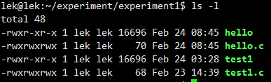
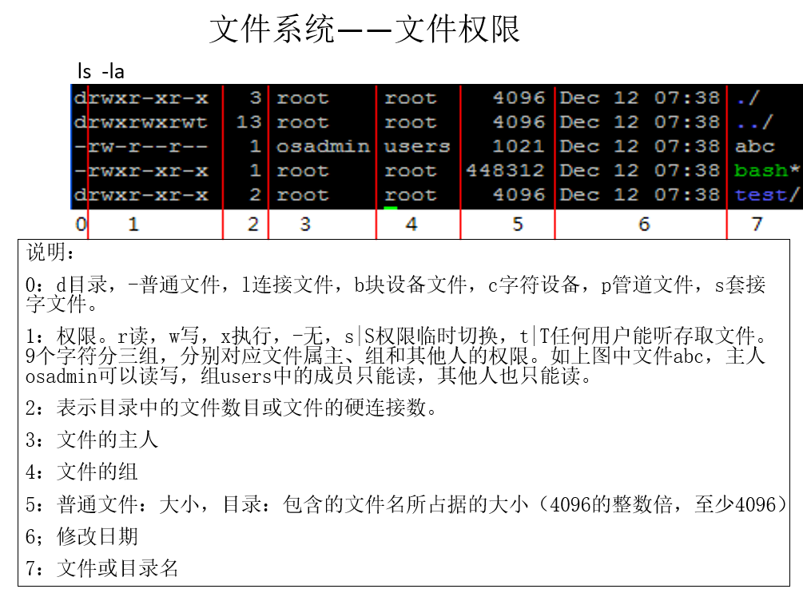
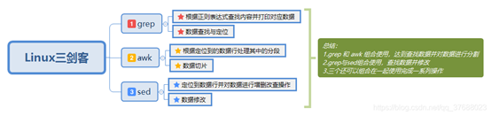

# Linux

---

#	lrzsz

rz上传文件，sz下载文件

#	tar


#	强制停止当前命令

Ctrl+C


#	常用命令

https://blog.csdn.net/qq_23329167/article/details/83856430


#	目录


#	全局变量


#	chown

chown（英文全拼：**change owner**）命令用于设置文件所有者和文件关联组的命令。

```
chown [-cfhvR] [--help] [--version] user[:group] file...
```

> - user : 新的文件拥有者的使用者 ID
> - group : 新的文件拥有者的使用者组(group)
> - -c : 显示更改的部分的信息
> - -f : 忽略错误信息
> - -h :修复符号链接
> - -v : 显示详细的处理信息
> - -R : 处理指定目录以及其子目录下的所有文件
> - --help : 显示辅助说明
> - --version : 显示版本

# chmod

修改文件、目录的权限

1. chmod [操作对象] [操作符] [赋予的权限] 文件名

   > 操作对象：
   >
   > > u  用户user，表现文件或目录的所有者
   > >
   > > g  用户组group，表现文件或目录所属的用户组
   > >
   > > o  其他用户other
   > >
   > > a  所有用户all
   >
   > 操作符：+ 添加权限       -  减少权限         =直接给定一个权限
   >
   > 权限：r w x

2. 数字表示权限

   > ​          		  r      w      x
   >
   > 二进制代表100  010  001
   >
   > 十进制代表  4       2     1


#	systemctl和service文件

https://blog.csdn.net/weixin_39963341/article/details/111107237


# 默认目录

/bin bin是binary的缩写，存放二进制的可执行文件。对UNIX系统习惯的沿袭，存放着使用者最经常使用的命令，例如ls,cat。

/boot 启动LINUX时使用的一些核心文件。

/dev dev是device(设备)的缩写。这个目录下是所有LINUX的外部设备，其功能类似DOS下的.sys和Win下的.vxd。在LINUX中设备和文件是用同种方法访问的。例如:/dev/hda代表第一个物理IDE硬盘。

/etc： etcetera 的缩写。这个目录用来存放所有的系统管理所需要的配置文件和子目录。

/etc/resolv.conf ：DNS配置文件

nameserver 10.0.0.254

nameserver 223.5.5.5

nameserver：域名解析服务器

/etc/hostname：存放hostname，可通过hostname命令查看

/etc/hosts： ip与域名对应关系 解析域名（主机名）如111.13.28.119 xxx[.com](http://jd.com/) abcdx,可通过cat /etc/hosts查看

/etc/fstab ： file system table 文件系统挂载表，开机的时候设备与入口对应关系 开机自动挂载列表。

/etc/init.d/： 中包含许多系统服务的启动和停止脚本。它控制着所有从 acpid 到 x11-common 的各种事务。注：acpid 是 Linux 操作系统新型电源管理标准 ，X11 也叫做 X Window 系统。/etc/init.d/command 参数，其中参数主要为start 、stop 、restart、 reload、 force-reload。

/etc/rc.d/init.d ：这个/etc/init.d 是符号链接文件，实际上是链接到目录 /etc/rc.d/init.d，可以通过以下命令验证：ls-ld /etc/init.d。service 文件是使用 systemd 作为初始化程序的 Linux 系统才有的服务文件，叫“服务配置单元文件”，用来取代旧初始化系统中的脚本文件，但是他们可能会同时存在系统中。如果同时存在的话，在目录 /etc/init.d/ 下的脚本文件的优先级会高于目录 /etc/systemd/system/ 下的 service 文件。命令格式为service xxxx start|stop|restart。

/etc/rc.local：该脚本是在系统初始化级别的脚本运行之后再执行的，因此可以安全地在里面添加你想在系统启动之后执行的脚本。常见的情况是你可以在里面添加 NFS 挂载 /mount 脚本。例如在 /etc/rc.local 脚本里加上/etc/init.d/samba start。

/etc/inittab ：这是 init 程序的配置文件，系统的运行级别就是在 /etc/inittab 文件里指定，所谓“运行级”就是操作系统当前正在运行的功能级别。这个级别从1 到6 ，具有不同的功能。

/etc/init/ ：包含的是 Upstart（SysV init的替代版本）的配置文件，和 /etc/init.d/ 的作用几乎差不多。这样似乎 /etc/init/ 可以看作 /etc/init.d/ 的演化版本。

/etc/profile: 环境变量配置文件，可echo $varxx查看

/etc/bashrc： 别名（命令小名），全局生效

/etc/motd：文件中的内容 会在用户登录系统之后显示出来

/etc/issue /etc/[http://issue.net](http://issue.net/)：文件中的内容 会在用户登录系统之前显示出来

/home 用户的主目录，比如说有个用户叫wang，那他的主目录就是/home/xx也可以用~xx表示。Linux中，每一个用户都有一个自己的目录，目录以用户的账号命名。

/lib library的缩写，存放着系统最基本的动态链接共享库，其作用类似于Windows里的.dll文件。几乎所有的应用程序都需要用到这些共享库。

/lost+found 这个目录平时是空的，当系统不正常关机后，这里就成了一些无家可归的文件的避难所。有点类似于DOS下的.chk文件。

/media：该目录下存放的是Linux自动识别的一些设备，如：U盘、光驱等等。。

/mnt 这个目录是空的，系统提供这个目录是让用户临时挂载别的文件系统。

/opt：该目录存放服务器额外安装的一些软件，默认是空的。

/proc proc 是 Processes(进程) 的缩写，这个目录是一个虚拟的目录，它是系统内存的映射，我们可以通过直接访问这个目录来获取系统信息，这个目录的内容不在硬盘上而是在内存。当使用 ls -al /proc这条命令来查看proc目录时， 会发现其下面的所有文件的大小都为0字节。 proc以文件系统的方式为访问系统内核的操作提供接口。这个目录的内容不在硬盘上而是在内存里，我们也可以直接修改里面的某些文件，比如可以通过下面的命令来屏蔽主机的ping命令，使别人无法ping你的机器：echo 1 > /proc/sys/net/ipv4/icmp_echo_ignore_all

/proc/cpuinfo CPU的信息(型号、家族、缓存大小等)，通过cat /proc/cpuinfo查看

/proc/meminfo物理内存、交换空间

/proc/mounts 已加载的文件系统的列表

/proc/devices 可用设备的列表

/proc/filesystems 被支持的文件系统

/proc/modules 已加载的模块

/proc/version 内核版本

/proc/cmdline 系统启动时输入的内核命令行参数

/proc/uptime 获取系统的正常运行时间

/proc/sys/kernel/ostype 操作系统类型

/proc/sys/kernel/osrelease 内核版本

/proc/sys/kernel/hostname 主机名

/proc/partitions 硬盘设备分区信息

/proc/N pid为N的进程信息，如ls /proc/

/proc/N/cmdline 进程启动命令,如 cat /proc/158/cmdline

/proc/N/exe 链接到进程的执行命令文件，如ls -al /proc/158/exe

/proc/N/cwd 链接到进程当前工作目录，如 ls /proc/158/cwd

/proc/N/environ 进程环境变量列表 ,cat

/proc/N/fd 包含进程相关的所有的文件描述符# ls /proc/158/fd

/proc/N/stat 进程的状态 cat

/proc/N/status 进程状态信息，比stat更具可读性

/root 系统管理员，也叫作超级权限者的用户主目录。

/run该目录下存放系统启动以来的信息。如果系统重启，这个目录下的文件应该被删掉或清除。

/sbin s就是Super User或system的意思，也就是说这里存放的是一些系统管理员使用的二进制系统管理程序。

/selinux 这个目录是 Redhat/CentOS 所特有的目录，Selinux 是一个安全机制，类似于 windows 的防火墙，但是这套机制比较复杂，这个目录就是存放selinux相关的文件的。

/srv新标准才有，service的缩写，该目录存放服务启动之后需要提取的数据和存放对外的服务，如apache放置/srv/www。

/sys 这是Linux2.6 内核的一个很大的变化。该目录下安装了 2.6 内核中新出现的一个文件系统 sysfs 。

sysfs 文件系统集成了下面3种文件系统的信息：针对进程信息的 proc 文件系统、针对设备的 devfs 文件系统以及针对伪终端的 devpts 文件系统。该文件系统是内核设备树的一个直观反映。

当一个内核对象被创建的时候，对应的文件和目录也在内核对象子系统中被创建。

/tmp该目录用来存放一些临时文件。

/usr 是unix system resource的缩写。存放一些系统级别的资源/应用，比如MySQL，这是个最庞大的目录，我们要用到的很多应用程序和文件几乎都存放在这个目录下。/usr/local和/opt，前者可以比作window里的program files，后者可以比作D盘下的某一个安装目录，也叫第三方程序，就是一般不和别的程序打交道。注意：是应用程序，不是系统程序，这么解释了希望能帮到你区分了。

/usr/X11R6存放X-Windows的目录；

/usr/bin存放着许多应用程序；

/usr/sbin给超级用户使用的一些管理程序；

/usr/doc 存放LINUX文档的大本营；

/usr/include 存放开发和编译应用程序需要的头文件；

/usr/lib存放一些常用的动态链接共享库和静态档案库；

/usr/local 这是提供给一般用户的/usr目录，在这安装软件最适合；

/usr/man 帮助手册

/usr/src 存放LINUX开放的源代码。

/var不像/usr目录比较固定，这里存放经常被修改的目录，如系统存放日志/var/log

补充：

rc，runcommand的缩写，运行命令脚本文件的后缀。这些脚本通常在程序的启动阶段被调用，通常是Linux系统启动时。如 /etc/rs是Linux启动的主脚本，而.bashrc是当Linux的bash shell启动后所运行的脚本。.bashrc的前缀“.”是一个命名标准，它被设计用来在用户文件中隐藏那些用户指定的特殊文件;“ls”命令默认情况下不会列出此类文件，“rm”默认情况下也不会删除它们。许多程序在启动时，都需要“rc”后缀的初始文件或配置文件。


# 文件权限



1. 第一列的第一个字符表示文件的类型

   d：文件夹
   -：普通文件
   l：软链接（类似Windows的快捷方式）
   b：块设备文件，装置文件里面的可供存储的接口设备（可随机存取装置，例如硬盘、光驱等）
   p：管道文件
   c：字符设备文件，装置文件里面的串行端口设备（一次性读取装置例如键盘，鼠标，屏幕等串口设备）
   s：套接口文件

2. 第一列剩余字符表示操作权限

   1. 对于文件来说权限是用来限制用户对自己的操作的，而文件自己一般只有三个操作：

      > 读（read）：具有读取文件内容的权限限。
      > 写（write）： 具有修改文件内容的权限的权限。
      > 执行（execute）：具有执行文件的权限。

   2. 对于一个目录文件来说又有点不一样了，虽然有也是同样的三个操作，但是效果不一样。

      > 读（read）：查看目录下的文件列表的权限。
      > 写（write）： 具有删除移动目录内文件和创建文件的权限 。
      > 执行（execute）：具有进入目录的权限。

   3. 对于一个文件来说能访问它的用户大致分为三种： 拥有者(owner)、所属组(group)、其他(other)

      > 拥有者(owner)：文件和文件目录的所有者。
      > 所属组(group)：文件和文件目录的所有者所在的组的用户。
      > 其它用户(other)：不属于上面的两个。

   4. rwx的顺序是固定的，每个位置表示的就 读、写、执行，没有用 `—` 表示。

   4. 文件的s权限:表示set UID或set GID。位于user或group权限组的第三位置。如果在user权限组中设置了s位，则当文件被执行时，该文件是以文件所有者UID而不是用户UID 执行程序。如果在group权限组中设置了s位，当文件被执行时，该文件是以文件所有者GID而不是用户GID执行程序。s权限位是一个敏感的权限位，容易造成系统的安全问题。请在设置时小心，并注意系统中已有的SUID或SGID文件和目录。

3. 第二列是联结，**如果是目录的话**，这个数字表示当前这个目录下面的一级目录个数；**如果是文件的话**，数字表示硬链接个数。（硬链接个数：可以简单的理解为一个文件的文件名个数，比如a文件的文件名有s和j两个，因为s和j指向同一个a，改动s或j都会对a造成改变）

4. 第三四列是文件的拥有者和所属组，不属于这两个的就是other。

5. 第五列是文件容量




# apt

dpkg 用于安装本地的 .deb 包，处理依赖的能力较差。

apt 是基于 dpkg 封装好的软件包管理工具，它从软件源安装软件，并能较好地处理软件依赖，使用起来更加方便。

在 shell 中通常使用 apt，因为可以少打 4 个字符。在脚本中安装软件通常使用 apt-get，兼容性更好，通常在脚本中使用。

1. 更新本地的存储库

   `apt update`

   apt 从软件源安装软件，它需要在本地维护一个软件源的存储库，这样就能在存储库中搜索软件包了。但软件源中的软件包信息是频繁更新的，如果你想使用更新版本的软件，你就需要先更新本地的存储库，再进行软件安装。

2. 安装软件包

   `apt install xxx` 

3. 查看软件包

   `apt list --installed | grep program_name`

   查看软件包的具体信息

   `apt show xxx`

4. 卸载软件包

   ```
   # 卸载软件，保留相关文件
   apt remove xxx
   # 卸载软件并删除相关文件
   apt autoremove xxx
   ```

5. 更新软件包

   `apt upgrade`
   
5. 更新单个软件包

   `sudo apt install --only-upgrade package_name`
   
7. `dpkg -L xxx`查看安装路径

8. 获取软件的最新版本

   ```
   curl link | bash	#执行安装脚本
   source ~/.bashrc #环境变量生效
   ```

   


# /etc/passwd文件

/etc/passwd 文件中的内容非常规律，每行记录对应一个用户。

这些用户中的绝大多数是系统或服务正常运行所必需的用户，这种用户通常称为系统用户或伪用户。系统用户无法用来登录系统，但也不能删除，因为一旦删除，依赖这些用户运行的服务或程序就不能正常执行，会导致系统问题。

每行用户信息都以 "：" 作为分隔符，划分为 7 个字段，每个字段所表示的含义如下：

用户名：密码：UID（用户ID）：GID（组ID）：描述性信息：主目录：默认Shell


# make

make是GNU的工程化编译工具，用于编译众多相互关联的源代码文件，以实现工程化的管理，提高开发效率。

linux编译安装中configure、make和make install各自的作用：

- ./configure是用来检测你的安装平台的目标特征的。比如它会检测你是不是有CC或GCC，并不是需要CC或GCC，它是个shell脚本。
- make是用来编译的，它从Makefile中读取指令，然后编译。
- make install是用来安装的，它也从Makefile中读取指令，安装到指定的位置。


**1、configure**

这一步一般用来生成 Makefile，为下一步的编译做准备，你可以通过在 configure 后加上参数来对安装进行控制，比如代码:`./configure --prefix=/usr`上面的意思是将该软件安装在 /usr 下面，执行文件就会安装在 /usr/bin.同时一些软件的配置文件你可以通过指定 --sys-config= 参数进行设定。有一些软件还可以加上 --with、--enable、--without、--disable 等等参数对编译加以控制，你可以通过允许 ./configure --help 察看详细的说明帮助。

**2、make**

这一步就是编译，大多数的源代码包都经过这一步进行编译（当然有些perl或Python编写的软件需要调用perl或python来进行编译）。如果 在 make 过程中出现 error ，你就要记下错误代码（注意不仅仅是最后一行），然后你可以向开发者提交 bugreport（一般在 INSTALL 里有提交地址），或者你的系统少了一些依赖库等，这些需要自己仔细研究错误代码。make 的作用是开始进行源代码编译，以及一些功能的提供，这些功能由他的 Makefile 设置文件提供相关的功能，比如 make install 一般表示进行安装，make uninstall 是卸载，不加参数就是默认的进行源代码编译。
 make 是 Linux 开发套件里面自动化编译的一个控制程序，他通过借助 Makefile 里面编写的编译规范进行自动化的调用 gcc 、ld 以及运行某些需要的程序进行编译的程序。一般情况下，他所使用的 Makefile 控制代码，由 configure 这个设置脚本根据给定的参数和系统环境生成。

**3、make install**

这条命令来进行安装（当然有些软件需要先运行 make check 或 make test来进行一些测试），这一步一般需要你有 **root 权限**（因为要向系统写入文件）


# 环境变量和用户变量

Shell 的变量，可以分为 “环境变量” 和 “自定义变量” 两种类型，两者的区别在于作用范围不同。环境变量可以在其进程的子进程中继续有效，而自定义变量的势力范围则无法延伸到其进程的子进程中。

> 在Linux系统中，与环境变量相关的文件主要包括：
>
> 1. `/etc/profile`：这是一个系统级别的配置文件，在每次登录系统（无论是图形界面还是命令行）时，都会读取这个文件。这个文件通常用于设置环境变量，比如PATH、LD_LIBRARY_PATH等。这个文件对所有用户都有效。当用户第一次登录时,该文件被执行. 并从/etc/profile.d目录的配置文件中搜集shell的设置,即*.sh文件。
>
> 2. `/etc/bashrc`：这个文件是bash shell的配置文件，当启动一个bash shell时，会读取这个文件。这个文件通常用于设置bash shell的行为，比如别名、函数等。这个文件对所有用户都有效。
>
> 3. `~/.profile`：这个文件是当前用户的profile文件，当用户登录系统时，会读取这个文件。这个文件通常用于设置用户级别的环境变量。这个文件只对当前用户有效。
>
> 4. `~/.bashrc`：这个文件是当前用户的bashrc文件，当启动一个bash shell时，会读取这个文件。这个文件通常用于设置用户级别的bash shell行为。这个文件只对当前用户有效。
>
>    > 在Ubuntu系统中，当创建新用户时，新用户的`.bashrc`文件是从`/etc/skel`目录复制过来的。这个过程是在创建新用户的home目录时自动完成的。
>    >
>    > `/etc/skel`目录中的文件和目录模板，当创建新的用户帐号时，这些文件和目录会被复制到新用户的home目录中。这就是为什么新创建的用户会有一个`.bashrc`文件的原因
>
> 5. `/etc/bash.bashrc`：这个文件在Ubuntu和一些基于Debian的系统中，当bash shell被启动时，会在读取用户的`~/.bashrc`文件之前，先读取这个文件。因此，`/etc/bash.bashrc`中的配置会影响所有用户，并且会被用户的`~/.bashrc`文件中的相同配置覆盖。这个文件通常用于设置bash shell的行为，比如别名、函数等。
>
> `~/.bashrc、~/.bash_file`是当前用户目录下的配置信息。

env：显示当前用户的环境变量，但不会显示其自定义变量。
export：功能同 env 一样，也是显示当前用户的环境变量，只不过该命令的输出是按变量名进行排序的。
declare：显示当前 Shell 中定义的所有变量，包括用户的环境变量和自定义变量，该命令的输出按变量名进行排序。
set：功能同 declare 一样，显示当前 Shell 中定义的所有变量，包括用户的环境变量和自定义变量。

export可以设置环境变量。使用 export 设置的变量就成为了环境变量，而没有使用 export 设置的则是自定义变量。但是export命令新增加的环境变量只有在**每次登陆**时有效。

配置全局环境变量时要使用`source /etc/profile`更新环境变量


# 环境变量PS1配置

PS1 是Prompt String 1的缩写，它是Linux/Unix下的一个用于控制提示信息的环境变量，PS1是交互式的shell用于控制用户输入提示信息的环境变量，类似的环境变量还有PS2、PS3和PS4。

https://zhuanlan.zhihu.com/p/340003720


# vsftpd配置文件

/etc/vsftpd.conf

/etc/vsftpd.chroot_list

https://vps.yangmao.info/172494.html

https://blog.csdn.net/zjt597778912/article/details/122030309

- 主动模式：客户端向FTP服务器发送端口信息，由服务器主动连接该端口。
- 被动模式：FTP服务器开启并发送端口信息给客户端，由客户端连接该端口，服务器被动接受连接。

FTP支持以下三种认证模式：

匿名用户模式：任何人无需密码验证就可以直接登录到FTP服务器。这种模式最不安全，一般只用来保存不重要的公开文件，不推荐在生产环境中使用。
本地用户模式：通过Linux系统本地账号进行验证的模式，相较于匿名用户模式更安全。
虚拟用户模式：FTP服务器的专有用户。虚拟用户只能访问Linux系统为其提供的FTP服务，而不能访问Linux系统的其它资源，进一步增强了FTP服务器的安全性。


# find

https://cloud.tencent.com/developer/article/1348438


# /etc/sudoer

https://zhuanlan.zhihu.com/p/43934300


#  System V IPC

https://zhuanlan.zhihu.com/p/574446747


# 文本处理



1. 


# 软/硬链接

Linux 链接分两种，一种被称为硬链接（Hard Link），另一种被称为符号链接（Symbolic Link）。默认情况下，**ln** 命令产生硬链接。

**硬连接**

硬连接指通过索引节点来进行连接。在 Linux 的文件系统中，保存在磁盘分区中的文件不管是什么类型都给它分配一个编号，称为索引节点号(Inode Index)。在 Linux 中，多个文件名指向同一索引节点是存在的。比如：A 是 B 的硬链接（A 和 B 都是文件名），则 A 的目录项中的 inode 节点号与 B 的目录项中的 inode 节点号相同，即一个 inode 节点对应两个不同的文件名，两个文件名指向同一个文件，A 和 B 对文件系统来说是完全平等的。删除其中任何一个都不会影响另外一个的访问。

硬连接的作用是允许一个文件拥有多个有效路径名，这样用户就可以建立硬连接到重要文件，以防止“误删”的功能。其原因如上所述，因为对应该目录的索引节点有一个以上的连接。只删除一个连接并不影响索引节点本身和其它的连接，只有当最后一个连接被删除后，文件的数据块及目录的连接才会被释放。也就是说，文件真正删除的条件是与之相关的所有硬连接文件均被删除。

**软连接**

另外一种连接称之为符号连接（Symbolic Link），也叫软连接。软链接文件有类似于 Windows 的快捷方式。它实际上是一个特殊的文件。在符号连接中，文件实际上是一个文本文件，其中包含的有另一文件的位置信息。比如：A 是 B 的软链接（A 和 B 都是文件名），A 的目录项中的 inode 节点号与 B 的目录项中的 inode 节点号不相同，A 和 B 指向的是两个不同的 inode，继而指向两块不同的数据块。但是 A 的数据块中存放的只是 B 的路径名（可以根据这个找到 B 的目录项）。A 和 B 之间是“主从”关系，如果 B 被删除了，A 仍然存在（因为两个是不同的文件），但指向的是一个无效的链接。


# bash和shell

**bash是一种Unix shell**，它是GNU计划的一部分，是Bourne shell(Bash父级)的替代品。shell是一种通用的命令行界面程序，用于与操作系统交互并实现用户和计算机的交互。因此，**shell是一种程序**，为命令行提供了一个解释器，可以允许用户与操作系统进行直接交互。

特别地，bash是一种shell程序，因此bash具有所有shell的特性，比如可以运行命令、解析变量、重定向标准输入/输出等。但与其他shell不同的是，bash提供了许多其他功能，比如命令历史记录、作业控制、别名、条件测试和脚本解析等额外的功能。

因此，虽然bash是一种shell程序，但与其他shell程序相比，它包含了更多特定的功能。


# "bash  sh4"和"./sh4"和"source sh4"有什么区别

这三种方法都可以用来执行一个名为sh4的bash脚本，但它们之间有以下区别：

- `bash sh4`：这种方法使用bash解释器显式地执行脚本文件。它会创建一个新的bash进程来解释脚本，并按照脚本中的命令进行操作。这种方法可以在任何位置执行脚本，前提是sh4文件存在并且拥有执行权限。
- `./sh4`：这种方法使用当前shell解释器执行脚本文件。它会尝试在当前工作目录中查找名为sh4的文件，并使用当前shell中配置的脚本解释器来运行该脚本。这种方法必须通过在此脚本所在的目录中运行来执行，因为它需要找到该文件。此外，该文件需要有执行权限。
- `source sh4`：这种方法是在当前shell环境中直接读取并执行sh4脚本的内容。这个方法通常是在需要将脚本中定义的变量和函数导入到当前shell环境中使用时使用的。使用该方法执行脚本时，脚本中的任何修改都会影响当前shell环境。需要注意的是，使用"source"或"."这两个命令来执行脚本文件时，不需要该文件有执行权限。


# Sha-Bang(#!)

Sha-Bang是Sharp和Bang的组合词。Sharp for #, Bang for ! .

Sha-Bang(#!)不是注释。Sha-Bang(#!)所在行的作用是告知该脚本使用的是哪种命令解释器，并不是可有可无的。虽然很多情况下省略了Sha-Bang(#!)仍然能够运行脚本，这是由于系统在这种情况下是默认使用了当前命令行解释器。

Sha-Bang(#!)应该位于脚本的第一行，并且顶格填写，否则都是错的，即使Sha-Bang之前的内容都是注释，这种错误是常见的，而且不易发现的，因为此时Sha-Bang(#!)所在行实际上是不起效的，系统使用了默认的命令行解释器。

只有第一行的Sha-Bang(#!)会生效，其余的会视为注释。

这是有利于移植脚本到其它平台的写法。


# nohup

> 如果你正在运行一个进程，而且你觉得在退出帐户时该进程还不会结束，那么可以使用nohup命令。该命令可以在你退出帐户/关闭终端之后继续运行相应的进程。nohup就是不挂起的意思(no hang up)

```bash
nohup Command [Arg...] [ &]

# nohup命令提交作业时，指定输出文件：
nohup command > myout.file 2>&1 &
```

> 0 – stdin (standard input，标准输入) 
> 1 – stdout (standard output，标准输出)
> 2 – stderr (standard error，标准错误输出) 
> 2>&1解释：
> 将标准错误（2）重定向到标准输出（&1），
> 标准输出（&1）再被重定向输入到myout.file文件中。

- 最后的" &"：表示后台运行，不霸占交互命令行
- 如果不将 nohup 命令的输出重定向，输出将附加到当前目录的 nohup.out 文件中。
    如果当前目录的 nohup.out 文件不可写，输出重定向到 $HOME/nohup.out 文件中。
- 如果没有文件能创建或打开以用于追加，那么 Command 参数指定的命令不可调用。
- 如果标准错误是一个终端，那么把指定的命令写给标准错误的所有输出作为标准输出重定向到相同的文件描述符。

> https://juejin.cn/post/6844903860272660494