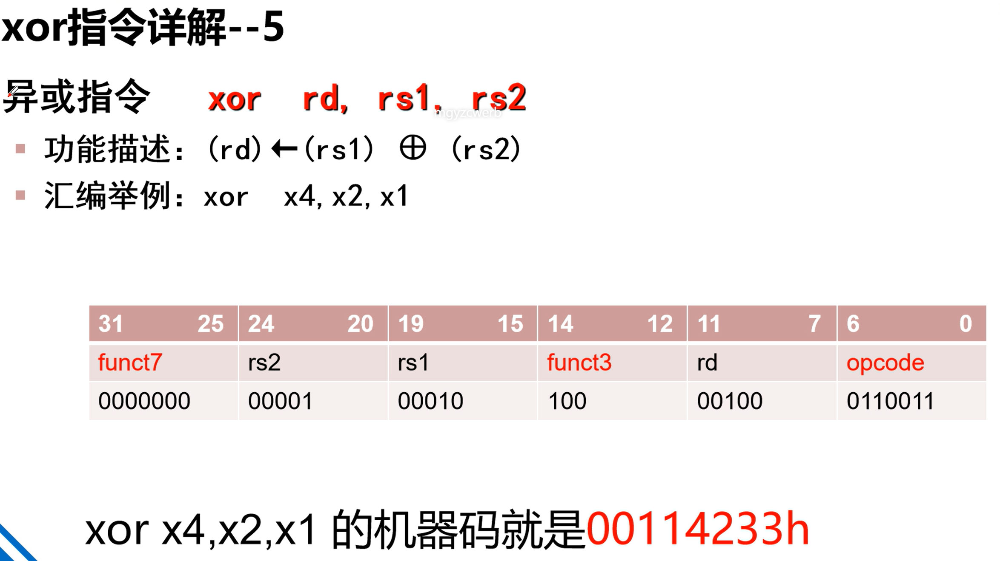
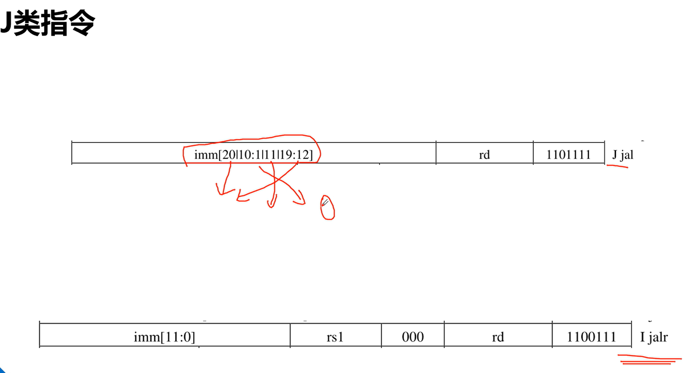

# RISC-V

---

# R类指令

## add

## sub

## and

## or

## xor

## sll

## srl

## sra

## slt

## sltu

# I类指令

---

## addi

## ori

## xori

## slti

## sltiu

## slli

## srli

## srai

# load指令

---

## lw

## lb

## lbu

## lh

## lhu

# S类指令

---

## sw

## sb

## sh

# U类指令

---

## lui

## auipc

# B类指令

---

## beq

## bne

## blt

## bgeu

# J类指令

---

## jal

## jalr

# 数据输入输出

---

