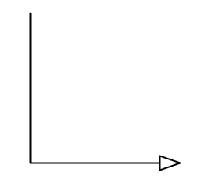
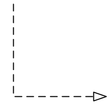
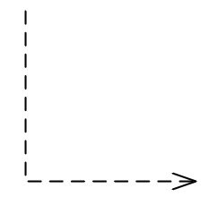
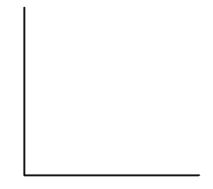
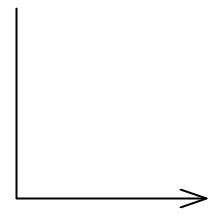
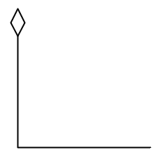
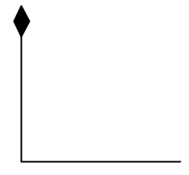

# UML

---

# 箭头含义

1. 泛化(继承)

   **实线空心箭头**

   

2. 实现

   **虚线空心三角形箭头表示，实现类指向接口**

   

3. 依赖（Java中指ClassA的某个方法的入参是ClassB）

   **虚线箭头**

   

4. 关联（Java中指ClassA中有一个成员的类型的ClassB）

   > 表示类与类之间的联接，使一个类使用另一个类的属性和方法，这种关系比依赖更强、不存在依赖关系的偶然性、关系也不是临时性的，一般是长期性的

   **关联无箭头，直接关联为实线箭头**

   

   

5. 聚合（Java中指ClassA中有一个成员的类型的ClassB）

   > 聚合是关联关系的一种特例，是更强的关联关系。聚合是整体和个体之间的关系，即`has-a`的关系;整体与个体可以具有各自的生命周期，部分可以属于多个整体对象，也可以为多个整体对象共享。程序中聚合和关联关系是一致的，只能从语义级别来区分

   **尾部为空心菱形的实线箭头**

   

6. 组合/复合

   > 组合也是关联关系的一种特例。组合是一种整体与部分的关系，即`contains-a的`关系，比聚合更强。部分与整体的生命周期一致，整体的生命周期结束也就意味着部分的生命周期结束，组合关系不能共享。程序中组合和关联关系是一致的，只能从语义级别来区分。

   **尾部为实心菱形的实现箭头**

   