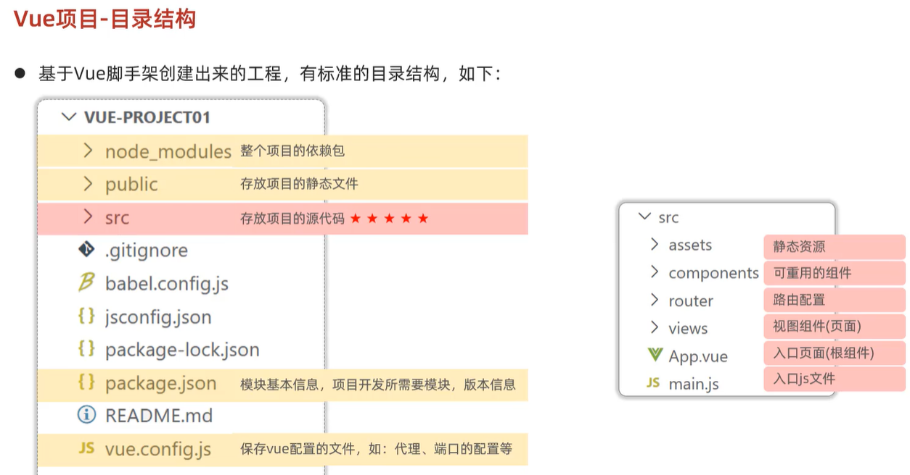

# Vue.js

---


# 组件

> Vue的组件文件以.vue结尾，每个组件由三个部分组成:`<template>、<script>、<style>`

1. template

    模板部分，生成HTML代码

2. script

    控制模板的数据来源和行为

3. style

    css样式部分

# Vue CLI

> Vue.js 开发的标准工具
>
> Vue CLI 是一个基于 Vue.js 进行快速开发的完整系统，提供：
>
> - 通过 `@vue/cli` 实现的交互式的项目脚手架。
> - 通过 `@vue/cli` + `@vue/cli-service-global` 实现的零配置原型开发。
> - 一个运行时依赖 (`@vue/cli-service`)，该依赖：
>     - 可升级；
>     - 基于 webpack 构建，并带有合理的默认配置；
>     - 可以通过项目内的配置文件进行配置；
>     - 可以通过插件进行扩展。
> - 一个丰富的官方插件集合，集成了前端生态中最好的工具。
> - 一套完全图形化的创建和管理 Vue.js 项目的用户界面。
>
> Vue CLI 致力于将 Vue 生态中的工具基础标准化。它确保了各种构建工具能够基于智能的默认配置即可平稳衔接，这样你可以专注在撰写应用上，而不必花好几天去纠结配置的问题。与此同时，它也为每个工具提供了调整配置的灵活性，无需 eject。

## 目录结构




# Element

> 一套为开发者、设计师和产品经理准备的基于 Vue 2.0 的桌面端组件库。
>
> 组件：组成网页的部件，例如 超链接、按钮、图片、表格、表单、分页条等等。


## 引入

1. npm安装

    ```vue
    npm i element-ui -S
    npm install element-ui@2.15.3	// vue 2
    
    import ElementUI from 'element-ui'
    import 'element-ui/lib/theme-chalk/index.css'
    
    Vue.use(ElementUI);
    ```

2. CDN引入

    ```js
    <!-- 引入样式 -->
    <link rel="stylesheet" href="https://unpkg.com/element-ui/lib/theme-chalk/index.css">
    <!-- 引入组件库 -->
    <script src="https://unpkg.com/element-ui/lib/index.js"></script>
    ```
