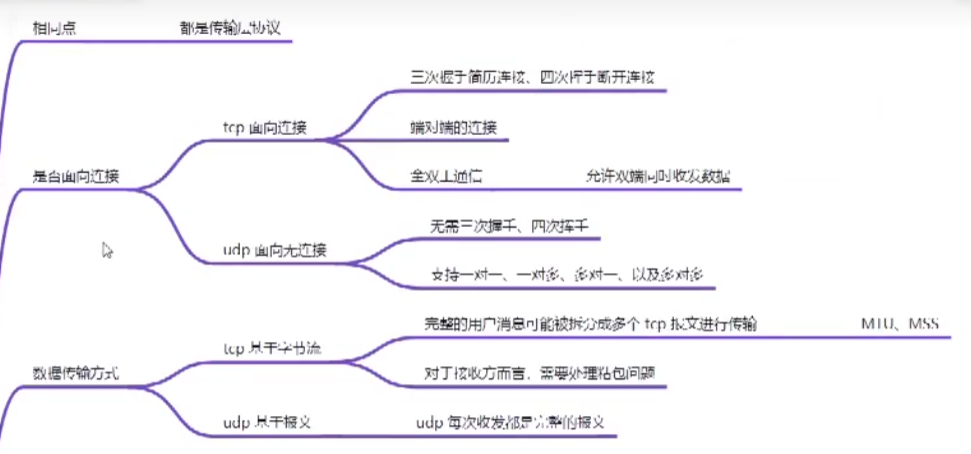
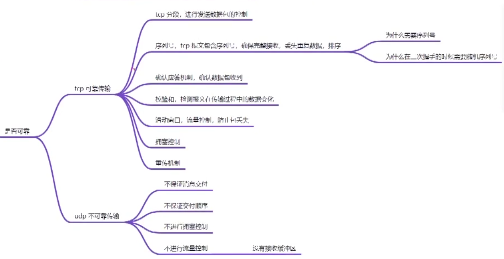
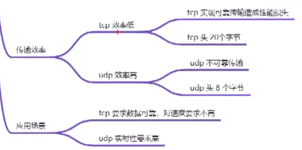
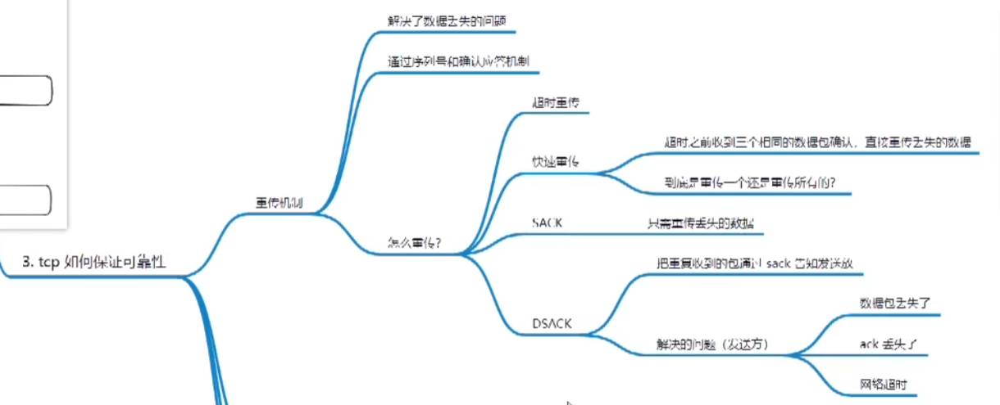
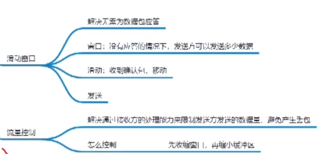

# new/malloc和delete/free的区别

1. malloc和feree是C语言中的库函数，new和delete是C++中的操作符

2. new根据对象类型自动计算所需分配内存大小，malloc需要手动指定分配内存大小

3. new的返回值是对象类型的指针，malloc返回void * 

4. new分配失败会返回异常，malloc分配失败返回NULL

5. new操作符从**自由存储区（free store）**上为对象动态分配内存空间

    malloc函数从**堆**上动态分配内存，先从内存池分配，如果内存池不够再使用系统调用分配堆空间，小于128K使用brk系统调用，超过128K后使用mmap系统调用且可能分配的是文件映射区

    > 自由存储区是C++基于new操作符的一个抽象概念，凡是通过new操作符进行内存申请，该内存即为自由存储区。
    >
    > 而堆是操作系统中的术语，是操作系统所维护的一块特殊内存，用于程序的内存动态分配，C语言使用malloc从堆上分配内存，使用free释放已分配的对应内存。
    >
    > 自由存储区是否能够是堆（问题等价于new是否能在堆上动态分配内存），这取决于operator new 的实现细节。自由存储区不仅可以是堆，还可以是静态存储区，这都看operator new在哪里为对象分配内存。

6. malloc与new都会分配虚拟内存，但是malloc分配完后因为没有初始化所以不一定会有物理内存，而new因为会调用构造函数所以会分配物理内存

7. delete需要对象类型的指针，因为要调用析构函数，而free使用void*类型的指针，因为malloc分配内存时会多分配16字节的内存来存储内存块的描述信息，然后右偏移16个字节再返回首地址，free时会左偏移16字节获取内存块的描述信息再释放具体的内存空间大小

7. 如果是使用brk系统调用分配的内存，free后的内存会回收到内存池中，而mmap分配的则会释放内存

# TCP和UDP的区别

慢开始;拥塞避免;快重传;快恢复

# STL

---

> STL包括容器、迭代器和算法
> 其中容器包括顺序容器（vector，list）和关联性容器（map，set）
> 算法包括排序算法和复制算法，包括容器特定的算法
> 迭代器的目的是在不暴露容器内部结构的前提下，实现对容器的遍历

## hashtable的实现

- 在STL中的hashtable通过开链法来解决哈希冲突，具体通过一个vector数组和链表来实现。
- 当要插入元素时，首先计算出该元素的哈希值，然后将值映射到哈希表的索引。如果当前索引处没有元素，则将该值插入指向链表的头部。如果该处已经有其他元素，则插入该处链表的尾部，以此通过链表将元素穿起来。
- 当要查找元素时，先计算出该元素的索引，然后遍历该处链表进行查找
- 哈希表的大小在创建时进行确定，在容器中提供了一系列质数，因为质数能更好的分布哈希值，避免哈希冲突。当哈希表中的（哈希表元素个数/哈希表大小）超过阈值，则寻找下一个质数，创建新的vector数组，扩大哈希表，并进行元素转移
- hashtable时c++98中的，在c++11标准中，改为unordered_map

## slist的实现

- slist为**单向链表**，其中每一个结点通过
- 结构体实现，包括一个指针和一个元素
- 所以结构体中只存储了下一个结点的指针，减少了一半的内存消耗
- 单向链表不允许后退，所以设计了一种单向迭代器，

## list的实现

- list是双向链表，具体的实现可以分为节点定义和迭代器定义、构造函数定义、插入删除定义
- 在结点定义中，在结构体内定义了前后指针和元素
- 在迭代器定义中，为双向迭代器，通过模版定义了value_type,reference,pointer,difference_type,并且定义了一个node结点，表示当前迭代器指向的结点
- 插入删除中，可以分别向前和向后插入删除

## vector的实现

- vector底层数据结构为连续的内存空间，和array类似。但array在定义时，空间大小就无法再更改。vector可以动态扩展内存。
- 具体vector的内部维护了三个指针，即起始位置，最后一个元素位置，内存空间的最后一个位置。
- 当元素数量超过最大容量时，将容量扩展为两倍，并进行元素复制。在这个过程中，通过迭代器和移动语义减少内存拷贝。

## stack和queue的实现

- stack是一种先入后出的数据结构。由于它是单向开口的数据结构，所以很容易由list和deque这种双向开口的数据结构实现，只需要移除部分接口
- 通过修改某个容器的接口，然后变成另外的结构，通常叫做adaptater（适配器），从而将其归为容器适配器
- stack也可以使用list来构建，但是没有迭代器，不能进行遍历

## ++it和it++

- 先++可以直接对this指针进行加法操作，然后返回this指针，不需要创建临时对象

## list和vector的区别

- vector具有连续的内存空间，并且可以实现o1的随机存取
- list是双向链表，内存空间是不连续的，所以随机存取是on的，并且list的每一个节点都包含向前和向后的指针，所以资源消耗较大
- 并且vector可以双向遍历

## vector删除策略

- 由于每次扩容的大小一定等于或大于之前的大小，并且每次分配的空间越多，平摊的时间复杂度低，所以将增长因子设为2，即每次 都翻倍增长，可以直观减少扩容的次数

## 迭代器删除元素

- 顺序容器中，erase使删除迭代器及之后所有迭代器失效，然后返回下一个有效的迭代器
- 关联容器中，erase只是被删除元素的迭代器失效，返回值为void，所以使用erase(it++)