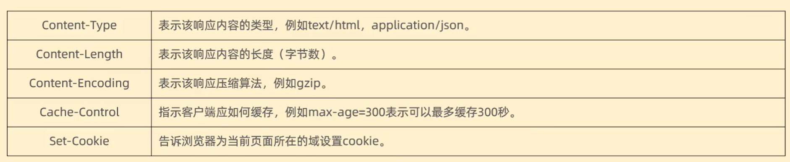

# HTTP

---

## 结构

1. 请求数据格式

    1. 请求行：请求数据第一行(请求方式、资源路径、协议)

        1. **GET:**
            - 用于请求指定的资源。
            - 对服务器的数据请求，不会改变资源的状态。
            - 参数可以附加在URL的末尾，通过查询字符串传递。
            - 有大小限制
        2. **POST:**
            - 用于提交指定资源的数据，通常用于向服务器提交表单数据。
            - 对服务器的数据提交请求，可能导致新的资源的创建。
            - 参数通常包含在请求体中。
            - 无大小限制
        3. **PUT:**
            - 用于更新指定资源或创建一个新资源，如果不存在的话。
            - 对服务器的数据更新请求，会替换整个资源。
            - 参数通常包含在请求体中。
        4. **DELETE:**
            - 用于删除指定资源。
            - 对服务器的数据删除请求。
            - 参数可以包含在URL中或请求体中。
        5. **PATCH:**
            - 用于对资源进行部分更新。
            - 对服务器的局部更新请求，通常用于更新资源的一部分。
            - 参数通常包含在请求体中。
        6. **HEAD:**
            - 与GET类似，但服务器不返回资源主体，只返回响应头信息。
            - 用于获取资源的元信息，而不需要获取实际的资源内容。
        7. **OPTIONS:**
            - 用于描述目标资源的通信选项。
            - 查询服务器支持的HTTP方法，或者询问服务器某些特殊配置信息。
        8. **TRACE:**
            - 用于执行一个消息回环测试，主要用于诊断。
            - 通过服务器传回的消息，客户端可以查看在请求/响应链上发生了什么。
        9. **CONNECT:**
            - 用于与代理服务器建立隧道连接，通常用于加密连接

    2. 请求头：第二行开始，格式key:value

        

    3. 请求体：POST请求存放请求参数

2. 响应数据格式

    1. 响应行：响应数据第一行(协议、状态码、描述)

    2. 响应头：第二行开始，格式key:value

        

    3. 响应体：最后一部分，存放响应数据


## POST与GET区别

Get请求一般是去取获取数据（其实也可以提交，但常见的是获取数据）；post请求一般是去提交数据。
Get是不安全的，因为在传输过程，数据被放在请求的URL中；Post的所有操作对用户来说都是不可见的，请求数据是放在body体中（最常用场景，用户登录密码提交，一定是使用post请求的）
Get传送的数据量较小，这主要是因为受url长度限制；Post传送的数据量较大，一般被默认为不受限制。
Get请求可以被缓存，Post请求不会被缓存


## Cookie和Session的区别与联系

Cookie和Session都是会话技术，Cookie是运行在客户端，Session是运行在服务器端。
Cookie有大小限制以及浏览器在存cookie的个数也有限制，Session是没有大小限制和服务器的内存大小有关。
Cookie有安全隐患，通过拦截或本地文件找得到你的cookie后可以进行攻击。
Session是保存在服务器端上会存在一段时间才会消失，如果session过多会增加服务器的压力。


##	响应状态码

> https://cloud.tencent.com/developer/chapter/13553

一、1xx-信息提示：这些状态代码表示临时的响应。客户端在收到常规响应之前，应准备接收一个或多个1xx响应。
100-继续。
101-切换协议。

二、2xx-成功：这类状态代码表明服务器成功地接受了客户端请求。
**200-确定。客户端请求已成功。**
201-已创建。
202-已接受。
203-非权威性信息。
204-无内容。
205-重置内容。
206-部分内容。

三、3xx-重定向：客户端浏览器必须采取更多操作来实现请求。例如，浏览器可能不得不请求服务器上的不同的页面，或通过代理服务器重复该请求。
301-对象已永久移走，即永久重定向。
**302-对象已临时移动。指示所请求的资源已移动到由Location响应头给定的URL，浏览器会自动重新访问到这个页面。**
**304-服务端未修改资源，客户端直接使用缓存中的内容。**
307-临时重定向。

四、4xx-客户端错误：发生错误，客户端似乎有问题。例如，客户端请求不存在的页面，客户端未提供有效的身份验证信息。400-错误的请求。

**400-客户端请求有语法错误，不能被服务器所理解**

401-访问被拒绝。IIS定义了许多不同的401错误，它们指明更为具体的错误原因。这些具体的错误代码在浏览器中显示，但不在IIS日志中显示：
401.1-登录失败。
401.2-服务器配置导致登录失败。
401.3-由于ACL对资源的限制而未获得授权。
401.4-筛选器授权失败。
401.5-ISAPI/CGI应用程序授权失败。
401.7–访问被Web服务器上的URL授权策略拒绝。这个错误代码为IIS6.0所专用。 403-禁止访问：IIS定义了许多不同的403错误，它们指明更为具体的错误原因：
**403.1-执行访问被禁止。**
**403.2-读访问被禁止。**
**403.3-写访问被禁止。**
**403.4-要求SSL。**
**403.5-要求SSL128。**
**403.6-IP地址被拒绝。**
**403.7-要求客户端证书。**
**403.8-站点访问被拒绝。**
**403.9-用户数过多。**
**403.10-配置无效。**
**403.11-密码更改。**
**403.12-拒绝访问映射表。**
**403.13-客户端证书被吊销。**
**403.14-拒绝目录列表。**
**403.15-超出客户端访问许可。**
**403.16-客户端证书不受信任或无效。**
**403.17-客户端证书已过期或尚未生效。**
**403.18-在当前的应用程序池中不能执行所请求的URL。这个错误代码为IIS6.0所专用。**
**403.19-不能为这个应用程序池中的客户端执行CGI。这个错误代码为IIS6.0所专用。**
**403.20-Passport登录失败。这个错误代码为IIS6.0所专用。**
**404-文件或资源未找到。**
**404.0-（无）–没有找到文件或目录。**
**404.1-无法在所请求的端口上访问Web站点。**
**404.2-Web服务扩展锁定策略阻止本请求。**
**404.3-MIME映射策略阻止本请求。**
**405-用来访问本页面的HTTP谓词不被允许（方法不被允许）。请求方式有误，比如应该用GET请求方式的资源，用了POST**
406-客户端浏览器不接受所请求页面的MIME类型。
407-要求进行代理身份验证。
412-前提条件失败。
413–请求实体太大。
414-请求URI太长。
415–不支持的媒体类型。
416–所请求的范围无法满足。
417–执行失败。
423–锁定的错误。

**428-服务器要求有条件的请求，告诉客户端要想访问该资源，必须携带特定的请求头**

**429-指示用户在给定时间内发送了太多请求(“限速”)，配合 Retry-After(多长时间后可以请求)响应头一起使用**

**431-请求头太大，服务器不愿意处理请求，因为它的头部字段太大。请求可以在减少请求头域的大小后重新提交**

五、5xx-服务器错误：服务器由于遇到错误而不能完成该请求。
**500-内部服务器错误。**
**500.12-应用程序正忙于在Web服务器上重新启动。**
**500.13-Web服务器太忙。**
**500.15-不允许直接请求Global.asa。**
**500.16–UNC授权凭据不正确。这个错误代码为IIS6.0所专用。**
**500.18–URL授权存储不能打开。这个错误代码为IIS6.0所专用。**
**500.100-内部ASP错误。**
501-页眉值指定了未实现的配置。
502-Web服务器用作网关或代理服务器时收到了无效响应。
502.1-CGI应用程序超时。
502.2-CGI应用程序出错。application.
**503-服务不可用。这个错误代码为IIS6.0所专用。**
504-网关超时。
505-HTTP版本不受支持。


## HTTP与HTTPS

### HTTP

HTTP是无状态的、明文的应用层协议，用于在客户端（如浏览器）和服务器之间传输超文本数据。

**特点**

1. **无状态**：每个请求都是独立的，服务器不会自动保留客户端之间的请求数据。
2. **明文传输**：数据以纯文本形式传输，容易被截获和查看。
3. **默认端口**：HTTP使用80端口。

**工作原理**

1. **客户端发起请求**：客户端向服务器发送HTTP请求，包含请求方法（GET、POST等）、URL、协议版本等信息。
2. **服务器处理请求**：服务器接收到请求后处理相应的逻辑，并生成响应。
3. **服务器返回响应**：服务器将响应（包括状态码、响应头和响应体）发送回客户端。

### HTTPS

HTTPS是HTTP的安全版本，通过SSL/TLS（Secure Sockets Layer/Transport Layer Security）协议对数据进行加密传输，确保数据在传输过程中不被窃取或篡改。

**特点**

1. **数据加密**：通过SSL/TLS协议对数据进行加密，保护数据的机密性和完整性。
2. **身份验证**：使用数字证书验证服务器身份，防止中间人攻击。
3. **数据完整性**：确保数据在传输过程中未被篡改。
4. **默认端口**：HTTPS使用443端口。

**工作原理**

1. **SSL/TLS握手**：客户端和服务器首先进行SSL/TLS握手，协商加密算法和会话密钥，建立安全连接。
2. **客户端发起请求**：在建立安全连接后，客户端向服务器发送HTTPS请求，类似于HTTP请求，但通过加密通道传输。
3. **服务器处理请求**：服务器接收到请求后处理相应的逻辑，并生成响应。
4. **服务器返回响应**：服务器将加密的响应发送回客户端，客户端解密后获得响应内容。

### HTTP和HTTPS的区别

1. **安全性**：
    - HTTP：数据以明文形式传输，易被截获和篡改。
    - HTTPS：数据通过SSL/TLS协议加密传输，确保数据的机密性和完整性。
2. **性能**：
    - HTTP：由于没有加密开销，通常比HTTPS稍快。
    - HTTPS：由于加密和解密操作，可能稍慢，但现代硬件和优化技术使得差异非常小。
3. **端口**：
    - HTTP：使用80端口。
    - HTTPS：使用443端口。
4. **应用场景**：
    - HTTP：适用于对安全性要求不高的场景，如公开的静态网页。
    - HTTPS：适用于对安全性要求高的场景，如电子商务、网上银行、社交媒体等。

### 实现HTTPS

为了在网站上实现HTTPS，需要以下步骤：

1. **获取SSL/TLS证书**：从受信任的证书颁发机构（CA）获取SSL/TLS证书。
2. **配置服务器**：将证书安装到Web服务器并配置相关的SSL/TLS设置。
3. **重定向流量**：将所有HTTP流量重定向到HTTPS，以确保所有数据通过加密通道传输。

# TCP

---

## 特点

1. 面向连接：数据传输前两个进程要先互相发送预备报文段，以确定确保数据传输的参数
2. 可靠传输：不丢失、重复、失序
3. 全双工：应用层数据可以同时双向传输
4. 点对点：单个发送方与单个接收方之间的连接
5. 基于字节流：当网络包超过mtu长度之后，会被拆分为多个tcp报文段，若接收方不知道消息边界，则无法进行有效消息传输。并且由于tcp传输是有序的，所以当前一个tcp报文没有收到，后续报文也不会给应用层，而是自动丢弃。


## 报文段结构

1. 首部字段(20字节)
    1. 源端口号和目标端口号
    2. 数据包的序号(4字节)
    3. 确认号，防止丢包(4字节)
    4. 状态位(6bit)
        1. CWR
        2. ECE
        3. URG：指示报文段里存在着被发送端的上层实体置为"紧急"的数据(未使用)
        4. ACK：指示确认字段中的值是有效的，即该报文段包括一个对已被成功接收报文段的确认
        5. PSH：指示接收方应立即将数据交给上层(未使用)
        6. RST：重新连接
        7. SYN：发起连接
        8. FIN：结束连接
    5. 接受窗口大小，只是接收方愿意接受的字节数量，双方约定窗口缓存大小来控制自身发送速度，从而进行流量控制(2字节)
    6. 校验和
2. 数据字段


## 三次握手

1. 第一次握手

    - 客户端向服务器发送一个SYN（Synchronize）报文，表示希望建立连接

    - 这个报文包含一个初始序列号（Sequence Number，简称seq）

    - 客户端进入SYN_SENT状态

    - ```
        Client ----SYN(seq=x)----> Server
        ```

2. 第二次握手

    - 服务器接收到SYN报文后，回应一个SYN-ACK（Synchronize-Acknowledgment）报文，表示同意建立连接，并回应客户端的SYN

    - 这个报文包含服务器的初始序列号（seq=y）和客户端的序列号+1（作为ACK，Acknowledgment Number，简称ack），即服务器发送自己的初始序列号（y），同时确认客户端的序列号（ack=x+1）

    - 服务器进入SYN_RECEIVED状态

    - ```
        Client <----SYN-ACK(seq=y, ack=x+1)---- Server

3. 第三次握手

    - 客户端接收到SYN-ACK报文后，发送一个ACK报文给服务器，确认收到服务器的SYN-ACK报文

    - 这个报文的ack为服务器的序列号+1（ack=y+1），即发送ACK报文确认服务器的序列号（ack=y+1）

    - 客户端进入ESTABLISHED状态，连接建立完成

    - 服务器接收到ACK报文后，也进入ESTABLISHED状态，连接建立完成

    - ```
        Client ----ACK(ack=y+1)----> Server
        ```

4. 为什么需要三次握手

    1. **防止重复连接初始化**：
        - 三次握手确保了双方都能确认对方的接收和发送能力，从而避免了因为网络延迟导致的重复连接初始化问题。例如，假设有一个旧的连接请求SYN报文因网络延迟到达服务器，服务器回应SYN-ACK，若无第三次握手确认，客户端会误认为这是一个新的连接，从而造成资源浪费。
    2. **序列号的同步**：
        - 三次握手过程中，客户端和服务器都发送了自己的初始序列号，并且都确认了对方的序列号。这为后续的数据传输提供了可靠的基础，确保数据按顺序传输和接收。


## 四次挥手

1. **第一步：客户端发送FIN报文**

    - 客户端主动关闭连接，发送一个FIN（Finish）报文给服务器，表示它已经没有数据要发送了。
    - 这个报文包含一个序列号。
    - 表示客户端已经没有数据要发送了，请求关闭数据传输。

    ```
    Client ----FIN----> Server
    ```

2. **第二步：服务器发送ACK报文**

    - 服务器接收到FIN报文后，发送一个ACK（Acknowledgment）报文给客户端，确认接收到FIN报文。
    - 这个ACK报文的序列号是客户端发送的FIN报文的序列号加1。
    - 确认已经收到客户端的FIN报文，但服务器可能还在处理未发送完的数据。

    ```
    Client <----ACK---- Server
    ```

3. **第三步：服务器发送FIN报文**

    - 如果服务器也没有数据要发送了，它会发送一个FIN报文给客户端，表示它也要关闭连接。
    - 这个FIN报文包含自己的序列号。
    - 服务器确认已经没有数据要发送了，请求关闭连接。

    ```
    Client <----FIN---- Server
    ```

4. **第四步：客户端发送ACK报文**

    - 客户端接收到服务器的FIN报文后，发送一个ACK报文给服务器，确认接收到服务器的FIN报文。
    - 这个ACK报文的序列号是服务器发送的FIN报文的序列号加1。
    - 确认已经收到服务器的FIN报文，准备彻底关闭连接。
    - 在发送完这个ACK报文后，客户端进入TIME_WAIT状态，等待一段时间（通常是2倍的最大报文段生存时间，2MSL（Maximum Segment Lifetime，最大报文生存时间））以确保服务器收到ACK报文。如果服务器没有收到ACK报文，会重新发送FIN报文。TIME_WAIT时间结束后，客户端彻底关闭连接。

    ```
    Client ----ACK----> Server
    ```

5. TIME_WAIT状态

    - 客户端在发送最后一个ACK报文后进入TIME_WAIT状态。
    - TIME_WAIT状态持续时间为2MSL（Maximum Segment Lifetime，最大报文生存时间）。
    - TIME_WAIT状态的目的是确保客户端最后的ACK报文能够到达服务器。如果服务器没有收到ACK报文，会重传FIN报文，客户端在TIME_WAIT状态还能接收到这个重传的FIN报文并再次发送ACK报文。

6. 为什么需要四次挥手

    TCP的四次挥手过程确保了双方在断开连接前都能正确接收和处理所有数据，避免数据丢失和连接不一致的情况。客户端和服务器在整个过程中都要发送和接收确认报文，以保证连接的可靠关闭。这种机制使得TCP连接的关闭过程既可靠又有序。


## 分割数据

MTU：一个网络包的最大长度
MSS：除去ip和tcp头部，剩余容纳数据段的最大长度
数据被划分为mss长度，加上tcp头部，然后送给ip模块进行发送


## 多路复用/分解

TCP多路复用/分解（TCP Multiplexing/Demultiplexing）是指在TCP协议中，通过套接字（socket）来区分和管理不同的连接，以便能够在同一台服务器上处理多个客户端的连接请求。

**多路复用/分解的工作原理**

TCP多路复用/分解的关键在于四元组（4-tuple），即每个TCP连接都由以下四个要素唯一标识：

1. 源IP地址
2. 源端口号
3. 目标IP地址
4. 目标端口号

在服务器上，当多个客户端连接到同一IP地址和端口时，服务器能够通过这些四元组唯一标识每个连接，并使用相应的套接字处理它们。

**多路复用**

多路复用指的是在同一个服务器端口上同时处理多个客户端连接的能力。每个客户端连接会有一个独立的套接字用于通信，即使它们连接到同一个服务器端口。

**分解**

分解是指服务器在收到一个数据包时，能够根据数据包中的目标端口号和源IP地址、源端口号，将数据包交给正确的处理程序或线程。服务器通过这些信息识别不同的连接并处理相应的数据。

# 键入网址到网页显示，期间发生了什么

---

1. http
    刚开始输入的是**url连接**，最开始的http是访问数据时请求的协议。//后面是服务器名称 /后面是访问服务器的文件地址
    解析url之后，根据这些信息发送http请求报文，变成http数据包

2. dns
    得到http数据包之后，需要通过域名，**查询目标地址的ip**
    客户端首先发送dns请求给本地的域名服务器，**查询缓存**
    本地域名服务器依次**询问根域名服务器**、顶级域名服务器、权威域名服务器
    查询到ip之后，客户端和目标建立连接

3. 协议栈
    应用程序通过**调用socket库**，委托协议栈工作。
    协议栈**上半部分通过tcp、udp协议接受应用层的委托**进行收发数据
    协议栈下**半部分用ip协议控制网络包收发**操作
    ip中包含arp协议，查询对应ip的mac地址

4. tcp

    在http传输数据之前，通常需要tcp建立连接，这个过程就是三次握手

    tcp分割数据

    tcp报文生成：tcp协议中的两个端口号，浏览器监听的端口号是随机生成。web服务器端口号（http为80）
    在建立好连接之后，生成tcp报文，tcp报文其中的数据部分就是http头部和数据段

5. ip
    ip报文头部
    源地址ip和目标地址ip
    协议号。由于http由tcp传输，所以协议号为06

6. mac
    mac包头格式
    mac头部是以太网使用的头部，包含接收方和发送方的mac地址
    发送方mac地址
    接收方mac地址
    协议类型：ip协议0800. arp协议0806
    arp协议
    arp协议会在以太网中通过广播的形式，对所有设备询问ip
    在linux中，通过arp -a查看缓存
    arp协议只能请求同一个子网中路由器的mac地址

7. 出门-网卡
    通过网卡将数字信号转换为电信号
    网卡驱动获取网络包之后，将其复制到网卡内的缓存
    最后在开头加上报头和起始帧分界符
    在末尾加上检测错误的帧校验符fcs
    然后变成电信号

8. 送别-交换机
    电信号到达网线接口，交换机将电信号转换为数字信号
    检查fcs校验错误，然后放到缓存
    交换机网卡不具有mac地址，所以不需要判断终点mac地址
    在交换机中的mac地址表查询记录和交换机的端口号
    如果缓存中没有该mac地址，或者mac地址为广播地址，则向所有端口转发数据包

9. 出镜-路由器
    路由器基本原理
    路由器为三层网络设备，每个端口都有mac地址和ip地址
    路由器接到以太网包后，查询路由表，然后从相应端口发送
    路由器接收操作
    电信号到达网线接口部分，然后转为数字信号，通过fcs进行错误校验
    如果校验没有问题，则进而检查mac头部，如果确认是发送给自己，则存入缓存
    路由器输出
    完成接收之后，去掉原始mac头部。然后替换为自己的mac头部
    路由器通过数据包的ip头部内容进行转发操作
    通过路由表查询转发目标
    将目标ip地址和路由表中每条ip的子网掩码按位相与，然后再找ip
    发送操作
    首先通过路由表的网关列判断对方的地址
    如果网关是iip地址，则这个ip地址就是下一个目标，还需要寻找下一个路由器
    如果网关为空，则ip头部中的接收方ip就是目标地址
    在发送的过程中，变化的一直都是mac地址

10. 到达服务器
    服务器首先确认mac头部，确认mac地址值为服务器
    然后打开ip头部，确认ip地址是服务器
    然后再打开tcp头部，确认数据包的序列号。。如果该数据包正确，则返回ack。
    然后检查tcp头部中的端口号，发现http正在监听此端口号，所以将数据包发送给http进程
    然后http进程看到数据包内容为请求页面，然后将页面封装为http响应报文，重新发送给客户端

11. 客户端拆快递
    客户端收到相应报文之后，交给浏览器渲染页面
    客户端要离开时，向服务器发起tcp四次挥手，然后断开连接


# Socket套接字

套接字（Socket）是计算机网络通信的一个抽象概念，它提供了一种在计算机之间进行数据传输的机制。套接字可以看作是通信的端点，通过它，应用程序可以在网络中发送和接收数据。

套接字地址由IP地址与端口组成，IP地址用于标识网络中的主机，而端口号用于标识主机上的特定应用程序。

> **端口（Port）**：端口是用于标识特定应用程序或进程的通信端点。服务器通常监听一个固定的端口号，客户端通过该端口与服务器进行通信。

根据不同的传输协议，套接字可以分为几种类型：

1. **流套接字（Stream Socket）**：
    - 使用传输控制协议（TCP）。TCP是面向连接的协议，提供可靠的、按顺序的、无差错的数据传输。流套接字用于需要可靠传输的应用，例如HTTP、FTP等。
    - 创建方式：`socket.socket(socket.AF_INET, socket.SOCK_STREAM)`
2. **数据报套接字（Datagram Socket）**：
    - 使用用户数据报协议（UDP）。UDP是无连接的协议，提供不可靠的数据传输，数据可能会丢失、重复或失序。数据报套接字用于需要快速传输但不需要可靠传输的应用，例如视频流、在线游戏等。
    - 创建方式：`socket.socket(socket.AF_INET, socket.SOCK_DGRAM)`

套接字的工作流程：

1. **服务器端**：
    1. 创建**监听套接字**：`server_socket = socket.socket(socket.AF_INET, socket.SOCK_STREAM)`
    2. 绑定服务端的IP地址和端口：`server_socket.bind((host, port))`
    3. 开始监听连接：`server_socket.listen(backlog)`
    4. 接受连接，创建**通信套接字**，注意此时**监听套接字**仍然在监听新的连接而没有被关闭：`client_socket, client_address = server_socket.accept()`
    5. **通信套接字**处理客户端请求：通过`client_socket`发送和接收数据
    6. 关闭**通信套接字**连接：`client_socket.close()`
    7. 关闭服务器**监听套接字**：`server_socket.close()`
2. **客户端**：
    1. 创建套接字：`client_socket = socket.socket(socket.AF_INET, socket.SOCK_STREAM)`
    2. 连接服务器：`client_socket.connect((server_host, server_port))`
    3. 发送和接收数据：通过`client_socket`发送和接收数据
    4. 关闭连接：`client_socket.close()`

> 1. **服务器监听套接字**绑定到服务器的IP地址和一个特定的端口号，是服务器用来监听客户端连接请求的套接字。
> 2. **服务器与客户端的通信套接字**是由四个要素唯一确定的：服务端的IP地址、服务端的端口号、客户端的IP地址和客户端的端口号。

# Socket和多线程

​	socket通信中需要绑定端口，如果一个端口只被一个进程/应用程序占用，将会无法处理更多的连接请求。

​	在服务端中，可以使用多线程来同时处理多个客户端连接，而不会因为单个请求而阻塞其他请求。

​	而在多线程中可以将多个线程的套接字绑定到同一个端口而不会发生冲突，原因是使用通信套接字时，虽然服务端的ip和端口相同，但是因为客户端的ip和端口不相同，所生成的套接字对象也不同，不同连接也就可以区分了。

​	多线程与端口没有直接关系，但多线程允许服务器同时处理多个客户端连接。每个客户端连接到服务器的同一个端口，服务器为每个连接创建一个新的线程来处理通信。这些线程在后台运行，并共享服务器的端口进行通信。

​	通过多线程，服务器可以在一个固定的端口上同时处理多个客户端连接。每个客户端连接由一个独立的线程处理，确保服务器能够同时处理多个请求而不阻塞。这种方式提高了服务器的并发性能，使其能够高效地处理多个客户端的连接和请求。
