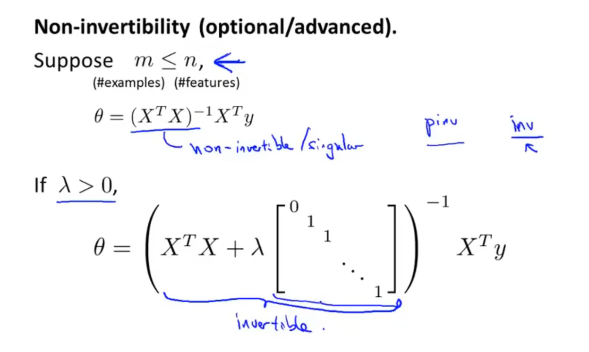
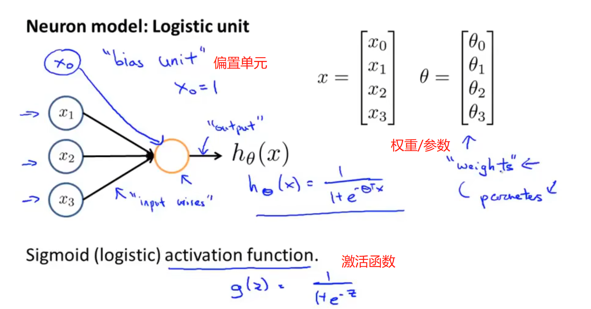
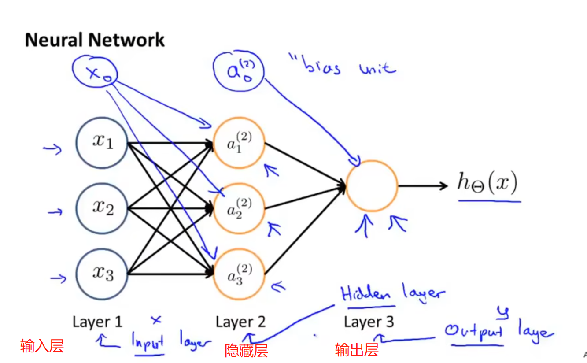
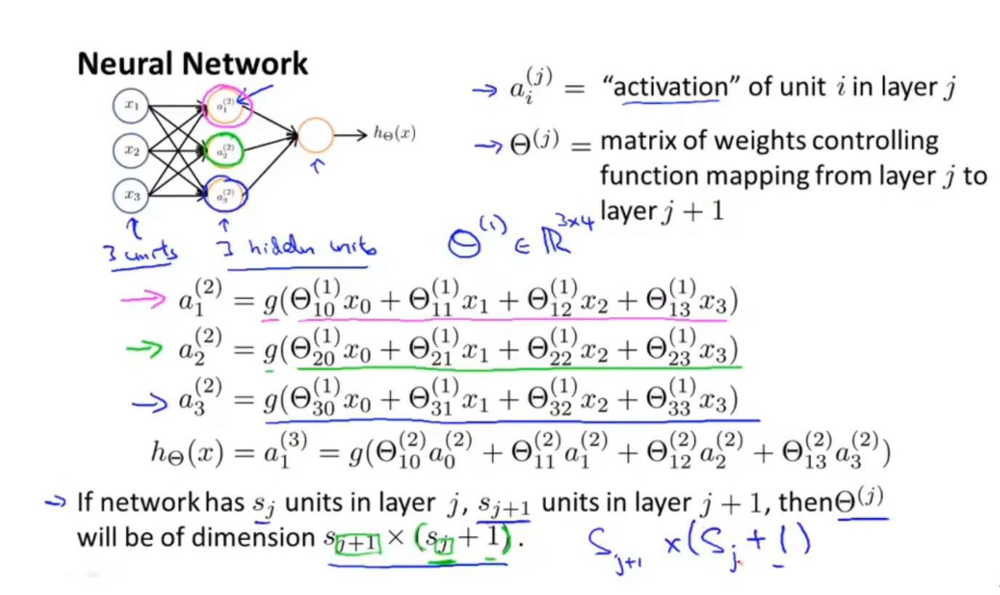
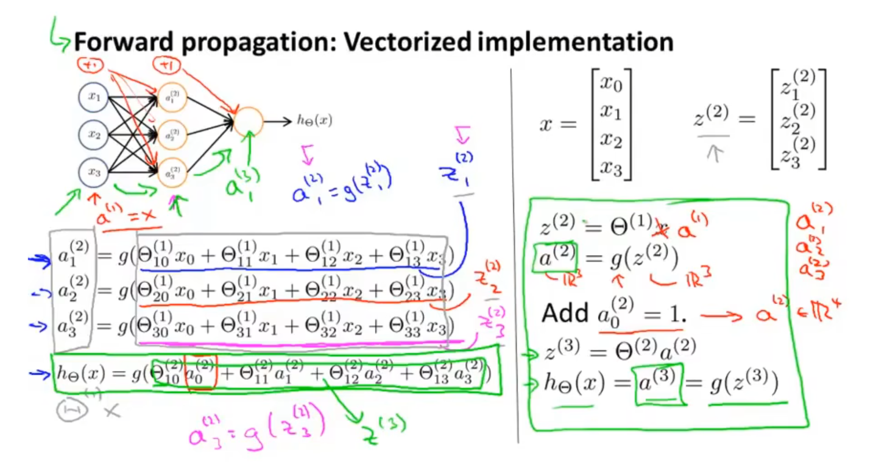
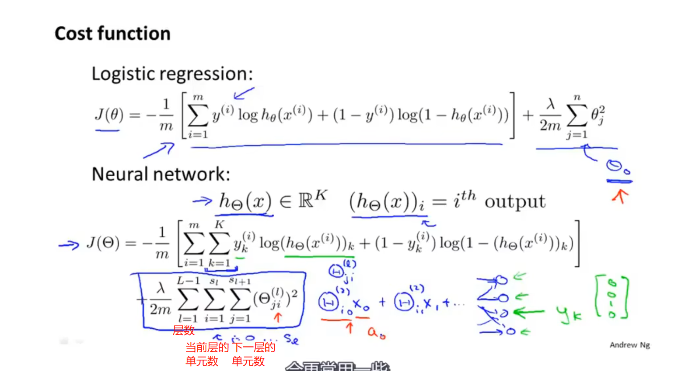
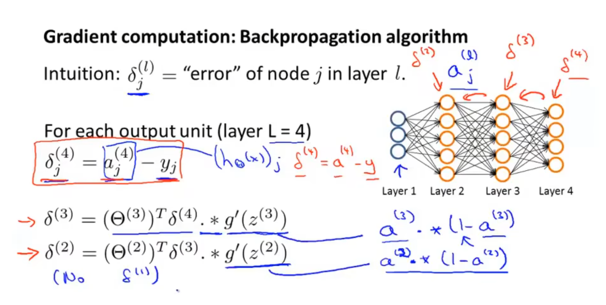
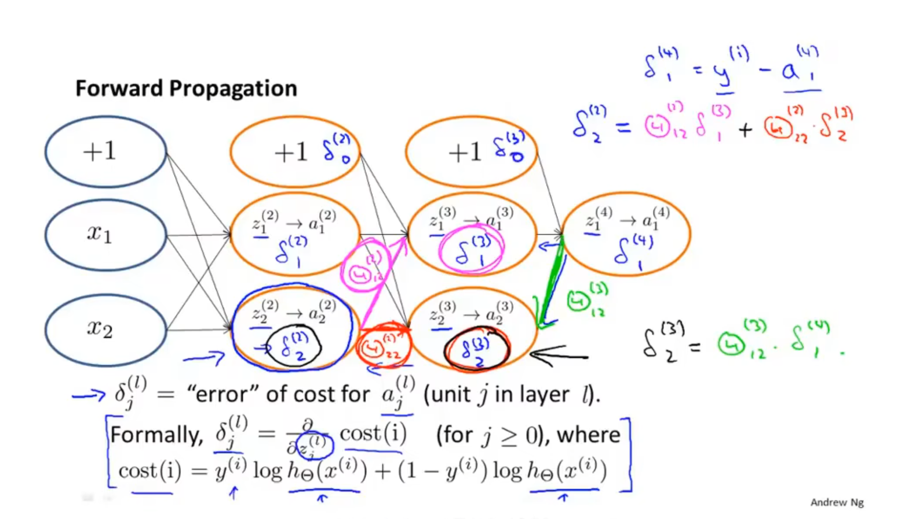
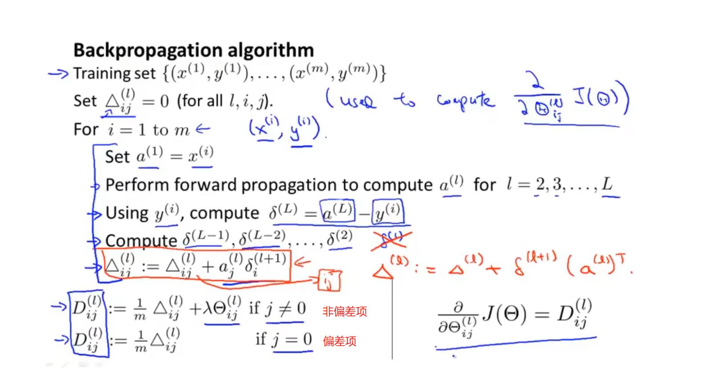

# 机器学习

---

# 定义

> A computer program is said to learn from experience E with respect to some task T and some performance measure P, if its perfomance on T, as measured by P, improves with experience E. ——Tom Mitchell(1988)

计算机程序从经验E中学习，解决某一任务T，进行某一性能度量P，通过P测定在T上的表现因经验E而提高。

“计算机程序可以在给定某种类别的任务 T 和性能度量 P 下学习经验 E ，如果其在任务 T 中的性能恰好可以用 P 度量，则随着经验 E 而提高。”

# Symbols

> - m ==> Number of training examples
> - x's ==> "input" variable / features
> - y's ==> "output" variable / "target" variable
> - (x,y) ==> one single training example
> - (x^i^,y^i^) ==> i^th^ training example
> - x^i^~j~ ==>value of feature j in i^th^ training example
> - :=  ==> assignment
> - =  ==> truth assertion
> - h(θ,x) ==> hypothesis function
>
> 
>
> Neural Network
>
> - a~i~^j^  ==> "activation" of unit i in layer j
> - θ^j^  ==> matrix of weights controlling functin mapping from layer j to layer j+1   
> - L  ==> total number of layers in network
> - s~l~ ==> number of units(not counting bias unit) in layer l

# 代价 函数(平方误差函数)

 

# Batch梯度下降算法

Batch梯度下降算法可以应用于最小化一般函数J(θ)

> - α是被称为学习率的数字，用来控制梯度下降的步长，即更新参数的幅度，α越大梯度下降越迅速
> - 重复进行该步骤直到收敛
> - 对θ~0~和θ~1~的更新需要同时进行

## 特征放缩 

多个特征使用梯度下降算法时，如果能确保这些特征的取值都处于一个相近的范围，则梯度下降算法能更快地收敛

更一般地说，当我们执行特征缩放时，我们通常的目标是将特征的取值约束到-1≤x~i~≤1的范围内，但这个范围不是绝对的

除了将特征除以最大值以外，在特征缩放中有时我们会进行均值归一化的工作：

> μ~1~是训练集中特诊x~1~的平均值
>
> s~1~是该特征值的范围，即最大值减去最小值，也可以将s~1~设置为变量的标准差

## 学习率

通常我们会画出代价函数随迭代步数增加的变化曲线来判断梯度下降算法是否已经收敛，也可以进行一些自动收敛测试

# 正规方程算法

在最小化代价函数J(θ)时，对于某些模型可以使用正规方程算法进行最小值求解，这种方法不需要多次迭代来收敛到全局最小值，基本上只需一步就可以得到最优值，且不需要进行特征缩放，在处理的特征量不是特别大时具有较好的效率。

正规方程算法并不具有普适性，比如对线性回归算法适用而对分类算法并不适用

## 矩阵不可逆

如果X^T^X是奇异矩阵或不可逆，则无法进行逆运算

# 正则化

## 过拟合

欠拟合：算法具有高偏差，无法较好地拟合数据集

过拟合：算法具有高方差，即拟合一个高阶多项式时，假设函数h(x)能拟合几乎所有的数据，这时可能面临可能的函数太过庞大、变量太多的问题，我们没有足够的数据来约束它来获得一个好的假设函数，这个函数会非常拟合已有的数据集，但是无法泛化到新的样本中

解决方法：

## 代价函数

通过在代价函数中增加惩罚项弱化特征对拟合模型的影响 ，更好地去拟合数据集且使参数都尽可能小，以此来简化预测函数，避免出现过拟合的情况

> 正则化参数λ的作用是控制两个不同目标间的取舍，即控制这两个目标之间的平衡关系：
>
> - 与目标函数的第一项有关，即更好地拟合数据集
> - 与目标函数的第二项有关，即保持参数尽量地小，与正则化目标和正则化项有关

# 监督学习(Supervised Learning)

为算法提供包含”正确答案“的数据集

## 线性回归算法(linear regression)

为算法提供包含”正确答案“的数据集，回归是指根据已有的数据集预测一个具体的数值输出，输出结果不是离散的

### 单变量线性回归

### 多变量线性回归

### 代价函数正则化

#### 梯度下降

#### 正规方程

不可逆问题

数学上可以证明，正则化时不会出现不可逆的情况

## 分类算法

预测离散值的输出，如预测结果只有0/1(负类/正类)

### logistic回归算法

用于预测结果y为离散值0/1的情况下，算法的输出或者说预测值一直介于0和1之间

#### 决策界限

决策边界不是训练集的属性，而是假设本身及其参数的属性，只要给定了参数向量θ那么就能确定决策边界，而不是用训练集来定义决策边界，我们用训练集来拟合参数θ

#### 参数拟合

由于g()的凸优化问题，所选的代价函数与平方误差函数有所不同

#### 简化代价函数与梯度下降

特征放缩同样适用与logistic回归

#### 高级优化

- 共轭梯度法
- BFGS
- L-BFGS

这些优化算法通常不需要手动选择学习率，这些算法有被称为线搜索算法的智能内循环，它可以自动尝试不同的学习率并自动选择一个好的学习率，甚至可以为每次迭代选择不同的学习速率

通常这些算法的收敛会远远快于梯度下降

#### 正则化

梯度下降

# 无监督学习(Unsupervised Learning)

## 聚类算法

对无标签的数据集进行分簇

## 鸡尾酒会算法

分离叠加在一起的两个音频源

# 神经网络

神经元是一个计算单元，它从输入通道接受一定数量的信息并做一些计算，然后将结果通过它的轴突传送到其他节点或者大脑中的其他神经元。

在一个神经网络中，我们将使用一个很简单的模型来模拟神经元的工作，我们会将神经元模拟成一个逻辑单元。

神经网络其实就是一组神经元连接在一起的集合

> 任何非输入层和非输出层都是隐藏层，隐藏层不会在数据集中体现
>
> 神经网络中神经元的连接方式称为神经网络的架构

在神经网络中，最终的预测函数的输入值不是原始输入，而是经过学习得到的函数输入值，即经过学习的特征，这与普通的模型不同，有时神经网络学习可以得到更好的假设函数

## 前向传播

从输入单元的激活项开始，然后进行前向传播给隐藏层，计算隐藏层的激活项，然后继续前向传播并继续计算输出层的激活项

 

## 代价函数

> 正则项中 i j累加的位置无关，可以将相邻两层之间的θ参数看做一个矩阵，i j 只是这个矩阵的每一行和每一列，正则项就是对每行每列求和，矩阵大小就是s~l+1~*s~l~(忽略了偏移项)，代价函数希望结果最小，也就是该网络中的K个输出单元的预测值都最小，因此需要累加每个输出单元的结果，使其总和最小

## 反向传播算法

从输出层开始将误差反向传播给输入层

> 与之前的学习算法不同，因为需要梯度下降的θ不是直接联系输入层和输入层，而是输入层/输出层与隐藏层之间的权重，所以想要通过梯度下降的方式获得较好的权重就需要计算每一层之间的的偏差值，也就是反向传播的方式获得偏差值δ，即代价函数的偏导数
>
> 权重越大，下一层对应的单元误差对该单元的误差影响越大
>
> 偏置单元的计算结果可以舍弃，它们的结果并不会影响偏导数的计算
