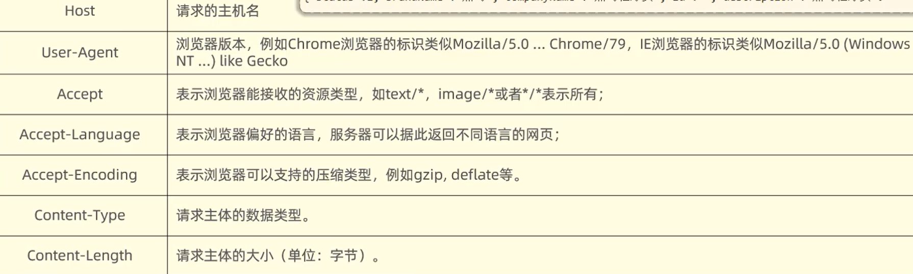
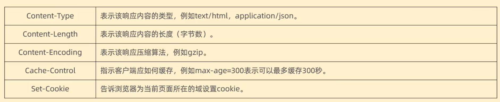

#	网络

---

##	NAT

##	泛解析

##	CDN

##	DNS解析

 DNS：Domain Name System 域名系统，这是一项用解析域名与IP地址对应关系的技术，能够接受用户输入IP地址或域名，然后自动查找与之匹配的IP地址或域名，即将域名解析为IP地址（正向解析），获将IP地址解析为域名（反向解析）。

##	TCP和UDP的区别

##	响应状态码

> https://cloud.tencent.com/developer/chapter/13553

一、1xx-信息提示：这些状态代码表示临时的响应。客户端在收到常规响应之前，应准备接收一个或多个1xx响应。
100-继续。
101-切换协议。

二、2xx-成功：这类状态代码表明服务器成功地接受了客户端请求。
**200-确定。客户端请求已成功。**
201-已创建。
202-已接受。
203-非权威性信息。
204-无内容。
205-重置内容。
206-部分内容。

三、3xx-重定向：客户端浏览器必须采取更多操作来实现请求。例如，浏览器可能不得不请求服务器上的不同的页面，或通过代理服务器重复该请求。
301-对象已永久移走，即永久重定向。
**302-对象已临时移动。指示所请求的资源已移动到由Location响应头给定的URL，浏览器会自动重新访问到这个页面。**
**304-服务端未修改资源，客户端直接使用缓存中的内容。**
307-临时重定向。

四、4xx-客户端错误：发生错误，客户端似乎有问题。例如，客户端请求不存在的页面，客户端未提供有效的身份验证信息。400-错误的请求。

**400-客户端请求有语法错误，不能被服务器所理解**

401-访问被拒绝。IIS定义了许多不同的401错误，它们指明更为具体的错误原因。这些具体的错误代码在浏览器中显示，但不在IIS日志中显示：
401.1-登录失败。
401.2-服务器配置导致登录失败。
401.3-由于ACL对资源的限制而未获得授权。
401.4-筛选器授权失败。
401.5-ISAPI/CGI应用程序授权失败。
401.7–访问被Web服务器上的URL授权策略拒绝。这个错误代码为IIS6.0所专用。 403-禁止访问：IIS定义了许多不同的403错误，它们指明更为具体的错误原因：
**403.1-执行访问被禁止。**
**403.2-读访问被禁止。**
**403.3-写访问被禁止。**
**403.4-要求SSL。**
**403.5-要求SSL128。**
**403.6-IP地址被拒绝。**
**403.7-要求客户端证书。**
**403.8-站点访问被拒绝。**
**403.9-用户数过多。**
**403.10-配置无效。**
**403.11-密码更改。**
**403.12-拒绝访问映射表。**
**403.13-客户端证书被吊销。**
**403.14-拒绝目录列表。**
**403.15-超出客户端访问许可。**
**403.16-客户端证书不受信任或无效。**
**403.17-客户端证书已过期或尚未生效。**
**403.18-在当前的应用程序池中不能执行所请求的URL。这个错误代码为IIS6.0所专用。**
**403.19-不能为这个应用程序池中的客户端执行CGI。这个错误代码为IIS6.0所专用。**
**403.20-Passport登录失败。这个错误代码为IIS6.0所专用。**
**404-文件或资源未找到。**
**404.0-（无）–没有找到文件或目录。**
**404.1-无法在所请求的端口上访问Web站点。**
**404.2-Web服务扩展锁定策略阻止本请求。**
**404.3-MIME映射策略阻止本请求。**
**405-用来访问本页面的HTTP谓词不被允许（方法不被允许）。请求方式有误，比如应该用GET请求方式的资源，用了POST**
406-客户端浏览器不接受所请求页面的MIME类型。
407-要求进行代理身份验证。
412-前提条件失败。
413–请求实体太大。
414-请求URI太长。
415–不支持的媒体类型。
416–所请求的范围无法满足。
417–执行失败。
423–锁定的错误。

**428-服务器要求有条件的请求，告诉客户端要想访问该资源，必须携带特定的请求头**

**429-指示用户在给定时间内发送了太多请求(“限速”)，配合 Retry-After(多长时间后可以请求)响应头一起使用**

**431-请求头太大，服务器不愿意处理请求，因为它的头部字段太大。请求可以在减少请求头域的大小后重新提交**

五、5xx-服务器错误：服务器由于遇到错误而不能完成该请求。
**500-内部服务器错误。**
**500.12-应用程序正忙于在Web服务器上重新启动。**
**500.13-Web服务器太忙。**
**500.15-不允许直接请求Global.asa。**
**500.16–UNC授权凭据不正确。这个错误代码为IIS6.0所专用。**
**500.18–URL授权存储不能打开。这个错误代码为IIS6.0所专用。**
**500.100-内部ASP错误。**
501-页眉值指定了未实现的配置。
502-Web服务器用作网关或代理服务器时收到了无效响应。
502.1-CGI应用程序超时。
502.2-CGI应用程序出错。application.
**503-服务不可用。这个错误代码为IIS6.0所专用。**
504-网关超时。
505-HTTP版本不受支持。

##	DDNS

##	SSL证书

##	TS3服务端搭建

https://www.bilibili.com/read/cv1940769/

##	URL中 的# ? & 

1. #
   #代表网页中的一个位置。其右面的字符，就是该位置的标识符
   比如你访问 https://www.xxx.com/ 和 https://www.xxx.com/#wee 是同一个页面 #后面是指浏览器的页面所在的位置不同 就类似于鼠标把页面滚动到下面了。
   是用来指导浏览器动作的，对服务器端完全无用。所以，HTTP请求中不包括#。
   在第一个#后面出现的任何字符，都会被浏览器解读为位置标识符。这意味着，这些字符都不会被发送到服务器端。 就比如上面的两个网址 浏览器发送的请求都是 www.xxx.com
2. ？
   连接作用
   通过？来带参数，连接域名和参数，经常会用到。
   www.xxx.com
   www.xxx.com?ame=gee&class=weew
   两个url打开的页面一样，但是后面这个有问号，说明不调用缓存的内容，而认为是一个新地址，重新读取。
   因为在http请求的时候，如果浏览器检测到你的地址完全没变，会从缓存里读取先前请求过的数据，不再发送请求。加上这个，会让浏览器认为这是一个新的地址
3. &
   不同参数的间隔符
   https://www.xxxxxx.com/?name=were&class=gegfw

## Web标准

Web 标准是由W3C组织和其他标准化组织制定的一系列标准的集合

遵循Web 标准除了可以让不同的开发人员写出的页面更标准、更统一外，还有以下优点：

- 让Web的发展前景更广阔
- 内容能被更广泛的设备访问。
- 更容易被搜寻引擎搜索
- 降低网站流量费用
- 使网站更易于维护
- 提高页面浏览速度

Web标准的构成主要包括结构 ( Structure )表现( Presentation )和行为( Behavior ) 三个方面：

- 结构：结构用于对网页元素进行整理和分类，主要指的是HTML。
- 表现：表现用于设置网页元素的版式、颜色、大小等外观样式，主要指的是CSS
- 行为：行为是指网页模型的定义及交互的编写，主要指的是Javascript

## HTTP

1. 请求数据格式

    1. 请求行：请求数据第一行(请求方式、资源路径、协议)

        1. **GET:**
            - 用于请求指定的资源。
            - 对服务器的数据请求，不会改变资源的状态。
            - 参数可以附加在URL的末尾，通过查询字符串传递。
            - 有大小限制
        2. **POST:**
            - 用于提交指定资源的数据，通常用于向服务器提交表单数据。
            - 对服务器的数据提交请求，可能导致新的资源的创建。
            - 参数通常包含在请求体中。
            - 无大小限制
        3. **PUT:**
            - 用于更新指定资源或创建一个新资源，如果不存在的话。
            - 对服务器的数据更新请求，会替换整个资源。
            - 参数通常包含在请求体中。
        4. **DELETE:**
            - 用于删除指定资源。
            - 对服务器的数据删除请求。
            - 参数可以包含在URL中或请求体中。
        5. **PATCH:**
            - 用于对资源进行部分更新。
            - 对服务器的局部更新请求，通常用于更新资源的一部分。
            - 参数通常包含在请求体中。
        6. **HEAD:**
            - 与GET类似，但服务器不返回资源主体，只返回响应头信息。
            - 用于获取资源的元信息，而不需要获取实际的资源内容。
        7. **OPTIONS:**
            - 用于描述目标资源的通信选项。
            - 查询服务器支持的HTTP方法，或者询问服务器某些特殊配置信息。
        8. **TRACE:**
            - 用于执行一个消息回环测试，主要用于诊断。
            - 通过服务器传回的消息，客户端可以查看在请求/响应链上发生了什么。
        9. **CONNECT:**
            - 用于与代理服务器建立隧道连接，通常用于加密连接

    2. 请求头：第二行开始，格式key:value

        

    3. 请求体：POST请求存放请求参数

2. 响应数据格式

    1. 响应行：响应数据第一行(协议、状态码、描述)

    2. 响应头：第二行开始，格式key:value

        

    3. 响应体：最后一部分，存放响应数据

## 跨域

跨域：域名不一致就是跨域，主要包括：
域名不同： www.taobao.com 和 www.taobao.org 和 www.jd.com 和 miaosha.jd.com
域名相同，端口不同：localhost:8080和localhost8081
跨域问题：浏览器禁止请求的发起者与服务端发生跨域ajax请求，请求被浏览器拦截的问题
解决方案：CORS
