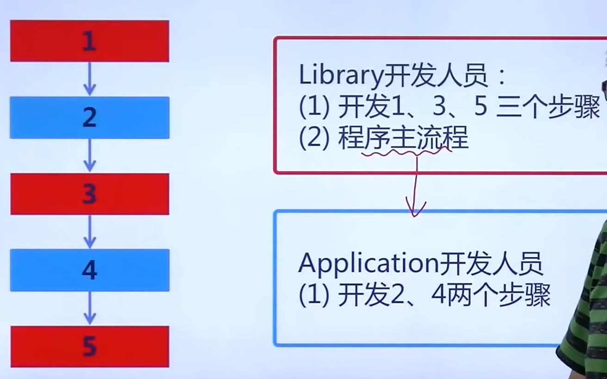
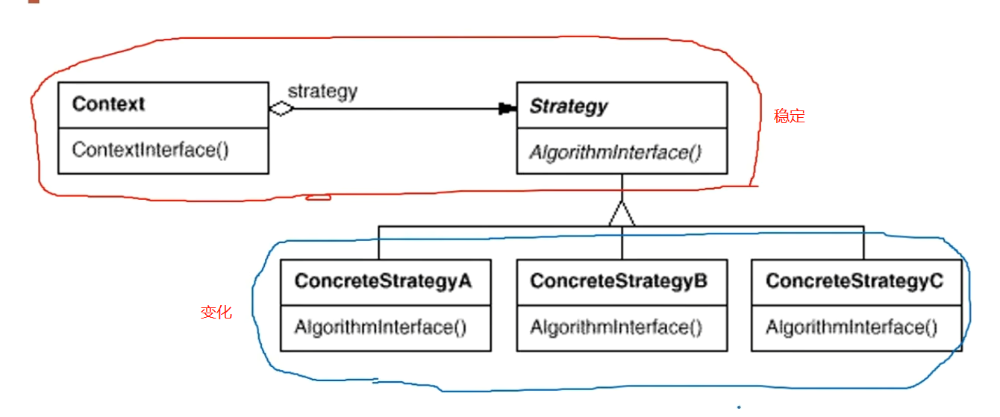
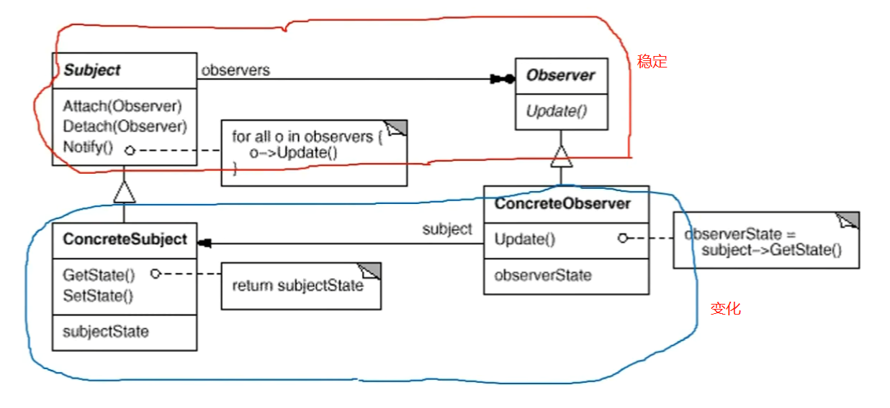
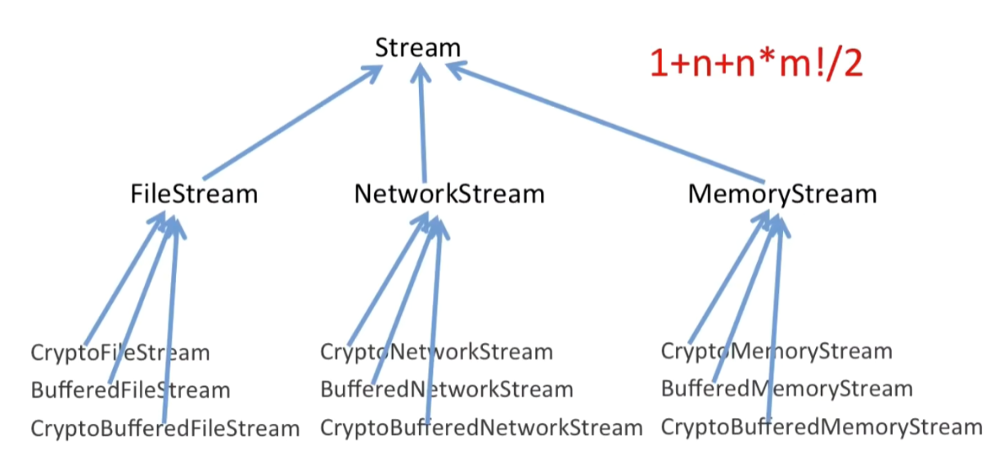
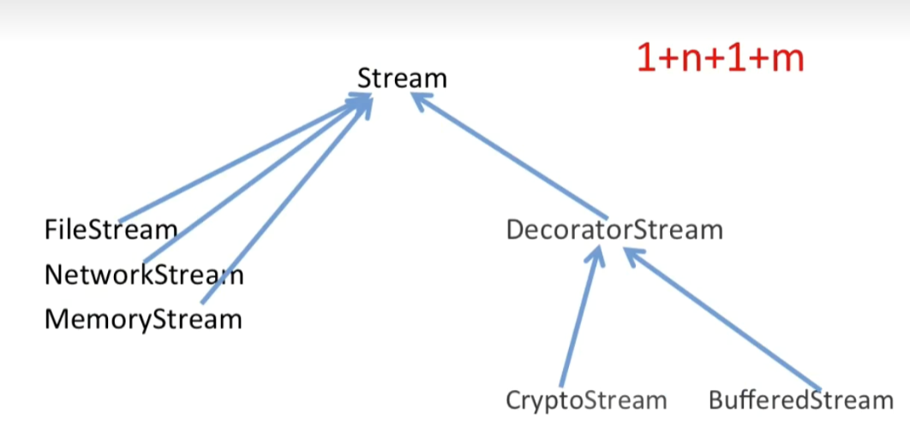
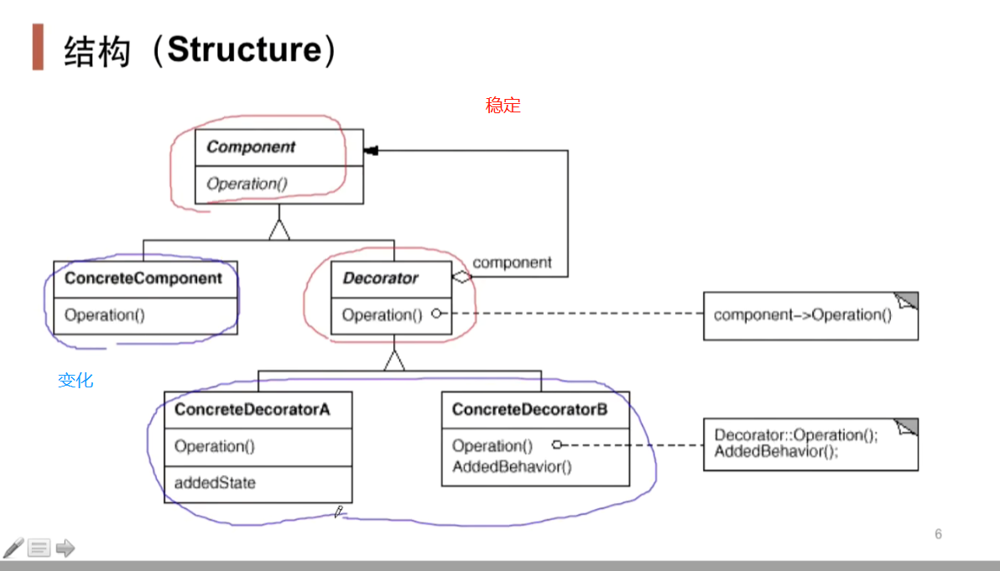
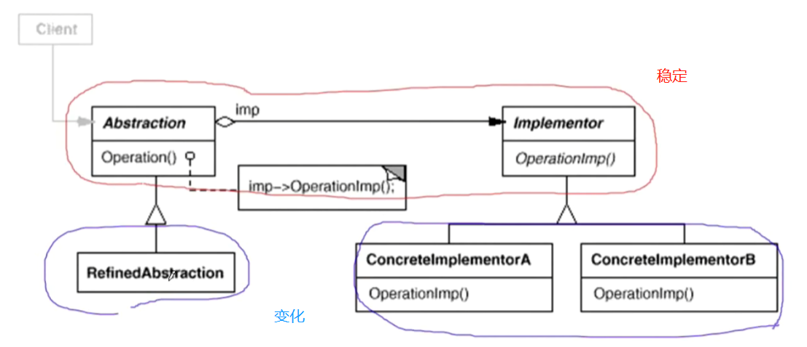
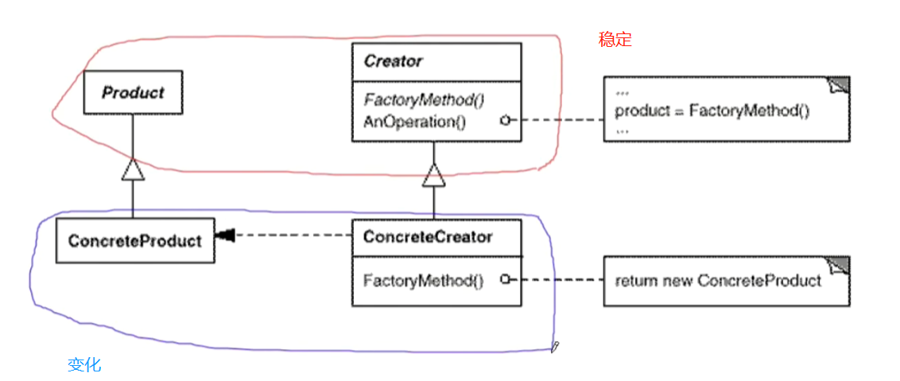
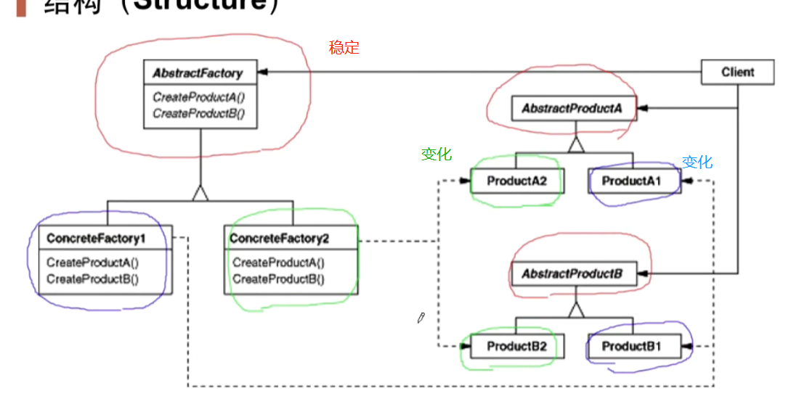

# 设计模式

---

设计模式（Design pattern）是一套被反复使用、多数人知晓的、经过分类编目的、代码设计经验的总结。使用设计模式是为了可重用代码、让代码更容易被他人理解、保证代码可靠性。 毫无疑问，设计模式于己于他人于系统都是多赢的，设计模式使代码编制真正工程化，设计模式是软件工程的基石，如同大厦的一块块砖石一样。项目中合理的运用设计模式可以完美的解决很多问题，每种模式在现在中都有相应的原理来与之对应，每一个模式描述了一个在我们周围不断重复发生的问题，以及该问题的核心解决方案，这也是它能被广泛应用的原因。设计模式是对大家实际工作中写的各种代码进行高层次抽象的总结，其中最出名的当属 Gang of Four（GoF）的分类了，他们将设计模式分类为 23 种经典的模式，根据用途我们又可以分为三大类，分别为创建型模式、结构型模式和行为型模式。

# 设计原则

---

## 依赖倒置原则(DIP)

- 高层模块(稳定)不应该依赖于低层模块(变化)，二者都应该依赖于抽象(稳定)
- 抽象(稳定)不应该依赖于实现细节(变化)，实现细节应该依赖于抽象(稳定)

## 开放封闭原则(OCP)

- 对扩展开放，对更改封闭
- 类模块应该是可扩展而不可修改的

## 单一职责原则(SRP)

- 一个类应该仅有一个引起它变化的原因
- 变化的方向隐含着类的责任

## Liskov替换原则(LSP)

- 子类必须能够替换它们的基类(IS-A)
- 继承表达类型抽象

## 接口隔离原则(ISP)

- 不应该强迫客户程序依赖它们不用的方法
- 接口应该小而完备

## 优先使用对象组合而不是类继承

- 类继承通常为“白箱复用“，对象组合通常为"黑箱复用"
- 继承在某种程度上破坏了封装性，子类父类耦合度高
- 而对象组合则只要求被组合的对象具有良好定义的接口，耦合度低

## 封装变化点

- 使用封装来创建对象之间的分界层，让设计者可以在分界层的一侧进行修改，而不会对另一侧产生不良的影响，从而实现层次间的松耦合 

## 针对接口编程而不是针对实现编程

- 不将变量类型声明为某个特定的具体类，而是声明为某个接口
- 客户程序无需获知对象的具体类型，只需要知道对象所具有的接口
- 减少系统中各部分的依赖关系，从而实现“高内聚、松耦合"的类型设计方案

# 分类

## 从目的来看

- 创建型(Creational)模式
   - 对象实例化的模式，创建型模式用于解耦对象的实例化过程。将对象的部分创建工作延迟到子类或其他对象，从而应对需求变化为对象创建时具体类型实现引起的冲击
- 结构型(Structural)模式
   - 把类或对象结合在一起形成一个更大的结构。通过类继承或对象组合获得更灵活的结构，从而应对需求变化为对象的结构带来的冲击
- 行为型(Behavioral)模式
   - 类和对象如何交互，及划分责任和算法。通过类继承或对象组合来划分类与对象间的职责，从而应对需求变化为多个交互的对象带来的冲击

## 从范围来看

- 类模式处理类与子类的静态关系，更偏向于继承方案
- 对象模式处理对象间的动态关系，更偏向于组合方案

## 从封装变化角度

- “组件协作”模式

    现代软件专业分工之后的第一个结果是“框架与应用程序的划分”，“组件协作”模式通过晚期绑定，来实现框架与应用程序之间的松耦合，是二者之间协作时常用的模式。

   - Template Method
   - Observer / Event
   - Strategy

- “单一职责”模式：

    在软件组件的设计中，如果责任划分的不清晰，使用继承得到的 结果往往是随着需求的变化，子类急剧膨胀，同时充斥着重复代码， 这时候的关键是划清责任

   - Decorator
   - Bridge

- “对象创建”模式

    绕开“new”来避免对象创建（new）过程 中所导致的紧耦合（编译时依赖具体实现类），从而支持对象创建的稳定。它是接口抽象之后的第一步工作

   - Factory
   - Abstract Factory
   - Prototype
   - Builder

- “对象性能”模式

    面向对象很好地解决了“抽象”的问题，但是不可避免地要付出一定的代价。对于通常情况来讲，面向对象的成本大都可以忽略不计。但是某些情况，面向对象所带来的成本必须谨慎处理。

   - Singleton
   - Flyweight

- “接口隔离”模式

    在组件构建过程中，某些接口之间直接的依赖常常会带来很多问题、甚至根本无法实现。采用添加一层稳定/间接（微观上比如指针，宏观上比如操作系统、虚拟机、依赖倒置原则）接口，来隔离本来互相紧密关联的接口是一种常见的解决方案

   - Facade
   - Proxy
   - Adapter
   - Mediator

- “状态变化”模式

    在组件构建过程中，某些对象的状态经常会变化，如何对这些变化进行有效地管理？同时又维持高层模块的稳定？

   - State
   - Memento

- “数据结构”模式

    一些组件在内部具有特定的数据结构，如果让客户程序依赖这些特定的数据结构，将极大地破坏组件的复用。将这些特定数据结构封装在内部，在外部提供统一的接口，来实现与特定结构无关的访问，是一种行之有效的解决方案

   - Composite
   - Iterator
   - Chain of Responsibility

- “行为变化”模式

    在组件的构建过程中，组件行为的变化经常导致组件本身剧烈的变化。“行为变化”模式将组件的行为和组件本身进行解耦，从而支持组件行为的变化，实现两者之间的松耦合

   - Command
   - Visitor

- “领域规则”模式

    在特定领域中，某些变化虽然频繁，但可以抽象为某种规则。这时候，结合特定领域，将问题抽象为语法规则，从而给出在该领域下的一般性解决方案。

   - Interpreter

# 组件协作模式

---

## Template Method(模板方法)

- 动机：在软件构建过程中，对于某一项任务，它常常有稳定的整体操作结构，但各个子步骤却有很多改变的需求，或者由于固有的原因(比如框架与应用之间的关系)而无法和任务的整体结构同时实现。
- 定义：定义一个操作中的**算法的骨架(稳定)**，而将一些**步骤(变化)延迟到子类**中。Template Method使得子类可以不改变(复用)一个算法的结构即可重定义(override 重写)该算法的某些特定步骤。
- 要点：
   - Template Method模式是一种非常基础性的设计模式，在面向对象系统中有着大量的应用。它用最简洁的机制(如C++中的虚函数的多态性)为很多应用程序框架提供了灵活的扩展点，是代码复用方面的基本实现结构。
   - 除了可以灵活应对子步骤的变化外，“**不要调用我，让我来调用你**”的反向控制结构是Template Method的典型应用。
   - 在具体实现方面，被Template Method调用的虚方法可以具有实现，也可以没有任何实现(如C++中的抽象方法、纯虚方法)，但一般推荐将它们设置为protected方法。

## Strategy(策略模式)

- 动机：在软件构建过程中，某些对象使用的算法可能多种多样，经常改变，如果将这些算法都编码到对象中，将会使对象变得异常复杂；而且有时候支持不使用的算法也是一个性能负担。
- 定义：定义一系列算法，把它们一个个封装起来，并且使它们可互相替换(变化)。该模式使得算法可独立于使用它的客户程序(稳定)而变化(扩展，子类化)。 
- 要点
   - Strategy及其子类为组件提供了一系列可重用的算法，从而可以使得类型在运行时方便地根据需要在各个算法之间进行切换。
   - Strategy模式提供了用条件判断语句以外的另一种选择，消除条件判断语句，就是在解耦合。**含有许多条件判断语句的代码通常都需要Strategy模式。**
   - 如果Strategy对象没有实例变量，那么各个上下文可以共享同一个Strategy对象，从而节省对象开销

## Observer/Event(观察者模式)

- 动机：在软件构建过程中，我们需要为某些对象建立一种“通知依赖关系"——一个对象(目标对象)的状态发生改变，所有的依赖对象(观察者对象)都将得到通知。如果这样的依赖关系过于紧密将使软件不能很好地抵御变化
- 定义：定义对象间的一种一对多(变化)的依赖关系，以便当一对象(Subject)的状态发生改变时，所有依赖于它的对象都得到通知并自动更新
- 要点
   - 使用面向对象的抽象，Observer模式使得我们可以独立地改变目标与观察者，从而使二者之间的依赖关系达致松耦合
   - 目标发送通知时，无需指定观察者，通知(可以携带通知信息作为参数)会自动传播
   - 观察者自己决定是否需要订阅通知，目标对象对此一无所知。
   - Observer模式是基于事件的UI框架中非常常用的设计模式，也是MVC模式的一个重要组成部分

# 单一职责模式

---

## Decorator(装饰模式)

- 动机：在某些情况下我们可能会“过度地使用继承来扩展对象的功能”，由于**继承为类型引入的静态特质**，使得这种扩展方式缺乏灵活性;并且随着子类的增多(扩展功能的增多)，各种子类的组合 (扩展功能的组合) 会导致更多子类的膨胀。
- 定义：动态(组合)地给一个对象增加一些额外的职责。就增加功能而言，Decorator模式比生成子类 (继承) 更为灵活 (消除重复代码 & 减少子类个数)。
- 要点：
   - 通过采用组合而非继承的手法， Decorator模式实现了在**运行时**动态扩展对象功能的能力，而且可以根据需要扩展多个功能。避免了使用继承带来的“灵活性差”和“多子类衍生问题”。
   - Decorator类在**接口上表现为is-a Component的继承关系**，即Decorator类继承了Component类所具有的接口。但在**实现上又表现为has-a Component的组合关系**，即Decorator类又使用了另外个Component类。
   - Decorator模式的目的并非解决“多子类衍生的多继承”问题，Decorator模式应用的要点在于解决“**主体类在多个方向上的扩展功能**"——是为“装饰”的含义。

## Bridge(桥模式)

- 动机：由于某些类型的固有的实现逻辑，使得它们具有两个变化的维度乃至多个纬度的变化。
- 定义：将抽象部分(业务功能)与实现部分(平台实现)分离，使它们都可以独立地变化。
- 要点：
   - Bridge模式使用对象间的组合关系”解耦了抽象和实现之间固有的绑定关系，使得抽象和实现可以沿着各自的维度来变化。所谓抽象和实现沿着各自纬度的变化，即“子类化”它们。
   - Bridge模式有时候类似于多继承方案，但是多继承方案往往违背单职责原则 (即一个类只有一个变化的原因)，复用性比较差。Bridge模式是比多继承方案更好的解决方法。
   - Bridge模式的应用一般在“两个非常强的变化维度”，有时一个类也有多于两个的变化维度，这时可以使用Bridge的扩展模式。

# 对象创建模式

---

## Factory Method(工厂方法)

- 动机：在软件系统中，经常面临着创建对象的工作;由于需求的变化，需要创建的对象的具体类型经常变化。
- 定义：定义一个用于创建对象的接口，让子类决定实例化哪一个类。Factory Method使得一个类的实例化延迟(目的:解耦，手段: C++中虚函数)到子类。
- 要点：
   - Factory Method模式用于隔离类对象的使用者和具体类型之间的耦合关系。面对一个经常变化的具体类型，紧耦合关系(new)会导致软件的脆弱。
   - Factory Method模式通过面向对象的手法，将所要创建的具体对象工作延迟到子类，从而实现一种扩展 (而非更改)的策略，较好地解决了这种紧耦合关系。
   - Factory Method模式解决“单个对象”的需求变化。缺点在于要求创建方法/参数相同。

## Abstract Factory(抽象工厂)

- 动机：在软件系统中，经常面临着“**一系列相互依赖的对象**”的创建工作;同时，由于需求的变化，往往存在更多系列对象的创建工作。
- 定义：提供一个接口，让该接口负责创建一系列“相关或者相互依赖的对象”，无需指定它们具体的类。
- 要点：
   - 如果没有应对“多系列对象构建”的需求变化，则没有必要使用Abstract Factory模式，这时候使用简单的工厂完全可以。
   - “系列对象”指的是在某一特定系列下的对象之间有相互依赖、或作用的关系。不同系列的对象之间不能相互依赖。
   - Abstract Factory模式主要在于应对“新系列”的需求变动。其缺点在于难以应对“新对象”的需求变动。

