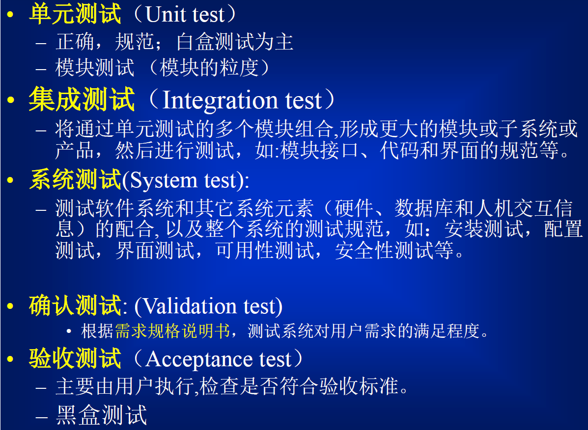
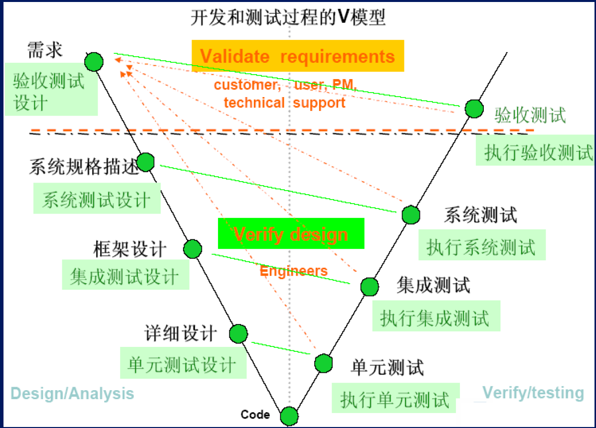
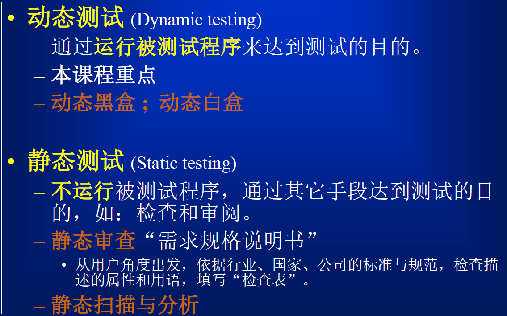

# 软件测试

---

1. 软件测试时为了发现错误而执行程序的过程

    G·J·Myers：广义上讲，在软件开发过程中的所有评审、确认、检验等活动都是软件测试

    IEEE：是使用人工或自动手段来运行或测定某个系统的过程，其目的在于检验它是否满足规定的需求或是弄清预期结果与实际结果之间的差别

2. 目的：发现问题、对质量或可接受性做出判断

3. 测试只能表明软件中存在错误，不能表明软件中不存在错误

4. 测试与调试时一个交叉循环的过程

    测试是一种检验，调试是推理过程

    测试的结果常常表明一个程序员的失败，调试则是程序员证明其正确

    测试经常由非程序设计者完成，调试必须由程序员完成

    大多数测试在不了解设计细节的条件下完成，而调试必须了解程序的细节

    测试可以且应该计划、设计和制定工作日程表，调试的规程和持续的时间不受约束

    在能做什么和不能做什么方面，测试有一套完整的理论，而调试没有

    很多测试的设计和执行能够自动化，而调试则不行

    

5. 软件测试时有风险的行为：彻底测试程序是不可能的，如果决定不去测试所有的情况就意味着选择了风险

6. 并非所有的软件缺陷都需要修复

7. 软件测试的流程

    

8. 测试用例(Test case) = 输入(Input/Test data) + 预期输出(预言Oracle/Expected output)

    - 输入：输入和前提(前置条件,在测试用例执行之前已经存在的环境)
    - 预期输出：输出和后果(前置条件,在测试用例执行之后将产生的环境)

9. 两种基本的测试技术

    1. 黑盒测试：功能性测试，基于规格说明的测试

        设计测试用例的唯一依据是软件的规格说明，与软件的具体实现无关

        - 优点
            - 如果实现发生变化，测试用例仍然有用
            - 测试用例的开发可以与实现并行进行
        - 缺点
            - 测试用例之间可能冗余度大
            - 测试有漏洞：程序实现的某部分未被测试到
            - 不能发现多余缺陷(即程序实现了未描述的行为)
        - 

    2. 白盒测试：透明盒测试/玻璃盒测试，基于程序的测试

        程序实现是已知的，把系统看做一个透明盒子，利用程序内部的逻辑结构及有关信息设计或选择测试用例

        设计测试用例的唯一依据是程序实现(程序源代码)

        - 优点
            - 具有覆盖率指标
        - 缺点
            - 不能发现:遗漏缺陷(即程序未能实现已描述的行为)
        - 

    > **灰盒测试**
    >
    > 通常指在无法直接获得源代码的情况下，通过一些软件制品、或者通过反编译反汇编等手段获得代码的部分结构信息，从而进行测试。
    >
    > 例如对java、android等写的程序进行反编译、对嵌入式程序进行反汇编等。

10. 测试级别

    

    

    

    

    

    > ### 单元测试
    >
    > 是在软件开发过程中要进行的最低级别的测试活动，在单元测试活动中，软件的独立单元将在与程序的其他部分相隔离的情况下进行测试，测试重点是系统的模块，包括子程序的正确性验证等。
    >
    > ### 集成测试
    >
    > 也叫组装测试或联合测试。在单元测试的基础上，将所有模块按照设计要求，组装成为子系统或系统，进行集成测试。实践表明，一些模块虽然能够单独地工作，但并不能保证连接起来也能正常的工作。程序在某些局部反映不出来的问题，在全局上很可能暴露出来，影响功能的实现。测试重点是模块间的衔接以及参数的传递等。
    >
    > ### 系统测试
    >
    > 是将经过测试的子系统装配成一个完整系统来测试。它是检验系统是否确实能提供系统方案说明书中指定功能的有效方法。测试重点是整个系统的运行以及与其他软件的兼容性。
    >
    > > ##### 系统测试范围
    > >
    > > 功能测试、ui测试、性能测试、容错测试、可用性测试、异常问题测试、稳定性测试、系统稳定性测试、兼容性测试、接口测试、安全性测试、登录权限测试
    >
    > ### 验收测试
    >
    > 是软件产品检验的最后一个环节。按照项目任务书或合同、供需双方约定的验收依据文档进行的对整个系统的测试与评审，决定是否接收或拒收系统。
    >
    > 1、界面测试；指软件产品所有的页面浏览时功能按钮或者界面是否能正常显示。
    > 2、功能测试；产品的功能是否都能正常实现。
    > 3、性能测试；发现性能瓶颈的过程，包括对CPU、内存、网络环境、版本等多项测试内容。
    > 4、安全测试；产品的信息保密，密码保护等功能的测试。
    >
    > > ### 回归测试
    > >
    > > 是指对软件的新版本测试时，重复执行之前某一个重要版本的所有测试用例，目的：
    > >
    > > 1.验证之前版本产生的所有缺陷已全部被修复；
    > > 2.确认修复这些缺陷没有引发新的缺陷
    > >
    > > 
    > >
    > > 1.在测试策略制定阶段，制定回归测试策略
    > > 2.确定需要回归测试的版本
    > > 3.回归测试版本发布,按照回归测试策略执行回归测试
    > > 4.回归测试通过，关闭缺陷跟踪单（问题单）
    > > 5.回归测试不通过，缺陷跟踪单返回开发人员，开发人员重新修改问题，再次提交测试人员回归测试
    > >
    > > 
    > >
    > > ### 冒烟测试
    > >
    > > 是指在对一个新版本进行系统大规模的测试之前，先验证一下软件的基本功能是否实现，是否具备可测性。也叫可测性测试。

11. 测试的分类

    > 

    1. 静态测试与动态测试

        

    2. 人工测试与自动测试

        

    3. 主动测试与被动测试

        

# 术语

---

1. 差错(Mistake)：人类会犯差错，不可避免

2. 缺陷(Fault/Defect)：差错在程序中的表现(静态)

    1. 过错缺陷(Wrong)：未将规格说明书正确实现

    2. 遗漏缺陷(Missimg)：规定的或者预期的需求没有体现在产品中

    3. 多余缺陷(Extra)：规格说明书中未规定的需求被实现

        

        

3. 错误(Error)：当程序缺陷被执行时，所导致的非预期的程序内部状态(动态)

4. 失效(Failure)：当错误传播到外部时所导致的结果

5. 事故(Incident)：当出现失效时，可能会呈现

> 人类会犯**差错**，差错在程序中的表现是**缺陷**。此时缺陷还未被执行，所以是静态的。当缺陷被执行时可能会出现**错误**，此时的错误即是动态的。当程序中的错误发生后传播到外部则会呈现为程序**失效**，该程序的失效可能会导致**事故**。

# 黑盒测试

---

## 边界值测试

> 针对各种边界情况设计测试用例 ，可以查出更多的错误。
>
> 依据：(测试经验)大量的错误是发生在输入或输出范围的边界上，而不是在范围的内部。

1. 边界值测试是最基本的测试方法，可以基于输入(最常见)，也可以基于输出

2. 变量的边界值(极值)

    最小值、略高于最小值、正常值、略低于最大值、最大值(即min, min+,nor,max-,max)

    > "正常值nor"通常为中点

    基于单缺陷假设(大部分失效是由单个缺陷引起的)，每次只对一个变量取极值(即:min,min+,nor,max-,max)而对其它所有变量取正常值，重复对每个变量进行。

    n个变量有4n+1个测试用例

    

## 等价类测试

## 基于决策表测试

## 因果图测试

## 基于正交表测试

# 白盒测试

---

## 逻辑覆盖(含MCDC覆盖)

1. 语句覆盖SC
2. 判定覆盖DC
3. 条件覆盖CC
4. 条件/判定覆盖 C/DC
5. 修订的条件/判定覆盖 MC/DC
6. 条件组合(多条件)覆盖 MCC
7. 路径覆盖

## 基本路径测试

## 数据流测试

## 变异测试